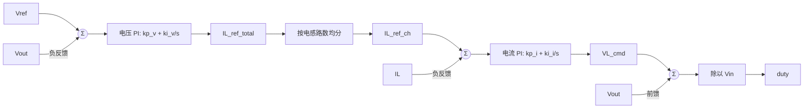
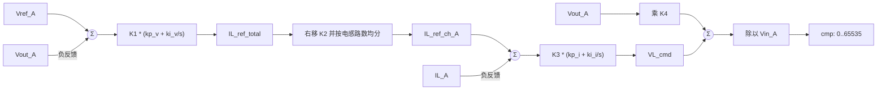

# Buck 环路从模拟量到整型量的设计方法

本文档说明当前 Buck 控制代码中，如何把模拟量控制环路等效迁移到整型计算域。
设计目标是让控制器在 ISR 中只处理 `int32_t` 数据，同时保持模拟环路中电压外环、
电流内环、前馈和占空比计算的物理含义。

相关代码位置：

- `code/ctrl/buck/buck_cfg.h`：码域、K 值、环路参数、限幅定义。
- `code/ctrl/buck/buck_ctrl.c`：ISR 与 task 中的控制计算。
- `code/lib/pi_tustin_i32.c/.h`：整型 PI 的 Tustin 离散化实现。

## 0. 术语说明

| 术语 | 含义 |
|---|---|
| 采样码 | 直接从 ADC 数据寄存器读取到的整数数据。 |
| `_A` 后缀 | 表示已经进入 ADC/整型码域的量，不表示 A 相或 A 通道。 |
| `V_A` | 电压物理量转换后的电压采样码。 |
| `I_A` | 电流物理量转换后的有符号电流码。 |
| `V_FS` | 电压采样的物理满量程。 |
| `I_FS` | 电流采样的物理满量程。 |
| `V_CODE_MAX` | 电压采样码正端最大值。 |
| `I_CODE_MAX` | 电流控制码正端最大值。 |
| `K_V` | 电压物理量到电压采样码的斜率。 |
| `K_I` | 电流物理量到电流控制码的斜率。 |
| `K1` | 电压误差码到 K2 电流码域的补偿系数。 |
| `K2` | 电压外环输出电流给定时使用的移位放大系数。 |
| `K3` | 电流误差码到 K4 电压码域的补偿系数。 |
| `K4` | 电流内环输出和输出电压前馈使用的移位放大系数。 |
| `S_v` | 电压外环人为加入的整数放大系数，用于提高电压环系数分辨率。 |
| `S_i` | 电流内环人为加入的整数放大系数，用于提高电流环系数分辨率。 |
| K2 电流码域 | 普通电流码再乘以 K2 后的控制域。 |
| K4 电压码域 | 普通电压码再乘以 K4 后的控制域。 |
| `Gv(s)` | 连续域电压环 PI。 |
| `Gi(s)` | 连续域电流环 PI。 |
| `kp` | 连续域 PI 的比例系数。 |
| `ki` | 连续域 PI 的积分系数。 |
| `PM` | 环路设计使用的相位裕度。 |
| `wcut` | 环路设计使用的截止角频率。 |
| `OBJ` | 环路设计中的被控对象参数，电压环对应电容，电流环对应电感。 |
| `Ts` | 离散化采样周期。 |
| `a1`、`b0`、`b1` | Tustin 离散化后写入整型 PI 的差分方程系数。 |
| `VL_cmd` | 电流内环输出的电感电压命令，在代码中处于 K4 电压码域。 |
| `duty` | 连续域占空比，范围按物理意义理解。 |
| `cmp` | PWM 比较值，是 `duty` 在 PWM compare 码域中的整数表达。 |
| `CH_NUM` | 并联电感电流通道数量。 |
| offset-binary | ADC 电流采样常见的偏置二进制表示，进入控制器前需要减去中心码。 |

## 1. 模拟量控制框图

模拟量控制环路以 SI 单位思考。电压外环输出总电感电流给定，电流内环输出电感电压命令，
再叠加输出电压前馈，并除以输入电压得到 Buck 占空比。



模拟量核心关系：

```text
I_ref_total = Gv(s) * (V_ref - V_out)
V_L_cmd     = Gi(s) * (I_ref_ch - I_L)
duty        = (V_L_cmd + V_out) / V_in
```

## 2. 整型控制框图

整型设计中，ADC 采样值和控制输出都先归入明确的码域。当前代码使用两个主要放大系数：

- `K2`：电压外环输出的电流码域放大系数。
- `K4`：电流内环输出和输出电压前馈的电压码域放大系数。

`K2` 和 `K4` 选成移位形式，当前均为 `1 << 16`。`K1` 和 `K3` 承担 ADC 码域到目标控制码域之间的
非 2 的幂比例。



整型核心关系：

```text
V_A = V / V_FS * V_CODE_MAX
I_A = I / I_FS * I_CODE_MAX

e_v_A           = Vref_A - Vout_A
IL_ref_total    = K1 * Gv(s) * e_v_A
IL_ref_ch_A     = IL_ref_total / (K2 * CH_NUM)
e_i_A           = IL_ref_ch_A - IL_A
VL_cmd          = K3 * Gi(s) * e_i_A
cmp             = (VL_cmd + Vout_A * K4) / Vin_A
```

命名说明：后缀 `_A` 表示已经进入 ADC/整型码域的量，不表示 A 相或 A 通道。
例如 `Vout_A` 是输出电压的整型采样码，`Vin_A` 是输入电压的整型采样码。
电感电流如果需要区分通道，使用 `ILA_A`、`ILB_A` 这类名字；框图中的 `IL_A` 表示某一路电感电流反馈码值。
这里的采样码指直接从 ADC 数据寄存器读取到的原始数据。
电压采样码直接进入控制器；电流若由 ADC 输出 offset-binary 码，则在进入控制器前减去中心码，
转换成控制器约定的有符号码。

关键等价公式如下。先定义物理量到码值的比例：

```text
K_V = V_CODE_MAX / V_FS
K_I = I_CODE_MAX / I_FS

V_A = V * K_V
I_A = I * K_I
```

K 值的关键设计目标是让不同物理量的码域斜率在 PI 输入/输出两端等价。
电压外环需要把电压误差换算成 K2 放大的电流给定，因此必须满足：

```text
K1 * K_V = K2 * K_I

也就是:
K1 * (0x0FFF / 60 V) = K2 * (0x3FFF / 100 A)

所以:
K1 = K2 * (0x3FFF / 100 A) / (0x0FFF / 60 V)
```

电流内环在当前代码实现中，先把 K2 放大的电流给定还原到普通电流码域，再与电流反馈相减。
因此电流内环的 K3 需要把普通电流误差码换算成 K4 放大的电压命令码，必须满足：

```text
K3 * K_I = K4 * K_V

也就是:
K3 * (0x3FFF / 100 A) = K4 * (0x0FFF / 60 V)

所以:
K3 = K4 * (0x0FFF / 60 V) / (0x3FFF / 100 A)
```

电压外环从模拟量到整型量的等价关系为：

```text
模拟量:
I_ref = Gv(s) * (V_ref - V_out)

整型量:
I_ref_K2 = K1 * Gv(s) * (Vref_A - Vout_A)

因为:
Vref_A - Vout_A = K_V * (V_ref - V_out)
K1 = K2 * K_I / K_V

所以:
I_ref_K2 = K2 * K_I * Gv(s) * (V_ref - V_out)
          = K2 * K_I * I_ref
          = K2 * I_ref_A
```

也就是说，电压外环输出的 `I_ref_K2` 等价于模拟电流给定转换成电流码后再乘以 `K2`。

电流内环按当前代码的快速写法为：

```text
模拟量:
V_L_cmd = Gi(s) * (I_ref_ch - I_L)

整型量:
IL_ref_ch_A = IL_ref_total / (K2 * CH_NUM)
VL_cmd = K3 * Gi(s) * (IL_ref_ch_A - IL_A)

因为:
IL_ref_ch_A - IL_A = K_I * (I_ref_ch - I_L)
K3 = K4 * K_V / K_I

所以:
VL_cmd = K4 * K_V * Gi(s) * (I_ref_ch - I_L)
       = K4 * K_V * V_L_cmd
```

最后，前馈和除法的等价关系为：

```text
模拟量:
duty = (V_L_cmd + V_out) / V_in

整型量:
cmp = (VL_cmd + Vout_A * K4) / Vin_A

因为:
VL_cmd = K4 * K_V * V_L_cmd
Vout_A * K4 = K4 * K_V * V_out
Vin_A = K_V * V_in

所以:
cmp = K4 * K_V * (V_L_cmd + V_out) / (K_V * V_in)
    = K4 * (V_L_cmd + V_out) / V_in
    = K4 * duty
```

当 `K4` 选成接近 PWM compare 满量程的移位系数时，`cmp` 就是 `duty` 在 PWM 比较值域中的表达。

如果 `K2` 是 `1 << 16` 且电感路数为 2，则总电流给定转单路电流给定可以写成：

```text
IL_ref_ch_A = IL_ref_total >> 17
```

## 3. K 值推导

### 3.1 码域定义

当前控制代码使用以下码域：

| 物理量 | 最大物理量 | 最大码值 | 说明 |
|---|---:|---:|---|
| 电压 | 60 V | `0x0FFF` | 电压 ADC 原始码域 |
| 电流 | 100 A | `0x3FFF` | 有符号电流控制码域的正端点 |
| PWM 比较值 | 1 pu | `0xFFFF` | PWM compare 输出码域 |

### 3.2 整数放大与等比例缩放原则

整型环路的 K 值设计分两步。第一步先按模拟量等价关系计算“无额外放大”的 K 值；第二步检查这个 K 值
生成的 `b0/b1` 是否有足够整数分辨率。若 K 值过小，则人为插入一个整数放大系数 `S`，并在后续边界
等比例缩回，使整条链路的物理等价关系不变。

基本原则如下：

```text
原始等价关系:
Y_code = K_base * G(s) * X_code

人为放大:
K_impl = S * K_base
Y_scaled = K_impl * G(s) * X_code
         = S * Y_code

等比例缩回:
Y_code = Y_scaled / S
```

这个 `S` 可以放在不同位置。判断对错不看某一个局部节点，而看从输入物理量到最终输出物理量的总增益是否
保持不变。

电压外环如果不加额外放大，K1 只需要完成电压码到电流码的斜率转换：

```text
K1_base * K_V = K_I

K1_base = K_I / K_V
        = (0x3FFF / 100 A) / (0x0FFF / 60 V)
        = 2.40043956
```

这个数值太小，后续生成整型 PI 系数时分辨率不足。因此当前设计选择：

```text
S_v = K2 = 1 << 16

K1 = S_v * K1_base
   = K2 * K_I / K_V
   = 157315
```

于是电压外环输出不再是普通电流码，而是 K2 电流码域：

```text
I_ref_total_K2 = K2 * I_ref_total_A
```

为了进入当前代码的电流内环，必须在电压环到电流环的边界把这个放大系数缩回去。两路电感时：

```text
I_ref_ch_A = I_ref_total_K2 / K2 / CH_NUM
           = I_ref_total_K2 >> 17
```

这就是当前代码中电压外环结果右移 `16` 位的原因：它不是改变控制律，而是在电压环输出处抵消人为加入的
`K2` 放大；额外的 `1` 位是两路电感均分。

如果改用另一种结构，也可以不在电压环输出处除以 `K2`，而是在电流反馈支路乘以 `K2`：

```text
I_ref_ch_K2 = I_ref_total_K2 / CH_NUM
e_i_K2 = I_ref_ch_K2 - IL_A * K2
```

这种结构下，电流内环输入已经处于 K2 电流码域，K3 的无额外放大值会变成：

```text
K3_base = K4 * K_V / (K2 * K_I)
        = 0.416590368
```

这个 K3 又太小，所以需要再给电流内环引入一个放大系数 `S_i`，并在电流环输出边界缩回：

```text
K3_impl = S_i * K4 * K_V / (K2 * K_I)
VL_cmd_K4 = VL_cmd_scaled / S_i
```

如果选择 `S_i = K2`，则：

```text
K3_impl = K4 * K_V / K_I
        = 27302
```

这说明 `K2` 放在哪一段不是唯一的，关键是“放大”和“缩回”要成对出现，并且每个环路的限幅也必须跟随
该节点所在的码域一起变化。

### 3.3 电压外环 K1

电压外环输入误差是电压 ADC 码值：

```text
e_v_A = e_v * V_CODE_MAX / V_FS
```

电压外环输出希望落在 K2 放大的电流码域：

```text
I_ref_K2 = I_ref * I_CODE_MAX / I_FS * K2
```

因此电压外环 PI 系数需要乘以：

```text
K1 = K2 * (I_CODE_MAX / I_FS) / (V_CODE_MAX / V_FS)
   = K2 * I_CODE_MAX * V_FS / (I_FS * V_CODE_MAX)
```

代入当前参数：

```text
K1 = round(65536 * 16383 * 60 / (100 * 4095))
   = round(64420577280 / 409500)
   = 157315
   = 0x26683
```

输入限压环和输出电压环具有同样的输入、输出码域，因此当前共用同一套 K1 设计方法。

### 3.4 电流内环 K3

电流内环输入误差是电流码值：

```text
e_i_A = e_i * I_CODE_MAX / I_FS
```

电流内环输出希望落在 K4 放大的电压码域：

```text
VL_cmd = V_L * V_CODE_MAX / V_FS * K4
```

因此电流内环 PI 系数需要乘以：

```text
K3 = K4 * (V_CODE_MAX / V_FS) / (I_CODE_MAX / I_FS)
   = K4 * V_CODE_MAX * I_FS / (V_FS * I_CODE_MAX)
```

代入当前参数：

```text
K3 = round(65536 * 4095 * 100 / (60 * 16383))
   = round(26836992000 / 982980)
   = 27302
   = 0x6AA6
```

### 3.5 输出电压前馈 K4

占空比的模拟表达式为：

```text
duty = (V_L_cmd + V_out) / V_in
```

当前实现中，`V_L_cmd` 已经处于 K4 放大的电压码域，因此 `Vout_A` 也需要乘以 K4 后再参与求和：

```text
cmp = (VL_cmd + Vout_A * K4) / Vin_A
```

因为 `Vout_A` 和 `Vin_A` 使用同一个电压 ADC 码域，分母不需要额外乘 K。`K4` 同时等于 PWM compare
满量程附近的缩放系数，所以除法结果可以直接作为 `cmp`，再由 `BUCK_CTRL_CMP_MIN/MAX` 做限幅。

## 4. 代码宏定义与说明

下面摘录的是当前 `code/ctrl/buck/buck_cfg.h` 中和整型控制尺度直接相关的宏定义。

### 4.1 码域和物理满量程

```c
/* Output voltage-loop reference maximum integer code. */
#define BUCK_CTRL_OUT_VOLT_LOOP_REF_CODE_MAX ((int32_t)(0x1000 - 1))

/* Output voltage-loop reference full-scale physical value. */
#define BUCK_CTRL_OUT_VOLT_LOOP_REF_MAX_V (60.0f)

/* Input voltage-limit loop reference maximum integer code. */
#define BUCK_CTRL_IN_VOLT_LMT_LOOP_REF_CODE_MAX ((int32_t)(0x1000 - 1))

/* Input voltage-limit loop reference full-scale physical value. */
#define BUCK_CTRL_IN_VOLT_LMT_LOOP_REF_MAX_V (60.0f)

/* Input current-limit path reference positive endpoint code. */
#define BUCK_CTRL_IN_CURR_LMT_CODE_MAX ((int32_t)(0x4000 - 1))

/* Input current-limit path reference negative endpoint code. */
#define BUCK_CTRL_IN_CURR_LMT_CODE_MIN (-BUCK_CTRL_IN_CURR_LMT_CODE_MAX)

/* Input current-limit path reference full-scale physical value. */
#define BUCK_CTRL_IN_CURR_LMT_MAX_A (100.0f)

/* Output current-limit path reference positive endpoint code. */
#define BUCK_CTRL_OUT_CURR_LMT_CODE_MAX ((int32_t)(0x4000 - 1))

/* Output current-limit path reference negative endpoint code. */
#define BUCK_CTRL_OUT_CURR_LMT_CODE_MIN (-BUCK_CTRL_OUT_CURR_LMT_CODE_MAX)

/* Output current-limit path reference full-scale physical value. */
#define BUCK_CTRL_OUT_CURR_LMT_MAX_A (100.0f)
```

这些宏定义了控制器内部的基本码域。电压采样码使用 ADC 原始电压码域，电流采样码使用进入控制器后的有符号码域。
后续所有 K 值都围绕这些斜率展开：

```text
K_V = BUCK_CTRL_OUT_VOLT_LOOP_REF_CODE_MAX / BUCK_CTRL_OUT_VOLT_LOOP_REF_MAX_V
K_I = BUCK_CTRL_IN_CURR_LMT_CODE_MAX / BUCK_CTRL_IN_CURR_LMT_MAX_A
```

### 4.2 K2、K4、K1、K3

```c
/* Integer-control K2 shift used by the current-feedback domain. */
#define BUCK_CTRL_K2_IND_CURR_FB_SHIFT (16U)

/* Integer-control K2 selected as the current-feedback shift gain. */
#define BUCK_CTRL_K2_IND_CURR_FB_K ((int32_t)(1L << BUCK_CTRL_K2_IND_CURR_FB_SHIFT))

/* Integer-control K4 shift used by the output-voltage feedforward domain. */
#define BUCK_CTRL_K4_V_OUT_FF_SHIFT (16U)

/* Integer-control K4 selected as the output-voltage feedforward shift gain. */
#define BUCK_CTRL_K4_V_OUT_FF_K ((int32_t)(1L << BUCK_CTRL_K4_V_OUT_FF_SHIFT))

/* Integer-control K1 numerator derived from current and voltage code scales. */
#define BUCK_CTRL_K1_OUT_VOLT_PI_GAIN_K_NUM      \
    ((int64_t)BUCK_CTRL_K2_IND_CURR_FB_K *       \
     (int64_t)BUCK_CTRL_IN_CURR_LMT_CODE_MAX *   \
     (int64_t)BUCK_CTRL_OUT_VOLT_LOOP_REF_MAX_V)

/* Integer-control K1 denominator derived from current and voltage code scales. */
#define BUCK_CTRL_K1_OUT_VOLT_PI_GAIN_K_DEN      \
    ((int64_t)BUCK_CTRL_IN_CURR_LMT_MAX_A *      \
     (int64_t)BUCK_CTRL_OUT_VOLT_LOOP_REF_CODE_MAX)

/* Integer-control K1 used as the output-voltage PI coefficient gain. */
#define BUCK_CTRL_K1_OUT_VOLT_PI_GAIN_K                          \
    ((int32_t)((BUCK_CTRL_K1_OUT_VOLT_PI_GAIN_K_NUM +            \
                (BUCK_CTRL_K1_OUT_VOLT_PI_GAIN_K_DEN / 2LL)) /   \
               BUCK_CTRL_K1_OUT_VOLT_PI_GAIN_K_DEN))

/* Integer-control K3 numerator for raw-current error to K4 voltage domain. */
#define BUCK_CTRL_K3_IND_CURR_PI_GAIN_K_NUM          \
    ((int64_t)BUCK_CTRL_K4_V_OUT_FF_K *              \
     (int64_t)BUCK_CTRL_OUT_VOLT_LOOP_REF_CODE_MAX * \
     (int64_t)BUCK_CTRL_IN_CURR_LMT_MAX_A)

/* Integer-control K3 denominator for raw-current error to K4 voltage domain. */
#define BUCK_CTRL_K3_IND_CURR_PI_GAIN_K_DEN       \
    ((int64_t)BUCK_CTRL_OUT_VOLT_LOOP_REF_MAX_V * \
     (int64_t)BUCK_CTRL_IN_CURR_LMT_CODE_MAX)

/* Integer-control K3 used as the inductor-current PI coefficient gain. */
#define BUCK_CTRL_K3_IND_CURR_PI_GAIN_K                          \
    ((int32_t)((BUCK_CTRL_K3_IND_CURR_PI_GAIN_K_NUM +            \
                (BUCK_CTRL_K3_IND_CURR_PI_GAIN_K_DEN / 2LL)) /   \
               BUCK_CTRL_K3_IND_CURR_PI_GAIN_K_DEN))
```

`K2` 和 `K4` 固定为移位系数，便于 ISR 中用右移或乘法快速完成尺度变换。`K1` 和 `K3` 则负责补偿
电压码域、电流码域之间的非 2 的幂比例。当前展开后的关键数值为：

| 宏 | 十进制 | 十六进制 | 说明 |
|---|---:|---:|---|
| `BUCK_CTRL_K2_IND_CURR_FB_K` | `65536` | `0x00010000` | 电流码域移位放大 |
| `BUCK_CTRL_K4_V_OUT_FF_K` | `65536` | `0x00010000` | 电压前馈和 PWM 比较值移位放大 |
| `BUCK_CTRL_K1_OUT_VOLT_PI_GAIN_K` | `157315` | `0x00026683` | 电压误差码到 K2 电流码域 |
| `BUCK_CTRL_K3_IND_CURR_PI_GAIN_K` | `27302` | `0x00006AA6` | 电流误差码到 K4 电压码域 |

对应的代码等价式为：

```text
K1 = round(K2 * 0x3FFF * 60 / (100 * 0x0FFF))
   = round(64420577280 / 409500)
   = 157315

K3 = round(K4 * 0x0FFF * 100 / (60 * 0x3FFF))
   = round(26836992000 / 982980)
   = 27302
```

### 4.3 环路参数宏

```c
/* Control-loop sample time sourced from the global math configuration. */
#define BUCK_CTRL_TS (CTRL_TS)

/* Slow control-task sample time used by voltage and limit loops. */
#define BUCK_CTRL_TASK_TS (100.0e-6f)

/* Output voltage-loop phase-margin setting. */
#define BUCK_CTRL_OUT_VOLT_LOOP_PM (60.0f / 180.0f * M_PI)

/* Output voltage-loop angular cutoff-frequency setting. */
#define BUCK_CTRL_OUT_VOLT_LOOP_WCUT (M_2PI * 1200.0f)

/* Output voltage-loop controlled object parameter. */
#define BUCK_CTRL_OUT_VOLT_LOOP_OBJ (BUCK_HW_OUT_CAP_TOTAL)

/* Output voltage-loop PI gain scaling factor. */
#define BUCK_CTRL_OUT_VOLT_LOOP_PI_GAIN_K (BUCK_CTRL_K1_OUT_VOLT_PI_GAIN_K)

/* Input voltage-limit loop phase-margin setting. */
#define BUCK_CTRL_IN_VOLT_LMT_LOOP_PM (45.0f / 180.0f * M_PI)

/* Input voltage-limit loop angular cutoff-frequency setting. */
#define BUCK_CTRL_IN_VOLT_LMT_LOOP_WCUT (M_2PI * 500.0f)

/* Input voltage-limit loop controlled object parameter. */
#define BUCK_CTRL_IN_VOLT_LMT_LOOP_OBJ (BUCK_HW_IN_CAP_TOTAL)

/* Input voltage-limit loop PI gain scaling factor. */
#define BUCK_CTRL_IN_VOLT_LMT_LOOP_PI_GAIN_K (BUCK_CTRL_OUT_VOLT_LOOP_PI_GAIN_K)

/* Inductor-current loop phase-margin setting. */
#define BUCK_CTRL_IND_CURR_LOOP_PM (45.0f / 180.0f * M_PI)

/* Inductor-current loop angular cutoff-frequency setting. */
#define BUCK_CTRL_IND_CURR_LOOP_WCUT (M_2PI * 7000.0f)

/* Inductor-current loop controlled object parameter. */
#define BUCK_CTRL_IND_CURR_LOOP_OBJ (BUCK_HW_IND)

/* Inductor-current loop PI gain scaling factor. */
#define BUCK_CTRL_IND_CURR_LOOP_PI_GAIN_K (BUCK_CTRL_K3_IND_CURR_PI_GAIN_K)
```

三组环路都使用同一套连续域设计式。`OBJ` 对电压环是电容，对电流环是电感；`PI_GAIN_K` 决定该环路最终
进入 `pi_tustin_i32_update()` 的放大尺度。

```c
#define BUCK_CTRL_OUT_VOLT_LOOP_KP      \
    (sinf(BUCK_CTRL_OUT_VOLT_LOOP_PM) * \
     BUCK_CTRL_OUT_VOLT_LOOP_WCUT *     \
     BUCK_CTRL_OUT_VOLT_LOOP_OBJ *      \
     (float)BUCK_CTRL_OUT_VOLT_LOOP_PI_GAIN_K)

#define BUCK_CTRL_OUT_VOLT_LOOP_KI        \
    ((sinf(BUCK_CTRL_OUT_VOLT_LOOP_PM) *  \
      BUCK_CTRL_OUT_VOLT_LOOP_WCUT *      \
      BUCK_CTRL_OUT_VOLT_LOOP_OBJ *       \
      BUCK_CTRL_OUT_VOLT_LOOP_WCUT /      \
      tanf(BUCK_CTRL_OUT_VOLT_LOOP_PM)) * \
     (float)BUCK_CTRL_OUT_VOLT_LOOP_PI_GAIN_K)
```

输入限压环和电感电流环的 `*_KP`、`*_KI` 宏结构与上面一致，只是替换为各自的 `PM`、`WCUT`、`OBJ`
和 `PI_GAIN_K`。

### 4.4 限幅宏

```c
/* Output voltage-loop upper limit expressed in the current physical domain. */
#define BUCK_CTRL_OUT_VOLT_LOOP_UP_LMT_A (100.0f)

/* Output voltage-loop lower limit expressed in the current physical domain. */
#define BUCK_CTRL_OUT_VOLT_LOOP_DN_LMT_A (-10.0f)

/* Output voltage-loop upper limit converted to the K2 current domain. */
#define BUCK_CTRL_OUT_VOLT_LOOP_UP_LMT                         \
    ((int32_t)((int64_t)BUCK_CTRL_OUT_VOLT_LOOP_UP_LMT_RAW *   \
               (int64_t)BUCK_CTRL_K2_IND_CURR_FB_K))

/* Output voltage-loop lower limit converted to the K2 current domain. */
#define BUCK_CTRL_OUT_VOLT_LOOP_DN_LMT                         \
    ((int32_t)((int64_t)BUCK_CTRL_OUT_VOLT_LOOP_DN_LMT_RAW *   \
               (int64_t)BUCK_CTRL_K2_IND_CURR_FB_K))

/* Inductor-current loop upper limit expressed in the voltage physical domain. */
#define BUCK_CTRL_IND_CURR_LOOP_UP_LMT_V (60.0f)

/* Inductor-current loop lower limit expressed in the voltage physical domain. */
#define BUCK_CTRL_IND_CURR_LOOP_DN_LMT_V (-60.0f)

/* Inductor-current loop upper limit converted to the K4 voltage domain. */
#define BUCK_CTRL_IND_CURR_LOOP_UP_LMT                          \
    ((int32_t)((int64_t)BUCK_CTRL_IND_CURR_LOOP_UP_LMT_RAW *    \
               (int64_t)BUCK_CTRL_K4_V_OUT_FF_K))

/* Inductor-current loop lower limit converted to the K4 voltage domain. */
#define BUCK_CTRL_IND_CURR_LOOP_DN_LMT                          \
    ((int32_t)((int64_t)BUCK_CTRL_IND_CURR_LOOP_DN_LMT_RAW *    \
               (int64_t)BUCK_CTRL_K4_V_OUT_FF_K))
```

电压外环和输入限压环输出的是 K2 电流码域，所以限幅先从物理电流转换到原始电流码，再乘 K2。
电流内环输出的是 K4 电压码域，所以限幅先从物理电压转换到原始电压码，再乘 K4。

## 5. PI 参数离散化

模拟 PI 参数按目标相位裕度、截止角频率和被控对象计算：

```text
kp = sin(PM) * wcut * OBJ
ki = kp * wcut / tan(PM)
```

迁移到整型 PI 时，先把对应 K 值乘入 `kp/ki`：

```text
kp_i32_src = kp * K
ki_i32_src = ki * K
```

`pi_tustin_i32_update()` 使用当前实现的 Tustin 形式生成整型系数：

```text
kp_term   = round(2 * kp_i32_src)
kiTs_term = round(ki_i32_src * Ts)

a1 = -1
b0 = (kp_term + kiTs_term) / 2
b1 = (kiTs_term - kp_term) / 2
```

当前配置下的系数示例：

| 参数 | 输出电压环 | 输入限压环 | 电感电流环 |
|---|---:|---:|---:|
| K | `K1 = 157315` | `K1 = 157315` | `K3 = 27302` |
| Ts | `1 / 100000` | `100 us` | `1 / 100000` |
| a1 | `-1` | `-1` | `-1` |
| b0 | `4198297` | `533755` | `1553` |
| b1 | `-4019433` | `-388835` | `-993` |

这些值由当前 `buck_cfg.h` 中的电容、电感、PM、wcut、K 值和采样周期共同决定。

## 6. 限幅设计

限幅必须与环路输出码域一致，否则会出现 PI 输出被错误截断或过大输出。

电压外环和输入限压环输出的是 K2 电流码域，因此限幅方法为：

```text
I_lmt_raw = I_lmt / I_FS * I_CODE_MAX
I_lmt_K2  = I_lmt_raw * K2
```

电感电流环输出的是 K4 电压码域，因此限幅方法为：

```text
V_lmt_raw = V_lmt / V_FS * V_CODE_MAX
V_lmt_code = V_lmt_raw * K4
```

占空比输出最终落在 PWM compare 码域：

```text
cmp = limit((VL_cmd + Vout_A * K4) / Vin_A, CMP_MIN, CMP_MAX)
```

## 7. 接口约束

控制器内部默认 ADC 接口已经输出控制器约定的码域：

- 电压反馈使用 `0..V_CODE_MAX`。
- 电流反馈使用控制环路约定的有符号码域。
- 如果仿真或硬件 ADC 使用 offset-binary 电流码，需要在 interface/HAL 进入控制器前转换成控制器约定的电流码。

ISR 内部不检查指针有效性，也不做码域纠错。启动前必须由 HAL 绑定和接口层保证输入指针与码域正确。
