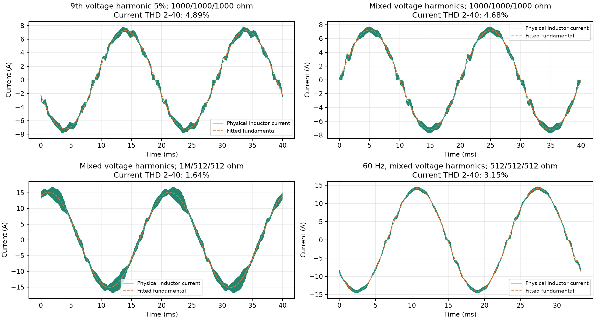
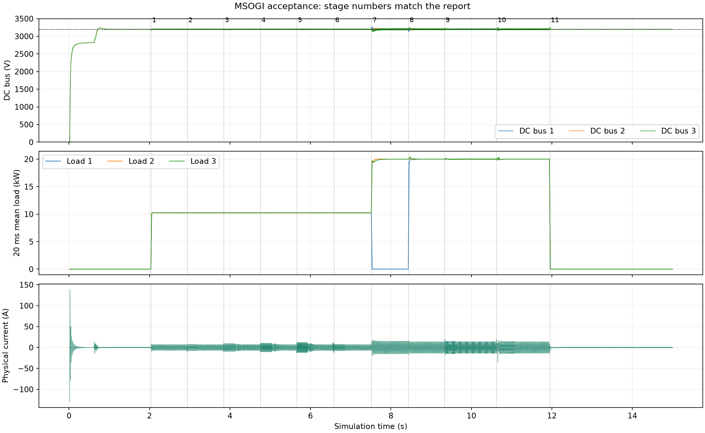

# CHB MSOGI 谐波电流与频率斜坡测试报告

日期：2026-09-27。仅呈现当前版本 `phase_regression` 的仿真数据。验证结论：**通过**。

## 实现与测试条件

- 实测电网电压 MSOGI、基波 PLL、谐波电压前馈及 MSOGI 电流选频反馈。
- 基波前馈保留实测电压减去已分离谐波后的残差，避免 PLL 暂态滞后直接造成遗漏的电压扰动。
- 总桥限幅、各桥电压分配及无功规划采用 64 点完整周期波形约束，并加入节点间波峰的二阶导数误差裕量；选频反馈余量也根据含相位的完整前馈波形计算。
- 电网基波 6000 V RMS；输入 L=12 mH；每桥 C=600 µF、母线目标 3200 V。
- 控制/PWM 为 10 kHz；8 拍电感电流平均采样；BSP duty 和 EN 的一拍延迟保留。
- dq PI 为 Kp=60 V/A、Ki=7000 V/(A·s)；电流 MSOGI k=0.05，选频反馈 400 V/A。
- 快速变频时依据实测 PLL 频率变化率和相角误差暂停选频电压分解及电流反馈；连续稳定 200 ms 后用 200 ms 恢复。基波电流环和完整的瞬时电网电压前馈持续工作。
- 混合谐波幅值为 3/5/7/9 次各 3%/2%/1%/1%，初相位均为 0；电网实际低次 THD 约 3.87%。
- 前 6 段为 1000/1000/1000 Ω；第 7 段为 1 MΩ/512/512 Ω；第 8～10 段为 512/512/512 Ω；第 11 段为三路 1 MΩ。
- 先空载启动并稳定，再在线改变负载及谐波。频率变化速率为 10 Hz/ms，50 与 60 Hz 之间的源频率斜坡历时 1 ms。
- 使用现有 PLECS 开关模型、实际电感电流和母线电压。仅临时开启已有 Scope3 采集，并在导出后恢复原状态。

## 判据与测量口径

本次工程验收采用：带载低次电流 THD（2～40 次）小于 5%；稳态各母线平均值距 3200 V 不超过 1%；运行中无保护闭锁；快速变频阶段电流绝对峰值小于 50 A（本次以 25 A 参考幅值上限的两倍作为暂态观察界限）。轻载单列绝对谐波电流，以 0.25 A RMS 为本次观察界限。这是本次仿真判据，不是电能质量标准认证或器件安全额定值。

每段取记录终点之前 100 ms 为窗口终点，向前取 10 个基波周期计算频谱；从原始变步长波形按 200 kHz 插值，而不是直接使用同控制频率采样的 THD 模块。2～40 次 THD 不含全部开关频率纹波。真 PF 使用同窗口瞬时电压、电流计算。

## 稳态结果

| 段 | 工况 | 基波电流 RMS/A | 电流 THD/% | 2～40 次谐波 RMS/A | 真 PF | 三路平均母线/V |
|---|---|---:|---:|---:|---:|---|
| 1 | 纯正弦电网 | 5.120 | 4.70 | 0.2408 | 0.9975 | 3200.0/3200.0/3200.0 |
| 2 | 3 次 5% | 5.122 | 4.71 | 0.2411 | 0.9960 | 3200.0/3200.0/3200.0 |
| 3 | 5 次 5% | 5.123 | 4.87 | 0.2492 | 0.9960 | 3200.0/3200.0/3200.0 |
| 4 | 7 次 5% | 5.123 | 4.84 | 0.2479 | 0.9958 | 3200.0/3200.0/3200.1 |
| 5 | 9 次 5% | 5.122 | 4.89 | 0.2503 | 0.9961 | 3200.1/3200.1/3200.2 |
| 6 | 混合谐波 | 5.122 | 4.68 | 0.2400 | 0.9964 | 3200.0/3200.0/3200.0 |
| 7 | 混合谐波，一级近空载 | 10.727 | 1.64 | 0.1758 | 0.6182 | 3199.7/3200.0/3199.7 |
| 8 | 混合谐波，均衡重载 | 10.002 | 2.77 | 0.2774 | 0.9983 | 3200.0/3200.0/3200.1 |
| 9 | 混合谐波，50→60 Hz | 10.003 | 3.15 | 0.3150 | 0.9982 | 3200.0/3200.0/3200.0 |
| 10 | 混合谐波，60→50 Hz | 10.002 | 2.77 | 0.2774 | 0.9983 | 3200.0/3200.0/3200.0 |
| 11 | 混合谐波，卸载 | 0.351 | 41.71 | 0.1465 | 0.0115 | 3199.9/3199.9/3199.9 |

近空载时基波很小，THD 百分比会放大，应结合绝对谐波电流及开关纹波理解。不平衡负载保留基波无功电流以满足每桥调制容量，正弦电流不等于 PF=1。

## 投卸载与变频动态

下表统计命令标记前 20 ms 至后 300 ms 的原始波形极值；标记时间为在线命令提交后的近似时间。电流峰值包含开关纹波和动态分量，不能与稳态基波电流参考限幅混为一谈。

首次投载之前的启机区间包含无源预充，电感电流绝对峰值为 138.55 A。该值独立于后续变频判据，当前结果不能用于认定预充器件额定电流或启动限流已满足硬件要求。

| 工况 | 电感电流绝对峰值/A | 三路母线最低/V | 三路母线最高/V |
|---|---:|---:|---:|
| 混合谐波，一级近空载 | 22.89 | 3129.6 | 3269.3 |
| 混合谐波，均衡重载 | 18.36 | 3128.9 | 3250.0 |
| 混合谐波，50→60 Hz | 19.60 | 3169.3 | 3231.9 |
| 混合谐波，60→50 Hz | 34.73 | 3153.9 | 3252.8 |
| 混合谐波，卸载 | 14.71 | 3183.8 | 3249.8 |

60 Hz 段的 PLL 读数为 59.99985 Hz；恢复 50 Hz 后为 50.00004 Hz。斜坡解决电源相角跳变，不能消除控制环对真实频率变化的暂态响应。

## 使用与边界

- `GRID_SOURCE_HZ`：源频率目标，40～70 Hz；`GRID_FREQ_RAMP_HZ_MS`：0.001～10 Hz/ms，默认 10。
- `GRID_SOURCE_HZ_ACT` 观察电源斜坡频率；`GRID_HZ` 观察实测电压 PLL 的频率。
- `GRID_H3_PU`～`GRID_H9_PU` 配置幅值比例；对应 `GRID_H*_PHASE_RAD` 配置初相位。
- `I_H*_PEAK_A` 观察控制采样中的谐波峰值；最终电流质量仍以原始电感电流波形判定。
- `CHB_HARM_SCALE`、`CHB_HARM_FB_SCALE` 观察补偿缩放。容量不足时不能保证完整补偿；当前测试不代表所有谐波幅值、相位和负载组合均可行。
- `HARM_FEEDBACK_WEIGHT` 观察频率暂态期间的选频反馈退出与恢复；此时允许暂态电流畸变，不应按稳态 THD 判据解读。
- 算法独立测试涵盖 45/50/60/70 Hz、多谐波与直流偏置，电压通道误差低于 0.03 V，电流通道误差低于 0.001 A；严格 GCC 构建通过。
- 未进行实机、电磁兼容或 MCU 执行时间验证。

## 本次证据

原始 trace、日志和 JSON 位于本地忽略目录 `platform/plecs/chb/build/msogi/`；脚本位于本地忽略目录 `local/scripts/`。源码和 DLL 指纹：

- `build/bin/plecs_chb.dll`：`6040d1a1705bf6963b615b2020227cc01785c07358ed68ac89c778900de9f2ac`
- `chb.plecs`：`610d6b96a12f673caea4afc08a1e1433ca98a8010936159bd4af981f2ab659c1`
- `app/app.c`：`e4b3b4d1fd79a8bac82f7e679c4759f8c9ebcb3be328f623ab5aa0ce3ddae76a`
