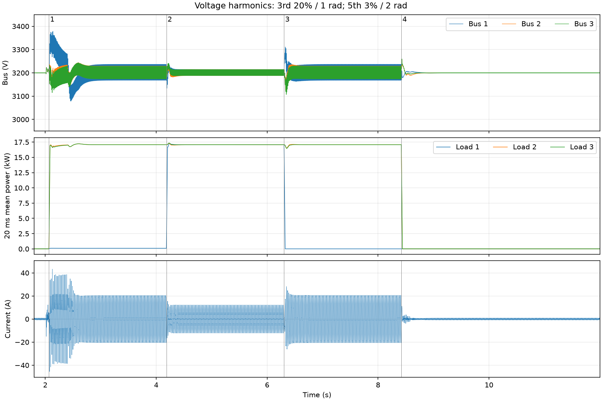
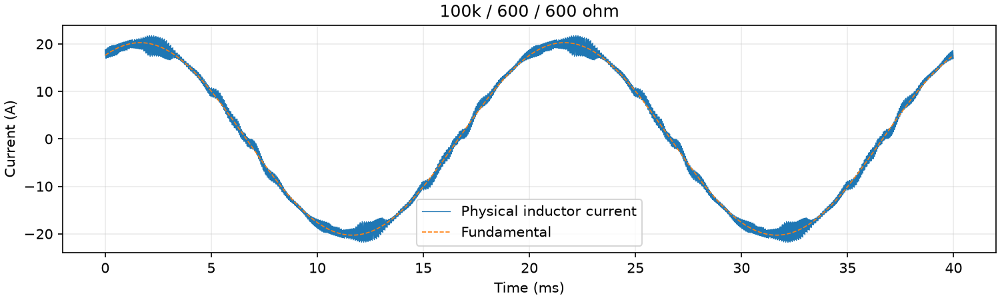

# CHB 大谐波与不平衡负载验证

日期：2026-09-27；运行标识 `phase_final`。本文件仅记录此次控制版本的测试结果。

## 工况与改动

- 电网基波 6000 V RMS、50 Hz；三次谐波 20%、相位 1 rad，五次谐波 3%、相位 2 rad，七次和九次为零。实测电压低次 THD 约 20.22%。
- 每桥母线目标 3200 V、600 µF，输入电感 12 mH；PWM/控制 10 kHz，BSP duty/EN 一拍延迟保留。
- 先空载启机，再按下表在线切换负载，每段观察 2 s。首段对应用户截图参数。
- 总桥限幅、各桥电压分配、无功规划及电流谐波反馈余量统一使用带相位的完整波形容量；64 点周期约束加二阶导数误差裕量。没有提高电流上限、母线给定或保护阈值。
- 该算法改善可实现工况的分配，不能保证任意谐波幅值、相位和负载组合都可实现。

## 实测结果

结论：**通过本次判据**。带载 THD 判据为 2～40 次小于 5%；母线稳态平均误差小于 1%；无保护闭锁。近空载用绝对谐波电流小于 0.25 A RMS 判定，不要求很小基波下的 THD 百分比小于 5%。

| 段 | 三路电阻 | 三路平均母线/V | THD/% | 谐波电流 RMS/A | 真 PF | 切换电流峰值/A |
|---|---|---|---:|---:|---:|---:|
| 1 | 100 kΩ / 600 Ω / 600 Ω | 3199.99/3199.98/3200.01 | 2.30 | 0.330 | 0.3887 | 46.19 |
| 2 | 600 Ω / 600 Ω / 600 Ω | 3199.98/3199.98/3200.03 | 3.87 | 0.330 | 0.9786 | 22.59 |
| 3 | 1 MΩ / 600 Ω / 600 Ω | 3199.98/3199.98/3200.01 | 2.30 | 0.330 | 0.3865 | 30.42 |
| 4 | 1 MΩ / 1 MΩ / 1 MΩ | 3200.00/3200.00/3200.00 | 43.45 | 0.153 | 0.0112 | 22.66 |

稳态频谱使用每段记录终点前 100 ms 结束的 10 个基波周期，从原始变步长电流按 200 kHz 插值计算。峰值取命令标记前 20 ms 至后 300 ms，含开关纹波。PF 包含谐波及均衡所需的基波无功影响，母线均衡并不意味着 PF 为 1。

截图工况稳定段的三路母线峰峰纹波分别为 **68.82/55.21/55.01 V**。三路平均值均衡，仍存在周期纹波，瞬时电压不要求完全相同。

## 证据与边界

- DLL SHA-256：`6040d1a1705bf6963b615b2020227cc01785c07358ed68ac89c778900de9f2ac`。
- 原始波形、测量 JSON 和日志：本地忽略目录 `platform/plecs/chb/build/msogi/phase_final.*`。
- 未进行 MCU 执行时间和硬件器件额定值验证；本报告是 PLECS 开关模型的结果。
