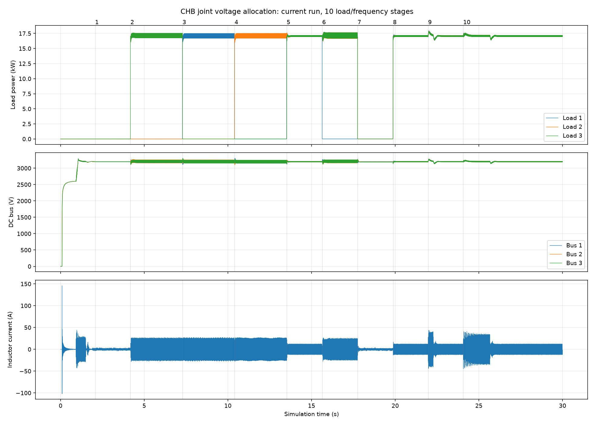

# CHB 近方波双路轻载与联合电压分配测试

日期：2026-09-27。运行标识：`square_joint_accept`。本报告只列本轮代码的实测结果，不混入历史数据。

## 条件与判据

- 电网基波 6000 V RMS；H3/H5/H7/H9 为 0.333333 / 0.2 / 0.14 / 0.111，相位均为 0，与用户截图一致。
- 每桥目标 3200 V、600 µF，输入电感 12 mH；控制/PWM 100 µs，电源生成 12.5 µs；BSP duty 和 EN 一拍延迟保留。
- 电流参考矢量上限仍为 25 A 峰值；每桥输出功率限制仍为 20 kW。保护阈值未更改。
- 在已保存模型的本地副本 `local/models/chb_square_verify.plecs` 上运行 30 s，空载启机后切换负载。下表阻值单位 Ω，1M 表示 1 MΩ。
- 稳态统计：各段终点前 100 ms 结束的 10 个基波周期，原始变步长波形插值至 200 kHz；电流 THD 包含 2～40 次，负载功率为各路母线电压乘负载电流。
- 判据：全过程无保护闭锁，各稳态母线平均误差小于 1%；带载电流 THD 小于 5%。轻载基波不足 1 A 时，用 2～40 次谐波电流小于 0.25 A RMS 判定，不能称轻载原始电流为纯正弦。
- 变频斜率 10 Hz/ms，变化前 20 ms 至后 300 ms 的电流峰值检查线为 50 A；该检查线不是已验证的硬件器件额定值。

## 稳态结果

本轮自动判据：**通过**。

| 段 | 三路负载/Ω | 频率/Hz | 三路负载功率/kW | 三路平均母线/V | 电流 THD/% | 谐波电流 RMS/A | 真 PF |
|---|---|---:|---|---|---:|---:|---:|
| 1 | 1M / 1M / 1M | 50 | 0.010/0.010/0.010 | 3194.35/3198.71/3199.96 | 20.81 | 0.145 | 0.0048 |
| 2 | 1M / 1M / 600 | 50 | 0.010/0.010/17.057 | 3199.11/3199.10/3199.04 | 1.50 | 0.265 | 0.1480 |
| 3 | 600 / 1M / 1M | 50 | 17.018/0.010/0.010 | 3195.35/3196.49/3191.19 | 1.09 | 0.192 | 0.1470 |
| 4 | 1M / 600 / 1M | 50 | 0.010/17.026/0.010 | 3190.37/3196.07/3191.20 | 1.22 | 0.215 | 0.1473 |
| 5 | 600 / 600 / 600 | 50 | 17.067/17.066/17.067 | 3199.99/3199.98/3200.04 | 2.98 | 0.254 | 0.9182 |
| 6 | 1M / 600 / 600 | 50 | 0.010/17.068/17.068 | 3199.94/3199.94/3199.96 | 1.48 | 0.253 | 0.3065 |
| 7 | 1M / 1M / 1M | 50 | 0.010/0.010/0.010 | 3198.21/3191.71/3188.92 | 20.88 | 0.146 | 0.0049 |
| 8 | 600 / 600 / 600 | 50 | 17.067/17.067/17.067 | 3200.00/3199.98/3200.04 | 2.98 | 0.254 | 0.9182 |
| 9 | 600 / 600 / 600 | 60 | 17.067/17.066/17.067 | 3200.00/3199.97/3200.04 | 3.44 | 0.293 | 0.9182 |
| 10 | 600 / 600 / 600 | 50 | 17.066/17.066/17.067 | 3199.98/3199.96/3200.02 | 2.98 | 0.254 | 0.9182 |

电网畸变及不平衡负载所需无功都会降低真 PF。当前无功规划仍沿用周期分配可行域，极不平衡时趋向 25 A 电流圆；联合瞬时分配扩大了均衡能力，本轮未优化此类工况的最小无功。

## 投卸载与母线纹波

| 段 | 三路稳态母线峰峰纹波/V | 切换期间三路母线范围/V | 切换电流峰值/A |
|---|---|---|---:|
| 1 | 3.26/4.58/3.10 | 3193.0～3196.3/3196.7～3201.6/3198.7～3202.6 | 3.83 |
| 2 | 92.74/91.91/73.85 | 3132.8～3261.3/3125.2～3262.6/3105.6～3247.0 | 29.61 |
| 3 | 74.32/92.98/92.20 | 3107.7～3254.5/3159.1～3262.7/3154.1～3301.6 | 28.39 |
| 4 | 92.18/74.49/93.05 | 3153.2～3305.9/3099.3～3252.1/3151.9～3260.9 | 28.74 |
| 5 | 19.30/19.32/19.32 | 3121.2～3245.5/3167.0～3250.2/3122.8～3246.8 | 27.10 |
| 6 | 56.66/92.50/89.12 | 3170.0～3269.1/3117.1～3258.2/3125.0～3260.9 | 28.23 |
| 7 | 3.29/4.60/3.11 | 3162.9～3238.1/3162.3～3277.6/3164.0～3276.3 | 25.57 |
| 8 | 19.30/19.32/19.32 | 3145.0～3219.3/3138.0～3210.3/3134.5～3209.9 | 17.43 |
| 9 | 16.19/16.21/16.21 | 3130.9～3281.3/3135.3～3275.6/3138.7～3270.8 | 46.61 |
| 10 | 19.34/19.36/19.36 | 3188.4～3251.4/3186.2～3249.1/3184.1～3247.8 | 44.92 |

母线范围取命令标记前 20 ms 至后 500 ms；电流峰值取前 20 ms 至后 300 ms。稳态平均值合格不代表瞬时纹波为零。

## 启机与验证边界

- 首次控制输出 0.9210 s，随后 500 ms 内原始电流峰值 45.33 A；此前被动预充峰值 146.80 A。预充限流须另作硬件校核。
- 25 A 是参考矢量限幅，原始开关电流含纹波与动态超调，不能据此声称电流瞬时值始终不超过 25 A。
- 本次为有限阶近方波及表内负载组合的 PLECS 开关模型验证；不是任意谐波、负载或硬件测试结果。MCU 执行时间尚未验证。
- 原始证据保存在本地忽略目录 `platform/plecs/chb/build/msogi/square_joint_accept.*`。
- 测试 DLL SHA-256：`9713b5ed5e649d2e170947329d64111ea9d70e910a44a88db2708afa4909e445`。
