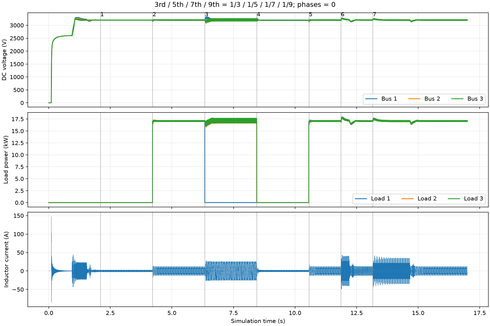
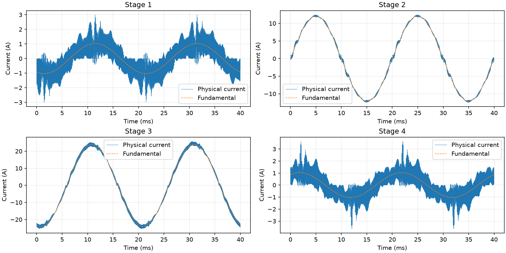

# CHB 近方波电网测试

日期：2026-09-27；运行标识：`square_priority_accept`。仅呈现本轮实测数据。

## 条件

- 电网基波 6000 V RMS、50 Hz；3、5、7、9 次比例分别为 1/3、1/5、1/7、1/9，相位全部为 0。有限阶近方波的理论峰值约 7.88 kV，总有效值约 6.53 kV。
- 每桥 3200 V、600 µF，输入电感 12 mH；控制与 PWM 10 kHz；BSP duty、EN 一拍延迟保留。
- 电源输出独立按 12.5 µs 更新，DLL 的 Sample time 为 `ctrl_ts/8`，控制中断仍为 100 µs。验证在本地模型副本 `local/models/chb_square_verify.plecs` 执行。用户已将原 `chb.plecs` 同步为该采样时间，Output delay 为 0；本报告数据来自副本。
- 谐波采用含相位的合成峰值限幅；全周期电压可行域为 256 点加二阶导数插值裕量。电流环 Kp=60、Ki=7000，选频电流反馈增益 400 V/A。
- 周期约束用于均衡电压分配；电流环剩余的共模电压按母线比例加入各桥，实际 PWM 电压限幅保留，防止周期幅值缩放误削弱瞬态电流调节。
- 在发出 RUN 前设置近方波谐波参数，空载启机后在线切换负载，前四段每段保持 2 s。近空载电阻为每路 1 MΩ；下表阻值单位 Ω。随后三路重新投入 600 Ω，再进行变频检查。
- 电流 THD 使用原始电感电流的 2～40 次频谱；稳态窗口为各段记录终点前 100 ms 结束的 10 个基波周期，按 200 kHz 插值计算。

## 结果

固定频率下的稳态及 RUN 阶段负载切换判据：**通过**。判据为无保护闭锁、母线平均误差小于 1%、带载 THD 小于 5%；基波电流不足 1 A 时改用谐波电流小于 0.25 A RMS 判定。启控及变频峰值按下文单独验收。

| 段 | 三路电阻 | 三路平均母线/V | 基波电流 RMS/A | THD/% | 谐波电流 RMS/A | 真 PF | 切换电流峰值/A |
|---|---|---|---:|---:|---:|---:|---:|
| 1 | 近空载 | 3200.01/3200.01/3200.00 | 0.745 | 16.80 | 0.125 | 0.0007 | 3.25 |
| 2 | 600 / 600 / 600 | 3199.99/3199.97/3200.04 | 8.538 | 2.98 | 0.254 | 0.9179 | 17.37 |
| 3 | 1 M / 600 / 600 | 3200.06/3199.70/3199.77 | 17.104 | 1.42 | 0.242 | 0.3052 | 28.72 |
| 4 | 卸载至三路 1 M | 3197.98/3192.09/3190.22 | 0.743 | 19.54 | 0.145 | 0.0047 | 25.42 |

切换电流峰值窗口为命令标记前 20 ms 至后 300 ms。畸变电网下，正弦电流的真 PF 不必为 1；一级近空载时，还包括母线均衡所需无功。

| 段 | 三路稳态母线峰峰纹波/V | 切换期间三路母线范围/V |
|---|---|---|
| 1 | 3.29/3.43/4.90 | 3197.3～3201.9/3197.7～3202.0/3196.9～3202.8 |
| 2 | 19.31/19.33/19.29 | 3149.0～3214.6/3150.1～3221.4/3149.9～3217.8 |
| 3 | 60.01/96.54/91.84 | 3175.9～3320.0/3082.1～3254.0/3096.2～3259.7 |
| 4 | 3.49/4.88/3.31 | 3163.4～3239.4/3163.4～3278.5/3163.8～3277.2 |

母线切换范围使用命令标记前 20 ms 至后 500 ms；纹波使用同一稳态窗口。

## 启控电流

控制首次输出时间为 0.9410 s。按原始变步长波形统计，启控后 500 ms 内的电感电流峰值为 **45.34 A**，50 A 判据**通过**；此前被动预充阶段为 **147.36 A**。这些峰值没有包含在上表从 2 s 后开始的负载切换窗口中。

预充电流由当前模型中的电源、限流电阻及电感决定，不属于已投入 PWM 控制的电流环验收范围。该预充峰值仍须在实际硬件设计时单独校核。

## 快速变频组合工况

图中第 5 段恢复三路 600 Ω，第 6 段升至 60 Hz，第 7 段回到 50 Hz；变频斜率为 10 Hz/ms。判据包含变化附近电流峰值小于 50 A、稳态 THD 小于 5%、母线平均偏差小于 1%及无保护闭锁。此项结果：**通过**。

| 目标频率 | 观察时长/s | 变化附近电流峰值/A | 观察窗口 THD/% | 结果 |
|---|---:|---:|---:|---|
| 60hz | 1.20 | 49.72 | 3.44 | 通过 |
| 50hz | 2.50 | 43.48 | 2.98 | 通过 |

频率连续积分的最大斜率为 10 Hz/ms。过渡过程允许电流失真；稳态 THD 结果不表示变频期间每一个工频周期都满足同一 THD。50→60 Hz 峰值距离本轮 50 A 检查线仅约 0.28 A，裕量较小；50 A 是本轮仿真检查线，不是经过器件额定值确认的硬件限值。

## 边界与证据

- 本结论适用于上述有限阶谐波组合，不代表无限带宽理想方波、任意谐波相位或任意负载均可保持相同结果。
- 原始数据位于本地忽略目录 `platform/plecs/chb/build/msogi/square_priority_accept.*`。
- DLL SHA-256：`bf93c77d243cb334d5b1717a079ab786c132b63d8882dbd7988e593c432c8a90`。
- 属于 PLECS 开关模型验证，尚未验证 MCU 运算时间或实际硬件。
- 25 A 是闭环参考矢量限幅，不等于原始电感电流在预充、参数突变或开关纹波期间的硬峰值上限。完整波形保留了预充冲击；表中的切换峰值仅针对所标记的 RUN 阶段。
