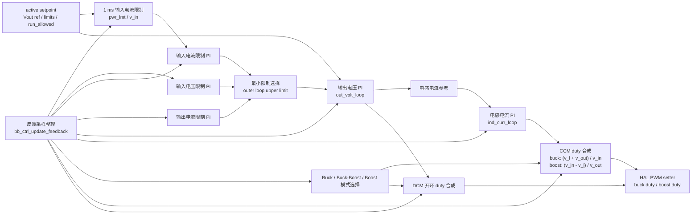

# Buck-Boost 控制模块设计

## 1. 模块定位

BB 模块位于 `code/ctrl/bb/`，用于宽范围 Buck-Boost 功率级控制。该模块使用浮点物理量控制域。

通用控制模块结构见 [CTRL_DESIGN.md](CTRL_DESIGN.md)。

## 2. 文件职责

| 文件 | 职责 |
| --- | --- |
| `bb_cfg.c/h` | 控制周期、运行许可、功率限制、输入/输出电压电流限制、输出电压参考、active/building 双缓冲 |
| `bb_hal.c/h` | 输入/输出电压电流、电感电流、buck/boost PWM、保护锁存绑定 |
| `bb_ctrl.c/h` | 初始化、运行准备、反馈采样整理、限制环、输出电压环、电感电流环、CCM/DCM duty 生成 |
| `bb_fsm.c/h` | init、idle、run 状态机 |

## 3. 配置和 HAL

`bb_ctrl_timing_t` 包含 `ctrl_ts`。

`bb_ctrl_setpoint_t` 包含：

| 字段 | 说明 |
| --- | --- |
| `run_allowed` | 控制运行许可 |
| `pwr_lmt` | 输入功率限制 |
| `out_volt_ref` | 输出电压参考 |
| `in_volt_lmt` | 输入电压限制 |
| `in_curr_lmt` | 输入电流限制 |
| `out_curr_lmt` | 输出电流限制 |

`bb_ctrl_hal_t` 绑定输入/输出电压电流、电感电流和 buck/boost PWM setter。PWM setter 同时接收 buck duty、buck 上下管使能、boost duty、boost 上下管使能。

BB 的采样整理函数是 `bb_ctrl_update_feedback()`。

## 4. 注册入口

| 注册 | 说明 |
| --- | --- |
| `REG_INIT(0, bb_ctrl_init)` | 初始化控制对象 |
| `REG_INTERRUPT(3, bb_ctrl_isr)` | 中断阶段执行 BB 控制和 PWM 输出 |
| `REG_TASK(1, bb_ctrl_task)` | 慢速后台任务 |
| `REG_TASK_MS(1, bb_ctrl_in_curr_lmt_task)` | 1 ms 输入功率到输入电流限制换算 |
| `REG_FSM(BB_FSM, ...)` | 1 ms BB 状态机 |

## 5. 控制框图

BB ISR 整理 HAL 采样，计算 CCM/DCM 状态、限制环、输出电压环和电感电流环。CCM 路径闭合电感电流环后合成 duty；DCM 路径复位电流环并使用开环 duty 生成器。

## 6. 约束

- 不使用动态内存。
- 采样量和设定值使用浮点物理量。
- 运行前完成 timing、配置双缓冲和 HAL 绑定。
- HAL 绑定只在 idle 阶段更新。
- 启动前通过 `bb_hal_is_ready()`。
