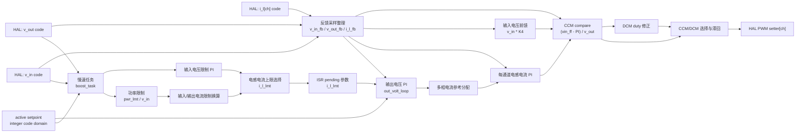

# Boost 控制模块设计

## 1. 模块定位

Boost 模块位于 `code/ctrl/boost/`，用于升压功率级控制。该模块使用整数代码域，配置层把物理量转换成控制代码。

通用控制模块结构见 [CTRL_DESIGN.md](CTRL_DESIGN.md)。

## 2. 文件职责

| 文件 | 职责 |
| --- | --- |
| `boost_cfg.c/h` | 控制周期、任务周期、PWM 周期、PWM compare 上限、物理量到整数代码域转换、active/building 双缓冲 |
| `boost_hal.c/h` | 输入/输出电压代码、多通道电感电流代码、PWM compare setter、PWM enable/disable、运行回调绑定 |
| `boost_ctrl.c/h` | 初始化、运行准备、反馈采样整理、输出电压环、电感电流环、慢速限制计算、CCM/DCM compare 输出 |
| `boost_fsm.c/h` | init、idle、run 状态机和紧急停止 |

## 3. 配置和 HAL

`boost_ctrl_timing_t` 包含 `ctrl_ts`、`task_ts`、`pwm_ts` 和 `pwm_cmp_max`。

`boost_ctrl_setpoint_t` 使用整数代码域保存运行许可、输出电压参考、输入电压限制、功率限制、输入电流限制和输出电流限制。

`boost_ctrl_hal_t` 绑定输入/输出电压代码、多通道电感电流代码、每通道 PWM setter、PWM enable/disable。

Boost 的采样整理函数是 `update_adc_feedback()`，电感电流通道数由 `BOOST_CTRL_IND_CURR_CH_NUM` 决定。

## 4. 注册入口

| 注册 | 说明 |
| --- | --- |
| `REG_INIT(0, boost_init)` | 初始化控制对象 |
| `REG_INTERRUPT(3, boost_isr)` | 中断阶段执行 Boost 控制和 PWM 输出 |
| `REG_TASK(1, boost_task)` | 慢速计算电流限制和参数发布 |
| `REG_FSM(BOOST_FSM, ...)` | 1 ms Boost 状态机 |

## 5. 控制框图

Boost ISR 整理 ADC 反馈，执行输出电压环和每通道电感电流环，再根据 CCM compare 和 DCM duty 结果做模式滞回选择。

## 6. 约束

- 不使用动态内存。
- 采样量和设定值使用整数代码域。
- 平台提供正确的 `pwm_ts` 和 `pwm_cmp_max`。
- 多通道电感电流和 PWM setter 按通道绑定。
- 运行前完成 timing、配置双缓冲和 HAL 绑定。
