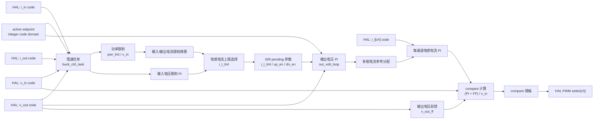

# Buck 控制模块设计

## 1. 模块定位

Buck 模块位于 `code/ctrl/buck/`，用于降压功率级控制。该模块使用整数代码域，配置层把物理量转换成控制代码。

通用控制模块结构见 [CTRL_DESIGN.md](CTRL_DESIGN.md)。

## 2. 文件职责

| 文件 | 职责 |
| --- | --- |
| `buck_cfg.c/h` | 控制周期、任务周期、PWM compare 上限、物理量到整数代码域转换、active/building 双缓冲 |
| `buck_hal.c/h` | 输入/输出电压电流代码、多通道电感电流代码、PWM compare setter、保护绑定 |
| `buck_ctrl.c/h` | 初始化、运行准备、输出电压环、电感电流环、慢速限制计算、PWM compare 输出 |
| `buck_fsm.c/h` | init、idle、run 状态机 |

## 3. 配置和 HAL

`buck_ctrl_timing_t` 包含 `ctrl_ts`、`task_ts` 和 `pwm_cmp_max`。

`buck_ctrl_setpoint_t` 使用整数代码域保存运行许可、输出电压参考、输入电压限制、功率限制、输入电流限制和输出电流限制。

`buck_ctrl_hal_t` 绑定输入/输出电压电流代码、多通道电感电流代码、每通道 PWM compare setter 和 PWM disable。

电感电流通道数由 `BUCK_CTRL_IND_CURR_CH_NUM` 决定。

## 4. 注册入口

| 注册 | 说明 |
| --- | --- |
| `REG_INIT(0, buck_ctrl_init)` | 初始化控制对象 |
| `REG_INTERRUPT(3, buck_ctrl_isr)` | 中断阶段执行 Buck 控制和 PWM 输出 |
| `REG_TASK(1, buck_ctrl_task)` | 慢速计算电流限制和使能参数 |
| `REG_FSM(BUCK_FSM, ...)` | 1 ms Buck 状态机 |

## 5. 控制框图

慢速任务计算电流限制和上下管使能，ISR 使用 pending 参数执行输出电压环、电感电流环和 PWM compare 输出。

## 6. 约束

- 不使用动态内存。
- 采样量和设定值使用整数代码域。
- 平台提供正确的 `pwm_cmp_max`。
- 多通道电感电流和 PWM setter 按通道绑定。
- 运行前完成 timing、配置双缓冲和 HAL 绑定。
