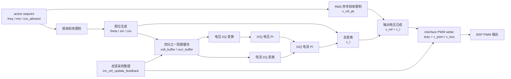

# INV 控制模块设计

## 1. 模块定位

INV 模块位于 `code/ctrl/inv/`，用于逆变输出电压控制、输出继电器流程和运行状态管理。该模块使用浮点物理量控制域。

通用控制模块结构见 [CTRL_DESIGN.md](CTRL_DESIGN.md)。

## 2. 文件职责

| 文件 | 职责 |
| --- | --- |
| `inv_cfg.c/h` | 控制周期、控制频率、运行许可、输出频率、RMS 电压参考、斜率、active/building 双缓冲 |
| `inv_hal.c/h` | 输出电容电压、输出电感电流、母线电压、PWM、输出继电器、保护锁存绑定 |
| `inv_ctrl.c/h` | 初始化、运行准备、反馈采样整理、相位计算、DQ 电压环、DQ 电流环、PWM 电压命令 |
| `inv_fsm.c/h` | init、idle、rly_on、run 状态机 |

## 3. 配置和 HAL

`inv_ctrl_timing_t` 包含 `ctrl_ts` 和 `ctrl_freq`。

`inv_ctrl_setpoint_t` 包含：

| 字段 | 说明 |
| --- | --- |
| `run_allowed` | 控制运行许可 |
| `freq_hz` | 输出频率 |
| `freq_slew_hzps` | 频率斜率 |
| `rms_ref_v` | 输出 RMS 电压参考 |
| `rms_slew_vps` | RMS 电压斜率 |

`inv_ctrl_hal_t` 绑定输出电容电压、输出电感电流、母线电压和 PWM 回调。`inv_fsm_hal_t` 绑定输出继电器、运行进入/退出回调和保护锁存。

INV 的采样整理函数是 `inv_ctrl_update_feedback()`，控制 ISR 再把整理后的采样写入 `volt_buffer` 和 `curr_buffer`。

## 4. 注册入口

| 注册 | 说明 |
| --- | --- |
| `REG_INIT(0, inv_ctrl_init)` | 初始化控制对象 |
| `REG_INTERRUPT(0, inv_ctrl_cal_theta)` | 中断前段计算输出相位 |
| `REG_INTERRUPT(3, inv_ctrl_isr)` | 中断阶段执行 INV 控制和 PWM 输出 |
| `REG_FSM(INV_FSM, ...)` | 1 ms INV 状态机 |

## 5. 控制框图

`inv_ctrl_cal_theta` 计算当前相位。`inv_ctrl_isr` 同步 setpoint、整理采样、更新斜率限制、执行 DQ 电压环和电流环，并输出 `p_set_pwm_func(v_pwm, v_bus)`。

## 6. 约束

- 不使用动态内存。
- 采样量和设定值使用浮点物理量。
- 运行前完成 timing、配置双缓冲和 HAL 绑定。
- HAL 绑定在运行中保持锁定。
- 启动前通过 `inv_hal_is_ready()`。
