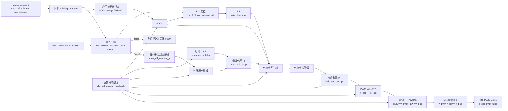

# PFC 控制模块设计

## 1. 模块定位

PFC 模块位于 `code/ctrl/pfc/`，用于交流侧 PFC 控制、母线电压调节、主继电器流程和运行状态管理。该模块使用浮点物理量控制域。

通用控制模块结构见 [CTRL_DESIGN.md](CTRL_DESIGN.md)。

## 2. 文件职责

| 文件 | 职责 |
| --- | --- |
| `pfc_cfg.c/h` | 控制周期、运行许可、母线电压参考、母线参考斜率、active/building 双缓冲 |
| `pfc_hal.c/h` | 电网电压、PFC 电容电压、PFC 电感电流、母线电压、电网 RMS、主继电器、PWM、保护锁存绑定 |
| `pfc_ctrl.c/h` | 初始化、运行准备、反馈采样整理、SOGI/FLL、母线电压环、PR 电流环、PWM 电压命令 |
| `pfc_fsm.c/h` | init、idle、soft_start、main_rly、run 状态机 |

## 3. 配置和 HAL

`pfc_ctrl_timing_t` 包含 `ctrl_ts`。

`pfc_ctrl_setpoint_t` 包含：

| 字段 | 说明 |
| --- | --- |
| `run_allowed` | 控制运行许可 |
| `vbus_ref_v` | DC bus 电压参考 |
| `vbus_slew_vps` | 母线参考斜率 |

`pfc_ctrl_hal_t` 绑定控制侧采样和 PWM 回调。`pfc_fsm_hal_t` 绑定母线状态、主继电器动作、运行进入/退出回调和保护锁存。

PFC 的采样整理函数是 `pfc_ctrl_update_feedback()`。PLECS 拓扑复用导致的电感电流方向适配在该函数内完成，控制环和控制框图使用整理后的控制方向。

## 4. 注册入口

| 注册 | 说明 |
| --- | --- |
| `REG_INIT(0, pfc_ctrl_init)` | 初始化控制对象 |
| `REG_INTERRUPT(3, pfc_ctrl_isr)` | 中断阶段执行 PFC 快速控制 |
| `REG_TASK(1, pfc_ctrl_task)` | 慢速更新 SOGI/PR 目标频率 |
| `REG_FSM(PFC_FSM, ...)` | 1 ms PFC 状态机 |

## 5. 控制框图

`pfc_ctrl_isr` 每次同步 setpoint、整理采样、计算 SOGI、更新或复位 FLL，并更新母线 notch。运行门控通过后执行母线电压环、电流参考生成、PR 电流环和 PWM 输出。

## 6. 约束

- 不使用动态内存。
- 采样量和设定值使用浮点物理量。
- 运行前完成 timing、配置双缓冲和 HAL 绑定。
- HAL 绑定只在 idle 解锁阶段更新。
- 启动前通过 `pfc_hal_is_ready()`。
