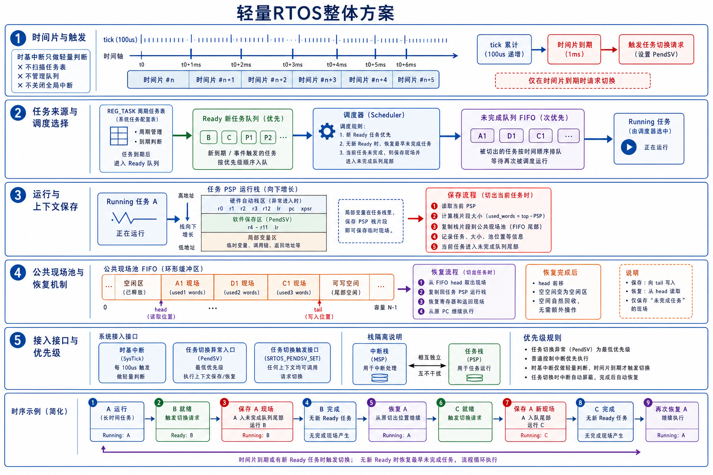
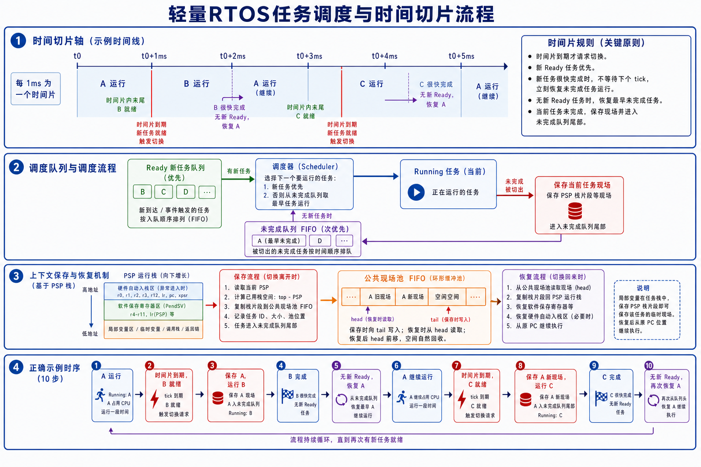
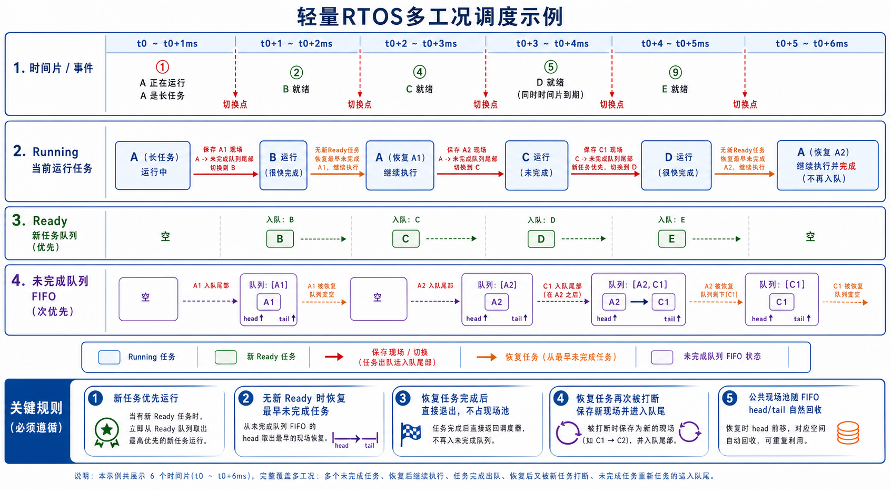

# SRTOS 设计方案

## 1. 模块定位

SRTOS 是基于 `REG_TASK` 周期任务表扩展出的轻量任务调度机制。

它保留原有自动注册任务模型，在 `SRTOS == 1` 时增加任务时间片、上下文保存恢复、Ready 新任务队列、未完成任务队列和公共现场池。

整体方案如下：



## 2. 设计目标

SRTOS 的目标是让长任务不能长期占用主循环执行权，同时保持原有周期任务注册方式。

核心行为：

- `100us` tick 作为任务到期判断的时间粒度。
- `1ms` 时间片作为长任务被切出的抢占周期。
- 新到期任务优先运行。
- 当前任务未完成时保存现场，进入未完成队列尾部。
- 没有新 Ready 任务时，恢复最早未完成任务。
- 未完成任务恢复后如果执行完成，直接退出，不再进入未完成队列。
- 未完成任务恢复后再次被切出，保存为新的现场并进入未完成队列尾部。

## 3. 时间粒度与时间片

当前配置中：

```c
#define SECTION_SYS_TICK_UNIT_US 100u
#define SECTION_TASK_SLICE_TICKS 10u
```

含义如下：

| 项目 | 当前值 | 作用 |
| --- | --- | --- |
| 系统 tick | `100us` | `REG_TASK` 周期到期判断粒度 |
| 时间片 | `10 tick`，即 `1ms` | 当前运行任务最长连续运行时间 |

`100us` 和 `1ms` 是两个不同概念：

- `100us` 用于判断任务是否到期。
- `1ms` 用于判断当前任务是否需要被切出。

当前实现中，时基中断只做轻量判断：

```text
delay_decrement
判断时间片是否到期
到期后触发任务切换请求
```

时基中断不做以下操作：

- 不扫描 `REG_TASK`。
- 不管理 Ready 队列。
- 不管理未完成队列。
- 不关闭全局中断。

任务到期扫描发生在 `run_task()` 和任务切换路径中。主循环持续调用 `run_task()` 时，满足周期条件的任务会按 `REG_TASK` 链表顺序进入 Ready 新任务队列。

如果长任务一直运行，新的 `100us` 任务会在时间片切换路径中被扫描到，并优先于未完成任务执行。

## 4. 任务队列

SRTOS 使用两类运行队列。

### 4.1 Ready 新任务队列

Ready 新任务队列保存刚到期或被事件唤醒的任务。

进入条件：

- `REG_TASK` 周期到期。
- 任务处于睡眠状态。
- 任务还没有处于 Ready 或 Running 状态。

Ready 新任务队列优先级高于未完成队列。

多个任务同时到期时，按 `REG_TASK` 链表扫描顺序进入 Ready 队列，并按 FIFO 顺序运行。

### 4.2 未完成队列 FIFO

未完成队列保存被切出的任务。

进入条件：

- 当前任务正在 Running。
- 时间片到期或有更优先的新 Ready 任务需要运行。
- 当前任务还没有执行完成。
- 当前任务现场已保存到公共现场池。

未完成队列按 FIFO 顺序恢复。没有新 Ready 任务时，调度器从未完成队列 head 取出最早未完成任务恢复运行。

## 5. 调度规则

调度器每次选择下一个任务时，按以下顺序执行：

1. 扫描 `REG_TASK`，把到期任务加入 Ready 新任务队列。
2. 如果 Ready 新任务队列非空，取出最早进入 Ready 队列的新任务运行。
3. 如果 Ready 新任务队列为空，取出未完成队列中最早未完成的任务恢复运行。
4. 如果两个队列都为空，当前任务继续运行或主循环继续等待。

当前运行任务被切出时：

1. 保存当前 PSP 运行栈片段。
2. 现场写入公共现场池 tail。
3. 任务进入未完成队列尾部。
4. 调度器选择下一个任务运行。

## 6. 上下文保存与恢复

任务运行使用 PSP 运行栈。任务栈中包含：

- 异常进入时硬件自动保存的寄存器现场。
- 任务切换时软件保存的寄存器现场。
- 局部变量、临时变量、调用链和返回地址。

保存当前任务时：

1. 读取当前 PSP。
2. 计算当前任务已经使用的栈片段大小。
3. 将 PSP 到运行栈栈顶之间的内容复制到公共现场池。
4. 记录任务、现场大小、现场池位置等信息。
5. 任务进入未完成队列尾部。

恢复未完成任务时：

1. 从公共现场池 head 读取任务现场。
2. 将现场复制回 PSP 运行栈。
3. 恢复软件保存寄存器和硬件异常返回现场。
4. 从原 PC 位置继续执行。

局部变量能够恢复，是因为局部变量本来就在任务 PSP 运行栈中。保存 PSP 栈片段等价于保存当前任务的临时现场。

## 7. 公共运行栈与公共现场池

当前 SRTOS 使用两块公共内存：

```c
#define SECTION_TASK_RUNTIME_STACK_WORDS 512u
#define SECTION_TASK_CONTEXT_POOL_WORDS 1024u
```

### 7.1 公共运行栈

公共运行栈是任务实际恢复后运行的位置。任务被调度运行时，现场恢复到公共运行栈，然后通过 PSP 继续执行。

### 7.2 公共现场池

公共现场池只保存未完成任务的现场，不是每个新任务都立即占用现场池。

公共现场池按 FIFO 环形方式使用：

- 保存现场时向 `tail` 写入。
- 恢复现场时从 `head` 读取。
- 恢复后 `head` 前移，对应空间自然回收。
- 任务恢复后如果执行完成，不再占用现场池。
- 任务恢复后再次被切出，保存为新的现场并写入 `tail`。

公共现场池机制如下：



## 8. 多工况调度示例

多个未完成任务同时存在时，未完成队列保持 FIFO 顺序。

示例：

1. A 是长任务，正在运行。
2. B 到期，A 被切出并保存为 `A1`，B 运行。
3. B 很快完成，没有新 Ready 任务，恢复 `A1`。
4. C 到期，A 再次被切出并保存为 `A2`，C 运行。
5. C 没有完成，D 到期，C 保存为 `C1`，D 优先运行。
6. D 完成后，没有新 Ready 任务，恢复最早未完成的 `A2`。
7. A 恢复后执行完成，直接退出，不再进入未完成队列。
8. 调度器继续恢复 `C1`。
9. C 后续再次被新任务打断时，保存为新的现场，例如 `C2`，并进入未完成队列尾部。

多工况示例如下：



## 9. 接入接口

启用 SRTOS 时，硬件平台需要提供以下接口。

### 9.1 SRTOS 开关

```c
#define SRTOS 1
```

`SRTOS == 1` 时启用任务切换、上下文保存恢复和公共现场池。

`SRTOS == 0` 时保持原有裸机 `run_task()` 调度方式。

### 9.2 系统时间

```c
#define SECTION_SYS_TICK systick_gettime_100us()
#define SECTION_SYS_TICK_UNIT_US 100u
```

`SECTION_SYS_TICK` 提供单调递增系统时间。

### 9.3 时间片触发

时基中断需要在时间片到期时触发任务切换请求：

```text
if scheduler started and slice elapsed:
    SRTOS_PENDSV_SET()
```

### 9.4 任务切换异常入口

任务切换异常入口负责：

- 保存当前 PSP 上的软件寄存器现场。
- 调用 `section_task_switch_sp()` 进行任务选择。
- 恢复下一个任务的 PSP 和寄存器现场。

### 9.5 任务启动入口

任务启动入口负责第一次调度请求，进入 SRTOS 的任务运行状态。

## 10. 栈隔离与优先级

SRTOS 使用栈隔离：

- 中断、异常和故障入口使用中断栈。
- 任务运行使用 PSP 运行栈。
- 任务现场通过 PSP 栈片段保存和恢复。

任务切换异常使用最低优先级。普通控制中断优先于任务切换执行，任务切换不会覆盖普通控制中断。

## 11. 当前实现边界

当前实现中，`100us` 任务周期表示任务到期粒度，不表示在长任务运行期间一定会在每个 `100us` 边界立即抢占执行。

如果当前任务长时间运行，新的到期任务会在时间片切换路径中被扫描出来。默认时间片为 `1ms`，因此长任务占用 CPU 时，新到期任务的最坏响应延迟受时间片影响。

当前实现的重点是：

- 长任务不会无限阻塞其他任务。
- 新 Ready 任务优先于未完成任务。
- 未完成任务按 FIFO 恢复。
- 局部变量和调用现场通过 PSP 栈片段保存。
- 中断路径保持轻量，不关闭全局中断。
