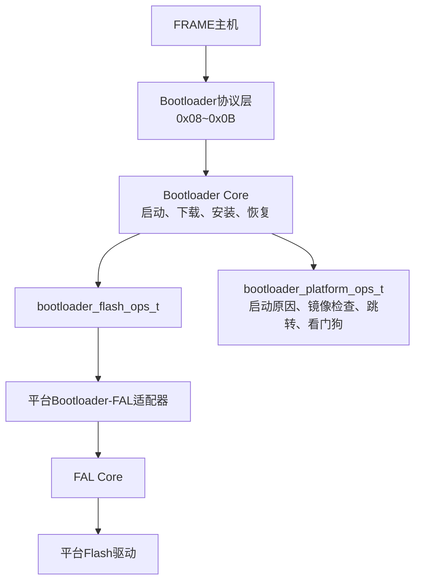
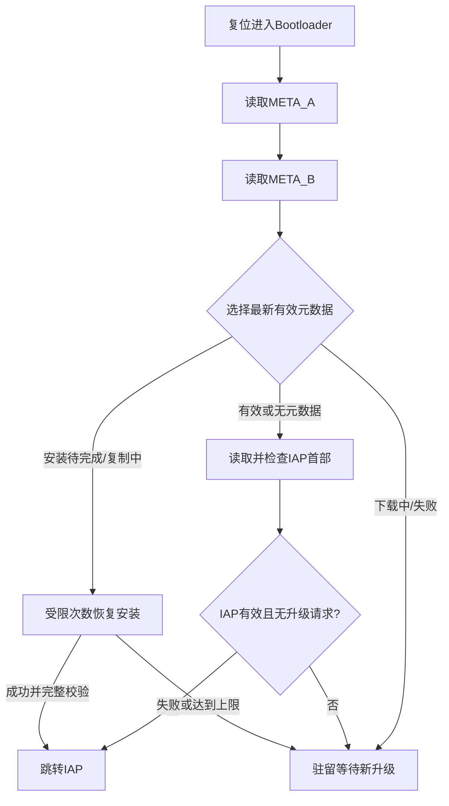
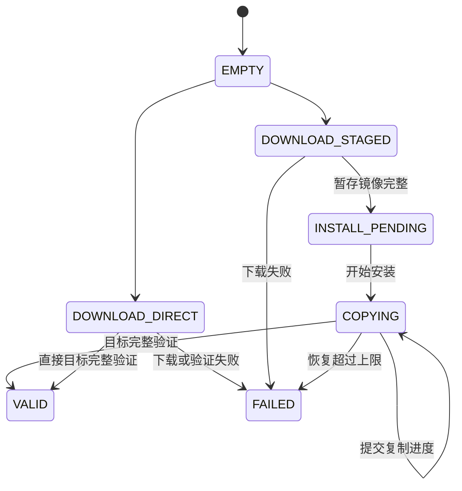

# Bootloader升级与防变砖设计

Bootloader的首要责任不是“把文件写进Flash”，而是在正常启动、升级、掉电和介质错误之间维持一个安全启动不变量：只有经过完整验证的IAP镜像才能获得执行权；无法证明安全时，系统留在Bootloader并继续提供升级入口。

## 1. 设计目标

- Core不包含FAL、Section或平台硬件头文件。
- 同时支持直接升级和暂存升级。
- 空IAP或损坏IAP时永久驻留，允许首次升级。
- 下载、安装和元数据提交期间掉电后能够恢复或安全等待。
- Flash持续失败时停止自动重试，避免复位循环和介质反复擦写。
- Bootloader自身区域不暴露给在线升级逻辑。
- IAP触发升级只传递升级意图，不让IAP承担安装状态机。

## 2. 软件边界



Core只认识`IAP/STAGING/META_A/META_B/LAYOUT`五个逻辑区域。Bootloader自身区域不存在于这个枚举中，即使平台FAL配置包含只读Bootloader分区，适配器也没有把它映射给Core的入口。

## 3. 能力挂载而非平台识别

Flash能力通过`bootloader_flash_ops_t`挂载：区域信息、读、写、擦、忙状态和结果查询。平台能力通过`bootloader_platform_ops_t`挂载：

- 读取启动原因和保留升级请求；
- 校验平台可执行镜像首部；
- 跳转到IAP；
- 喂狗或完成平台维护。

CRC初始化与增量更新也由配置提供。Core因此不判断当前是HC32、Zynq、片内EFM还是QSPI，也不负责初始化公共FAL实例。

## 4. 启动决策

Bootloader从元数据开始，而不是直接检查IAP后跳转：



元数据损坏不等于立即擦除IAP。两个副本都无效时，Core独立检查IAP首部：已有有效应用仍可正常启动；无法验证时才驻留。

## 5. 直接升级与暂存升级

### 5.1 直接升级

固件数据直接写入IAP区域。开始升级前元数据记录IAP处于直接下载状态，因此任何中途复位都不会把半个镜像作为有效应用启动。

优点是占用Flash少、流程短；代价是一旦开始擦除IAP，旧应用不再保留。失败后必须停留Bootloader并重新发送完整镜像。

### 5.2 暂存升级

固件先完整写入STAGING：

1. 擦除暂存区域。
2. 按顺序接收数据并维护运行CRC。
3. 校验结束命令、文件长度、CRC和footer。
4. 原子提交`INSTALL_PENDING`元数据。
5. 擦除IAP区域。
6. 分块读取暂存、写入IAP并读回比较。
7. 对完整IAP重新计算CRC。
8. 校验最终镜像首部和footer。
9. 提交`VALID`元数据后才允许跳转。

暂存下载完成前不修改旧IAP。只有候选镜像完整且可安装时才进入破坏旧应用的阶段。

## 6. 下载会话

协议层把FRAME命令转换为Core事件：

| 命令 | 含义 | Core动作 |
| --- | --- | --- |
| `0x08` | 升级信息 | 检查模块、长度和模式，建立会话 |
| `0x09` | 就绪查询 | 报告目标区域是否完成擦除并可接包 |
| `0x0A` | 固件数据 | 校验模块、offset、长度和包CRC后提交写入 |
| `0x0B` | 升级结束 | 校验总长度和整包CRC，进入验证或安装 |

数据包必须顺序到达。重复上一offset是网络重发，而不是新数据，Core可以幂等确认；跳跃offset会破坏运行CRC和镜像连续性，因此拒绝。

协议层负责结构体长度、字节序和直接ACK，Core只处理规范化后的升级信息和数据事件。通信回调不等待Flash完成。

## 7. 双份元数据与原子提交

元数据记录升级状态、模式、模块、版本、文件大小、期望CRC、已接收长度、运行CRC、复制进度、错误和重试次数。

两个副本交替提交：

```text
读取A/B → 选择有效且sequence较新的副本
       → 擦除另一个副本
       → 写入sequence+1的新记录
       → CRC和commit marker通过后成为最新状态
```

旧副本在新副本完整写入前仍然存在。掉电最多导致新副本无效，启动时仍可选择旧记录。序号比较使用回绕安全关系，不能简单把无符号数值较大者永远视为更新。

元数据状态构成持久化状态机：



## 8. 验证层次

一次成功升级包含不同层次的证明：

- 包CRC：证明单个传输块未损坏；
- 运行CRC：证明收到的字节序列与主机声明一致；
- footer：证明模块、固件类型、版本、文件大小和footer自身校验有效；
- 复制后读回：证明当前写入块与暂存块一致；
- 完整目标CRC：证明整个IAP区域安装正确；
- 平台镜像首部检查：证明栈、入口等满足本平台执行约束。

这些检查不能互相替代。包CRC正确不表示包顺序正确，整包CRC正确也不表示入口地址可执行。

## 9. 失败策略

所有不能证明IAP有效的路径都进入驻留状态：

- 空白或损坏IAP；
- 下载中断或协议错误；
- Flash读写擦失败；
- footer、整包CRC或平台首部无效；
- 暂存复制恢复达到次数上限；
- 必需函数表或区域geometry缺失。

驻留不是死循环停机。Section通信和看门狗仍应继续运行，新一轮合法`0x08`可以重建升级会话。

配置错误与介质错误要区分：配置错误说明软件挂载关系不完整，应禁止升级和跳转；介质错误说明本次操作失败，可以在策略允许时重新发起完整升级。

## 10. IAP升级交接

IAP镜像只编译独立的升级触发服务。收到`0x08`后：

1. 校验并直接ACK升级信息。
2. 周期调用用户`iap_update_prepare()`。
3. 返回`IN_PROGRESS`时继续等待，例如封波或等待参数保存完成。
4. 返回`FAILED`时取消跳转。
5. 返回`READY`后写入保留SRAM请求。
6. 请求完整后最后写入magic，再执行`SYSTEM_RESET`。

Bootloader启动后验证magic、字段和checksum，读取模块、版本、文件大小和升级类型。保留请求只用于跨复位交接会话意图，完整固件仍通过FRAME重新下载。

## 11. 固件与存储边界

同一片连续Flash通常划分为Bootloader和IAP；暂存与元数据可以位于另一片Flash。布局必须满足：

- Bootloader区域按实际可启动镜像向erase block对齐；
- IAP链接起点与FAL区域起点一致；
- IAP中断向量按目标构建放置；
- 保留SRAM请求不被C运行库清零；
- Bootloader与IAP不能同时拥有启动专用配置段；
- 在线升级逻辑无法映射Bootloader区域。

构建目标决定哪些服务进入镜像：Bootloader包含完整协议和安装Core；IAP只包含升级触发服务。编译隔离是固件职责边界的一部分，不只是减少代码体积。

## 12. 设计权衡

暂存升级以额外Flash容量和复制时间换取旧IAP保留、完整候选验证和掉电恢复能力。双份元数据以两个擦除块换取可判定的持久化状态。非阻塞状态机增加状态数量，但避免升级过程阻塞通信和看门狗。

安全策略有意偏向“驻留等待”而不是“尝试启动”。这种策略要求现场始终保留可达的Bootloader通信链路，但能避免把不确定镜像交给CPU执行。

## 13. 关联导航

### 应用文档

- [Bootloader升级接入与运行](../../application/bootloader/bootloader_upgrade_usage.md)
- [Bootloader平台移植](../../application/porting/bootloader_platform_porting.md)
- [FAL平台配置与上层接入](../../application/storage/fal_usage.md)

### 基础教材

- [C语言函数表与依赖倒置基础](../../tutorial/c_function_table_and_dependency_inversion.md)
- [异步设备状态机基础](../../tutorial/asynchronous_device_state_machine.md)
- [掉电安全持久化基础](../../tutorial/power_fail_safe_persistence.md)
- [嵌入式通信分发、性能与可靠性基础](../../tutorial/communication_performance_reliability.md)
