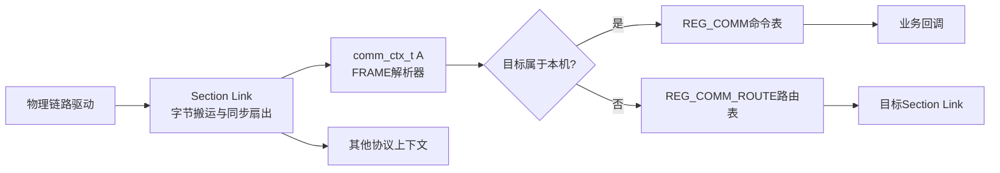
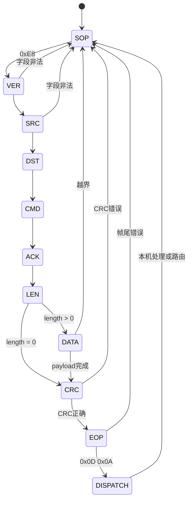

# FRAME 通信核心设计

FRAME 通信核心把连续字节流转换为具有地址、命令和应答语义的数据帧。它处在 Section Link 与业务命令之间：Link 只搬运字节，FRAME 负责恢复帧边界、验证内容、判断归属，再把有效帧交给本机命令或路由出口。

## 1. 设计目标

- 同一套协议核心能够挂在多条物理链路上。
- 每条链路独立保存半帧、CRC、超时和来源信息。
- 业务命令分散声明，由运行时统一发现和分发。
- 本机处理和跨链路转发共用同一种帧格式，但保持不同责任。
- 接收路径不依赖动态内存，也不假设一次输入就是完整帧。
- 错误帧只影响所属解析上下文，不污染其他链路。

## 2. 分层边界



物理驱动决定字节从哪里来、如何发出去；Link 决定一份字节流交给哪些协议；FRAME 决定字节能否组成有效帧；业务模块只处理已经通过协议校验的命令。

## 3. 一条链路一个解析上下文

`comm_ctx_t` 是接收状态的所有者，保存：

- payload 缓冲区及容量；
- 当前解析状态和剩余长度；
- 增量 CRC；
- 当前帧字段；
- 本机静态地址和动态地址；
- 最近字节时间；
- 来源 `link_id`；
- 本机处理或路由判定结果。

解析状态不能放在协议全局变量中。否则两条链路交错到达的字节会共同修改一个半帧，无法判断字段属于哪条链路。链路独立上下文使协议实现可重入到“不同实例”，但同一实例仍要求串行调用。

`DECLARE_COMM_CTX()`同时声明固定容量的 payload 缓冲区和上下文。容量在编译期确定，因此接收内存上界由目标固件明确承担。

## 4. 字节流解析

FRAME 使用逐字节有限状态机恢复帧结构：



CRC 从帧头开始增量更新到 payload 结束，不包含 CRC 字段和帧尾。增量计算避免在接收完成后再次遍历整个帧。

若半帧长时间没有新字节，解析器根据 tick 差值复位。超时恢复针对上下文执行，不清空其他链路的解析状态。

## 5. 地址与归属判定

帧中包含静态源/目的地址和动态源/目的地址。解析目的地址后，通信核心决定：

- 目的属于本机：继续解析并在校验完成后查找命令；
- 目的不属于本机：保留完整帧并进入路由路径；
- 地址或长度不满足接收条件：立即放弃当前帧。

地址判定在 payload 到达前完成，可以避免明显无关或不可接受的数据继续占用本机业务处理路径。转发仍必须等完整帧和 CRC 校验通过，不能传播损坏数据。

## 6. 静态命令发现

业务模块通过 `REG_COMM(cmd_set, cmd_word, callback)`声明命令描述符。描述符由 Section 注册段收集，初始化时形成命令链表。

这种组织方式把“命令由谁实现”和“协议如何找到命令”分开：

- 业务文件持有回调和命令编号；
- FRAME 核心持有查找与调用规则；
- Section 持有静态发现机制；
- 平台不需要维护集中式命令数组。

命令查找命中后采用 move-to-front，把热点命令移到链表头部。它改善重复命令的平均查找长度，但不会改变命令身份和注册顺序语义。

## 7. 路由模型

路由项由三元组组成：

```text
来源link_id + 目标地址 → 目标link_id
```

来源链路是必要条件。相同目标地址可能在不同物理网络中具有不同出口，只按目标地址查找无法表达这种拓扑。

路由只负责把已经验证的原始帧送入目标 Link，不调用目标设备的本地命令。它是协议层转发能力，不等同于业务模块收到命令后再主动发送另一条命令。

## 8. ACK语义

ACK 表示对同一个 `cmd_set/cmd_word` 请求的直接响应：

- 请求与响应命令相同，响应设置 `is_ack = 1`；
- 某个请求触发了另一条命令的主动上报，该上报不是 ACK；
- 路由帧保持原有协议语义，不由中间节点伪造业务 ACK。

这一约束使请求方可以使用“命令身份 + ACK标志”匹配事务，避免把后续事件误认为请求已经完成。

## 9. 发送所有权

接收时，Link 将当前链路的发送函数一并传给 `comm_run()`。命令回调使用该发送能力沿请求来源返回响应。FRAME 核心负责序列化字段、计算 CRC 和追加帧尾，物理链路负责实际传输。

发送缓冲的并发和完成语义属于具体 Link：如果底层使用 DMA，Link 必须保证 `comm_send_data()`返回后数据仍然有效，或者在调用中完成安全复制。FRAME 核心不推断硬件发送完成时刻。

## 10. 失败隔离与容量边界

- payload 长度超过上下文容量时拒绝接收。
- CRC或帧尾错误时丢弃当前帧。
- 半帧超时后回到帧头搜索状态。
- 未注册的本机命令不调用任意业务回调。
- 无匹配路由时不尝试猜测出口。
- 不同链路使用不同上下文，因此一条链路的噪声不会重置其他链路。

FRAME 核心没有消息队列。业务回调运行在 Link 调用路径中，应快速完成；需要等待的事务应只提交事件，再由周期状态机推进。

## 11. 设计权衡

优点：

- 静态内存和静态注册使资源上界可计算。
- 独立上下文天然支持多链路、多协议交叉组合。
- 字节级状态机适合UART、CAN字节适配等流式输入。
- 命令、路由和物理链路可以分别演进。

代价：

- 同步业务回调过长会阻塞同一Link上的其他协议。
- 链表查找的最坏复杂度随命令数量增长。
- payload容量需要按固件角色分别规划。
- 无内建背压和事务队列，上层必须约束并发会话。

## 12. 关联导航

### 应用文档

- [FRAME通信接入](../../application/communication/frame_usage.md)
- [Section Link使用](../../application/framework/section/section_usage.md)

### 基础教材

- [嵌入式通信分发、性能与可靠性基础](../../tutorial/communication_performance_reliability.md)
- [C语言静态注册与链接基础](../../tutorial/static_registration_and_linking.md)
