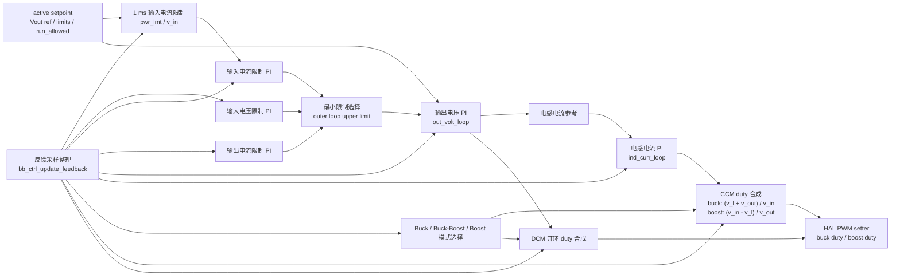

# Buck-Boost 控制模块设计

## 1. 模块定位

BB 模块位于 `code/ctrl/bb/`，用于宽范围 Buck-Boost 功率级控制。该模块使用浮点物理量控制域。

## 2. 拓扑特征

- 控制域使用浮点物理量，setpoint同时保存输出参考、功率和输入/输出限制。
- 1ms任务把功率限制换算为输入电流限制，优先级3的ISR完成限制环、电压环、电流环和调制。
- 一个PWM setter同时接收Buck与Boost两组duty和上下管使能，保证模式切换作为一次输出提交。
- CCM闭合电感电流环，DCM复位电流环并使用开环duty生成器，两条路径共享模式语义。

公共Cfg、HAL、Ctrl和FSM分层见[控制模块总设计](../ctrl_design.md)。

## 3. 控制框图

BB ISR 整理 HAL 采样，计算 CCM/DCM 状态、限制环、输出电压环和电感电流环。CCM 路径闭合电感电流环后合成 duty；DCM 路径复位电流环并使用开环 duty 生成器。

## 4. 约束

- 三个工作区与CCM/DCM切换阈值必须形成回差。
- 联合PWM setter必须一次提交两组桥臂的duty和使能状态。

## 5. 关联导航

- 应用：[BB控制使用](../../../application/control/bb/ctrl_bb_usage.md)
- 公共设计：[控制模块总设计](../ctrl_design.md) · [控制HAL挂载与生命周期设计](../hal_binding_lifecycle_design.md)
