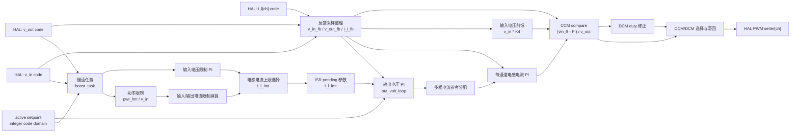

# Boost 控制模块设计

## 1. 模块定位

Boost 模块位于 `code/ctrl/boost/`，用于升压功率级控制。该模块使用整数代码域，配置层把物理量转换成控制代码。

## 2. 拓扑特征

- `ctrl_ts`、`task_ts`、`pwm_ts` 和 `pwm_cmp_max`共同定义整数控制与调制时基。
- 输入、输出电压和多通道电感电流均使用代码域，通道数由`BOOST_CTRL_IND_CURR_CH_NUM`确定。
- 慢速任务计算功率、电压和电流限制，优先级3的控制ISR执行多相电流环及PWM输出。
- PWM输出在CCM compare和DCM duty之间带回差切换，平台同时提供分通道setter及整体enable/disable。

公共Cfg、HAL、Ctrl和FSM分层见[控制模块总设计](../ctrl_design.md)。

## 3. 控制框图

Boost ISR 整理 ADC 反馈，执行输出电压环和每通道电感电流环，再根据 CCM compare 和 DCM duty 结果做模式滞回选择。

## 4. 约束

- 平台提供正确的 `pwm_ts` 和 `pwm_cmp_max`。
- 多通道电感电流和 PWM setter 按通道绑定。
- CCM/DCM模式切换不得改变通道身份或产生compare跳变。

## 5. 关联导航

- 应用：[Boost控制使用](../../../application/control/boost/ctrl_boost_usage.md)
- 公共设计：[控制模块总设计](../ctrl_design.md) · [控制HAL挂载与生命周期设计](../hal_binding_lifecycle_design.md)
