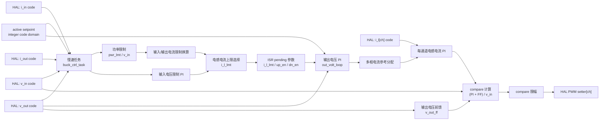

# Buck 控制模块设计

## 1. 模块定位

Buck 模块位于 `code/ctrl/buck/`，用于降压功率级控制。该模块使用整数代码域，配置层把物理量转换成控制代码。

## 2. 拓扑特征

- `ctrl_ts`、`task_ts`和`pwm_cmp_max`定义整数控制时基与比较值范围。
- 输入/输出电压电流及多通道电感电流使用代码域，通道数由`BUCK_CTRL_IND_CURR_CH_NUM`确定。
- 慢速任务形成电流限制和上下管使能pending快照，优先级3的控制ISR消费快照。
- 每通道setter同时接收compare与上下管使能，保护路径提供整体PWM关闭和锁存。

公共Cfg、HAL、Ctrl和FSM分层见[控制模块总设计](../ctrl_design.md)。

## 3. 控制框图

慢速任务计算电流限制和上下管使能，ISR 使用 pending 参数执行输出电压环、电感电流环和 PWM compare 输出。

## 4. 约束

- 平台提供正确的 `pwm_cmp_max`。
- 多通道电感电流和 PWM setter 按通道绑定。
- 慢速任务形成的pending限制与使能必须在ISR边界统一生效。

## 5. 关联导航

- 应用：[Buck控制使用](../../../application/control/buck/ctrl_buck_usage.md)
- 公共设计：[控制模块总设计](../ctrl_design.md) · [控制HAL挂载与生命周期设计](../hal_binding_lifecycle_design.md)
