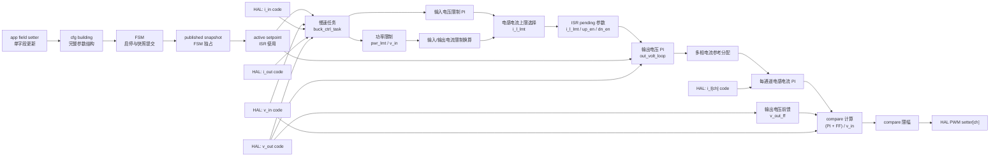

# Buck 控制模块设计

## 1. 模块定位

Buck 模块位于 `code/ctrl/buck/`，用于降压功率级控制。对应用层只提供 cfg 和 HAL 两类接口：cfg 接收参数与启停请求，HAL 绑定模拟量和 PWM 硬件回调。

模块内部按四层协作：

- cfg 使用一个 `buck_cfg_t` 表达五个运行参数和启停请求，只负责字段写入和完整 building 配置读取。
- FSM 检查配置、HAL 与保护状态，引导 init、idle、run 状态迁移，独占配置发布函数并形成带原子序号的 published 快照。
- ctrl 只读取FSM已经发布的快照，执行慢速限制计算、控制 ISR、PI 算法和 PWM 指令计算。
- HAL 保存模拟量指针与发波回调，执行进入运行、退出运行和硬保护动作。

## 2. 拓扑特征

- `ctrl_ts`、`task_ts`和`pwm_cmp_max`是编译期控制参数，分别由`CTRL_TS`、Buck任务周期和`CTRL_PWM_CMP_MAX`定义。
- 输入/输出电压电流及多通道电感电流使用代码域，通道数由`BUCK_CTRL_IND_CURR_CH_NUM`确定。
- 慢速任务形成电流限制和上下管使能pending快照，优先级3的控制ISR消费快照。
- 每通道setter同时接收compare与上下管使能，保护路径提供整体PWM关闭和锁存。

公共Cfg、HAL、Ctrl和FSM分层见[控制模块总设计](../ctrl_design.md)。

## 3. 控制框图

慢速任务计算电流限制和上下管使能，ISR 使用 pending 参数执行输出电压环、电感电流环和 PWM compare 输出。

每个 setter 只更新 `buck_cfg_t` 和 building 控制设定值中的对应字段。发布函数是 `buck_fsm.c` 的静态函数，只有FSM状态处理能够调用。FSM使用奇偶原子序号提交完整快照；CTRL通过只读接口获取前后序号一致的published配置，读取失败时继续保留上一份active配置。

## 4. 约束

- 平台通过 `CTRL_PWM_CMP_MAX` 提供正确的PWM比较值上限。
- 多通道电感电流和 PWM setter 按通道绑定。
- FSM的init执行函数逐一检查HAL数据指针和函数回调，空指针通过`PLECS_LOG`标明具体字段并阻止进入idle；其他控制路径不重复检查。
- 慢速任务形成的pending限制与使能必须在ISR边界统一生效。

## 5. 关联导航

- 应用：[Buck控制使用](../../../application/control/buck/ctrl_buck_usage.md)
- 公共设计：[控制模块总设计](../ctrl_design.md) · [控制HAL挂载与生命周期设计](../hal_binding_lifecycle_design.md)
