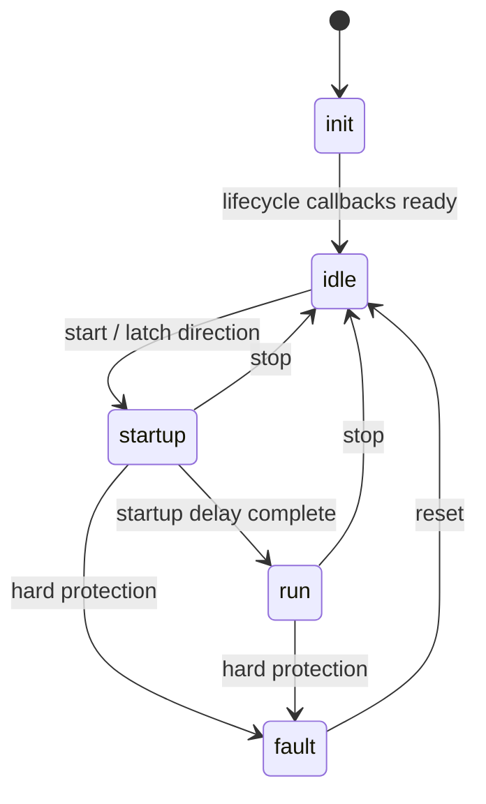
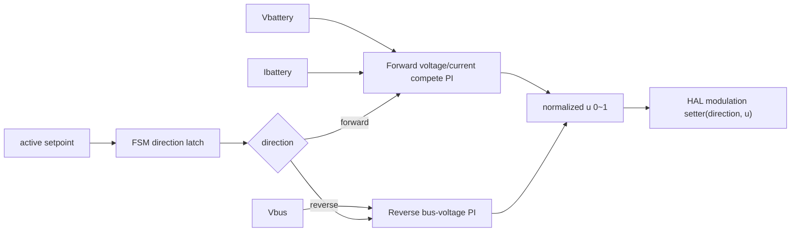

# CLLC 双向控制模块设计

## 1. 模块定位

CLLC 模块位于 `code/ctrl/cllc/`，在同一个 `cllc_ctrl` 和同一套 FSM 中实现正向与反向控制。模块使用浮点物理量，输出统一为 `0~1` 归一化调制命令，具体 PSM/PFM 与桥臂驱动由平台 PWM 回调完成。

正向能量流为高压母线到电池端，反向能量流为电池端到高压母线。

## 2. 文件职责

| 文件 | 职责 |
| --- | --- |
| `cllc_hw_param.h` | 谐振网络、变比、电容、功率、电流、电压范围和调制频率硬件宏 |
| `cllc_cfg.c/h` | PI 计算公式、正反向设计点、timing、setpoint、active/building 双缓冲 |
| `cllc_hal.c/h` | 电池电压、电池电流、母线电压、方向化调制回调、PWM 启停和保护锁存绑定 |
| `cllc_ctrl.c/h` | 正向双 PI 竞争、反向母线 PI、参考缓升、方向锁存和调试量 |
| `cllc_fsm.c/h` | 正反向共用的 init、idle、startup、run、fault 状态机 |

## 3. 硬件模型宏

`cllc_hw_param.h` 包含当前 CLLC 网络参数：

| 参数 | 数值 |
| --- | --- |
| 原边谐振电感 | 40 μH |
| 原边谐振电容 | 80 nF |
| 励磁电感 | 200 μH |
| 副边谐振电感 | 0.625 μH |
| 副边谐振电容 | 5.12 μF |
| 变比 `Np/Ns` | 8 |
| 电池端输出电容 | 10 mF |
| 高压母线电容 | 1360 μF |
| 额定功率 | 6600 W |
| 额定电池电流 | 150 A |

谐振频率由宏直接计算：

```text
fr = 1 / (2*pi*sqrt(Lr_primary*Cr_primary))
```

正向最高频率为 `2*fr`，反向所选单调调频支路最低频率为 32 kHz。模块只输出归一化命令，平台根据方向和这些边界完成实际 PSM/PFM 映射。

## 4. PI 宏计算

正反向均使用工作点附近的一阶包络对象：

```text
G(s) = Ku / (1 + s*tau)
tau  = Rload*Cout/2
fz   = 1/(2*pi*tau)
```

PI 零点放在输出主极点，目标交越频率为 `fc`：

```text
C(s) = Kp + Ki/s
Kp = sqrt(1 + (2*pi*fc*tau)^2)
     / (Ku*sqrt(1 + (fz/fc)^2))
Ki = 2*pi*fz*Kp
```

对应宏为：

- `CLLC_CTRL_LOAD_RESISTANCE_OHM()`
- `CLLC_CTRL_OUTPUT_TIME_CONSTANT_S()`
- `CLLC_CTRL_OUTPUT_POLE_HZ()`
- `CLLC_CTRL_PI_KP_FIRST_ORDER()`
- `CLLC_CTRL_PI_KI_FROM_ZERO()`
- `CLLC_CTRL_PI_KI_STEP()`

正向设计点为 48 V、6600 W，电压环交越频率 350 Hz，电流限制环交越频率 3.5 kHz。正向电压与电流 PI 使用 `pi_dual_compete` 的共享积分和最小值竞争：

```text
uv = Kpv*(Vref - Vbattery) + ishare
ui = Kpi*(Ilimit - Ibattery) + ishare
u  = min(uv, ui)
```

只有获胜通道更新共享积分。正常状态由电压环稳压，过流时电流候选下降并接管归一化命令。

反向设计点为 48 V 电池、450 V 母线、3000 W，交越频率 200 Hz。反向只有母线电压 PI：

```text
u = PI(Vbus_ref - Vbus)
```

正向共享积分 PI 的 `ki` 参数是每次调用增量，因此由 `Ki*ctrl_ts` 宏计算；反向 `pi_tustin` 接收连续域 `Kp`、`Ki` 和 `ctrl_ts`，在初始化时计算离散系数。

### 4.1 正向 100 Hz 电压纹波 PR

正向控制在双 PI 竞争结果之后叠加一个100 Hz非理想 PR：

```text
                   2*Kr*wc*s
Gpr(s) = Kp + ---------------------
                 s^2+2*wc*s+w0^2

w0 = 2*pi*100
wc = 2*pi*5
Kp = 0
Kr = 10/|Gp(j*w0)|
```

`Kp=0` 使 PR 的直流增益为0。PR 给定固定为0，反馈由输出电压减去缓升后的直流电压目标得到，因此输入主要包含电压偏差和纹波，而不是24~72 V直流工作点。正向最终输出为：

```text
u_pr    = sat(PR(0 - (Vout - Vdc_command)), -0.5, 0.5)
u_final = sat(u_dual_compete + u_pr, 0, 1)
```

参数设计和 Tustin 离散系数见 `cllc_forward_pr_design.m`。PR 是围绕 PI 稳态工作点变化的交流补偿量，因此采用双极性输出；只有 PI 与 PR 相加后的最终调制命令限制为0~1。

## 5. 同一 FSM 中的方向管理

方向字段 `CLLC_DIRECTION_E` 位于 setpoint 中。FSM 在 idle 收到 start 后同步配置，检查 HAL、timing 和保护锁存，然后把方向锁存到 `run_direction`。



方向配置由 FSM 管理写锁：只有 idle 状态允许 `cllc_cfg_set_direction()` 修改 building setpoint；离开 idle 后立即锁定，startup、run 和 fault 状态收到的方向命令均被忽略。控制 ISR 始终使用启动时锁存的方向。换向流程固定为：stop、回到 idle、发布新方向、再次 start。

## 6. 控制数据流



## 7. 安全约束

- HAL 绑定只在 idle 解锁。
- 启动前必须配置 `ctrl_ts`、`task_ts`、3 个反馈指针、调制回调、PWM 启停回调和保护锁存。
- `cllc_hal_hard_protect_trip()` 立即关闭 PWM，再由 FSM 转入 fault。
- fault 只接受显式 reset。
- 电池参考限制在 24~72 V，反向母线参考限制在 400~500 V。
- 当前 48 V 网络在 400~500 V 全范围不能持续达到 6600 W；反向控制设计点采用可覆盖全电压范围的 3000 W。

## 8. 关联导航

### 应用文档

- [CLLC 控制使用](../../../application/control/cllc/ctrl_cllc_usage.md)

### 基础教材

- [CLLC 双竞争 PI MATLAB 教程](../../../tutorial/control/cllc/cllc_dual_compete_pi_matlab_tutorial.md)
