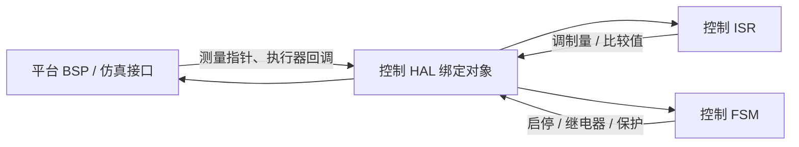
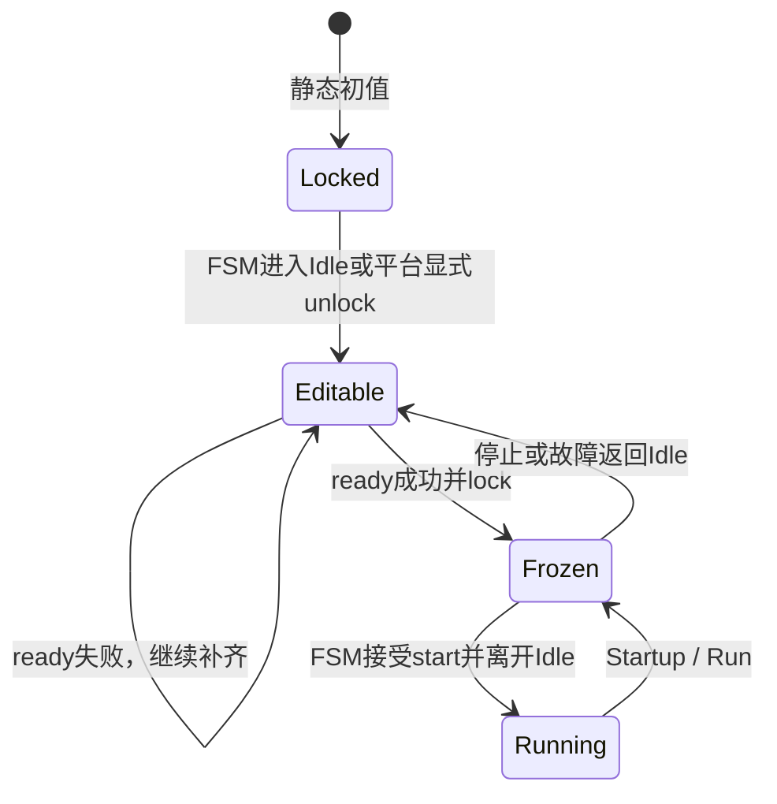

# 控制 HAL 挂载与生命周期设计

## 1. 设计定位

控制 HAL 是控制模块与运行平台之间的静态绑定边界。这里的 HAL 不是芯片厂商外设库，而是一组由控制模块定义、由平台提供实例的测量指针、执行器回调和生命周期回调。

控制算法只表达“读取什么量、输出什么控制量、何时启停”，平台负责把这些语义映射到 ADC 结果、PWM 比较值、桥臂使能、继电器和硬件保护资源。



## 2. 两类绑定域

每个拓扑的 HAL 通常分成两组。

### 2.1 快速控制域

`*_ctrl_hal_t` 服务于控制 ISR，包含：

- 电压、电流和状态量的实时指针；
- PWM、调制或比较值更新回调；
- PWM 使能和快速关闭回调。

该路径的关键约束是固定时长。控制计算不查找设备、不解析平台配置，也不等待外设状态。

### 2.2 生命周期域

`*_fsm_hal_t` 服务于 FSM，包含：

- 进入运行与退出运行回调；
- 继电器开关等慢速动作；
- 母线状态和继电器反馈；
- 硬件保护锁存指针。

生命周期域把功率级的“可启动条件”和“控制算法可以计算”区分开。PFC 的预充、主继电器和母线状态，CLLC 的方向锁存，均属于 FSM 决策而不是控制器数值计算。

## 3. 所有权

控制模块静态持有 HAL 结构体，平台持有被绑定的变量和函数实现：

| 对象 | 所有者 | 生命周期要求 |
|---|---|---|
| HAL 结构体 | 控制模块 | 固件整个运行期有效 |
| ADC/状态变量 | 平台 | 从挂载到停止使用期间地址稳定 |
| PWM/继电器回调 | 平台 | 从挂载到停止使用期间代码有效 |
| 内部默认启停回调 | 控制模块 | 维持控制器准备、PWM关闭和运行许可不变量 |
| 外部保护锁存 | 平台或控制模块 | FSM 检查期间持续有效 |

`*_hal_get_ctrl()` 和 `*_hal_get_fsm()` 为控制器与 FSM 提供内部对象地址。平台挂载应通过 `*_hal_set_*()` 完成，不把 getter 当作绕过锁定规则的写入口。

## 4. 绑定状态机

绑定锁将“平台配置阶段”和“功率运行阶段”分开。



当前实现具有以下语义：

- 绑定锁静态初值为锁定；
- FSM 进入 Idle 时解锁；
- setter 在锁定状态下静默拒绝写入；
- `*_hal_is_ready()` 检查必需指针是否非空；
- 平台可在 ready 后主动锁定；
- FSM 离开 Idle 时再次锁定，运行期间禁止 setter 改写绑定。

锁定保护的是绑定表稳定性，不是通用线程锁。它不提供原子提交、跨核内存顺序或多写者同步。

## 5. 启动闸门

启动需要同时满足三类条件：

```text
HAL ready
  ∧ 控制 timing / setpoint ready
  ∧ 保护未锁存及拓扑专用条件满足
  → FSM 接受 start
```

`*_hal_is_ready()` 只说明当前实现要求的指针和回调已经非空。它不能证明：

- 指针指向正确通道；
- 信号单位、极性和缩放正确；
- PWM 回调作用于正确桥臂；
- 回调满足实时预算；
- 硬件保护已经配置；
- 指针在后续运行期不会失效。

因此 ready 是结构完整性闸门，平台验证和硬件联锁仍是独立闸门。

## 6. 进入与退出运行

内部进入运行回调负责准备控制状态和发布运行许可；INV、LLC、CLLC 和整数 PFC 还会在该阶段直接使能相应 PWM，Boost 则在快速控制路径满足条件后使能输出。浮点 PFC 的当前进入回调只准备控制器并发布运行许可。

完整进入过程可包含：

1. 重置或准备控制器历史状态；
2. 根据拓扑在生命周期路径或后续控制路径启用功率输出；
3. 发布 `run_allowed`；
4. 从后续控制周期开始产生有效调制。

当前停止实现存在两种时序：BB、Buck、Boost、INV 和 CLLC 的退出回调直接关闭 PWM；LLC、浮点 PFC 先撤销运行许可，由控制路径检测禁止状态后关闭 PWM。硬故障路径应直接调用关闭回调，不等待下一次正常控制计算。

无论采用哪种停止时序，关闭回调都必须幂等：重复调用、尚未启用时调用和故障中调用都应保持功率级关闭。平台还应验证从 stop 到实际无脉冲的最坏延迟是否满足功率级要求。

部分拓扑允许平台替换进入、退出回调。替换者必须保留控制器准备、PWM 安全关闭和运行许可发布等原有不变量，否则 HAL 虽然 ready，生命周期仍可能失效。

## 7. 保护路径

提供 `*_hal_hard_protect_trip()` 的拓扑通过该接口连接控制软件与保护状态：

```text
保护触发
  → 立即调用 PWM disable
  → 设置保护锁存
  → 撤销 run_allowed
  → FSM 禁止再次启动
```

软件回调是硬件保护后的状态收敛路径，不能替代比较器、刹车输入或驱动器关断等硬件快速保护。保护入口不得依赖通信、日志、动态内存或阻塞等待。

保护清除只应在故障源消失且功率级处于安全状态时执行。清除锁存与重新启动是两个动作，不能由一次写零隐式完成。

## 8. 拓扑差异

| 拓扑 | 快速测量 | 执行器特点 | FSM 专用资源 |
|---|---|---|---|
| BB | 输入、输出和电感量 | Buck/Boost 联合占空比 | 保护锁存 |
| Buck / Boost | 多路电感电流 | 分通道 PWM setter | Buck 有保护锁存；Boost 有 PWM enable |
| PFC | 电网、母线、电感、RMS | 电压命令与母线量 | 母线状态、主继电器及反馈 |
| INV | 电容电压、电感电流、母线 | 桥式 PWM | 逆变继电器 |
| LLC | 输出、电流、母线 | 占空比更新 | 保护锁存 |
| CLLC | 电池端和母线 | 带方向的调制与使能 | 方向锁存和保护锁存 |

公共思想是一致的，但信号域并不一致。浮点拓扑通常传递物理量，Buck、Boost 和整数 PFC 可能传递代码域或定点量。接口类型和模块设计文档共同构成单位契约。

## 9. 绑定失败与重绑

当前 setter 返回 `void`，锁定、非法通道等拒绝不会直接返回错误。平台必须在一轮设置后调用 `*_hal_is_ready()`，不能用“setter 已调用”判断成功。

当前重绑也不是事务：修改多个字段时，ready 失败会留下已经写入的部分字段；再次挂载可能同时包含旧值和新值。安全做法是在 Idle 且控制路径不消费这些对象时完成整轮重绑，并在进入运行前统一验证。

若未来需要运行时切换硬件实例，应引入候选绑定对象、完整校验和一次性提交，而不是扩大当前 unlock 窗口。

## 10. 并发边界

- 绑定只能发生在功率停止的 Idle 阶段。
- 运行期间 ISR 可以无锁读取冻结后的指针和回调。
- 绑定变量由 ISR 更新时，平台仍需保证单次访问和快照语义。
- `volatile` 只能表达异步访问意图，不能保证多字段一致性。
- 多核或 Cache 平台需要额外的内存顺序和 Cache 一致性措施。

HAL 冻结与 setpoint 发布解决的是两个不同问题：前者保证硬件依赖不在运行中换绑，后者保证业务参数按版本进入控制周期。

## 11. 验证原则

平台接入至少验证：

- 缺失任一必需绑定时 start 被拒绝；
- 锁定后 setter 不能改变活动绑定；
- 所有通道与极性对应正确；
- PWM enable、setter、disable 的调用顺序正确；
- stop 和 hard trip 均使功率输出进入安全状态；
- 重复 disable 不产生反向副作用；
- 保护锁存未清除时不能重新启动；
- 回调最坏耗时满足所在 ISR 或 FSM 的预算。

## 12. 设计权衡

静态函数指针和数据指针带来固定内存、零查找和平台解耦，适合单实例实时控制。代价是接口按拓扑重复、setter 错误不可见、ready 只验证结构完整性，并且当前 getter 暴露可变对象。

这套模型适合“启动前绑定、运行期冻结”的系统。需要热插拔、多实例、运行时事务切换或跨核共享时，应使用更明确的实例上下文和提交协议。

## 13. 关联导航

- 应用：[控制 HAL 平台挂载方法](../../application/control/hal_binding_usage.md) · [控制模块通用接入](../../application/control/ctrl_usage.md)
- 相关设计：[控制模块总设计](ctrl_design.md) · [控制参数构建与发布设计](setpoint_publish_design.md)
- 基础教材：[C语言函数表与依赖倒置基础](../../tutorial/c_function_table_and_dependency_inversion.md) · [前后台数据一致性基础](../../tutorial/foreground_background_data_consistency.md)
