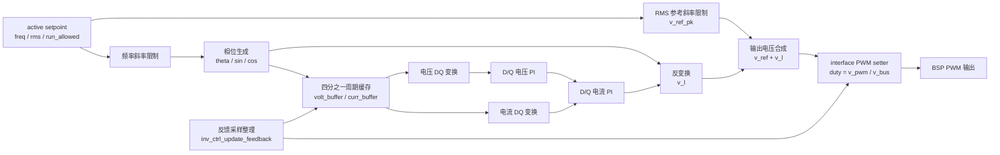

# INV 控制模块设计

## 1. 模块定位

INV 模块位于 `code/ctrl/inv/`，用于逆变输出电压控制、输出继电器流程和运行状态管理。该模块使用浮点物理量控制域。

## 2. 拓扑特征

- 控制域使用浮点物理量，setpoint保存频率、RMS参考及两者斜率。
- 优先级0中断先生成相位，优先级3中断再更新四分之一周期缓存、DQ双环和PWM命令。
- 输出电容电压与电感电流按同一相位重构为DQ量，母线电压参与最终调制换算。
- FSM在运行前管理输出继电器，HAL分别绑定桥式PWM与继电器动作。

公共Cfg、HAL、Ctrl和FSM分层见[控制模块总设计](../ctrl_design.md)。

## 3. 控制框图

`inv_ctrl_cal_theta` 计算当前相位。`inv_ctrl_isr` 同步 setpoint、整理采样、更新斜率限制、执行 DQ 电压环和电流环，并输出 `p_set_pwm_func(v_pwm, v_bus)`。

## 4. 约束

- 相位生成必须先于DQ控制执行，缓存长度在全部允许频率下保持有效。
- 输出继电器状态与PWM运行许可不得由控制ISR自行推断。

## 5. 关联导航

- 应用：[INV控制使用](../../../application/control/inv/ctrl_inv_usage.md)
- 公共设计：[控制模块总设计](../ctrl_design.md) · [控制HAL挂载与生命周期设计](../hal_binding_lifecycle_design.md)
