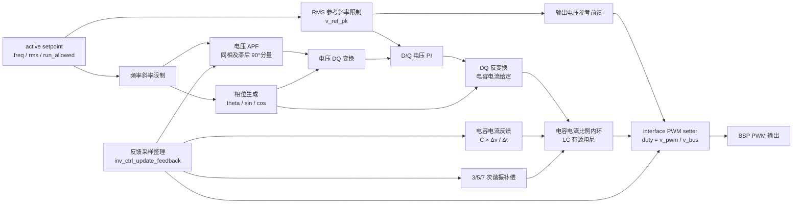

# INV 控制模块设计

## 1. 模块定位

INV 模块位于 `code/ctrl/inv/`，用于逆变输出电压控制、输出继电器流程和运行状态管理。该模块使用浮点物理量控制域。

## 2. 拓扑特征

- 控制域使用浮点物理量，setpoint保存频率、RMS参考及两者斜率。
- 优先级0中断先生成相位，优先级3中断再更新APF正交电压、SRFPI电压环、电容电流内环和PWM命令。
- 输出电容电压通过一阶全通滤波器生成滞后90°分量，再按当前相位变换为DQ电压。
- D/Q电压PI输出经DQ反变换形成电容电流给定；电容电流比例内环提供LC有源阻尼。
- 输出电压参考直接前馈到PWM电压命令，3、5、7次谐振支路降低对应频率的输出阻抗。
- FSM在运行前管理输出继电器，HAL分别绑定桥式PWM与继电器动作。

公共Cfg、HAL、Ctrl和FSM分层见[控制模块总设计](../ctrl_design.md)。

## 3. 控制框图

`inv_ctrl_cal_theta` 计算当前相位。`inv_ctrl_isr` 同步setpoint、整理采样、更新APF及谐振器中心频率、执行SRFPI电压外环和电容电流比例内环，并输出 `p_set_pwm_func(v_pwm, v_bus)`。

## 4. 论文控制器参数

控制结构采用Monfared、Golestan和Guerrero提出的单相逆变器同步坐标系多环方案。额定条件为230 V、6600 W，控制频率为30 kHz，滤波参数为 `L = 440 uH`、`C = 12 uF`。

电容电流内环带宽按4 kHz选择，论文式(8)得到比例增益 `K = 17.387878 V/A`。电压环带宽按1.3 kHz选择，论文式(13)得到 `Kp = 0.081859711 A/V`；积分增益取论文稳定条件 `Ki < Kp*omega_f` 的55%，即 `Ki = 14.144343 A/(V*s)`。D/Q电压PI输出限制为-20~20 A。

3、5、7次谐振补偿器使用论文式(17)及Tustin离散化，增益分别为0.30、0.20、0.15，总输出限制为-8~8 A。停机时清零电压PI、APF、谐振器和电容电流反馈历史状态。

## 5. 约束

- 相位生成必须先于DQ控制执行，APF与3、5、7次谐振器的中心频率跟随输出频率斜坡。
- APF输出作为滞后90°的电压正交分量，DQ变换和反变换使用同一相位。
- 当前HAL未提供独立电容电流采样，控制器使用 `C*Δv/Δt` 形成离散电容电流反馈；采样噪声和延迟需要在目标硬件上复核。
- 输出继电器状态与PWM运行许可不得由控制ISR自行推断。

## 6. 关联导航

- 应用：[INV控制使用](../../../application/control/inv/ctrl_inv_usage.md)
- 公共设计：[控制模块总设计](../ctrl_design.md) · [控制HAL挂载与生命周期设计](../hal_binding_lifecycle_design.md)
