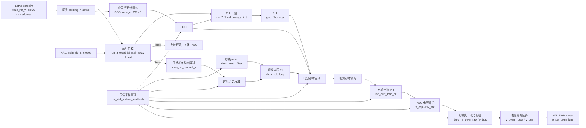

# PFC 控制模块设计

## 1. 模块定位

PFC 模块位于 `code/ctrl/pfc/`，用于交流侧 PFC 控制、母线电压调节、主继电器流程和运行状态管理。该模块使用浮点物理量控制域。

## 2. 拓扑特征

- 控制域使用浮点物理量，setpoint保存母线参考、斜率和运行许可。
- 优先级3的ISR完成采样整理、SOGI/FLL、母线电压环、PR电流环和PWM命令。
- 慢速任务把跟踪频率更新到SOGI与PR目标，FSM管理预充、母线状态和主继电器。
- 控制运行同时受run许可和主继电器反馈门控，任一条件失效都复位环路并关闭PWM。

公共Cfg、HAL、Ctrl和FSM分层见[控制模块总设计](../ctrl_design.md)。

## 3. 控制框图

`pfc_ctrl_isr` 每次同步 setpoint、整理采样、计算 SOGI、更新或复位 FLL，并更新母线 notch。运行门控通过后执行母线电压环、电流参考生成、PR 电流环和 PWM 输出。

## 4. 约束

- 电网同步、母线环和PR电流环使用同一控制时基。
- run许可与主继电器反馈共同构成快速控制门控。

## 5. 关联导航

- 应用：[PFC控制使用](../../../application/control/pfc/ctrl_pfc_usage.md)
- 公共设计：[控制模块总设计](../ctrl_design.md) · [控制HAL挂载与生命周期设计](../hal_binding_lifecycle_design.md)
