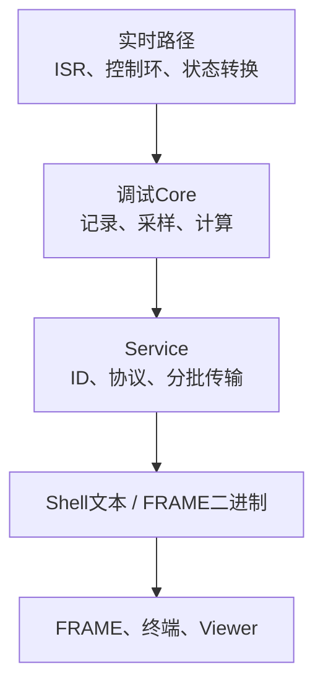

# 调试观测体系总设计

调试体系把实时系统中的时间、数据、事件、参数和频率响应转换为可观察证据。Perf、Scope、Trace、Shell和SFRA不是彼此替代的工具，而是从不同维度回答问题，并共享静态注册、Section调度和FRAME通信基础。

## 1. 五个观测维度

| 工具 | 观测对象 | 核心问题 |
| --- | --- | --- |
| Perf | 执行时间、周期、负载 | 运行是否超时、抖动来自哪里 |
| Scope | 连续数值波形 | 故障前后数据如何变化 |
| Trace | 离散事件顺序 | 哪条流程先发生、停在哪里 |
| Shell | 当前变量和命令 | 当前配置与状态是什么 |
| SFRA | 注入与响应 | 闭环频率特性是什么 |

单一工具无法回答全部问题。Scope看到电压突变但不能直接证明哪个任务延迟；Perf看到周期超限但不能说明状态转换顺序；Trace能给出顺序但不保存连续波形。

## 2. 共同分层



Core决定采什么、如何保存和何时完成。Service负责外部命令、实例发现、稳定ID、状态转换和分批上报。通信层只传帧，不理解调试数据语义。

Core可以在关闭二进制服务时继续工作；Service不能复制Core算法或在通信回调中执行实时采样。

## 3. 热路径与冷路径

实时热路径只执行有严格上界的动作：

- Perf读取计数器并更新固定字段；
- Trace向固定FIFO写一条短记录；
- Scope复制已注册变量到静态环形缓冲；
- SFRA注入、采样并写入固定样本队列。

名称查找、字符串格式化、单位换算、列表遍历和FRAME分包属于冷路径，由周期Service执行。把解释工作移出ISR，是调试功能不破坏被测对象的关键。

## 4. 静态发现与稳定身份

调试对象通过注册宏分散声明，由Section注册段在初始化时发现。运行时指针不能直接作为上位机身份，因此Service分配record ID、scope ID或SFRA ID，并配合字典版本、capture tag或sweep tag区分数据批次。

身份解决“对象是谁”，tag解决“数据属于哪次采集”。二者不能混用：同一个scope ID可以产生多次capture tag，同一个Perf字典版本中可以重复拉取很多批采样。

## 5. 控制面与数据面

控制面数据量小，负责：

- 列表与能力查询；
- 配置、启动、停止和复位；
- 触发条件和采样范围；
- 上报开关和峰值清除。

数据面负责波形、记录、频点或性能样本。数据面通常需要分批传输，不能在一个通信回调中同步发送完整结果。

Service先直接ACK控制命令，再由周期任务发送普通上报。后续不同命令字的报告不是原请求ACK。

## 6. Push、Pull与快照

- Shell适合人工pull当前状态或执行命令。
- Perf字典和样本适合主机发起pull会话。
- Trace适合后台push事件，但当前读取会消费记录。
- Scope适合先冻结快照，再按索引pull样本。
- SFRA适合逐点push进度，同时允许按频点查询。

选择方式取决于数据是否持续产生、是否允许丢失、是否需要一致快照，以及主机离线时设备是否仍要运行。

## 7. 数据所有权

每类工具必须定义缓冲区的生产者和消费者：

- Scope采样路径写环形缓冲，服务在采集冻结后读取；
- Trace写入端生产，Shell或二进制服务消费，两个出口不是独立副本；
- SFRA ISR生产样本，任务侧DFT消费，服务只读取已完成频点缓存；
- Perf热路径更新record，服务读取快照并分批发送。

当两个消费者共享同一可消费FIFO时，谁先读取会影响另一个出口。需要双出口时应增加广播或复制层，不能只再加一个读取函数。

## 8. 资源预算

调试功能的代价包括：

- 静态RAM缓冲区；
- 每次ISR插桩耗时；
- 周期Service CPU预算；
- FRAME发送带宽；
- 被测变量读取的一致性成本。

编译期开关用于彻底裁剪不需要的路径。运行期开关只能停止行为，未必释放静态内存或去除分支。设计评审应分别列出“编译进固件的成本”和“功能启用时的成本”。

## 9. 工具组合方法

典型定位顺序：

```text
Shell确认配置和状态
  → Perf确认任务周期和负载
  → Trace定位事件顺序
  → Scope冻结故障前后波形
  → SFRA验证控制环频率特性
```

这不是固定流程。硬实时超限先看Perf，偶发状态跳转先看Trace，模拟量异常先看Scope。多个工具同时开启时，要先评估它们叠加后的实时和通信负载。

## 10. 失败语义

- 对象ID无效：拒绝请求，不回退到第一个对象。
- 已有传输会话：返回busy，不覆盖活跃上下文。
- capture/sweep tag不匹配：拒绝混合读取新旧批次。
- 缓冲区溢出：记录溢出并停止或覆盖，策略必须明确。
- 通信中断：Core状态保持独立，Service允许取消或重新拉取。
- 调试功能关闭：注册宏和Service按编译配置裁剪，业务不能依赖其状态。

## 11. 关联导航

### 应用文档

- [Perf使用](../../application/debug/perf/perf_usage.md)
- [Scope使用](../../application/debug/scope/scope_usage.md)
- [Trace使用](../../application/debug/trace/trace_usage.md)
- [Shell使用](../../application/debug/shell/shell_usage.md)
- [SFRA使用](../../application/debug/sfra/sfra_usage.md)
- [故障现场读取与定位](../../application/debug/fault_diagnosis_usage.md)

### 基础教材

- [嵌入式通信分发、性能与可靠性基础](../../tutorial/communication_performance_reliability.md)
- [实时任务与调度基础](../../tutorial/realtime_task_scheduling.md)
