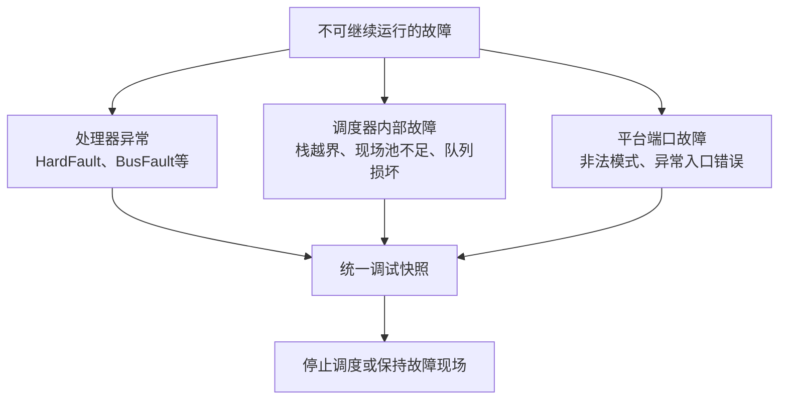

# 故障现场与事后诊断设计

故障诊断的目标不是在异常路径中完成复杂分析，而是在系统已经不可信时保存最小、稳定、可解释的证据，让调试器或外部探针在事后还原“在哪里失败、处理器当时处于什么状态、调度器资源是否完整”。

## 1. 故障分类



CPU异常说明指令执行或存储访问违反处理器规则；调度器故障说明软件自身不变量被破坏；平台端口故障说明上下文切换与异常模型的连接失败。三类故障需要不同字段，但共享“先保存、后停止”的策略。

## 2. 统一调试快照

`section_fault_debug_t`保存两组证据：

### 2.1 处理器异常字段

- CFSR、HFSR：异常原因和升级关系；
- BFAR、MMFAR：总线或内存管理故障地址；
- EXC_RETURN：异常前使用的栈、模式和浮点现场信息；
- MSP、PSP：两个栈指针；
- stacked LR、PC、xPSR：异常发生点的硬件栈帧。

### 2.2 调度器字段

- 当前任务名称、SP、PC和状态字；
- 任务栈基址、容量和剩余量；
- 公共运行栈使用量；
- 现场池容量、已用量、头尾位置；
- 保存/释放失败计数；
- 调度器故障原因、策略和本次所需容量。

统一结构让J-Link变量观察、Shell探针和平台故障处理能够使用同一数据入口，但字段解释仍依赖处理器架构和运行时类型。

## 3. Cortex-M异常入口

HardFault入口使用naked汇编在C函数建立普通栈帧之前确定异常前使用MSP还是PSP：

```text
检查EXC_RETURN bit2
  → 选择MSP或PSP
  → 把异常栈指针和EXC_RETURN传给C捕获函数
```

若EXC_RETURN表明存在扩展浮点栈帧，捕获函数越过浮点保存区，再读取基础栈帧中的LR、PC和xPSR。捕获完成后停在故障循环，防止继续执行已经失去可信度的任务现场。

异常入口本身不能调用依赖正常调度、锁、堆或复杂格式化输出的服务。这些设施可能正是故障来源。

## 4. 调度器故障入口

SRTOS在检测到现场池不足、释放顺序错误、PSP越界、恢复容量不足等不变量失败时调用内部故障记录：

1. 保存故障原因和当前策略。
2. 保存任务和资源池位置。
3. 若任务现场可验证，提取任务PC和状态字。
4. 设置故障激活标志。
5. 阻止后续正常任务切换继续破坏证据。

这种路径比普通返回错误更适合“继续运行会扩大损坏”的内核不变量。外部资源不足或设备失败仍应通过正常错误码处理，不能全部升级成内核故障。

## 5. 平台架构边界

Cortex-M可从硬件异常栈帧直接获得PC、LR和xPSR。Cortex-A使用不同异常模式、保存寄存器和返回机制，不能机械复用M系列异常汇编。

公共层定义诊断语义，平台端口负责：

- 从本架构异常现场提取等价信息；
- 记录不可恢复的端口原因；
- 决定故障后停机、看门狗复位或进入安全监控；
- 提供调试器可访问的符号和内存。

## 6. 现场所有权与覆盖规则

第一次不可恢复故障通常最有价值。故障激活后不应继续清零或反复覆盖快照，否则后续派生错误会掩盖根因。

调试结构声明为volatile，是为了让编译器真实执行读写并便于调试器观察；它不提供原子性，也不保证掉电或复位后保留。需要跨复位分析时，应由平台把已完成快照复制到保留SRAM或非易失故障记录区，并设计独立的有效性标记。

## 7. 从PC回到源码

现场PC只有与同一构建产生的ELF和map文件配合才有意义：

```text
故障PC
  → 确认对应固件版本
  → 在ELF符号和反汇编中定位地址
  → 检查异常寄存器和故障地址
  → 结合LR与任务名还原调用关系
```

只保存bin文件无法可靠恢复符号。发布固件应同时归档ELF、map、版本号和构建配置。

## 8. 故障后策略

可选策略取决于产品安全要求：

- 调试固件：保持故障现场，等待J-Link读取；
- 可无人值守设备：保存快照后触发看门狗复位；
- 功率设备：先由硬件或最小故障钩子封锁PWM，再保存软件现场；
- 连续复位设备：使用复位计数进入安全驻留，避免无限启动循环。

任何策略都应先保证功率级安全。格式化打印完整报告不能位于必须立即封波的路径之前。

## 9. 当前边界

- 当前HC32F334 HardFault快照停留在RAM，复位后默认丢失。
- MemManage、BusFault和UsageFault当前独立停机，未统一进入同一捕获函数。
- SRTOS调度器字段只在SRTOS运行时具有完整含义。
- Zynq平台已提供端口故障原因和状态探针，但架构异常现场仍由平台端口负责。
- 调试快照是诊断证据，不是业务故障/告警状态。

## 10. 关联导航

### 应用文档

- [故障现场读取与定位](../../application/debug/fault_diagnosis_usage.md)
- [SRTOS使用方法](../../application/framework/srtos/srtos_usage.md)

### 基础教材

- [处理器现场、栈与上下文切换基础](../../tutorial/processor_context_and_stack.md)
- [RTOS并发、内存与可靠性基础](../../tutorial/rtos_concurrency_and_reliability.md)
