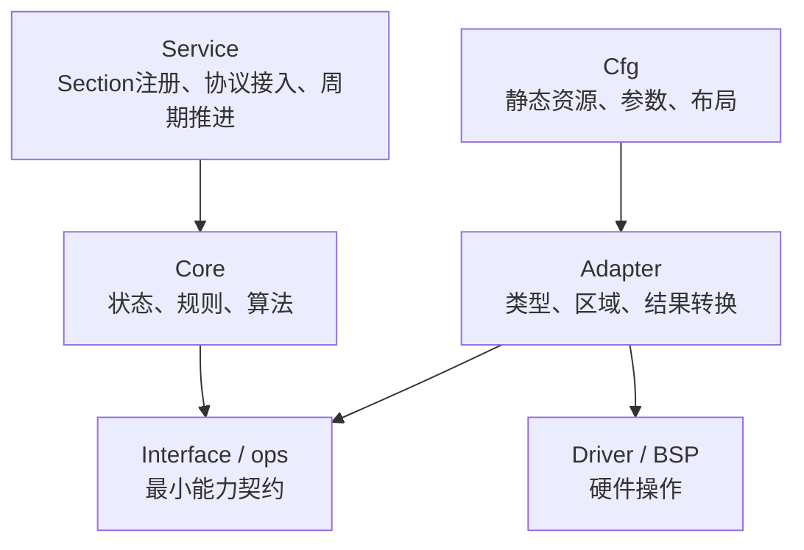

# 公共软件组件模型设计

仓库中的FAL、Bootloader、通信、调试和控制模块虽然解决不同问题，但逐渐形成了相同的软件组织原则：状态由明确对象持有，算法Core不识别平台，外部能力通过窄接口注入，Section和协议接入位于Core之外。

## 1. 设计目标

- 公共逻辑能够原封不动地进入不同MCU、MPU和主机测试。
- 组件的内存、依赖和执行时机可以静态审查。
- 平台代码只提供能力，不复制公共状态机。
- 协议、调度和硬件变化不会同时迫使Core修改。
- 单元测试可以替换能力边界，而不伪造整个硬件平台。

## 2. 五类责任



| 角色 | 持有什么 | 不应持有什么 |
| --- | --- | --- |
| Core | 状态机、校验、算法、不变量 | 平台宏、寄存器、Section注册 |
| Service | 初始化注册、任务注册、通信回调 | 硬件细节、重复Core逻辑 |
| Interface/ops | 上层真正需要的能力 | 平台对象布局、业务策略 |
| Adapter | 两侧类型和语义转换 | 新状态机、物理地址策略 |
| Cfg | 静态表、容量、权限、函数绑定 | 运行期业务流程 |
| Driver/BSP | 外设初始化和读写时序 | 上层逻辑区域和升级语义 |

实际模块不必机械地拥有五个文件。职责很小时可以同文件保存，但边界仍应在类型和函数上可辨认。

## 3. 调用方持有状态

公共Core优先使用显式上下文：

```c
module_result_t module_init(module_t *p_module,
                            const module_cfg_t *p_cfg,
                            const module_ops_t *p_ops);
void module_process(module_t *p_module);
```

这样做明确了：

- 谁拥有内存；
- 哪些字段构成一个实例；
- 多实例之间是否隔离；
- 测试如何构造初始状态；
- 哪个执行上下文有权调用它。

平台确认全系统只存在一个实例时，适配器可以封装固定的全局对象，对上提供无`p_context`接口。例如当前Bootloader-FAL适配器固定使用平台唯一FAL实例。但FAL Core本身仍保留显式`fal_t *`，因为FAL还服务于Bootloader之外的存储使用者，并且其可测试性不应被单个平台的单例约束削弱。

## 4. 能力接口应窄

Core所需的ops只表达业务不可缺少的动作。Bootloader只挂载区域查询、读、写、擦和状态，不接收`fal_cfg_t`、设备表或FAL初始化权。

窄接口带来三条边界：

1. 使用权不等于所有权：Bootloader可以使用FAL，但不负责初始化和调度公共FAL。
2. 逻辑不等于实现：Core要求“擦除逻辑区域”，不要求“调用W25Q64扇区擦命令”。
3. 测试替身只实现必要能力，不需要复制平台内部结构。

函数表不应层层机械转发。如果一个适配层既不转换类型、区域、结果，也不建立所有权边界，它通常没有独立存在的价值。

## 5. Adapter的成立条件

适配器至少承担一种真实转换：

- 逻辑ID到平台ID，例如Bootloader zone到FAL zone；
- 结果语义转换，例如FAL驱动错误到Bootloader存储错误；
- 数据形态转换，例如协议字节序到Core结构；
- 生命周期边界，例如固定平台单例并隐藏上下文；
- 能力裁剪，例如FAL具备初始化能力，但只向Bootloader暴露读写擦状态。

适配器不计算本应由下层负责的物理地址，也不推进上层状态机。否则它会成为第二个Core。

## 6. Cfg是静态事实

Cfg表达编译目标已经确定的事实：

- 设备和区域布局；
- 容量、页和块大小；
- 访问权限；
- 回调函数绑定；
- 固定缓冲区容量；
- 模块ID和默认策略。

Cfg使用指定初始化器，使字段含义不依赖结构体声明顺序。配置对象通常声明为`static const`或全局`const`，运行状态另由上下文保存。

## 7. Service是运行环境入口

Service把Core接入Section或其他运行环境：

- `REG_INIT`建立挂载顺序；
- `REG_TASK_MS`周期推进非阻塞状态机；
- `REG_COMM`把协议帧转换为Core事件；
- ISR只提交实时必要数据或事件。

通信回调和初始化函数不应执行长时间Flash轮询。耗时工作进入Core状态机，由周期任务分步推进。

Service可以依赖Section，Core不应因为某个平台使用Section就包含`section.h`。这使相同Core能够在裸机主循环、SRTOS和主机测试中运行。

## 8. 初始化方向与依赖方向

源码依赖通常由上到下：

```text
Service → Core → Interface
Adapter → Core Interface + 平台能力
Cfg → 公共配置类型 + Driver
```

初始化则从底层事实向上确认：

```text
Driver可用
  → 平台Cfg成立
  → 公共基础服务初始化
  → Adapter挂载能力
  → Core初始化
  → Service开放外部事件
```

先开放通信、后完成能力挂载会产生“命令已可达但Core不可用”的窗口。初始化顺序应让外部入口最后生效，或让入口明确返回未就绪。

## 9. 错误语义

公共接口应区分：

- 参数错误：调用者违反契约；
- 配置错误：静态挂载不完整；
- busy/in progress：请求有效但尚未完成；
- 下层错误：能力提供者执行失败；
- 业务拒绝：状态或权限不允许当前动作。

Adapter需要转换语义，而不是只强制转换枚举值。上层不应依赖下层新增了哪些错误码，也不应看到无权处理的硬件状态。

## 10. 静态内存与生命周期

不使用动态内存并不等于没有所有权问题。每个指针都应回答：

- 指向对象由谁分配；
- 生存期是否覆盖异步操作；
- 是否允许修改；
- 是否可能被ISR或另一个任务并发访问；
- 操作结束后是否仍保留引用。

异步Core保存调用方缓冲区指针时，API文档必须明确缓冲区在完成前持续有效。静态全局缓冲区虽然满足生存期，但仍需防止两个事务同时复用。

## 11. 何时不应抽象

- 只有一个调用点且不存在平台差异的简单函数，不必建立ops表。
- 适配器不做任何转换时，应直接调用下层窄接口。
- 只为“文件看起来对称”拆出的空Service会增加导航成本。
- 尚未统一的重复实现不宜提前总结成公共规范。

抽象的依据是稳定变化方向：硬件、运行环境、协议和业务规则会独立变化时，边界才有价值。

## 12. 关联导航

### 应用文档

- [公共组件接入方法](../../application/framework/component_integration.md)
- [FAL平台配置与上层接入](../../application/storage/fal_usage.md)
- [Bootloader升级接入与运行](../../application/bootloader/bootloader_upgrade_usage.md)

### 基础教材

- [C语言函数表与依赖倒置基础](../../tutorial/c_function_table_and_dependency_inversion.md)
- [异步设备状态机基础](../../tutorial/asynchronous_device_state_machine.md)
- [C语言静态注册与链接基础](../../tutorial/static_registration_and_linking.md)
