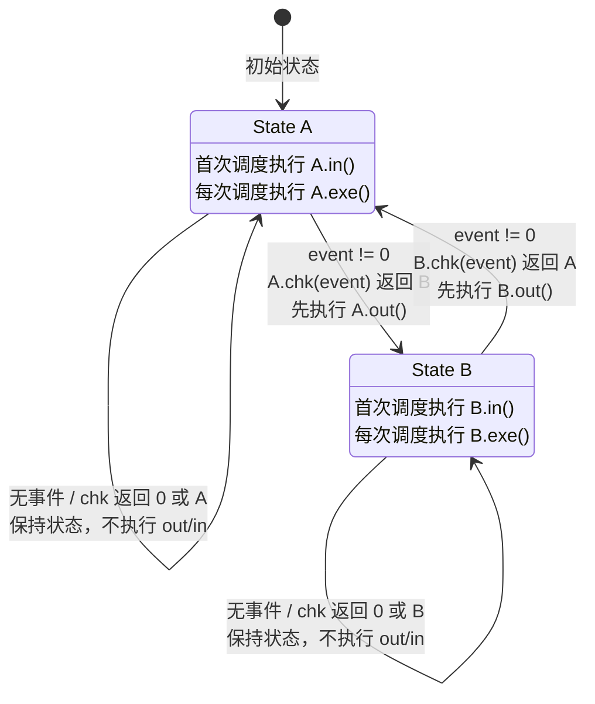
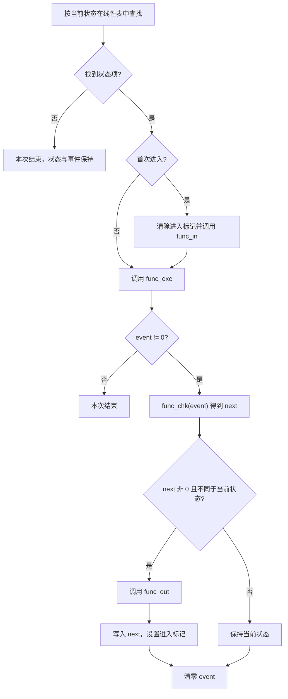

# Section FSM 设计文档

## 1. 设计定位

Section FSM 是一个表驱动的离散状态执行器。它把状态的进入、持续执行、事件判定和退出拆成四个阶段，并把状态表包装成固定周期任务。

FSM 只定义状态迁移的执行语义，不定义业务状态、事件来源或保护策略。业务模块负责声明状态值、事件值和各阶段函数，Section 负责按统一次序执行。

## 2. 数据模型

`reg_fsm_func_t` 描述一个状态：

| 字段 | 含义 |
| --- | --- |
| `p_name` | 状态名称，用于 PLECS 日志 |
| `fsm_sta` | 状态标识 |
| `func_in` | 进入该状态时执行一次 |
| `func_exe` | 状态驻留期间每次调度执行 |
| `func_chk` | 有事件时根据事件计算下一状态 |
| `func_out` | 确认迁移后、修改当前状态前执行 |

`reg_fsm_t` 保存执行器状态：当前状态、状态表、表长度、进入标记和事件变量指针。状态表与 FSM 对象都是静态对象，不使用动态内存。

`FSM_ENTRY()` 负责建立状态与四阶段函数的对应关系；`REG_FSM()` 负责建立状态表、FSM 对象和一个 1 ms 周期任务。

## 3. 状态机流程图

下面的状态图描述 Section FSM 的通用迁移模型。`State A` 和 `State B` 代表任意两个业务状态，事件由当前状态的执行阶段产生或由外部写入。



一次有效迁移按以下时间顺序发生：

```text
当前周期：旧状态 exe → chk(event) → 旧状态 out → 写入新状态 → 设置进入标记 → 清零事件
下一周期：新状态 in → 新状态 exe
```

`out` 与状态值切换发生在事件被处理的当前周期，目标状态的 `in` 延迟到下一次调度。这个周期边界避免一次调用连续穿越多个状态。

## 4. 单次调度语义



状态迁移只在本次调度中完成 `out` 和状态值更新。新状态的 `in` 不会立即执行，而是在下一次 1 ms 调度中执行。这使一次调度最多跨越一条状态边，避免多个状态的进入和退出逻辑在同一次调用中级联执行。

## 5. 事件模型

事件由一个 `uint32_t` 变量表达，0 表示无事件。`REG_FSM()` 通过静态断言要求事件变量具有 32 位宽度，并把地址保存到 FSM 对象中。

事件可以由当前状态的 `func_exe()` 产生，也可以由模块内其他执行路径写入。执行器只在 `func_exe()` 之后读取一次事件：

- 无事件时不调用 `func_chk()`；
- 有事件时只调用当前状态的 `func_chk()`；
- 无论是否发生迁移，事件在判定后都会清零；
- 事件不是队列，同一调度周期内后写入的值会覆盖先写入的值。

因此事件表示“下一次判定要处理的一个原因”，而不是历史事件集合。需要保留多个并发原因的模块应在自身上下文中聚合条件，再生成一个确定事件。

## 6. 四阶段职责

### 6.1 `func_in`

`func_in` 建立状态入口的不变量，例如初始化计时基准、锁存模式或设置一次性输出。它在初始状态第一次运行时同样会执行。

### 6.2 `func_exe`

`func_exe` 表达状态驻留行为。它可以持续执行控制动作、观察条件并产生事件，但不直接修改 FSM 当前状态。

### 6.3 `func_chk`

`func_chk` 是当前状态对事件的解释器。同一个事件值在不同状态下可以得到不同结果。返回 0 或当前状态表示不迁移，返回其他状态值表示请求迁移。

### 6.4 `func_out`

`func_out` 只在迁移已确认时执行，用于撤销当前状态资源或建立离开状态前必须满足的条件。执行完成后，Section 才写入新状态。

## 7. 表驱动思想

状态定义与执行器分离后，迁移规则集中在状态表和各状态的 `func_chk()` 中。Section 不需要知道业务枚举，也不需要为不同产品复制状态机循环。

线性查表使状态值不必连续，也不要求状态值等于数组下标。代价是每次调度最多遍历整张表；当前设计以状态表规模有限、可读性优先为前提。

如果当前状态在表中不存在，本次调用直接结束，并且不会清除事件。这个行为保留了故障现场，但也意味着非法状态不会自动恢复，业务必须通过状态定义和诊断手段保证状态表完整。

## 8. 调度关系

`REG_FSM()` 不把 FSM 注册为新的 Section 类型，而是生成普通的 `REG_TASK_MS(1, ...)`。因此 FSM 继承所选 Section 运行时的任务调度语义：

- 裸机环境中作为协作式周期任务运行；
- SRTOS 环境中作为普通到期任务进入 Ready 队列；
- 任务延迟会推迟状态判定，但不会在一次调用中补跑多次历史状态；
- FSM 的执行时间可由任务 Perf 自动记录。

## 9. 一致性与并发边界

- 当前状态、进入标记和事件变量由同一个 FSM 对象共同描述。
- FSM 执行器没有内部锁；事件被其他执行上下文修改时，需要平台和业务保证读写原子性与时序可接受。
- 事件清零发生在判定之后；在判定与清零之间并发写入的新事件可能被覆盖。
- 回调允许为空，空回调表示该阶段没有动作。
- `func_chk()` 返回的目标状态不会在迁移时验证是否存在于表中，错误目标会在后续调度表现为查找失败。
- 状态函数应保持有限执行时间，避免阻塞同一任务调度器中的其他工作。

## 10. 关联导航

### 应用文档

- [Section 使用文档](../../../application/framework/section/section_usage.md)

### 基础教材

- [裸机调度、中断与状态机基础](../../../tutorial/baremetal_scheduling_interrupt_fsm.md)
- [实时任务与调度基础](../../../tutorial/realtime_task_scheduling.md)
