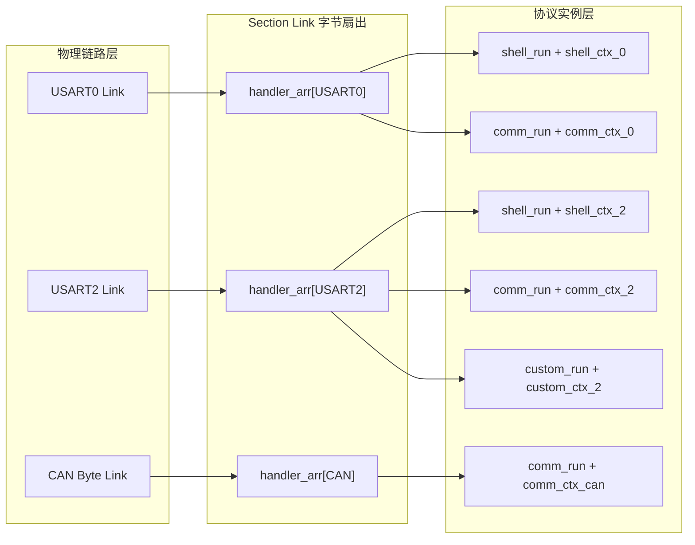
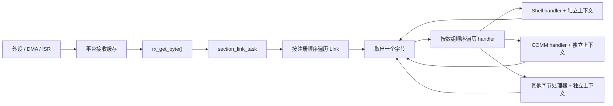

# Section Link 设计文档

## 1. 设计定位

Section Link 是连接硬件字节流与软件解析器的轻量分发层。它只处理三件事：发现链路、从链路取出字节、把同一个字节同步分发给链路上的所有 handler。

Link 不理解帧头、地址、命令、CRC 或业务语义。Shell、FRAME 通信和其他解析器都以 handler 的身份挂在 Link 后面，各自持有解析上下文。这种边界使物理串口、CAN 字节适配、协议解析和业务命令能够独立变化。

```text
硬件接收机制 → 字节提取接口 → Section Link → handler 上下文 → 协议或命令处理
```

## 2. 静态组合模型

链路由 `section_link_t` 描述：

| 成员 | 设计含义 |
| --- | --- |
| `rx_get_byte` | 从平台接收缓存中取出一个字节；返回非 0 表示本次取得有效数据 |
| `my_printf` | 当前链路的发送能力，包含格式化输出和 DMA 发送函数 |
| `handler_arr` | 该链路的同步字节消费者表 |
| `handler_num` | handler 表长度 |
| `link_id` | 链路身份，用于查找、协议上下文标识和跨链路路由 |
| `p_next` | Section 初始化后形成运行时链表 |

每个 handler 由函数和上下文组成：

```c
typedef void (*section_link_handler_f)(uint8_t data,
                                       section_link_tx_func_t *my_printf,
                                       void *ctx);

typedef struct
{
    section_link_handler_f func;
    void *ctx;
} section_link_handler_item_t;
```

函数描述处理规则，上下文保存该处理规则的持续状态。同一个解析函数可以依靠不同上下文服务多条链路，避免把链路身份固化在协议实现中。

`REG_LINK()` 在编译期产生 `section_link_t` 和 `SECTION_LINK` 注册记录。`section_init()` 扫描链接段，将记录按扫描顺序追加到链表。整个过程不分配动态内存，链路数量和 handler 组合在构建时确定。

## 3. 多物理链路与多协议交叉组合

物理链路和协议解析器是两条相互独立的设计轴：

- 物理链路负责字节从哪里来、数据向哪里发；
- 协议 handler 负责字节代表什么、解析状态如何推进；
- handler 数组负责声明某条物理链路承载哪些协议实例。

因此系统不是“一条链路对应一个协议”，而是可以构造任意静态交叉组合：



上图同时表达了三种复用关系：

1. `USART0` 同时承载 Shell 和 COMM，表示一条物理链路复用多个协议；
2. `shell_run` 和 `comm_run` 分别出现在多条链路上，表示一份协议代码复用到多个物理端口；
3. 每个函数绑定独立上下文，表示代码可以共享，但解析状态和缓存不能混用。

交叉关系可以用绑定矩阵理解：

| 物理链路 | Shell 实例 | COMM 实例 | 自定义协议实例 |
| --- | --- | --- | --- |
| USART0 | `shell_ctx_0` | `comm_ctx_0` | — |
| USART2 | `shell_ctx_2` | `comm_ctx_2` | `custom_ctx_2` |
| CAN Byte Link | — | `comm_ctx_can` | — |

矩阵中的每个非空单元格就是一个 `section_link_handler_item_t`。增加物理链路不会修改协议函数，增加协议也不会修改 Section 调度器，只需要增加静态上下文并调整目标链路的 handler 表。

### 3.1 同一协议跨多条链路

同一个 handler 函数可以出现在多个 handler 数组中。函数本身不保存链路专用状态，所有持续状态都从 `ctx` 取得。

以 COMM 为例，每条链路分别拥有自己的 `comm_ctx_t`、payload 缓冲区、解析位置、CRC 和 `link_id`。某条链路收到半帧时，不会改变另一条链路的解析状态。响应发送接口也由当前 Link 随字节传入，使同一个命令处理流程能够沿请求来源链路返回。

如果多个物理链路错误地共享同一个可变上下文，两条字节流会交替推进同一个解析器，破坏帧边界。因此“函数可复用、上下文必须按协议实例隔离”是交叉组合成立的核心约束。

### 3.2 同一链路承载多个协议

一条链路的每个输入字节都会依次到达所有 handler。各协议解析器并行观察同一字节流，并依靠自己的起始符、状态机和超时机制判断数据是否属于自己。

Section 不做协议识别，也不先判断 Shell 文本还是二进制帧。这样可以保持 Link 简单，但要求共用链路的协议具有可恢复的同步规则：无关字节不能让解析器永久停留在错误状态，帧超时或重新寻找起始符必须由协议自己完成。

### 3.3 交叉组合中的发送方向

接收方向是一对多扇出，发送方向仍落回具体物理链路：

- handler 使用本次调用携带的 `my_printf`，响应当前输入链路；
- 主动业务通过 `LINK_PRINTF(link_id)` 选择目标物理链路；
- COMM 路由根据源 `link_id` 和目的地址查找另一条 Link，再使用目标 Link 的发送接口。

协议实例之间不直接互相调用，跨物理链路的数据转移也不改变 Link 的接收扇出模型。

## 4. 接收数据流



### 4.1 硬件到接收缓存

外设中断或 DMA 把数据写入平台拥有的缓存。Section 不规定缓存是环形队列、DMA ping-pong 区还是驱动 FIFO，也不直接访问外设寄存器。

这层边界的核心是把“数据如何到达内存”与“数据由谁解释”分开。平台只需要保证 `rx_get_byte()` 每次成功时向调用方复制一个完整字节，并维护自己的读写位置。

### 4.2 接收缓存到 Link

`section_link_task` 通过 `REG_TASK(10, section_link_task)` 进入普通任务链。每次运行时，它按链表顺序遍历全部链路，并对当前链路重复调用 `rx_get_byte()`，直到接口返回 0。

因此当前模型是“任务主动拉取”，不是驱动向协议层推送：

- ISR 和 DMA 只负责尽快收下数据；
- Link 任务决定何时消费缓存；
- 协议处理不占用硬件 ISR 的执行路径；
- 一次调度会尽量排空当前链路，再访问下一条链路。

### 4.3 Link 到 handler

每取得一个字节，Link 都会把它依次传给 `handler_arr` 中的每个有效 handler。handler 之间不是竞争消费关系，而是观察同一份字节流：前一个 handler 不会阻止后一个 handler 收到该字节，也没有“已经消费”的返回值。

这种扇出模型允许一条物理链路同时承载 Shell 和二进制通信解析。两个解析器分别在自己的上下文中推进状态，互不共享接收索引和帧缓存。

handler 调用是同步的。当前字节的全部 handler 返回后，Link 才会提取下一个字节。因此 handler 的执行时间直接构成链路排空时间，任一 handler 阻塞都会阻塞同链路的后续字节和后续链路。

## 5. FRAME 数据处理脉络

当 `comm_run()` 作为 handler 挂入链路时，数据依次经历以下阶段：

```mermaid
sequenceDiagram
    participant HW as "硬件接收缓存"
    participant Link as "Section Link"
    participant Comm as "comm_run + comm_ctx_t"
    participant Table as "SECTION_COMM 命令表"
    participant Biz as "业务命令回调"
    participant Tx as "当前 Link 发送接口"

    loop "缓存中仍有字节"
        Link->>HW: "rx_get_byte(&data)"
        HW-->>Link: "data"
        Link->>Comm: "handler(data, my_printf, ctx)"
        Comm->>Comm: "推进帧解析状态与 CRC"
    end
    Comm->>Table: "按 cmd_set/cmd_word 查找"
    Table-->>Comm: "命令函数"
    Comm->>Biz: "func(&pack, my_printf)"
    Biz->>Tx: "comm_send_data / my_printf"
```

`comm_ctx_t` 保存正在接收的帧、payload 缓冲区、CRC、解析状态、本机地址和来源 `link_id`。Link 只传递字节、发送接口和上下文指针，不读取这些字段。

完整帧通过版本、长度、CRC 和结束符检查后，`comm_run()` 才查找并调用业务命令。业务回包使用随当前字节一起传入的 `my_printf`，因此响应自然返回到产生该请求的物理链路，不需要业务层识别 UART 或 CAN。

## 6. 跨链路路由

路由发生在 COMM 层，但依赖 Link 提供的两个事实：输入链路的 `link_id` 和所有已注册链路的只读链表。

```text
输入帧
  → comm_ctx_t.link_id 标识来源
  → 地址判断决定本机处理或路由
  → SECTION_COMM_ROUTE 匹配来源链路与目的地址
  → section_link_first_get() 查找目的 link_id
  → 使用目的链路 my_printf 重新发送完整帧
```

Section Link 不保存路由表，也不决定地址是否匹配。它只提供稳定的链路身份和目标链路发送能力，路由策略由 COMM 独立维护。

## 7. 发送数据流

发送有两条入口，但最终都落到 `section_link_tx_func_t`：

- handler 响应：通过参数中的 `my_printf` 返回当前输入链路；
- 主动发送：通过 `LINK_PRINTF(link)` 取得指定链路的发送接口。

格式化文本调用 `my_printf()`，二进制帧调用 `tx_by_dma()`。Section 不排队、不复制发送数据，也不判断 DMA 是否完成；发送缓存生命周期和并发保护属于发送实现或上层协议发送器。

这个边界让 Link 保持对硬件传输方式无感，同时要求发送函数在返回语义、缓存占用和并发调用方面提供明确保证。

## 8. 顺序、吞吐与公平性

当前调度顺序由两个静态顺序共同决定：

1. Link 链表采用链接段扫描顺序追加；
2. 单条 Link 内的 handler 采用数组声明顺序执行。

每次处理会排空当前链路，吞吐优先于链路间公平。持续有数据的前序链路可能延后后序链路的处理；耗时 handler 也会放大这种影响。系统因此依赖平台接收缓存吸收调度间隔，并依赖 handler 保持有限、非阻塞的执行时间。

## 9. 数据所有权与生命周期

| 数据 | 所有者 | 生命周期 |
| --- | --- | --- |
| 硬件接收缓存 | 平台驱动 | 由驱动初始化并持续存在 |
| `section_link_t` | 注册链路模块 | 静态生命周期 |
| handler 数组 | 注册链路模块 | 静态只读生命周期 |
| handler 上下文 | 对应解析模块 | 至少覆盖链路整个运行期 |
| 单字节 `data` | `link_process()` | 当前同步分发轮次 |
| `my_printf` | 注册链路模块 | 静态生命周期，通过指针共享 |

Link 不保存 handler 传入的数据副本。handler 若需要跨字节或跨调度保存信息，必须写入自己的上下文。

## 10. 设计边界

- Link 是字节流分发层，不是协议层。
- Link 不拥有硬件、不初始化外设、不管理 DMA。
- Link 不提供帧级队列、优先级、流控或背压。
- handler 同步执行，并共享同一字节的观察顺序。
- 无效链路、空接收函数或空 handler 表不会进入处理。
- 链路 ID 必须在当前构建中保持唯一，路由查找返回第一个匹配对象。
- 运行期不增加或删除链路；拓扑由链接段中的静态注册对象决定。

## 11. 关联导航

### 应用文档

- [Section 使用文档](../../../application/framework/section/section_usage.md)

### 基础教材

- [C语言静态注册与链接基础](../../../tutorial/static_registration_and_linking.md)
- [嵌入式通信分发、性能与可靠性基础](../../../tutorial/communication_performance_reliability.md)
