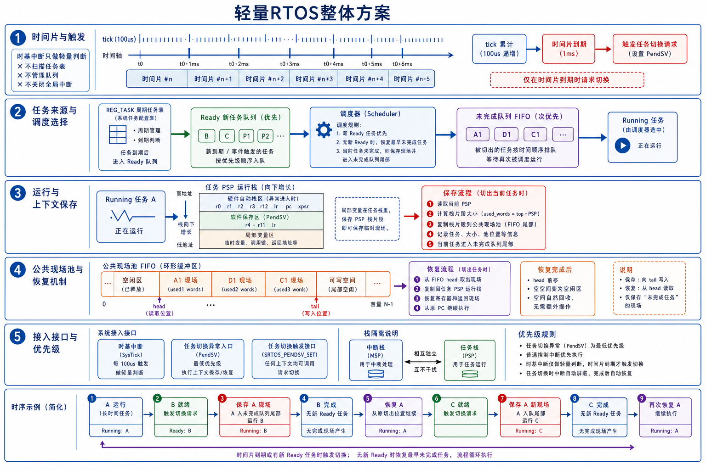
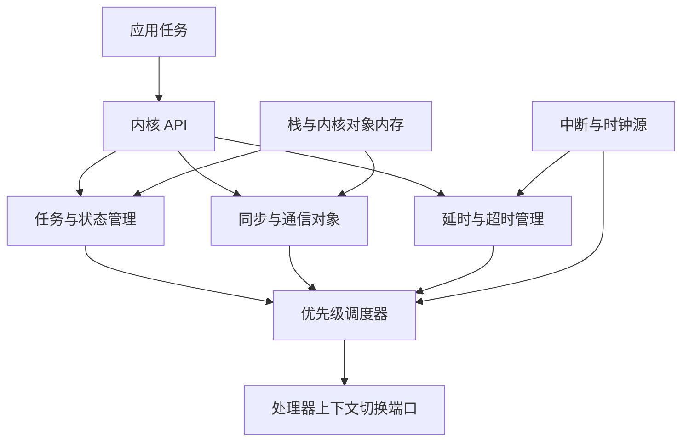
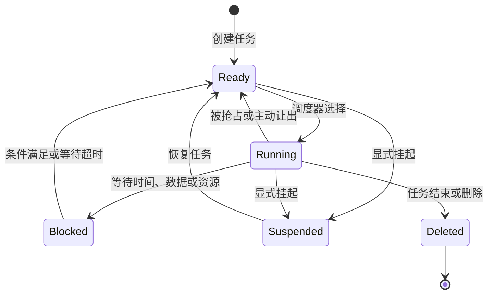
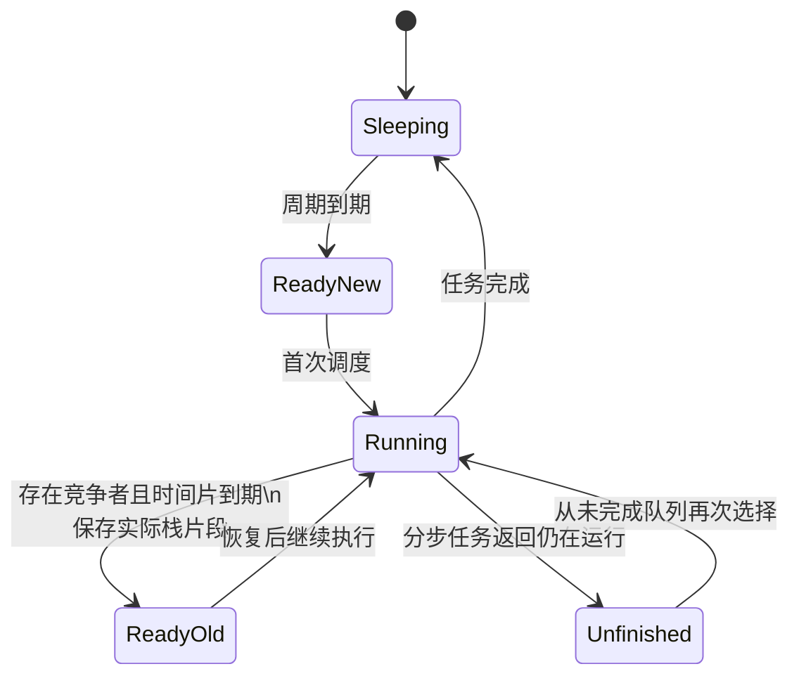
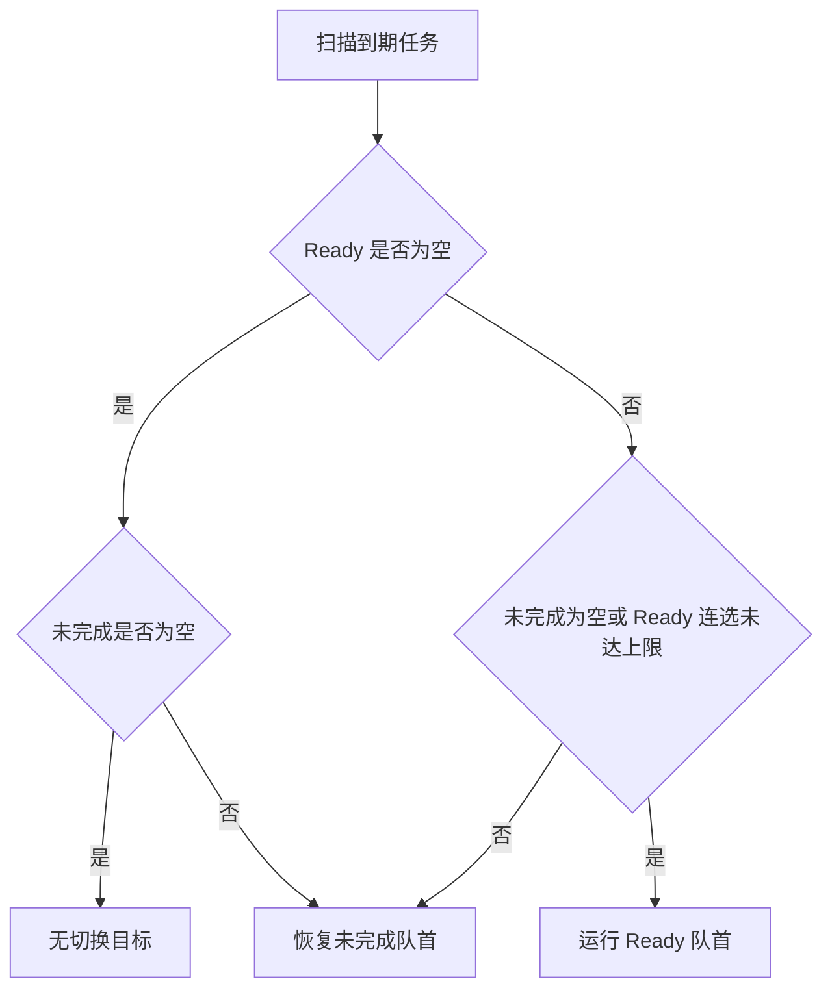
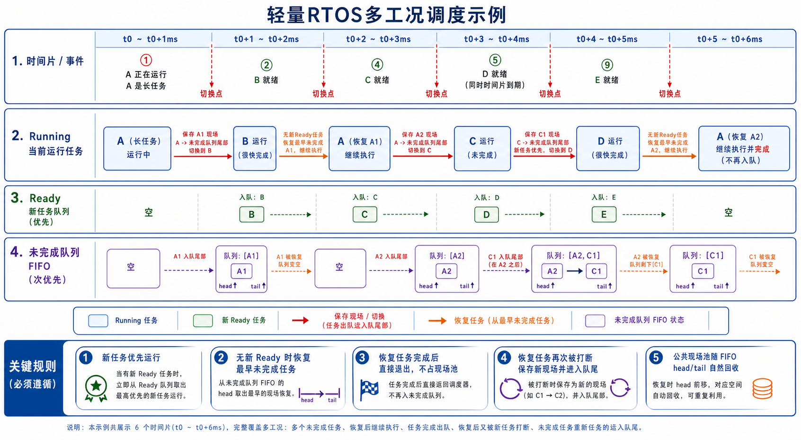
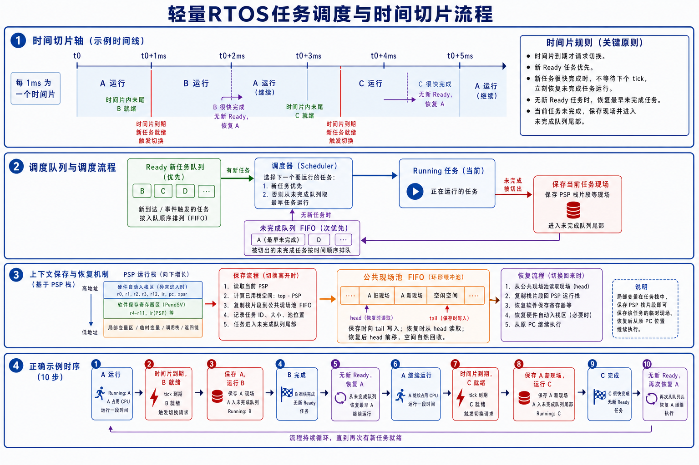

# SRTOS 设计思想

## 1. 模块定位

SRTOS 是建立在 Section 静态任务注册机制之上的轻量抢占调度层。它保留 `REG_TASK` 定义周期任务的方式，在任务执行时间不可忽略时，引入时间片、任务现场保存和恢复，使一个长任务不能无限占用主循环。

SRTOS 关注任务到期、执行连续性、公平选择和受控内存这些平台无关的问题。处理器如何保存现场、如何触发切换属于平台边界，不进入本文的设计讨论。

整体方案如下：



SRTOS 的定位介于普通前后台调度与通用 RTOS 之间：

- 相比普通 `run_task()` 轮询，它能够切出尚未返回的长任务。
- 相比通用 RTOS，它沿用静态注册任务，不引入线程创建、信号量、消息队列和每任务独立栈等完整内核对象。
- 它解决的是 Section 周期任务之间的执行权让渡问题，不承担完整操作系统职责。

## 2. 通用 RTOS 的设计方法

### 2.1 设计目标

通用 RTOS 面向一组相互独立、执行时间和等待关系各不相同的任务。它的核心目标不是简单地让多个函数轮流运行，而是建立一套统一规则，用来回答以下问题：

- 哪些任务当前具备运行条件。
- 多个任务同时就绪时由谁先运行。
- 任务等待时间、数据或资源时如何释放 CPU。
- 中断唤醒任务后何时发生抢占。
- 每个任务的执行现场如何独立保存。
- 任务之间如何交换数据并保护共享资源。
- 系统如何计算最坏响应时间并处理资源不足。

RTOS 提供的是可分析的并发执行模型。实时性仍取决于任务拆分、优先级、最坏执行时间、中断时间、阻塞时间和调度开销，使用 RTOS 本身并不自动构成实时保证。

### 2.2 典型组成

典型 RTOS 由任务管理、调度器、时间管理、同步通信、内存管理和处理器端口共同组成：



各部分职责相互独立：调度器只选择任务，同步对象改变任务是否就绪，时间管理负责到期事件，处理器端口负责真正切换执行现场。

### 2.3 任务控制块与独立栈

通用 RTOS 通常为每个任务建立任务控制块 TCB。TCB 保存：

- 任务栈指针和栈边界。
- 当前状态和优先级。
- Ready、延时或等待队列节点。
- 等待对象与超时信息。
- 任务名称、统计量和调试信息。

每个任务拥有独立栈。任务被切出后，它的局部变量、调用链和返回地址仍保留在自己的栈中，内核只需保存寄存器现场并切换栈指针，不需要复制整个已用栈片段。

这种方法使任意 Ready 任务都可以独立恢复，也允许调度器按照优先级选择任意任务。代价是每个任务都要永久预留覆盖最坏调用深度的栈空间。

### 2.4 任务状态与等待关系

典型任务状态包括：



Ready 表示已经具备运行条件但正在等待 CPU；Blocked 表示运行条件尚未满足。将两者区分后，调度器不需要反复轮询等待中的任务，事件、资源释放或超时发生时再把任务移回 Ready 队列。

### 2.5 基于优先级的调度

通用实时内核通常采用固定优先级抢占调度：

1. 每个任务具有明确优先级。
2. 调度器始终选择最高优先级 Ready 任务。
3. 更高优先级任务变为 Ready 时，可以立即抢占当前任务。
4. 同一优先级的多个任务可以使用 FIFO 或时间片轮转。

Ready 队列通常按优先级分组，并使用位图、最高位查找或分层队列快速找到最高优先级任务。调度选择开销主要取决于优先级数据结构，而不是系统任务总数。

优先级分配需要表达业务紧迫程度。常见分析方法包括速率单调、截止期单调以及基于最坏响应时间的人工分配。优先级不是任务重要程度的简单标签，而是影响整个系统阻塞关系的设计参数。

### 2.6 阻塞、唤醒与超时

RTOS 任务等待某个条件时进入 Blocked 状态，并从 Ready 队列移除。等待对象记录被阻塞任务；条件满足后，再把相应任务放回 Ready 队列。

典型等待条件包括：

- 延时到期。
- 信号量可用。
- 互斥量释放。
- 消息队列收到数据或获得空间。
- 事件标志满足组合条件。
- 驱动或中断完成一次异步操作。

等待通常同时带有超时。内核需要处理“事件先到”和“超时先到”的竞争，并保证任务只从等待队列中移除一次。

这种事件驱动方式避免任务忙等，但引入更多状态转换、内核对象和并发边界。

### 2.7 同步与任务间通信

通用 RTOS 通过内核对象组织任务之间的关系：

| 对象 | 主要用途 | 关键设计问题 |
| --- | --- | --- |
| 信号量 | 计数资源和事件通知 | 计数上限、中断释放、丢失通知 |
| 互斥量 | 保护共享资源 | 所有权、递归、优先级反转 |
| 消息队列 | 按消息传递数据 | 缓冲深度、复制开销、满队列策略 |
| 事件标志 | 等待多个布尔条件 | 任一/全部条件、自动清除 |
| 软件定时器 | 延后执行非中断工作 | 回调上下文、定时器服务任务优先级 |

互斥量需要处理优先级反转。常见方法是优先级继承或优先级上限，使持有资源的低优先级任务能够尽快完成临界区。

同步对象不仅提供 API，还定义数据所有权和唤醒规则。RTOS 设计的复杂度很大一部分来自这些对象之间的竞争、超时和删除行为。

### 2.8 时间管理

RTOS 使用系统 tick 或高精度硬件定时器维护时间。时间管理通常包含：

- 相对延时和绝对周期唤醒。
- 等待对象超时。
- 软件定时器。
- 同优先级时间片轮转。
- tick 回绕处理。
- 空闲时的 tickless 休眠。

延时任务可以使用按到期时间排序的队列、时间轮或分层时间结构。设计重点是在插入、删除、每 tick 处理成本和最大定时范围之间取舍。

周期任务通常使用绝对唤醒基准，避免把本次执行时间累加到下一周期而产生长期漂移。

### 2.9 内存与对象生命周期

通用 RTOS 可以支持静态创建、动态创建或两者并存：

- 静态创建由应用提供 TCB、栈和队列缓冲区，内存上界明确。
- 动态创建由内核堆分配对象，使用灵活，但需要处理碎片、失败和生命周期。
- 对象删除需要保证没有任务仍在等待或访问已释放对象。

安全关键系统通常倾向于启动阶段静态创建，运行期不再改变任务和对象拓扑。功能复杂、任务生命周期动态的系统则更依赖内核堆和对象引用管理。

### 2.10 中断与处理器端口

处理器端口负责保存寄存器、切换任务栈、进入和退出临界区，并建立首次任务现场。中断处理遵循两层结构：

1. ISR 完成最小硬件处理并向内核对象发布事件。
2. ISR 退出时判断是否有更高优先级任务被唤醒。
3. 满足抢占条件时，在安全的异常返回路径切换任务。

内核通常限制可调用系统 API 的中断优先级范围，避免高优先级中断在内核临界区中访问尚未完成更新的数据结构。

### 2.11 通用 RTOS 的设计流程

通用 RTOS 的应用设计通常按照以下顺序展开：

1. 根据独立执行节奏、阻塞条件和数据所有权拆分任务。
2. 明确每个任务的周期、截止期和最坏执行时间。
3. 根据实时约束分配优先级，而不是按模块层级分配。
4. 确定任务之间使用消息传递还是共享内存。
5. 为共享资源设计互斥关系并分析优先级反转。
6. 为每个任务计算并测量最坏栈深度。
7. 计算中断、阻塞和高优先级干扰下的最坏响应时间。
8. 定义队列满、内存不足、超时和任务失效时的故障策略。
9. 通过运行统计、栈水位和时序测量验证设计假设。

任务划分、优先级和资源关系共同决定实时性。内核只是执行这些规则，不能弥补应用层缺失的时序和并发设计。

### 2.12 通用 RTOS 与 SRTOS 的设计对比

| 设计维度 | 典型通用 RTOS | 当前 SRTOS |
| --- | --- | --- |
| 任务来源 | 通过创建接口建立任务，也可静态创建 | 通过 Section 在链接期形成静态任务集合 |
| 任务栈 | 每个任务拥有独立栈 | 所有任务复用公共运行栈，悬挂任务保存实际快照 |
| 任务状态 | Ready、Running、Blocked、Suspended、Deleted | Sleeping、Ready 新任务、未完成任务、Running |
| 调度依据 | 最高优先级 Ready 任务 | Ready 新任务与未完成任务之间的有界公平 |
| 同优先级处理 | FIFO 或时间片轮转 | 队列内部 FIFO |
| 抢占条件 | 更高优先级任务就绪时可立即抢占 | 时间片到期且存在竞争任务时切换 |
| 等待机制 | 任务阻塞在内核对象或时间队列上 | 分步任务主动返回未完成，普通任务由时间片切出 |
| 同步通信 | 信号量、互斥量、队列和事件标志 | 由现有模块状态和接口组织，不提供通用内核对象 |
| 优先级反转 | 通过互斥量继承或上限协议处理 | 没有任务优先级和对应继承机制 |
| 上下文切换 | 保存寄存器并切换到任务独立栈 | 保存寄存器并复制公共栈的实际使用片段 |
| 栈内存模型 | 所有任务最坏栈预算之和 | 单任务运行栈峰值加同时悬挂现场总量 |
| 动态能力 | 可支持运行期创建、删除和等待 | 任务拓扑保持静态 |
| 调度表达力 | 适合复杂阻塞关系和多级实时优先级 | 适合静态周期任务和少量长流程的执行权让渡 |
| 分析重点 | 优先级、阻塞时间、截止期和每任务栈 | 时间片、队列公平、栈复制时间和现场池峰值 |
| 主要代价 | 独立栈总量和内核对象复杂度 | 栈复制开销、现场池耦合和较少的同步语义 |

两种设计没有绝对优劣。通用 RTOS 用更多内存和内核对象换取独立任务、任意优先级调度和完整阻塞语义；SRTOS 保留静态 Section 模型，用更小的调度概念集合解决长任务让渡和现场连续性问题。

## 3. 核心设计思想

### 3.1 保留静态任务模型，只增强执行能力

Section 的任务集合在链接期形成，任务入口、周期和注册顺序都是静态信息。SRTOS 沿用这一模型，只为任务增加运行状态和可恢复现场。

这种设计把“系统里有哪些任务”保持为静态事实，把“任务当前运行到哪里”作为动态状态管理。任务拓扑可由链接结果检查，运行期不需要动态创建对象，也不需要动态内存分配。

### 3.2 将到期资格与执行连续性分开

周期到期只说明任务获得了一次执行资格，不代表它必须立即完成；任务被切出只说明执行权暂时让给其他任务，不代表本次任务已经结束。

SRTOS 因此维护两类不同语义的队列：

- Ready 新任务队列表达“新的周期工作已经到期”。
- 未完成任务队列表达“旧的执行现场需要继续”。

把两者分开后，调度器可以同时照顾周期任务的新鲜度和长任务的连续性，避免用一个队列混淆“第一次运行”和“从中断点恢复”。

### 3.3 用实际悬挂现场代替每任务固定栈

传统 RTOS 通常为每个任务永久保留一块能够覆盖最坏调用深度的栈。SRTOS 同一时刻只允许一个任务在公共运行栈上执行；任务被切出时，只把从当前 SP 到运行栈顶之间实际使用的部分复制到公共现场池。

两种内存模型可抽象为：

```text
每任务独立栈：总栈预算 ≈ Σ(每个任务的最坏栈深度)

SRTOS 公共栈：总栈预算 ≈ 公共运行栈峰值
                           + Σ(同时悬挂任务的实际现场大小)
```

它把“为每个任务预留最坏情况”转化为“为当前真实悬挂量付费”。代价是任务切换需要复制内存，现场池容量取决于同时悬挂任务的数量与调用深度。

### 3.4 时间片是竞争时延上界，不是任务优先级

时间片用于限制一个任务在存在竞争者时连续占用 CPU 的时间。时间片到期只发出切换请求；如果没有其他 Ready 或未完成任务，当前任务继续运行，不为一次无意义切换保存和恢复现场。

因此，时间片描述的是调度检查和让渡机会，不表达业务优先级，也不保证任务在某个 tick 边界完成。真正的中断实时性仍由硬件中断优先级保证。

### 3.5 公平性采用有界偏好

新的周期工作通常比旧现场更需要及时响应，但如果永远选择新任务，持续到期的短周期任务会饿死未完成任务。

SRTOS 使用有界 Ready 偏好：默认最多连续选择 `4` 个 Ready 新任务；只要未完成队列非空，达到上限后必须恢复一个未完成任务。这个策略不是固定优先级调度，而是在“新工作响应速度”和“旧工作最终推进”之间建立明确边界。

### 3.6 调度语义与平台机制分离

公共调度逻辑负责：

- 判断周期任务是否到期。
- 管理 Ready 与未完成队列。
- 选择下一个任务。
- 分配、回收和校验现场池。
- 记录栈水位与故障证据。

平台适配负责：

- 请求一次上下文切换。
- 保存和恢复寄存器帧。
- 提供任务栈与异常栈边界。
- 恢复任务的执行位置和运行环境。

这一分界使调度思想不依赖具体处理器。平台只需兑现“请求切换、保存当前执行现场、恢复目标执行现场”这一抽象契约。

## 4. 任务生命周期

任务只有一个权威状态，不会同时作为新任务、未完成任务和运行任务存在。



周期激活只发生在任务处于 Sleeping 时。一个任务已经处于 Ready、Running 或未完成状态时，不会因周期再次到期而重复入队。

当系统跨过多个任务周期后，`time_last` 按已经跨过的周期数推进。调度器合并历史到期次数，不补发一串过期实例，从而避免系统恢复后出现追赶风暴。

## 5. 时间模型

当前默认配置为：

```c
#define SECTION_SYS_TICK_UNIT_US 100u
#define SECTION_TASK_SLICE_TICKS 10u
```

| 项目 | 当前值 | 语义 |
| --- | --- | --- |
| 系统 tick | `100us` | 周期任务的到期判断粒度 |
| 时间片 | `10 tick`，即 `1ms` | 存在竞争任务时的连续运行检查周期 |

时基中断只更新时间并在调度器已经启动、时间片已经到期时请求切换。任务扫描、队列维护、现场复制都不在普通时基中断中完成。

```text
时基 ISR
  ├─ 更新时间与延时计数
  ├─ 判断时间片
  └─ 请求处理器端口进行切换
             ↓
切换路径
  ├─ 扫描新到期任务
  ├─ 判断是否存在竞争者
  ├─ 必要时保存当前任务
  └─ 选择并恢复下一个任务
```

这种分工让周期中断保持短小，同时把较重的队列和内存复制工作放在专用切换路径中。

`100us` 周期表示到期判定精度，不等于任务必然在每个 `100us` 边界获得 CPU。长任务运行期间，新到期任务的调度延迟受时间片、当前中断占用时间和一次上下文切换开销共同影响。

## 6. 双队列与调度公平性

### 6.1 Ready 新任务队列

Ready 新任务队列保存本周期刚获得执行资格的任务。任务必须处于 Sleeping，才会按照 `REG_TASK` 链表扫描顺序进入队列；同时到期的任务按 FIFO 顺序运行。

Ready 新任务尚未拥有现场池快照。第一次运行时，它从任务入口开始使用公共运行栈。

### 6.2 未完成任务队列

未完成队列保存需要继续推进的工作，包括被抢占并拥有现场快照的任务，以及分步执行后仍未结束的任务。队列按 FIFO 保持恢复顺序。

被抢占任务再次运行时从原 PC、原调用链和原局部变量继续；分步任务则按其接口语义进入下一次执行。

### 6.3 选择规则

每次调度按以下原则选择：

1. 扫描任务表，只把处于 Sleeping 且已经到期的任务加入 Ready 队列。
2. 未完成队列为空时，选择 Ready 队首。
3. Ready 队列为空时，选择未完成队首。
4. 两个队列都非空且连续 Ready 选择次数小于 `SECTION_TASK_READY_BURST_MAX` 时，选择 Ready 队首。
5. 连续 Ready 选择达到上限时，选择一个未完成任务，并清零 Ready 连选计数。
6. 两个队列都为空时，当前任务继续运行或主循环保持空闲。

默认 `SECTION_TASK_READY_BURST_MAX` 为 `4u`。



该规则提供的是有界公平，不是硬实时优先级保证。注册顺序、周期、时间片和 Ready 连选上限共同决定任务的可观察响应行为。

## 7. 公共运行栈与现场池

当前默认容量为：

```c
#define SECTION_TASK_RUNTIME_STACK_WORDS 512u
#define SECTION_TASK_CONTEXT_POOL_WORDS 1024u
```

### 7.1 公共运行栈

所有任务复用同一块运行栈，同一时刻只有 Running 任务在其上执行。Ready 新任务从预先构造的初始帧开始；Ready Old 任务先把快照恢复到公共栈，再由处理器端口恢复寄存器。

公共运行栈容量必须覆盖任意单个任务的最大实际栈深度以及必要的任务现场。它不是所有任务栈深度之和。

### 7.2 现场池

现场池只保存当前未运行但需要保留调用现场的任务。保存范围是当前 SP 到公共运行栈顶的实际使用区间。

现场生命周期如下：


现场池使用 FIFO 环形分配：

- 保存现场时从 tail 分配连续空间。
- 恢复现场时从 head 取得最早快照。
- 快照恢复后按分配顺序释放。
- 环尾剩余空间不足时可以绕回环首，并记录不可用间隙；head 到达间隙后再跨过它。

FIFO 回收与未完成队列的 FIFO 恢复相互配合，使内存管理不需要通用堆分配器，也避免外部碎片。

### 7.3 必须保持的系统不变量

SRTOS 依靠以下不变量保证现场可恢复：

- 任意时刻至多一个任务处于 Running 状态并占用公共运行栈。
- Ready 新任务没有现场池快照。
- 每个被抢占的未完成任务恰好拥有一份有效快照。
- 快照的释放顺序与分配顺序一致。
- 任务不会重复出现在多个队列中。
- 保存和恢复范围始终落在公共运行栈边界内。
- 平台自身的执行现场不会破坏任务公共运行栈。

这些约束比具体队列实现更重要。只要其中一个被破坏，继续调度可能恢复错误的局部变量、返回地址或处理器状态。

## 8. 平台抽象边界

SRTOS 对平台只要求一组语义完整的切换能力：

```text
请求切换
  → 保存当前执行现场
  → 交给公共逻辑选择任务和交换栈快照
  → 恢复目标执行现场
  → 从目标任务原位置继续
```

平台适配决定“现场怎样落地”，SRTOS 设计决定“为什么切换、保存谁、接下来运行谁”。两部分通过语义契约衔接，调度策略不感知寄存器组织、异常类型或指令集。

## 9. 故障策略与可观测性

现场损坏比普通任务失败更危险，因为错误的执行位置或返回关系会破坏整个执行流。SRTOS 对现场池不足、栈越界、恢复越界和回收顺序错误采用失败关闭思想，不继续使用无法证明有效的上下文。

系统也可以选择在现场无法保存时让当前任务继续运行。这能够保留当前调用关系，但会延长其他任务的响应时间，因此它表达的是可用性取向，而不是调度成功保证。

可观测信息覆盖当前任务、公共栈余量、现场池使用量、所需空间、故障原因及失败次数。栈高水位与现场池峰值用于根据真实负载校准容量。

故障处理体现两条原则：

1. 在调用平台故障入口前尽量保留现场证据。
2. 无法证明上下文完整时，不猜测性恢复任务。

## 10. 调度过程

典型调度过程如下：

1. A 是长任务，正在公共运行栈上执行。
2. B 到期；时间片切换时 A 的实际栈片段保存为 `A1`，B 首次运行。
3. B 完成后，调度器恢复 `A1`，A 从原调用位置继续。
4. C 到期；下一次有效切换把 A 的新现场保存为 `A2`，C 运行。
5. 连续 Ready 任务存在时，调度器最多连续选择配置数量的新任务。
6. 达到 Ready 连选上限后，恢复未完成队首，保证旧工作继续推进。
7. 一个恢复任务执行完成后回到 Sleeping，不再占用现场池。

多工况调度关系如下：



公共现场池与时间切片过程如下：



## 11. 优点与代价

### 11.1 优点

| 方面 | 收益 |
| --- | --- |
| 任务模型 | 保留 `REG_TASK` 静态注册方式，现有 Section 任务组织方式可以继续使用 |
| 内存 | 不为每个任务永久保留最坏情况独立栈，任务少量悬挂时内存利用率较高 |
| 长任务治理 | 长任务可以在调用链内部被切出，不要求所有业务都主动拆成短函数 |
| 公平性 | Ready 有界偏好兼顾新周期任务响应和未完成任务推进 |
| 中断路径 | tick 中断只做时间更新和切换请求，队列扫描与现场复制不进入普通时基 ISR |
| 确定性 | 静态任务、固定容量内存和无动态分配使内存上界可配置、故障条件可枚举 |
| 可移植性 | 调度语义与平台现场机制分离，不同处理器可以复用同一抽象 |
| 可诊断性 | 栈水位、现场池用量和故障上下文能够支持容量分析与现场定位 |

### 11.2 代价

| 方面 | 代价 |
| --- | --- |
| 切换开销 | 每次抢占需要复制实际栈片段，调用深度越大，切换时间越长 |
| 时延抖动 | 栈复制量随任务实际调用深度变化，切换耗时不像固定寄存器帧那样恒定 |
| 现场池耦合 | 多个深调用任务同时悬挂会共同消耗现场池，一个任务的栈增长会挤压其他任务空间 |
| FIFO 约束 | 环形池按分配顺序释放，调度与回收顺序必须保持一致，不能任意恢复任意快照 |
| 单核串行 | 同一时刻只有一个任务使用公共运行栈，不提供多核并行执行模型 |
| 调度表达力 | 没有通用 RTOS 的多级优先级、阻塞对象、优先级继承和线程间同步原语 |
| 最坏时延 | 新任务响应仍受时间片、中断占用和现场复制影响，不能只用任务周期推导硬实时保证 |
| 调试复杂度 | 调试器看到的是复用的公共栈，未运行任务的现场位于快照池，观察方式不同于独立线程栈 |
| 适配风险 | 平台必须完整保存和恢复任务执行环境，适配错误会直接破坏任务现场 |

### 11.3 适用边界

SRTOS 适合任务集合静态、内存受限、希望保留 Section 编程模型，同时存在少数不可立即拆短的长任务的系统。

当系统需要大量长期阻塞线程、复杂同步关系、严格的多级优先级分析、内存保护或成熟中间件生态时，通用 RTOS 的独立任务栈和内核对象模型更直接。

当所有任务都能稳定地在很短时间内返回时，普通 Section 协作式调度具有更低的切换成本和更简单的执行模型。

## 12. 接入边界

业务层继续使用 Section 的静态任务注册方式，不感知任务现场和平台切换机制。

平台向 SRTOS 提供三类基础能力：

- 单调递增的时间基准。
- 在安全时机请求任务切换的入口。
- 保存当前任务和恢复目标任务执行环境的能力。

这些能力只负责支撑调度语义，不在平台层重新实现任务到期、队列公平和现场池策略。

## 13. 当前能力边界

当前实现提供：

- 静态周期任务到期与合并激活。
- Ready 新任务和未完成任务的双队列调度。
- Ready 连选上限控制的有界公平。
- 基于公共运行栈和现场池的任务继续执行。
- 平台无关的切换契约。
- 固定容量内存、栈边界校验、现场池一致性校验和故障记录。

任务周期决定到期资格，时间片决定存在竞争时的让渡机会，中断优先级决定硬件事件的抢占关系。这三个层次共同构成系统时序，不能用其中单一参数替代完整的最坏响应时间分析。

## 14. 关联导航

### 应用文档

- [SRTOS 使用方法](../../../application/framework/srtos/srtos_usage.md)
- [M 系列 SRTOS 接入方法](../../../application/framework/srtos/srtos_m_porting.md)
- [A 系列 SRTOS 接入方法](../../../application/framework/srtos/srtos_a_porting.md)

### 基础教材

- [实时任务与调度基础](../../../tutorial/realtime_task_scheduling.md)
- [处理器现场、栈与上下文切换基础](../../../tutorial/processor_context_and_stack.md)
- [RTOS并发、内存与可靠性基础](../../../tutorial/rtos_concurrency_and_reliability.md)
