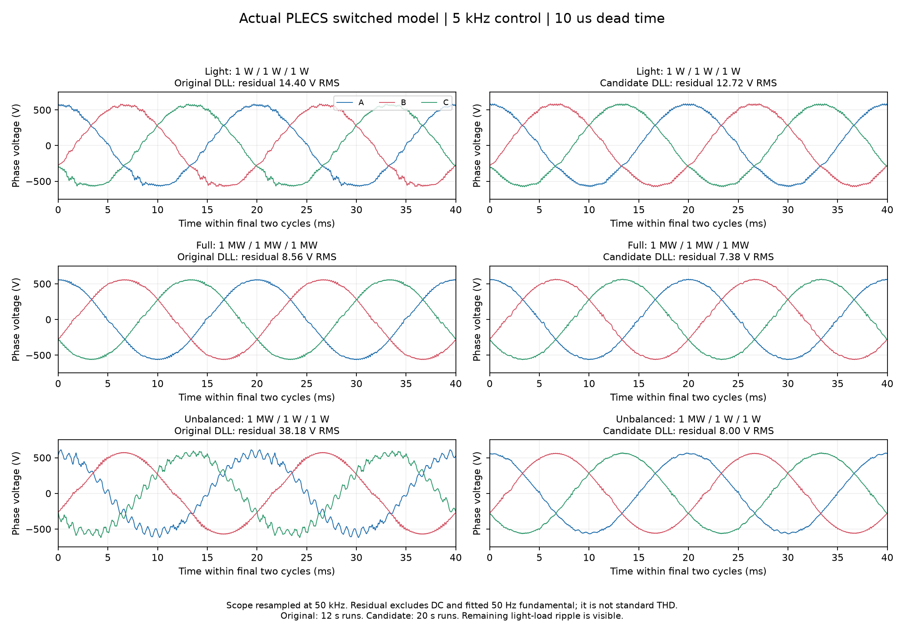

# NPC 中点平衡：开关纹波导致的错误电流分配

> 当前状态（2026-09-14）：用户已将模型死区改为 2 µs，生产补偿已同步。正式 Release DLL 完成轻载、满载和重载不平衡各 20 s 实际 PLECS 验证，末段均未出现增长振荡。当前交付见第 12 节。前文“仍为 10 us”“等待确认”等表述仅描述历史状态；突然卸载不在本轮验证范围内。

## 1. 目标：控制两只电容的电压差

本方案控制的是直流母线中点，不是交流电压正、负序。定义上电容电压为 `VP`，下电容电压的正幅值为 `VN`：

$$
\Delta V=V_P-V_N
$$

例如总母线为 1331 V，平衡目标为上下各 665.5 V。`ΔV>0` 表示上侧偏高，`ΔV<0` 表示下侧偏高。交流输出电压能跟踪目标，并不意味着直流中点也已经平衡。

三相共同偏移 z 不改变要求合成的平均线电压，但会改变各相连接到中点 O 的时间。利用这些驻留时间改变中点充放电，是本方案的调节手段。它不要求三相桥臂对直流中点的平均电压相加为零，也不是通过改变交流电压目标来调整母线。

## 2. 实际遇到的问题与排查证据

### 2.1 最初的母线电阻配置问题

最初模型将 `R13=1 mΩ`、`R14=1.1 mΩ` 分别并联在上下电容两端。连同电源串联的 `R1=1 mΩ`，在 1331 V 电源下形成约 429 kA 的直流负载，上下母线计算值约为 429.35 V、472.29 V，与当次日志一致。

这不是合理的均压电阻配置。电容 ESR 应串联，均压支路则应按允许损耗选择阻值。后续检查确认用户已经停用了这两条并联支路，并恢复约 665.5 V / 665.5 V 的初始分压。因此，**这个早期问题不能继续用来解释后续的中点漂移**。本次代码修正没有修改 `.plecs`。

### 2.2 启动时偶发电感状态不连续

写入 `RUN_ENABLE=1` 后，PLECS 曾报告 `State discontinuity after switching`，例如内部 L1 电流从约 31.38 µA 跳到 20.92 µA。对应日志中，控制已进入 RUN，约 31.6 ms 后仿真终止，上下母线仍各为 665.5 V。

把 `NP_BAL_KP` 设为 0 后仍出现过此错误；随后相同 `1e-5` 相对容差、平衡关闭的运行又成功了。因此不能把它直接归结为中点平衡使能，也不能因为一次成功就认为问题已经消失。

排查时曾把相对容差收紧到 `1e-7`，用户反馈运行很慢，之后确认成功运行使用的是 `1e-5`。收紧容差仅是诊断尝试，没有作为本次解决方案。具体触发条件仍需真实事件级的门极、续流路径和零电流附近状态证据；本次固定步长模型不能替代这项检查。

### 2.3 启用中点平衡后，反而出现严重偏移

PLECS 实测中，启用中点平衡后上下母线从约 665.5 V 对称分压发展到约 181 V / 1150 V。关闭平衡后可正常运行，但仍有缓慢漂移。原代码在 PWM 回调中重新读取原始电感电流，用它预测中点电流并挑选共同偏移 z。

实际排查结果：

| 检查 | 证据 | 能得出的结论 |
|---|---|---|
| 平衡是否启用 | 日志回放中，898 个采样点的占空比均匹配 `NP_BAL_KP≈1.885` 的计算 | 不是参数未生效或没有执行平衡计算 |
| 估算方向是否符合电容变化 | 326～327 s，按原始采样和本拍占空比估算约 +31.3 A；按 60 mF 电容压差变化反推的有效中点电流约 −22.2 A | 在该时间段，估算不能代表实际中点电荷变化 |
| 关闭后是否仍漂移 | `NP_BAL_KP=0`、相对容差 `1e-5` 下可运行，截图末段约 648 V / 683 V | 关闭后仍有缓慢漂移，但严重程度明显降低 |

这里反推电流采用固定总母线、两侧电容相等且没有外部中点支路电流的近似。这个符号差异用于指出估算失配，不能仅凭它就把相电流或 KP 取反。

### 2.4 原验证遗漏了什么

原有电容电荷守恒测试使用理想周期电流，能够检查占空比、符号和理论调节能力，但没有覆盖开关纹波。原有开关级 PI 验证脚本虽然含一拍延迟和死区，却把直流母线固定住，无法显示两只电容的压差是否发散。

这两种测试都不能单独证明实际 NPC 中点闭环有效。新的验证保留真实 C 控制器和调制器，同时加入可变化的上下电容电压以及周期内的中点电荷积分。

## 3. 为什么原始电流会误导平衡计算

模型估算为 `i_mid = sum(duty_o * i_phase)`。严格的中点充放电取决于整个 PWM 周期内 `O 状态 × 瞬时相电流` 的积分。载波边界的电感电流含有与之前调制相关的纹波，不能代表整个周期的电流。直接优化这个估算，会主动挑选“预测有利、实际不利”的偏移；一拍延迟和死区进一步影响实际电荷。

把第 j 相在 O 状态时的指示量记为 `s_Oj(t)`：接到中点时为 1，其余时候为 0。中点电流以从中点流向交流侧为正，则一个周期内的实际平均值是：

$$
\overline{i_M}=\frac{1}{T_s}\int_{t_k}^{t_k+T_s}
\sum_{j=a,b,c}s_{Oj}(t)i_j(t)\,dt
$$

只有周期内电流变化足够小，才可以把它近似为：

$$
\widehat{i_M}=\sum_{j=a,b,c}d_{Oj}i_j
$$

同一个周期内，电流在 O 区间与其他区间并不一定相同；在载波边界采到的峰、谷值也不一定等于 O 区间的代表值。因此，把瞬时采样或不加分析的上一周期平均值代入，都不自动构成正确的充放电估算。

原算法还会根据这个估算主动选择 z。错误电流不仅影响监视数值，还会改变下一周期的电平分配，从而形成不利的反馈。轻载时基波电流小、纹波占比大，这个问题尤其需要关注。本地同条件对照重现了这种恶化；它支持修正输入通道，但不表示已经排除了所有其他模型误差。

## 4. 解决方案：用基波电流分配中点电荷

### 4.1 先得到适合平衡计算的相电流

复用现有 DSOGI 提取的正序和负序分量，先在静止坐标系相加：

$$
i_{\alpha,1}=i_\alpha^++i_\alpha^-,\qquad
i_{\beta,1}=i_\beta^++i_\beta^-
$$

再用等幅值逆 Clarke 得到三相基波电流：

$$
\begin{aligned}
i_{a,1}&=i_{\alpha,1}\\
i_{b,1}&=-\tfrac12i_{\alpha,1}+\tfrac{\sqrt3}{2}i_{\beta,1}\\
i_{c,1}&=-\tfrac12i_{\alpha,1}-\tfrac{\sqrt3}{2}i_{\beta,1}
\end{aligned}
$$

正、负序都保留，避免在不平衡负载下只看正序电流。这里适用于当前三线制模型，不包含零序电流通道。DSOGI 用来降低开关纹波对平衡选择的影响；其输出不是直接测量的 O 区间平均电流，也不是精确的未来电流预测。

### 4.2 平衡方向、增益和 z 的求法

在两只电容都为 C、总母线固定的近似下：

$$
\frac{d\Delta V}{dt}=\frac{\overline{i_M}}{C}
$$

因此目标电流采用 `i_M_ref = -K × ΔV`。上侧偏高时要求负中点电流，上侧偏低时要求正中点电流。保留 `K≈1.885 A/V`，它来自 `C=0.06 F` 与理想平均响应 `K=C×2π×5`，并不表示实际闭环已经测得 5 Hz 带宽。

对每个可行的 O/P、N/O 电平组合，在允许的 z 区间内求中点电流与目标的最小误差，再比较各组合。三相基波电流替代原始采样进入这项计算，区间约束和平均线电压合成原则不变。达到区间边界后只能提供有限的平衡电流，不能保证任意负载下都精确实现目标。

没有根据一次错误方向的观测直接翻转 KP，也没有继续提高增益。现有证据首先指向估算输入被纹波污染，修正这一点比改变反馈方向更有依据。

### 4.3 接入代码的职责分配

本次保持平衡电流公式、增益和 PI 不变，改正输入通道：

1. NPC 控制器复用本拍已经完成的电流 DSOGI，合成正序与负序 alpha/beta 基波分量。
2. 逆 Clarke 得到三相基波电流，保存在控制输出 `i_fundamental[3]`。
3. HAL 的 PWM 回调增加 `const float *p_current`，同步消费三相电流。它不保留指针，也不回读上一拍监视对象。
4. 平台用这个电流构造 SVPWM 输入。原始电流采样和应用层保护保持原通道。

这里没有把电流取反，也没有增加一拍 DLL 延迟。基波提取不是对死区的精确补偿；中点电流输出仍然是估计量。

| 位置 | 本次职责 |
|---|---|
| [npc_ctrl.c / npc_ctrl.h](../../code/ctrl/npc/npc_ctrl.c) | 本拍 DSOGI 完成后生成 `i_fundamental[3]`，与电压命令一起传出 |
| [npc_hal.h / npc_hal.c](../../code/ctrl/npc/npc_hal.h) | PWM 回调携带三相电流指针，约定同步消费；不新增模拟采样绑定 |
| [PLECS app.c](../../platform/plecs/npc/app/app.c) | 用回调收到的基波电流构造 SVPWM 输入，不再回读原始采样作为平衡输入 |
| [svpwm_3level.h](../../code/lib/svpwm_3level.h) | 明确电流输入的正方向、基波含义和去开关纹波责任 |

保护继续使用原始模拟采样，避免基波提取延迟影响快速保护。电压环、电流环 PI 参数及中断执行顺序保持原有设置。本拍控制输出直接传递，避免在 PWM 回调里读取尚未更新的上一拍监视副本。

## 5. 本地验证方法

入口：[npc_midpoint_switching.m](../../platform/matlab/npc_sequence/npc_midpoint_switching.m)。运行：

```matlab
addpath(fullfile(pwd, 'platform/matlab/npc_sequence'));
npc_midpoint_switching(200);       % 1 us 电气步长，200 us 控制周期
npc_midpoint_switching(400, 3);    % 0.5 us 步长复核修正后的轻载工况
```

MATLAB/Octave 生成原有 Yd 变压器、LC 和负载的离散电气模型，编译并调用 [native runner](../../platform/matlab/npc_sequence/npc_midpoint_native.c)。控制与调制直接使用生产 C 源码，不在脚本中另写一套 PI 或 SVPWM。

电路包含：每相 80 uH 电感、200 uF 电容、原模型变压器、总母线 1331 V、两只各 60 mF 的电容、5 kHz 控制/载波、一拍占空比更新延迟、10 us 开通死区。上下母线压差由中点电荷积分更新。总母线假定理想电源保持固定。

开关模型使用受门极状态约束的续流电压区间，逐步求解电流方向和二极管导通路径；接近零电流时允许桥臂浮动。它是固定步长工程近似，未实现 PLECS 的全部事件求解、器件压降、反向恢复和寄生参数。调度层接口在该 native runner 中设置为中止陷阱，验证只运行控制计算，不连接真实网络或正在运行的 PLECS。

## 6. 结果与边界

同一轻载工况运行 12 s，以最后 1 s 的最大绝对压差比较，1 us 电气步长：

| 中点平衡配置 | 最后 1 s 最大压差 |
|---|---:|
| 关闭平衡 | 25.07 V |
| 原始瞬时电流输入 | 1094.69 V |
| 本拍基波电流输入 | 1.77 V |
| 本拍基波输入，初始压差 +100 V | 1.81 V |
| 本拍基波输入，初始压差 −100 V | 1.79 V |

上述旧版对照只切换调制输入的电流来源；其余控制、母线、负载、死区和延迟均相同。相较于先前固定电流的理想平均验证，这次本地模型已经重现了启用旧策略后失衡加重的现象。

将电气步长从 1 us 减半到 0.5 us 后，修正版轻载最后 1 s 最大压差为 0.96 V。两种步长都保持收敛，但残余压差随离散步长改变，因此不能把 1.77 V 当成 PLECS 或实物的精确预测值。表中峰值来自每 10 ms 保存的控制周期快照。

额外测试了 4 s 加载、8 s 卸载：三支路 10 kW / 100 kW / 1 MW，以及三支路各 1 MW。卸载后压差均恢复到约 2 V 以内，但输出电压矢量峰值分别达到约 2.10 kV 和 2.72 kV，**这些大功率阶跃没有通过整机电压瞬态验收**。本次不改变电压环 PI，也不宣称消除了这一问题。

生产 DLL 的真实 HAL 链路另经 3000 拍检查：在 20 A 基波上叠加幅度 150 A 的交替采样纹波，稳态基波误差最大约 0.01 A，回调三相值与本拍控制输出逐值一致。既有 SVPWM 约束测试和 NPC 中断注册顺序测试通过。

PLECS 中偶发的启动 `State discontinuity after switching` 尚未做真实事件级复现，不能据此宣称已修复。上述模型结论也不等于实物验证。

## 7. DLL、日志和后续验收

本次验证版编译到 `platform/plecs/npc/build/midpoint_verified/bin/plecs_npc.dll`，没有覆盖正在使用的 `build/bin/plecs_npc.dll`，也没有改动用户的 `.plecs`。

自动 CSV 新增 `np_kp`、`np_i_ref`、`np_i_est`、`np_offset`、`ia_fundamental`、`ib_fundamental`、`ic_fundamental`，原始电流列保留。后续实际 PLECS 验收可以直接比较调制输入、估计电流和母线压差。

| 信号 | 含义与用途 |
|---|---|
| `ia/ib/ic` | 原始采样，观察基波与纹波的混合结果 |
| `ia_fundamental/ib_fundamental/ic_fundamental` | 本拍用于中点平衡的基波电流 |
| `np_kp` | 实际应用的平衡增益，确认启停是否生效 |
| `np_i_ref` | 希望实现的中点电流 |
| `np_i_est` | 根据基波电流和 O 驻留比例得到的估算，不是传感器测量 |
| `np_offset` | 最终采用的 z，用于观察分配是否长期贴着可行边界 |
| `vdc_p/vdc_n` | 电容电压，用于检查压差及其变化方向 |

截至本次记录：

- **已完成：**原算法的本地开关模型复现、基波电流通道修正、DLL 编译、轻载及初始偏差验证、HAL 同拍传递回归、日志补充。
- **待实际 PLECS 验收：**修正版在相同模型、初始状态、负载和 `1e-5` 容差下的中点收敛，以及启动时是否仍触发状态不连续。有限模型结果不能替代这一项。
- **仍未解决：**大功率阶跃测试中的输出电压过冲；不能用中点最终恢复掩盖电压瞬态不合格。

后续先使用同一工况比较平衡关闭与开启，记录实际加载的 DLL 版本和 `np_kp`，不要同时改变负载、PI、死区和容差。若再出现估算与电容电荷变化明显不一致，进一步获取周期内中点电流和门极波形，核对实际 O 状态电荷；若发生启动报错，则按换流事件单独分析。两类问题分别验收。

## 8. 2026-09-14：1 MW / 1 W / 1 W 极端不平衡负载

### 8.1 实际反馈与可用日志

用户反馈三相输出波形峰值不一致并明显变形，上下母线约 655 V / 675 V，电流波形也出现正负峰值不对称。这里的三个功率对应高压侧三角形负载的三个支路，不能直接理解为低压侧三个独立的相对中性点负载。

本次读取模型确认 `R2=34.5kV²/1MW`、`R3=R4=34.5kV²/1W`；上下均压电阻分别为 1 kohm、1.1 kohm，初始母线约 633.8 V / 697.2 V。

最新自动 CSV 只记录 461.45～481.45 s，而截图约为 619 s。日志末段功率仅约 13.15 kW，三相基波约 563.095 V，不能拿这段数据代表截图的极端负载工况。实际加载时刻尚未确认。以下数值来自本地验证模型，采用极端负载从起动就接入的假设，不是截图时刻的实测频谱。

### 8.2 本地复现与频率分解

验证脚本新增工况 8，保留现有生产代码、5 kHz 控制、一拍占空比延迟、10 us 死区，并加入本次均压支路：

```matlab
npc_midpoint_switching(200, 8);
```

除基波以外，输出电压还包含直流和谐波/纹波。用最后 1 s 的 5 kHz 采样做常量项与 50 Hz 正弦、余弦拟合，1 us 电气步长得到：

| 指标 | A 相 | B 相 | C 相 |
|---|---:|---:|---:|
| 50 Hz 电压基波峰值 | 563.12 V | 563.12 V | 563.12 V |
| 去除直流及基波后的电压残差 RMS | 56.92 V | 18.55 V | 57.30 V |
| 电流直流分量 | −220.11 A | +589.89 A | −369.77 A |

基波负序/正序幅值比约 `4.7e-6`，控制器电流和电压指令限幅标志都没有置位。上下母线平均压差约 24.70 V，最大绝对压差约 28.27 V。因此，本地模型中主要问题是基波之外的畸变与电流偏置，而不是基波负序没有被调平。模型偏置方向不完全等于截图，不能据此判定实际传感器极性。

电压残差的重要频率集中在 1.1～1.3 kHz。按每相 L=80 uH、C=200 uF 计算：

$$
f_{LC}=\frac{1}{2\pi\sqrt{LC}}\approx1258\ \mathrm{Hz}
$$

这一频率与残差峰值吻合，支持“调制扰动激发 LC 谐振”的解释。现有电压、电流 PI 主要依据 DSOGI 的基波正负序反馈工作，直流和高频分量没有同样的稳态调节能力。不能用继续提高负序 PI 增益来代替对这些分量的处理。

### 8.3 离线候选与未通过项

为区分电流偏置与高频谐振，在 native 验证程序中加入了两个明确标记为实验的模式，均未导入生产控制代码：

- 工况 9：对“原始电流减基波电流”的残差做约 3 Hz 低通，再通过 0.1 ohm 的电压反馈抑制低频偏置。
- 工况 10：在工况 9 基础上，将共同偏移每拍变化限制为 25 V，并重新约束到可合成原指令的区间。

```matlab
npc_midpoint_switching(200, 9);   % 仅离线候选
npc_midpoint_switching(200, 10);  % 仅离线候选
```

| 末段指标 | 现有生产算法 | 低频偏置抑制候选 | 再加入共同偏移变化限制 |
|---|---:|---:|---:|
| 平均母线压差 | 24.70 V | 1.30 V | 4.62 V |
| 最大相电流直流分量绝对值 | 589.89 A | 61.22 A | 41.96 A |
| 最大相电压非基波残差 RMS | 57.30 V | 41.73 V | 40.54 V |

直接对未滤波残差施加 0.1 ohm 反馈的早期实验在约 0.662 s 超出调制可行范围，已经排除；不能把忽略延迟的“虚拟电阻”直接搬到生产环路。当前两个滤波候选虽然改善部分指标，电压畸变仍明显，**不构成完整修复或整机验收通过**。

本次只扩展了离线验证与记录，没有再次修改生产 PI、DLL 或 `.plecs`。下一步仍需针对 1.26 kHz 附近的阻尼与实际时序设计方案，并与偏置抑制共同验证；先前的轻载中点平衡通过结果不能扩展成这个极端负载工况也已通过。

### 8.4 生产代码接入及恢复后核对（2026-09-14）

在上述离线候选基础上，按后续“落地到代码里”的要求，现已接入低频电流偏置抑制。第 8.3 节末尾的“没有修改生产代码”描述的是当时的阶段，不是本节完成后的状态。

- `npc_cfg.c/.h`：增加固定配置 `current_bias_cutoff_hz = 3.0f` 和 `current_bias_resistance = 0.1f`；后者设为 0 可关闭补偿。
- `npc_ctrl.c/.h`：计算原始电流与 DSOGI 正负序合成基波电流之差，用 3 Hz 一阶低通提取低频偏置；从 alpha/beta 电压指令中减去偏置电流乘 0.1 ohm 的补偿电压。补偿与 PI 输出共同经过原调制限幅，停机时清除偏置状态。
- 控制器、HAL、PLECS PWM 回调继续传递同拍三相基波电流，用于中点平衡；原始电流仍用于应用保护。
- PLECS CSV 日志保留 `i_bias_alpha`、`i_bias_beta` 两个诊断字段。PI 参数保持原值，没有修改 `.plecs`。

恢复代码后一度出现的四参数与五参数回调不匹配已不存在。DLL 重新编译成功，`npc_section_order` 通过。额外的 `npc_pwm_chain` 测试未通过构建：其现有测试源码的无后缀双精度常量被编译规则拒绝，因此不能宣称全部 CTest 通过。

验证脚本改为每次编译到全新的可执行文件路径，并检查产物存在；编译失败时不再可能执行同名旧程序。本次重新编译并运行真实控制源码：

```matlab
npc_midpoint_switching(200, [11 12]);
```

模型保持 5 kHz 控制、一拍占空比延迟、10 us 死区及 1 us 电气步长。仿真 12 s，末段指标取最后 1 s：

| 指标 | 1 MW / 1 W / 1 W | 平衡轻载 |
|---|---:|---:|
| 末段平均母线压差 | 1.297 V | — |
| 末段最大母线压差绝对值 | 4.998 V | 1.801 V |
| 末段最大相电流直流分量绝对值 | 61.217 A | — |
| 末段最大相电压非基波残差 RMS（去除直流和 50 Hz 基波） | 41.733 V | — |

编译产物：`platform/plecs/npc/build/midpoint_verified/bin/plecs_npc.dll`。SHA-256：`E6E80FD023F9FFB78F96E72164D51F1BF271E26E3F180F5BC71307FA6283AF29`。

这些结果证明当前代码与低频偏置抑制候选一致，不能证明重载不平衡问题全部解决。LC 附近的高频畸变仍需单独设计阻尼；本次没有启动实际 PLECS 仿真，也未覆盖用户正在使用的 DLL。

## 9. 满载、轻载仍有纹波：文献核对与候选淘汰（2026-09-14）

### 9.1 先区分测量对象和控制对象

用户补充的 PLECS Scope 表明，平衡满载和轻载也存在高频分量，问题不限于不平衡负载。截图不能单独证明系统发散，也不能将所有高频分量归为正常开关纹波。必须同时查看基波、谐振频段和开关频段。

现有模型参数为每相 L=80 uH、C=200 uF，局部 LC 固有频率约 1258 Hz；这只定位频段，完整极点还受变压器和负载影响。控制与 PWM 均为 5 kHz，死区为 10 us。`.plecs` 的 DLL `OutputDelay=0`；PWM 采样方式还会影响实际生效时序，不能把“DLL 没有显式延迟”解释成整个调制链没有延迟。

离线程序新增最后 0.2 s、50 kHz 电气状态记录，避免仅用 5 kHz 控制采样波形计算畸变。下文“残差 RMS”先拟合并去除直流与 50 Hz 基波，再计算剩余波形的 RMS；它包含谐波和开关纹波，不等同于特定标准带宽的 THD。

### 9.2 公开资料给出的可用方向与适用边界

1. [TI 电压源逆变参考设计 TIDUAY6E，第 11～12 页](https://www.ti.com/lit/ug/tiduay6e/tiduay6e.pdf)：LC 电压源采用电压外环、电流内环，并用谐振补偿处理指定谐波、超前滞后环节改善相位裕量。它支持把基波调节与谐波调节区分设计，但属于单相参考设计，不能照搬到本项目的三相 DSOGI 正负序控制。
2. [imperix TN123：Active damping of LCL filters](https://imperix.com/doc/implementation/active-damping-of-lcl-filters)：有源阻尼与电流控制器应联合整定，计算及 PWM 延迟会改变阻尼效果。其示例使用并网侧电流和 LCL，当前电感电流不能直接当作该文中的并网电流；`fs/6` 结论也不是所有 LC 电压源的通用判据。
3. [Souri 等，Capacitor Voltage Active Damping，2024](https://arxiv.org/html/2404.05640v1)：利用电容电压可减少额外传感器，但数字微分的噪声增益和相位必须处理。该文用于 LCL 并网，提供的是离散设计思路，不是本项目已验证的系数。
4. [NPC 零死区 PWM 与电流失真研究，2020](https://www.mdpi.com/2079-9292/9/12/2195)：死区造成与电流方向有关的电压误差。论文的零死区调制改变了器件操作方式，不能据此直接删除现有互补驱动死区。
5. [PLECS 5.0 Symmetrical PWM 官方说明](https://docs.plexim.com/plecs/5.0/components-by-category/symmetricalpwm/)：自然采样、单次规则更新和双次规则更新具有不同的更新时刻。正式控制设计应匹配实际所选方式。

因此下一轮完整方案应联合建模：原 dq 基波环、谐振频段阻尼、必要的选择性谐波补偿、采样和 PWM 时序。不能以单个 PI 增益、单个滤波器或零死区作为全工况答案。

### 9.3 本轮实际验证

增加电压残差支路：先从原始 alpha/beta 电压减去 DSOGI 正负序合成基波，再以 100 Hz 高通去除直流，乘候选增益 0.15，加到电压指令中，最后与原 PI、低频偏置补偿共同限幅。

其代码位于 `npc_ctrl.c`，配置为 `voltage_damping_gain`、`voltage_damping_cutoff_hz`；停机复位滤波状态，CSV 增加 `v_damping_alpha`、`v_damping_beta`。**默认增益为 0，候选没有自动启用。** 原 PI、中点平衡、3 Hz 电流偏置抑制保持不变。

50 kHz 电气记录的各相最大残差 RMS：

| 工况 | 原低频偏置方案 | 新电压高通候选，一拍延迟 | 新候选，立即生效 |
|---|---:|---:|---:|
| 1 MW / 1 W / 1 W | 38.053 V | 19.142 V | 20.193 V |
| 平衡轻载，每支路 1 kW | 10.286 V | 10.748 V | 9.154 V |
| 平衡满载，三相总计 3 MW | 8.764 V | 9.375 V | 9.027 V |

两种时序下的候选均完成 12 s 稳态工况仿真，一拍延迟还做了 0.5 us 电气步长对照。但轻载和满载未同时改善，因此不能发布为“振荡已解决”。不平衡、平衡满载的突然卸载试验仍分别出现约 2.10 kV、2.72 kV 电压矢量峰值，动态验收也未通过。

同时淘汰或保留离线的分支：

- 纯电压残差差分：一拍延迟时改善，但立即生效时重载残差超过 580 V RMS，淘汰。
- 按基波电流方向补偿死区：有的负载改善、轻载变差，未写入 PWM 生产接口。
- 2～7 次谐振电压补偿：只作为离线对照，未与内环完成联合稳定性设计，不加入生产控制。
- 共同偏移限速 5 V/拍：满载母线瞬态压差超过 100 V，淘汰。
- 电容串联 0.1 ohm：仅在 `.m` 改变电气模型验证，轻载残差约 14.16 V RMS，比原方案更大。不能推荐用户直接照此改硬件或 `.plecs`。

### 9.4 复现与当前交付边界

```matlab
% 一拍延迟：原方案与候选，重载不平衡、轻载、满载。
npc_midpoint_switching(200, [11 12 18 13 14 17]);
npc_distortion_metrics(200, 1);
% 立即生效对照。
npc_midpoint_switching(200, [13 14 17], 0);
npc_distortion_metrics(200, 0);
% 更细步长及突然卸载。
npc_midpoint_switching(400, [13 14 17]);
npc_midpoint_switching(200, [15 16]);
% 仅离线考察电容支路串联阻尼，不改 PLECS 文件。
npc_midpoint_switching(200, [13 14 17], 1, 0.1);
```

工况 16 模式显式把候选增益设为 0.15，调用真实 C 实现；发布默认值仍为 0。命令中的工况编号与 native 模式编号是两个概念：例如工况 13 对应 native 模式 16 的重载不平衡场景。

本轮没有操作正在运行的 PLECS，也没有修改 `.plecs` 或替换其 `build/bin` DLL。新候选默认关闭，不能让用户再次更换 DLL 后声称全工况已修复。后续仍需联合设计和实际 PLECS 验证。

## 10. 慢速中点调节与实际 PLECS 对照（2026-09-14）

### 10.1 当前采用什么方法

目标是同时减少交流侧畸变和直流侧长期偏移。中点电压允许有周期纹波；控制器调节平均偏差，不要求每个 200 us 都把中点电流压到某个瞬时目标。这样减少为追逐瞬时电流而频繁改变共同偏移的动作。

先从三相目标电压求保持线电压不变的可行偏移区间，再取居中值。中点误差经过 10 Hz 一阶低通，PI 产生修正电流，依据当前三相电流和桥臂电平估算修正方向，换算成额外共同偏移，最后限制在 ±150 V 和实际可行区间内。

定义电流正方向为桥臂流向交流侧。若基准桥臂平均电压为 $u_x$，中点电流关于共同偏移的局部负导数为：

$$
S=\sum_{u_x\ge0}\frac{i_x}{V_P}-\sum_{u_x<0}\frac{i_x}{V_N}.
$$

当负载含容性电流或回馈电流时，$S$ 可以改变符号，不能始终采用固定修正方向。为避免 $S$ 接近零时除法放大，当前代码使用：

$$
A=\frac{S}{S^2+S_0^2},\qquad
S_0=\frac{\max(10\,\mathrm A,\;0.1\,\overline{\sum|i_x|})}{(V_P+V_N)/2},
$$

$$
i_c=K_p\overline{\Delta V}+I,\qquad z_c=A i_c.
$$

只有 $|S|>S_0$ 时更新积分，限幅误差经回算抑制积分饱和。`NP_BAL_KP=0` 同时停用比例与积分并清除积分状态。这个 $S$ 是局部平均模型的灵敏度，不能把它当成对实际死区换流的精确预测。

当前默认中点比例增益约 0.754 A/V，积分增益约 2.369 A/(V·s)，由 60 mF 配置、2 Hz 目标及 0.5 Hz PI 零点产生。实际模型电容为 66 mF/60 mF，等效压差动态采用 63 mF 时会有约 5% 差异；这些频率是整定目标，不是已测得的闭环带宽。

P/N 占空比仍由各相 $u_x=v_x+z$ 直接计算；理想平均线电压不变。死区补偿在 PWM 接口完成，补偿后的门极占空比与理想驻留时间分开保存。基波电流绝对值之和经低通超过 200 A 才启用补偿，电流过零按 100 A 范围平滑过渡。轻载时开关纹波可能改变换流电流符号，因此关闭这项补偿。10 us 补偿时间必须与下游实际死区一致。

交流环保留电压 PI `Kp=1, Ki=1300`、电流 PI `Kp=0.15, Ki=0.05`，以及 3 Hz/0.1 ohm 低频偏置抑制；电压残差支路现在启用 `gain=0.15, cutoff=100 Hz`。这些参数经过组合试验，不应单独解释成重新实现了 600/120 Hz 带宽。

### 10.2 实际模型与离线假设的差异

用户启用端口 1080 的 RPC 后，已实际运行打开的 `npc` 模型，并经 FRAME CLI 写入 `VD_POS_REF=563`、`RUN_ENABLE=1`。每次结束恢复原 DLL 路径与 R2/R3/R4 参数，不调用保存模型。原 Scope 数据在测试前另存。

实际读取的主要参数：

| 项目 | 当前模型 |
|---|---|
| 控制及 PWM | 5 kHz |
| PWM 规则采样 | 单次更新，载波最小值处更新，相移 0 |
| DLL 显式 OutputDelay | 0 |
| POS/NEG/EN 信号路径 | 各有 N=1、Ts=ctrl_ts 的外部 Delay |
| 滤波电感、电容 | 每相 80 uH、200 uF |
| 上、下母线电容 | 66 mF、60 mF |
| 旧 R12/R5 均压支路 | 当前模型中不存在 |
| 求解器 | auto，RelTol=1e-5 |

所以，“DLL 本身没有延迟”不等于“控制到 PWM 没有延迟”。此次未删除这些外部 Delay。PWM 规则更新方式参见 [PLECS 官方说明](https://docs.plexim.com/plecs/5.0/components-by-category/symmetricalpwm/)。

早期离线模型使用载波最大值作为周期起点、轻载每支路 1 kW，并保留历史均压支路，不能与现在每支路 1 W 的 PLECS 直接等同。新增 native 模式 82 用于载波最小值起点、实际轻载值、63 mF 压差动态和无均压支路对照；仍未完全复现源阻抗、非理想器件及事件求解器。实际 PLECS 波形作为本次验收依据。

### 10.3 12 s 实际仿真：旧 DLL 与当前方向补偿方案

每组从模型初始状态启动，软起动后运行到 12 s。读取 Scope 原始变步长波形，末 0.2 s 重采样为 50 kHz，拟合去除直流及 50 Hz 基波；下表为三相中最大的残差 RMS。它包含非整数谐波和开关纹波，**不是标准 THD**。

| 二次侧三支路功率 | 原 DLL 残差 | 当前 DLL 残差 | 改善 | 当前正序基波峰值 | 当前负序/正序 |
|---|---:|---:|---:|---:|---:|
| 1 W / 1 W / 1 W | 14.402 V | 12.729 V | 11.6% | 571.476 V | 0.0063% |
| 1 MW / 1 MW / 1 MW | 8.561 V | 7.382 V | 13.8% | 560.124 V | 0.0014% |
| 1 MW / 1 W / 1 W | 38.182 V | 7.999 V | 79.1% | 560.162 V | 0.0391% |

三组均未出现 PLECS 切换错误或控制保护停机。组合方案显著改善不平衡负载畸变；本表没有证明每一项改动的独立贡献。

中点纹波也必须一并报告：

| 工况 | 原 DLL 最大绝对压差 | 当前最大绝对压差 | 当前平均压差 |
|---|---:|---:|---:|
| 轻载 | 3.255 V | 2.391 V | -2.321 V |
| 满载 | 7.324 V | 10.489 V | -0.235 V |
| 重载不平衡 | 4.491 V | 23.560 V | -0.082 V |

这是一项明确的权衡：降低交流畸变，同时允许更大的周期中点压差。不能把“平均压差很小”写成“上下电容没有纹波”。

前一版固定方向平均平衡 DLL 也完成三组实际仿真，但轻载共同偏移达到约 -140 V。虽然它的轻载残差略低（12.119 V），固定方向对容性/回馈电流缺乏保障，因此没有仅凭这个单项数字选择它作为最终方案。

### 10.4 当前仍未解决的内容

- 轻载完整电压波形的基波峰值约 571 V，而控制采样识别值接近 563 V，存在约 1.5% 的采样/纹波偏差。不能只看 `VD_POS` 就认定实际电压精度达标。
- 轻载还有 100 Hz、350 Hz 等非基波分量，不能全部归因于正常 5 kHz 开关纹波；满载和不平衡负载也仍有残差。
- 突然卸载不是上述恒定负载试验。早期离线卸载仍有较大过压，未据此发布“卸载已解决”的结论。实际负载阶跃与更广泛参数范围尚需单独验证。
- 本轮改善属于仿真证据，不能代替硬件验收；当前版本仍作为验证 DLL，原模型默认 `build/bin/plecs_npc.dll` 没有被覆盖。

### 10.5 复测入口与产物

`platform/matlab/npc_sequence/npc_plecs_rpc.py` 自动选择三种负载，使用 FRAME 启动控制，保留 DLL 哈希、参数写 ACK、Scope 和运行日志路径。`npc_scope_trace.py` 检查 SaveTraces 格式、通道数、样本数和时间范围后提取波形。读取器只支持当前单条 trace、标量通道格式，遇到不同格式会停止，不能静默套用偏移。

```powershell
python platform/matlab/npc_sequence/npc_plecs_rpc.py light directional 20
python platform/matlab/npc_sequence/npc_plecs_rpc.py full directional 20
python platform/matlab/npc_sequence/npc_plecs_rpc.py unbalanced directional 20
python platform/matlab/npc_sequence/npc_scope_trace.py light_directional_20s
```

依次运行，不能对同一模型和 DLL 全局状态并行启动仿真。原 DLL 对照使用第二个参数 `baseline`，省略第三个参数时运行 12 s。输出位于 `platform/plecs/npc/build/rpc_validation/`；`*_binary.json` 记录每次实际使用的 DLL 路径与哈希，`*_scope_metrics.json` 记录指标和最后 6 s 的分窗趋势。

当前验证 DLL：`platform/plecs/npc/build/midpoint_directional/bin/plecs_npc.dll`，SHA-256 `AAE240AD22E2CE37B387D96D8724AF7BEC9B34A2D5FE36F3A3B13ADA1363E0AA`。

模型文件 SHA-256 在此次 RPC 前后保持 `31F243B8E9F35A132D53C122BFB37DD20174B650FD6AD94E3C4CED5871FE1001`，此哈希用于确认没有改写用户已有模型，并不表示它与 Git 提交版本相同。

### 10.6 延长到 20 s 的实际复测

三种恒定负载均完成 20 s 仿真，无切换异常、控制保护停机或非有限值退出。最后 6 s 按 0.2 s 分窗，分别拟合三相基波后计算残差：

| 工况 | 各窗最大相残差 RMS 的范围 | 末窗正序基波峰值 | 末窗平均母线压差 |
|---|---:|---:|---:|
| 轻载 | 12.7245～12.7262 V | 571.407 V | -2.298 V |
| 满载 | 7.3838～7.3843 V | 560.003 V | -0.245 V |
| 重载不平衡 | 7.9992～7.9996 V | 560.062 V | -0.083 V |

这些有限时间记录没有显示持续增长的振荡，残差已经进入近似周期稳态；它们不构成全参数范围稳定性证明，也不消除第 10.4 节的剩余问题。



图中原 DLL 使用 12 s 记录，当前候选使用 20 s 记录，各取最后两个基波周期；残差指标使用最后 0.2 s。图片由 `npc_plecs_comparison.py` 从实际 Scope 导出数据生成，不是平均模型曲线。

## 11. 轻载残差的死区隔离试验（2026-09-14）

### 11.1 只改变一个因素的实际结果

继续使用当前方向补偿 DLL、每支路 1 W、5 kHz 控制和原外部一拍 Delay。仅在 RPC 内存模型中临时改变全部 12 路 Turn-on Delay，结束后恢复各块原始表达式 `dead_time`，不保存 `.plecs`。

| 死区 | 最大相电压残差 RMS | 正序基波峰值 | 最大绝对母线压差 |
|---|---:|---:|---:|
| 原 10 us | 12.729 V | 571.476 V | 2.391 V |
| 临时 2 us | 3.936 V | 560.363 V | 0.088 V |
| 临时 0 us，仅诊断 | 4.090 V | 560.342 V | 0.086 V |

各组均运行到 12 s，指标取末 0.2 s。2 us 相对 10 us 残差下降约 69%，而 0 us 并没有进一步降低残差。这一对照说明死区及其换流、采样耦合是当前轻载畸变的主要相关因素；它没有单独区分过零钳位、器件压降和采样偏差的贡献。0 us 不是交付建议。

10 us 占 200 us 周期的 5%。原补偿只在电流足够大时启用；轻载下基波电流的符号不一定等于开关边沿电流的符号。不能简单将这个比例当作固定的电压损失，更不能给所有相统一加减 5% 占空比。

### 11.2 保留 10 us 的补偿对照

单独生成并记录参数变体 DLL，编译后恢复原源码字节，各组也在实际 PLECS 运行 12 s：

| 单项变化 | 轻载最大相残差 RMS | 结论 |
|---|---:|---|
| 轻载也开启原基波电流死区补偿 | 12.689 V | 改善极小，不能解决 |
| 关闭 0.15 电压残差支路 | 12.485 V | 改善极小，不能解决 |
| 电压残差增益由 0.15 增至 0.3 | 13.652 V | 变差，不采用 |

这些变体没有覆盖正式源码或模型默认 DLL。结果支持继续处理换流建模，而不是扩大电压残差增益。

### 11.3 下一步方案的依据和边界

[Song 等，IECON 2023，基于电流纹波预测的三电平死区补偿](https://www.researchgate.net/publication/375704273_A_Dead_Time_Compensation_Method_for_Three-Level_Inverters_Based_on_Current_Ripple_Prediction) 的作者公开全文指出，补偿需要考虑电压上升、下降边沿的实际电流；仅使用低频电流可能在过零区误判。其方法将预测纹波叠加到低频电流，并结合器件边沿延迟建模。该文支持下一步的分析方向，不代表本项目已实现或验证其完整算法。

若 10 us 是实际驱动必须满足的值，应保留它，进一步验证开关边沿电流预测及死区补偿。若它只是仿真暂定值，可以考察 2 us 与配套 2 us 软件补偿，但实际器件允许的死区仍需由器件、驱动和传播延迟确定；仿真成功不能证明实物可以直接使用 2 us。

为避免满载软件补偿仍按 10 us、模型却按 2 us，另编译 `matched_dt2` 诊断 DLL，两者一致后再运行满载和不平衡负载。当前生产配置仍保留 10 us，等待全工况验证与死区约束确认。

### 11.4 配套 2 us 软件补偿的满载验证

`matched_dt2` 只将 `NPC_PWM_DEAD_TIME_S` 从 10 us 改成 2 us，其他控制和中点参数保持一致。原源码在编译后逐字节恢复；实际加载的变体 DLL 及其哈希记录在 `build/matched_dt2/variant.json`。

| 工况 | 10 us 配套方案残差 | 2 us 配套方案残差 | 2 us 正序基波峰值 | 2 us 最大绝对母线压差 |
|---|---:|---:|---:|---:|
| 满载 3 MW | 7.382 V | 3.829 V | 559.823 V | 10.235 V |
| 1 MW / 1 W / 1 W | 7.999 V | 4.238 V | 560.024 V | 23.263 V |

两组实际 PLECS 仿真均完成 12 s，无切换错误。轻载 2 us 对照见第 11.1 节，其稳态软件补偿本来就关闭，因此没有 10 us 软件补偿量误用到轻载的问题。

这些证据说明，减小当前仿真死区并匹配软件补偿，是三种恒定负载都改善的可行方向。它尚不等于正式交付：实际器件是否允许 2 us 未确认，负载阶跃未复测，生产配置和模型默认 DLL 保持原值。不能把临时试验悄悄固化，也不能要求用户重复已完成的诊断。

本轮共完成 7 组新的 12 s 实际仿真：轻载死区 2 us/0 us、轻载补偿启用、电压残差增益 0/0.3、2 us 配套满载/不平衡。全部 12 个 Turn-on Delay 的 `T_d` 已恢复为 `dead_time`，四个参数变体的源文件哈希均验证恢复，模型文件哈希未改变。

### 11.5 保持 10 us 的边沿电流预测候选

在独立验证头文件 `npc_edge_compensation_candidate.h` 中，按三相理想 P/N 驻留时间重建首半周期的电压事件，扣除浮动中性点共同电压后，通过每相 80 uH 电感积分得到电流纹波；利用波形对称性估算第二个边沿，将纹波与基波电流叠加。两个边沿分别判断电流方向，形成死区占空比补偿。该候选没有实现器件寄生电容、零电流钳位的完整模型，不能称为前述论文算法的完整复现。

实际 10 us 轻载仿真完成 12 s，最大相电压残差为 12.808 V RMS，正序基波峰值 570.992 V；母线平均压差 0.024 V、最大绝对压差 0.185 V。它改善了中点偏差，却没有降低交流畸变，因此不采用为生产方案。

另对同一时间戳的 Scope 原始数据与 DLL CSV 逐点比较：电压 RMS 差约 11 uV，电流差小于 1 uA，排除了当前反馈通道接错或日志读取时刻不一致。实际周期内波形与每周期单点采样仍有差异，这属于采样方式的影响，不能通过把日志列改名解决。

当前需要确认的约束仍是：10 us 是否为器件/驱动必须满足的要求。若不能缩短，下一步必须进一步建模死区内零电流钳位及实际边沿时序；目前已验证的简单基波补偿、理想边沿电流预测、电压残差增益调整均不足以解决。不能因为 2 us 仿真效果好而擅自把正式死区改成 2 us。

### 11.6 同一配套 DLL 的三工况 20 s 验证

使用 `build/matched_dt2/bin/plecs_npc.dll`，三组均临时设置 2 us 门极死区，依次实际运行 20 s。最后 6 s 每 0.2 s 拟合一次基波，未观察到增长的振荡：

| 工况 | 分窗残差 RMS 范围 | 末窗正序基波峰值 | 末窗平均压差 | 末窗最大绝对压差 |
|---|---:|---:|---:|---:|
| 1 W / 1 W / 1 W | 3.9363～3.9373 V | 560.259 V | 0.0043 V | 0.0882 V |
| 1 MW / 1 MW / 1 MW | 3.8288～3.8290 V | 559.732 V | -0.0373 V | 10.233 V |
| 1 MW / 1 W / 1 W | 4.2379～4.2380 V | 559.933 V | -0.0122 V | 23.256 V |

该 DLL 的 SHA-256 为 `6827F78BD90EE3DEE313D87CE06F73A3B54804D6FC7707A43F1F750CDA369556`。数据前缀分别为 `light_matched_dt2_20s_dt2e-06`、`full_matched_dt2_20s_dt2e-06`、`unbalanced_matched_dt2_20s_dt2e-06`，原始 Scope、日志位置、参数 ACK、指标均保存在 `build/rpc_validation`。

三组均无切换异常，基波峰值相对 563 V 给定偏低约 0.5%～0.6%，非基波残差仍不为零。此结果只覆盖当前模型的恒定负载及软起动，不替代突然卸载、器件参数偏差或实物死区校核。

试验结束后确认：模型默认 DLL 路径恢复为 `build\bin\plecs_npc.dll`，全部 12 个门极死区表达式恢复为 `dead_time`，原模型文件哈希不变。当时生产源码仍为 10 us 配置；后续正式采用见第 12 节。

## 12. 用户确认 2 µs 后的正式交付

### 12.1 配置和实施

用户将模型 `dead_time` 改成 `2e-6` 后，软件补偿宏仍为 10 µs。因此将 `code/interface/npc/common/pwm.h` 的 `NPC_PWM_DEAD_TIME_S` 同步为 `0.000002f`，避免在 2 µs 门极死区下继续施加 10 µs 补偿。

正式方案采用第 10 节的有方向平均中点控制：DSOGI 基波电流参与调制，低通后的压差经 PI 得到校正电流，按中点电流对共同偏移的灵敏度确定校正方向，限制额外偏移并作积分抗饱和。轻载停用基波极性死区补偿，避免误判实际换流方向。未采用第 11 节试验失败的边沿预测或扩大电压残差增益候选。

仍为 5 kHz 控制，外部占空比和使能的一拍 Delay 保留，DLL `OutputDelay=0`，载波谷底单次规则更新。控制 PI 保持 `Kp_v=1、Ki_v=1300、Kp_i=0.15、Ki_i=0.05`，电压残差反馈增益为 0.15。

此次没有写入或保存 `.plecs`，保留用户新增的 Scope1、THD 元件和其他模型编辑；复测前备份两只 Scope 的波形。当前用户模型 SHA-256 为 `f62a1e09ccdd2723a2f62bfacf60262db55db22dc4208ca46d1bd5e14e725ef7`，与历史试验文件不同。

### 12.2 正式 Release 的实际 PLECS 结果

生产源码构建到 `build/release_dt2/bin/plecs_npc.dll`，严格警告、生产单精度编译及 `npc_section_order` 注册顺序测试通过。直接使用用户模型的 2 µs 参数，三组各运行 20 s；FRAME 写入 `VD_POS_REF=563` 和 `RUN_ENABLE=1` 均收到 ACK。

| 负载功率 | 最大相电压残差 RMS | 正序基波峰值 | 电压负序比例 | 平均母线压差 | 母线压差绝对峰值 |
|---|---:|---:|---:|---:|---:|
| 1 W / 1 W / 1 W | 3.936 V | 560.255 V | 0.00088% | 0.0043 V | 0.0882 V |
| 1 MW / 1 MW / 1 MW | 3.829 V | 559.732 V | 0.00480% | -0.0373 V | 10.234 V |
| 1 MW / 1 W / 1 W | 4.238 V | 559.932 V | 0.04245% | -0.0118 V | 23.255 V |

末 6 s 每 0.2 s 分窗，最大相电压残差范围分别为 3.9355～3.9366、3.8289～3.8291、4.2379～4.2380 V RMS，未出现增长振荡。三组启动至结束均无 PLECS 切换错误。Scope 按 50 kHz 重采样，去除直流和拟合的 50 Hz 基波后统计残差，含开关纹波；此指标不是标准 THD。

重载不平衡的平均母线压差接近零，但仍有约 23.3 V 峰值的周期纹波，不能宣称上下电容瞬时电压完全重合。输出基波相对 563 V 给定仍偏低约 0.5%～0.6%。原始数据和指标位于 `build/rpc_validation`，前缀为 `light_release_dt2_20s`、`full_release_dt2_20s`、`unbalanced_release_dt2_20s`。

### 12.3 DLL 交付及复现

正式 DLL SHA-256 为 `0af399ff57f9b303947a2e86bbe0245a9304a97a77263d4a3afe2078e9225063`。已复制到默认 `platform/plecs/npc/build/bin/plecs_npc.dll`，哈希一致。旧 DLL 备份为 `build/rpc_validation/pre_release_d11e4643ed8c.dll`，交付记录为 `release_deployment.json`。

替换后又使用模型实际的相对路径 `build\bin\plecs_npc.dll` 完成一次 20 s 满载复测，数据前缀 `full_production_20s`：最大相电压残差 3.8290 V RMS、正序峰值 559.733 V、平均压差 -0.0373 V，与独立 Release 结果一致。结束后核对默认 DLL 路径、原负载参数和 12 个 `dead_time` 表达式均恢复，模型文件哈希保持上文值。

复测脚本默认使用正式 DLL；`baseline` 使用备份，避免将新 DLL 误标为旧基线。命令临时设置负载，结束后恢复，不保存模型文件：

```powershell
python platform/matlab/npc_sequence/npc_plecs_rpc.py light production 20
python platform/matlab/npc_sequence/npc_plecs_rpc.py full production 20
python platform/matlab/npc_sequence/npc_plecs_rpc.py unbalanced production 20
```

本轮覆盖当前硬件参数下的软起动和三种恒定负载。突然卸载、参数偏差以及实物器件和驱动的 2 µs 适用性需要单独验证，不能用上述稳态结果替代。
