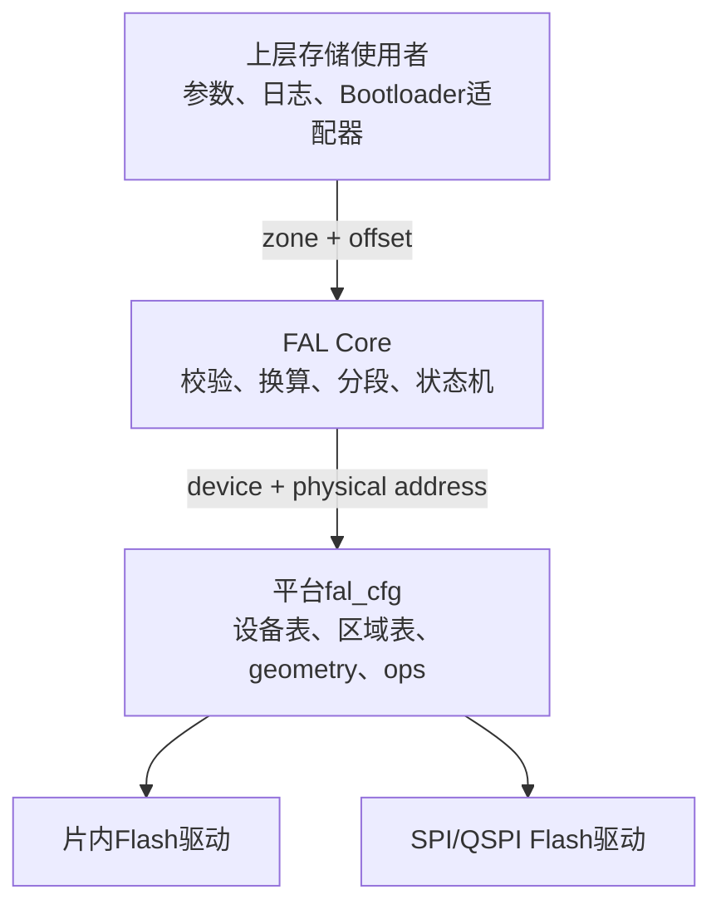
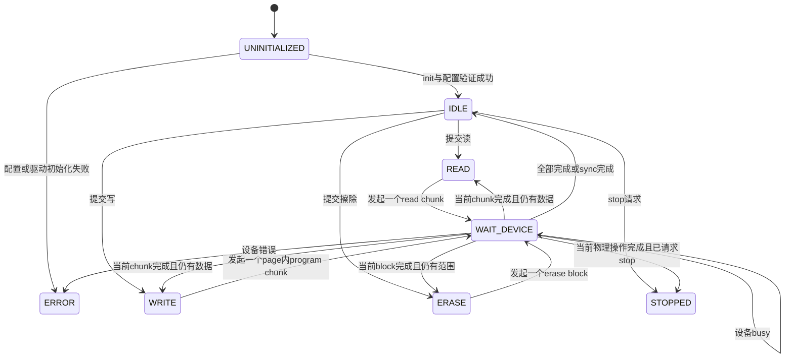

# FAL分区与异步Flash管理设计

FAL把不同Flash设备的容量、编程页、擦除块和异步驱动统一成逻辑分区接口。它管理“允许访问哪个区域、请求如何拆分、何时完成”，但不拥有具体Flash控制器，也不决定上层数据的业务含义。

## 1. 设计目标

- 同时管理片内Flash和外部Flash等多个物理设备。
- 上层只使用逻辑分区和分区内偏移。
- 平台完整描述设备geometry、区域顺序、权限和操作函数。
- 以非阻塞状态机推进读、写、擦操作。
- 按设备边界拆分请求，不把页大小或擦除大小写死在Core中。
- 初始化时拒绝有歧义或不可安全寻址的配置。
- 不使用动态内存，运行上下文由调用方持有。

## 2. 三层责任



FAL Core不包含平台头文件。平台cfg可以包含FAL公共类型和平台驱动头文件，把硬件差异收束在设备操作函数中。

## 3. 设备与区域模型

一个`fal_cfg_t`包含若干`fal_device_cfg_t`。每个设备独立描述：

- 设备ID和总容量；
- program page大小；
- erase block大小；
- 单次最大读取长度；
- 本设备的有序区域表；
- 初始化、状态查询、读取、编程、擦除和可选同步函数。

每个`fal_zone_cfg_t`只包含区域ID、大小和权限。区域不保存显式物理起点，起点由同一设备中前序区域大小累加得到：

```text
zone_offset[n] = size[0] + size[1] + ... + size[n-1]
physical_address = zone_offset[n] + request_offset
```

因此区域表顺序就是Flash布局。它避免“配置的offset”和“表中排列”出现两套真相，也意味着在已发布布局中插入、删除或调整前序区域会改变后续区域地址，必须作为持久化布局变更处理。

不同Flash使用不同区域表。片内Flash和外部Flash分别从自身地址0开始累加，不能把两个设备的区域放入一张连续表中。

## 4. 权限是存储边界

区域权限包含读、写和擦除。权限检查发生在调用驱动之前，因此可以表达：

- Bootloader区域只读；
- IAP区域可读写擦；
- 布局描述区只读；
- 暂存区和元数据区允许升级状态机修改。

权限属于FAL配置，而不是某个上层模块的约定。任何FAL使用者都经过相同检查，避免只靠Bootloader代码“自觉不写”保护区。

## 5. 初始化验证

`fal_init()`先验证完整配置，再进入空闲状态。核心检查包括：

- 配置、设备表和运行上下文非空；
- 设备ID不重复；
- 容量、program page和erase block合法；
- 必需驱动函数存在；
- 每个设备具有非空区域表；
- 区域ID在所有设备中唯一；
- 区域大小非零且权限合法；
- 累计区域容量不溢出、不超过设备容量；
- 每个区域起点和大小满足擦除块对齐。

配置错误进入`FAL_STATE_ERROR`。Core不尝试修正表顺序、缩短区域或猜测缺失geometry，因为静默修正会让链接布局和实际擦写范围失去一致性。

## 6. 请求生命周期

读、写、擦API只提交请求。一次请求保存到`fal_t`后，由外部周期调用`fal_process()`推进：



一个`fal_t`同时只接受一个请求。忙时提交新请求返回`FAL_RESULT_BUSY`，旧请求的地址、缓冲区和进度保持不变。

## 7. 分段规则

### 7.1 读取

读取块长度为剩余长度与`max_read_size`中的较小者；`max_read_size == 0`表示FAL不额外限制单次读取。

### 7.2 编程

写入块不能跨越program page：

```text
page_remaining = page_size - physical_address % page_size
chunk = min(request_remaining, page_remaining)
```

上层可以提交跨页数据，FAL负责拆分；底层`p_program`只接收合法的页内请求。

### 7.3 擦除

擦除请求扩展到覆盖请求范围的完整erase block，但扩展后的起止位置不能越出逻辑区域。FAL每次只提交一个erase block。

擦除具有破坏性。上层即使请求一个字节，也是在声明允许擦除其所在完整块；区域本身按擦除块对齐，保证扩展不会侵入相邻分区。

## 8. 异步设备契约

驱动操作函数接收物理地址，不接收区域ID。一次操作的契约是：

1. FAL在设备ready时调用read/program/erase。
2. 驱动接受后可以立即完成，也可以进入busy。
3. 后续`p_get_state()`返回busy时，FAL保持当前chunk不变。
4. 返回ready后，FAL才提交进度并处理下一块。
5. 返回error或操作函数报错时，请求以驱动错误结束。
6. 全部chunk结束后，可选`p_sync()`负责刷新驱动内部缓存。

FAL不会在一次`fal_process()`中无限轮询硬件，因此通信、看门狗和其他任务仍有执行机会。

## 9. 缓冲区与上下文所有权

`fal_t`只保存调用方的读目标或写源指针，不复制整段数据。调用方必须保证：

- 操作完成前缓冲区持续存在；
- 写源内容不被修改；
- 读目标不被其他执行路径同时使用；
- 同一`fal_t`的API和`fal_process()`被串行调用。

多个`fal_t`可以管理不同配置或设备集合，但同一个物理驱动若不支持并发，平台仍需保证它不会被两个实例同时占用。

## 10. 停止语义

`fal_stop_request()`不强行中断已经发给Flash的物理操作。强行中断program或erase可能留下无法描述的介质状态。停止规则是：

- 空闲时立即进入stopped；
- 操作中只设置延迟停止标记；
- 当前完整请求结束后进入stopped；
- stopped拒绝新请求，重新初始化后才能恢复。

## 11. 设计权衡

优点：

- 分区权限、geometry和异步推进集中管理。
- 上层与具体Flash器件解耦。
- 有序区域表简化地址配置并消除重叠表达。
- 静态内存适合Bootloader和资源受限MCU。

代价：

- 区域顺序是持久化ABI的一部分，调整布局必须谨慎。
- 单实例串行模型不适合高并发存储吞吐。
- FAL不提供磨损均衡、掉电事务或文件系统语义。
- 擦除扩展规则要求上层理解块级破坏范围。

## 12. 关联导航

### 应用文档

- [FAL平台配置与上层接入](../../application/storage/fal_usage.md)
- [Bootloader平台移植](../../application/porting/bootloader_platform_porting.md)

### 基础教材

- [C语言函数表与依赖倒置基础](../../tutorial/c_function_table_and_dependency_inversion.md)
- [异步设备状态机基础](../../tutorial/asynchronous_device_state_machine.md)
