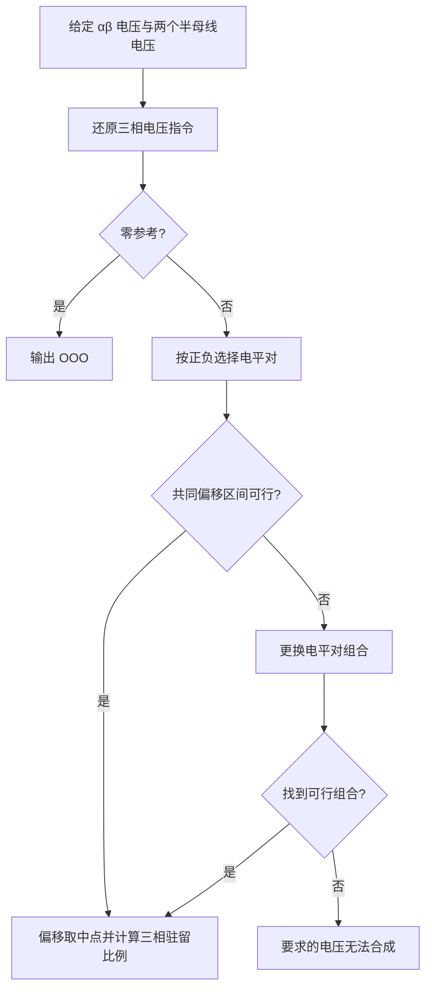

# 三电平 SVPWM：先理解物理原理，再实现为代码

本文按 2026-09-13 工作区的 `svpwm_3level.c/.h` 编写。目标是让你能手算一次调制结果，再回到代码中看懂每一步。本文只说明现有实现，没有改变控制算法或 PLECS 模型。

先记住模块的输入与输出：**输入是希望合成的 αβ 电压和两个半母线电压，输出是三相各自的 P/O/N 驻留比例。** 下游再把驻留比例变成开关管波形。

本文分两遍讲解：第一遍只从物理意义出发，按“是什么、有什么用、怎么做”的顺序走通完整调制过程；第二遍沿着相同过程，逐步解释数据、变量和函数。第一遍不需要阅读代码。

2026-09-13 已加入中点电压平衡。为保持学习顺序，第 1～9 节先讲**关闭中点平衡、z 取可行区间中点**的基准方法，原有手算数值对应这一模式；第 10.1 节再从物理上解释如何利用同一个 z 自由度控制中点电流。启用平衡后，z 不再固定取区间中点。

## 第一部分：完整理解物理过程

### 1. 桥臂到底能输出什么

设直流中点为 M，上半母线电压为 `VP`，下半母线电压幅值为 `VN`。两个输入都按正数表示，例如上、下各 350 V，总母线就是 700 V。

一个三电平 NPC 桥臂有 3 种有效电平。Q1～Q4 按从上到下编号，以下是忽略死区的理想导通表：

| 状态 | 桥臂输出端相对 M 的电压 | Q1 | Q2 | Q3 | Q4 |
|---|---:|---:|---:|---:|---:|
| P | `+VP` | 1 | 1 | 0 | 0 |
| O | 0 | 0 | 1 | 1 | 0 |
| N | `-VN` | 0 | 0 | 1 | 1 |

桥臂瞬时只能选择这 3 个电压。调制通过改变各电平在一个周期内持续的时间，得到需要的**周期平均电压**。

设完整 PWM 周期为 `Ts`：

$$
d_P=\frac{t_P}{T_s},\qquad d_O=\frac{t_O}{T_s},\qquad d_N=\frac{t_N}{T_s}
$$

有效输出满足：

$$
d_P+d_O+d_N=1,\qquad 0\le d_P,d_O,d_N\le1
$$

桥臂相对直流中点的平均电压为：

$$
\bar v_{xM}=d_P V_P-d_N V_N
$$

例如 `VP=VN=350 V`，`dP=0.4、dO=0.6、dN=0`，则平均电压为 140 V。`dP=0、dO=0.6、dN=0.4` 则得到 −140 V。

**O 状态仍然有开关管导通。OOO 与禁止所有门极输出是两件不同的事。**

### 2. α、β 的物理含义与单位

αβ 是三相电压在静止平面内的两个坐标。本调制方法采用幅值不变 Clarke 约定：α 轴沿 A 相，β 的正方向对应 B 相相对 C 相增大。

#### 2.1 相电压反馈变成 αβ 时，保留了什么

反馈是三相相电压，并不意味着它们在任何工况下都满足“三相之和为 0”。这还取决于电压测量的参考点，以及是否存在零序分量。

把实际采样值记为 va、vb、vc。先定义它们的共同分量，也叫零序分量：

$$
v_0=\frac{v_a+v_b+v_c}{3}
$$

例如三相都多出 20 V，这个共同增加的 20 V 就包含在 v0 中。完整描述任意三相电压，需要 α、β、0 三个量；只使用 αβ 时，不保留 v0。

从三相反馈计算 αβ：

$$
v_\alpha=\frac{2v_a-v_b-v_c}{3},\qquad
v_\beta=\frac{v_b-v_c}{\sqrt3}
$$

注意公式中的相减关系：如果 va、vb、vc 同时增加同一个电压，α 中这个电压的系数是 `(2−1−1)/3=0`，β 中的系数是 `(1−1)/√3=0`。因此 **αβ 看不到三相共同增加或减少的那部分电压**。

#### 2.2 为什么只从 αβ 还原的三相量相加为 0

只使用 αβ、将零序取为 0 的逆变换为：

$$
v_a^*=v_\alpha,\qquad
v_b^*=-\frac12v_\alpha+\frac{\sqrt3}{2}v_\beta,\qquad
v_c^*=-\frac12v_\alpha-\frac{\sqrt3}{2}v_\beta
$$

把这三个式子直接相加：

$$
v_a^*+v_b^*+v_c^*
=\left(1-\frac12-\frac12\right)v_\alpha
+\left(\frac{\sqrt3}{2}-\frac{\sqrt3}{2}\right)v_\beta
=0
$$

**这个“和为 0”来自逆变换本身，不是对实际反馈三相电压的假设，更不是加了 z 后仍然和为 0。**

如果将实际反馈先变成 αβ，再按上式还原，代入可得：

$$
v_a^*=v_a-v_0,\qquad v_b^*=v_b-v_0,\qquad v_c^*=v_c-v_0
$$

所以还原出的，是原采样中去掉零序之后的三相部分。只有原来的 v0=0 时，它才与原始采样逐相相等。若想完整还原原采样，还必须把测得的 v0 分别加回三相。

**例子 A：仅说明采样变换怎样去掉零序，这里没有加入调制偏移 z。**

| 量 | A 相 | B 相 | C 相 | 三相之和 |
|---|---:|---:|---:|---:|
| 实际相电压采样 | 320 V | −80 V | −180 V | 60 V |
| 每相减去 v0，即每相的变化量 | −20 V | −20 V | −20 V | −60 V |
| 只用 αβ 还原的结果 | 300 V | −100 V | −200 V | 0 V |

原采样得到 `vα=300 V、vβ=100/√3 V`。但 `(300,−100,−200) V` 也得到完全相同的 αβ。只看 αβ，无法判断采样中是否额外存在那 20 V 的共同分量。

这里从“三相和为 60 V”变成“三相和为 0 V”，是因为去掉了采样中的零序 v0，**不是因为调制器加了 z**。闭环控制中，反馈 αβ 用来描述测量结果，调制 αβ 是控制环给出的电压指令；两者不是因为使用同一种坐标，就必须数值相等或直接相连。

#### 2.3 调制侧的独立例子：加 z 后三相之和为 3z

**例子 B：下面单独看调制给定，不把上一例的采样反馈直接当作调制指令。** 为了便于对照，仍选用能还原出 `(300,−100,−200) V` 的调制 αβ。

先只用调制 αβ 得到三相指令 `(va*,vb*,vc*)`，它们之和为 0；再给每相加共同偏移 z，得到桥臂对直流中点的平均电压要求：

$$
\bar v_{aM}=v_a^*+z,\qquad
\bar v_{bM}=v_b^*+z,\qquad
\bar v_{cM}=v_c^*+z
$$

此时相加，得到的是：

$$
\bar v_{aM}+\bar v_{bM}+\bar v_{cM}=3z
$$

例如三相指令为 `(300,−100,−200) V`，加 z=−50 V 后变成 `(250,−150,−250) V`，三相之和就是 −150 V，而不是 0。

两个例子的区别是：采样变换去掉已有共同分量；调制则给零序为零的三相目标加入所选的共同偏移。这两种操作的三相之和变化方向不能混为一谈。

| 环节 | 三相之和 | 原因 |
|---|---|---|
| 实际相电压反馈 | 不预先假定为 0 | 可能含有零序分量 v0 |
| 仅由 αβ 还原的三相指令 | 0 | 逆变换采用零序为 0 的约定 |
| 加 z 后的桥臂平均电压要求 | 3z | 每一相都增加了 z |

**测量中的 v0 与调制选出的 z 也要区分。** v0 描述反馈电压已有的共同分量；z 是为了分配桥臂电平而选择的共同偏移，它们不要求相等。

这意味着：若实际相电压含有需要控制的零序分量，仅靠 αβ 电压反馈不能观察并独立调节这部分。还需结合真实电压参考点、滤波器与中性线连接，判断是否存在零序通路以及是否需要零序控制。不能把“αβ 合成正确”直接当成“任意参考点下的三相电压都已完全复现”。

#### 2.4 z 是不是在三相不平衡时，让桥臂电压之和变成 0

**不是。这里容易混淆两种不同的操作：去掉已有的零序分量，以及为调制选择共同偏移。**

如果目的是让一组原始三相电压的和变成 0，应先求它们的平均值 v0，再从每相减去 v0：

$$
v_a'=v_a-v_0,\qquad v_b'=v_b-v_0,\qquad v_c'=v_c-v_0
$$

这样三相之和确实为 0。这是**去除零序分量**，对应前面“只保留 αβ 再还原”的效果。

调制偏移 z 的用途不同：在不改变所需 αβ 电压的前提下，让三个桥臂的平均电压落入选定电平对的允许范围。它不是由“让三相之和为 0”这个条件求出来的。

| 操作 | 偏移如何确定 | 操作后三相之和 |
|---|---|---|
| 去除原始电压的零序分量 | 每相减去原始三相平均值 v0 | 0 |
| 本调制方法选择共同偏移 | 根据三相电平对约束求 z 的交集，再取中点 | 3z，通常不为 0 |

**三相完全平衡时，也可能需要非零 z。** 例如一组相峰值为 300 V 的平衡三相正弦，在 A 相达到正峰值的瞬间，三相指令是 `(300,−150,−150) V`。正、负半母线均为 350 V，A 使用 O/P，B、C 使用 N/O 时：

- A 允许 `−300≤z≤50 V`。
- B、C 均允许 `−200≤z≤150 V`。
- 共同范围为 `[−200,50] V`，取中点得到 `z=−75 V`。

加完后桥臂平均电压为 `(225,−225,−225) V`，三相之和为 −225 V。它们仍然合成所需的平衡 αβ 电压：减去共同分量 −75 V，就回到 `(300,−150,−150) V`。这说明 z 可以在三相平衡、母线也平衡时出现。

另外，**三相之和为 0，并不等于三相电压已经平衡。** 零序描述共同分量；不平衡还可能包含负序分量。给三相加同一个 z 不改变任意两相的电压差，因此不能靠它纠正相间幅值或相位的不平衡。调节不平衡电压需要上游相应的控制环来改变电压指令。

因此，可以把 z 理解成“为了安排桥臂电平而选出的共同电压偏移”，不要把它理解成“三相不平衡的补偿量”或“使桥臂电压之和为 0 的校正量”。

#### 2.5 平衡正弦电压的幅值怎么表示

α、β 是电压坐标，单位为 V，不能把它们与调制度或占空比混为一谈。

若需要平衡正序正弦电压，可令：

$$
v_\alpha=V_{pk}\cos\theta,\qquad v_\beta=V_{pk}\sin\theta
$$

其中 `Vpk` 是相电压峰值。平衡正弦条件下，690 V 线电压有效值对应：

$$
V_{pk}=690\sqrt{\frac23}\approx563.38\ \mathrm V
$$

调制要解决的是“怎样合成已经给定的电压”。给定电压的幅值和相位怎样由电压、电流控制环产生，是前一个环节的问题。

### 3. z 是什么、有什么用、怎么计算

#### 3.1 z 是什么

**`z` 就是给 A、B、C 三相同时加上的同一个电压，单位是 V。** 它叫作共同偏移电压，由调制算法每拍计算，不需要你额外输入，也不是相位或占空比。

把原始三相指令写成 `(va*, vb*, vc*)`，加上 z 后，得到三个桥臂相对直流中点 M 的平均电压指令：

$$
v_{aM}^*=v_a^*+z,\quad v_{bM}^*=v_b^*+z,\quad v_{cM}^*=v_c^*+z
$$

这就像把三个台阶一起升高或降低，台阶之间的高度差保持不变。z 改变的是三相共同的电压位置。

#### 3.2 z 有什么用

**z 用来移动三个桥臂的平均电压，使它们同时落入选定电平对允许的范围，同时保持所需线电压不变。**

桥臂选择 O/P 时，平均电压只能在 `0～VP`；选择 N/O 时，平均电压只能在 `−VN～0`。这里 VP、VN 分别是上、下半母线的电压幅值，均为正数。

三相加上同一个 z，线电压中的 z 会相互抵消。例如 AB 线电压：

$$
(v_a^*+z)-(v_b^*+z)=v_a^*-v_b^*
$$

αβ 也不会变，因为 Clarke 变换会消掉这个共同分量。例如 α 轴中偏移的系数为 `(2−1−1)/3=0`。

因此，可以利用这个共同偏移来安排桥臂电压，而不改变控制器要求的 αβ 电压。

#### 3.3 z 怎么计算：先求允许范围，再取中点

以同一个例子从头计算：

- 上、下半母线均为 350 V。
- 逆 Clarke 得到三相指令 `(300, −100, −200) V`。
- 先按正负选择电平对：A 相为正，先用 O/P；B、C 相为负，先用 N/O。电平对就是一个周期内交替使用的两个电平，第 4 节会展开说明。

**第 1 步：分别写出每相对 z 的要求。**

A 相用 O/P，加上 z 后必须落在 `0～350 V`：

$$
0\le300+z\le350
\quad\Longrightarrow\quad
-300\le z\le50
$$

也就是 A 相最多允许整体向下移动 300 V，或向上移动 50 V。

B 相用 N/O，加上 z 后必须落在 `−350～0 V`：

$$
-350\le-100+z\le0
\quad\Longrightarrow\quad
-250\le z\le100
$$

C 相也用 N/O：

$$
-350\le-200+z\le0
\quad\Longrightarrow\quad
-150\le z\le200
$$

**第 2 步：找到 3 相都能接受的范围。**

| 相 | z 的下限 | z 的上限 |
|---|---:|---:|
| A | −300 V | 50 V |
| B | −250 V | 100 V |
| C | −150 V | 200 V |

同一个 z 必须同时满足三相要求，所以要取**最大的下限、最小的上限**：

$$
z_{min}=\max(-300,-250,-150)=-150\ \mathrm V
$$

$$
z_{max}=\min(50,100,200)=50\ \mathrm V
$$

允许范围就是 `−150≤z≤50 V`。小于 −150 V 会让 C 相低于 −350 V；大于 50 V 会让 A 相超过 350 V。

**第 3 步：取允许范围的中点作为本次使用的偏移。**

$$
z=\frac{z_{min}+z_{max}}2
=\frac{-150+50}2
=-50\ \mathrm V
$$

所以 −50 V 是这样算出来的，不是预先设定的固定参数。这个例子中 z=0 也能合成指令；本调制方法选择取中点，使共同偏移距离允许范围的上下边界都为 100 V。它不意味着每一相的电压都处于各自范围的正中央。

取中点的前提是 `z_min≤z_max`，也就是共同允许范围确实存在。先验算这个可行例子，再在第 3.5 节说明范围不存在时会发生什么。

#### 3.4 把算出的 z 加回去，检查结果

| 电压 | A 相 | B 相 | C 相 | 三相之和 |
|---|---:|---:|---:|---:|
| 加 z 前的三相调制指令 | 300 V | −100 V | −200 V | 0 V |
| 每相加入的 z | −50 V | −50 V | −50 V | −150 V |
| 加 z 后的桥臂平均电压指令 | 250 V | −150 V | −250 V | −150 V |

**本例是从“和为 0”变成“和为 −150 V”，不是从“和不为 0”变成“和为 0”。** 后面将 −50 V 的共同分量扣除，是用于验算能否恢复原始指令，并不是再次修改实际施加的桥臂平均电压。

A 相的 250 V 在 `0～350 V` 内，B、C 相的 −150 V、−250 V 都在 `−350～0 V` 内，三相均满足要求。

桥臂对直流中点的平均电压变了，但线电压没有变：

| 线电压 | 加 z 之前 | 加 z 之后 |
|---|---|---|
| AB | `300−(−100)=400 V` | `250−(−150)=400 V` |
| BC | `−100−(−200)=100 V` | `−150−(−250)=100 V` |
| CA | `−200−300=−500 V` | `−250−250=−500 V` |

**为什么 A 相要求 300 V，A 桥臂却只需要平均输出 250 V？**

这里混在一起的是不同参考点下的电压。电压始终是两个点之间的电位差，不能只说“A 相是多少伏”，还要说“相对哪个点”。另外，开关瞬时电压和一个周期内的平均电压也要分开。

**先明确直流中点 M 是什么。**

M 是直流侧上、下两个半母线之间的实际连接点。上、下半母线各 350 V 时，桥臂输出端相对 M 的瞬时电压只能是：P 时 +350 V，O 时 0 V，N 时 −350 V。

因此，A 桥臂并不会在某个开关状态下直接输出 250 V。本例中它在 +350 V 与 0 V 之间切换：P 占周期的 `5/7`，O 占 `2/7`，平均值才是：

$$
\bar v_{aM}=350\times\frac57+0\times\frac27=250\ \mathrm V
$$

式子中的横线表示一个完整 PWM 周期的平均值。这里按理想电平、忽略死区和压降计算。

**再明确原始的 300 V 指什么。**

这里的三相指令 `(300,−100,−200) V` 特指**调制 αβ 经过零序取 0 的逆变换后、尚未加 z 的目标值**，所以它们相加为 0。它不是在说实际相电压反馈之和必然为 0，也不是在说加 z 之后仍然为 0；第 2 节已经分别推导了这三个环节。它们规定了需要合成的三相电压关系，并没有要求三个桥臂相对直流中点 M 的平均电压也必须恰好是这三个数。

为了看清参考点的区别，可以定义一个仅用于理解的**虚拟参考电位 R**：让它相对 M 的电位，等于三相桥臂平均电压的算术平均值。

$$
V_{RM}=\frac{\bar v_{aM}+\bar v_{bM}+\bar v_{cM}}3
$$

本例三相桥臂平均电压为 `(250,−150,−250) V`，所以：

$$
V_{RM}=\frac{250-150-250}{3}=-50\ \mathrm V
$$

R 不是必须实际接出的一根线，也不能直接认定为真实负载的中性点；这里只用它表示三相平均电位的共同位置。真实负载中性点还取决于接线、负载和滤波电路。

现在把三相桥臂平均电压的参考点从 M 改成 R：

| 相 | 桥臂对 M 的平均电压 | 减去 R 对 M 的电位 | 桥臂平均电位相对 R 的差值 |
|---|---:|---:|---:|
| A | 250 V | `250−(−50)` | 300 V |
| B | −150 V | `−150−(−50)` | −100 V |
| C | −250 V | `−250−(−50)` | −200 V |

这就回到了原始指令。因此，**A 相的 300 V 与 A 桥臂的 250 V 不矛盾，它们对应不同的参考电位。** 这里是在核对调制目标的合成关系，不是在断言实际负载端电压已经达到目标值。

**z 在这两个参考之间起什么作用？**

由于原始三相指令之和为 0，三相都加 z 后，它们的平均值就等于 z：

$$
V_{RM}=\frac{(v_a^*+z)+(v_b^*+z)+(v_c^*+z)}3=z
$$

于是 A 相的关系可以写成：

$$
\underbrace{\bar v_{aM}}_{\text{桥臂对 M 的平均电压}}
=\underbrace{v_a^*}_{\text{零共同分量的相电压指令}}
+\underbrace{z}_{\text{三相平均电位对 M 的共同偏移}}
$$

把这条关系完全用电压名称写出来，就是：

> 桥臂对直流中点 M 的平均电压 = 原始相电压指令 + 共同偏移电压 z。

以 A 相为例，原始指令是 300 V，调制选出的共同偏移是 −50 V，所以桥臂对 M 的平均电压要求为：

$$
300+(-50)=250\ \mathrm V
$$

“两者不必相等”只是在说：**共同偏移 z 不为 0 时，相加后的电压与原始指令数值不同；只有 z=0 时，这两个数值才相等。** 它不表示允许控制误差，也不表示要求 300 V 却只能输出 250 V。

可以反过来验算。三相桥臂对 M 的平均电压是 `(250,−150,−250) V`，其中共同分量为 −50 V。从 A 桥臂的平均电压中减去这个共同分量：

$$
250-(-50)=300\ \mathrm V
$$

便恢复了原始 A 相指令。B、C 相也减去同一个 −50 V，就恢复为 −100 V、−200 V。因此，变化的是三相共同的电压位置，要求合成的三相电压差没有改变。

z 的加入由三个桥臂的驻留时间安排来实现，不是额外串入一个 −50 V 的电源。

可以把这 3 个量放在一起记：

| 量 | 本例 A 相的值 | 表示什么 |
|---|---|---|
| 原始相电压指令 | 300 V | 去掉共同分量后，希望合成的 A 相电压目标 |
| 桥臂对 M 的瞬时电压 | +350 V 或 0 V | 开关在 P、O 状态下真正提供的电平 |
| 桥臂对 M 的周期平均电压 | 250 V | 按驻留时间对瞬时电压求平均的结果 |

再看“整体最多能往上、往下移动多少”：保持 `(300,−100,−200)` 三个目标值之间的差不变，改变 z，就会把三个桥臂对 M 的平均电压一起移动。例如 z=0 时为 `(300,−100,−200) V`，z=−50 V 时为 `(250,−150,−250) V`。

**求 z 的区间，就是求这样的整体移动允许到什么程度，才能让三相仍然落在各自选定电平对的范围内。** 第 5 节会把这一过程写成通用公式。

#### 3.5 如果下限反而大于上限，意味着什么

**`z_min>z_max` 表示三相对共同偏移 z 的要求互相冲突，没有任何一个 z 能同时满足它们。** 它不是一个可以倒过来使用的范围，而是三相允许范围没有交集。

换一个例子观察这种冲突：正半母线为 **600 V**，负半母线幅值为 **100 V**，三相指令为 **A=300 V、B=−50 V、C=−250 V**。首先选择 A 使用 O/P，B、C 使用 N/O。

**先分别看每相的要求。**

A 相使用 O/P，平均电压可以在 `0～600 V`；B、C 使用 N/O，平均电压只能在 `−100～0 V`：

| 相 | 加上 z 后必须满足 | z 的允许范围 |
|---|---|---|
| A | `0 ≤ 300+z ≤ 600` | `−300 ≤ z ≤ 300` |
| B | `−100 ≤ −50+z ≤ 0` | `−50 ≤ z ≤ 50` |
| C | `−100 ≤ −250+z ≤ 0` | `150 ≤ z ≤ 250` |

冲突出现在 B、C 两相：

- **B 相要求 z 最多为 50 V。** 再大，B 桥臂就需要正电压，而 N/O 只能合成非正电压。
- **C 相要求 z 至少为 150 V。** 再小，C 桥臂就需要低于 −100 V 的电压，负半母线提供不了。

同一个 z 不可能既不大于 50 V，又不小于 150 V。因此取最大的下限和最小的上限后：

$$
z_{min}=\max(-300,-50,150)=150\ \mathrm V
$$

$$
z_{max}=\min(300,50,250)=50\ \mathrm V
$$

所谓“下限 150 V、上限 50 V”，就是在说明约束已经冲突，**不存在从 150 V 到 50 V 的可行区间**。

**为什么不能平均一下，取 z=100 V？**

如果忽略冲突，强行计算 `(150+50)/2=100 V`，得到：

| 相 | 加上 z=100 V 后 | 是否满足选定电平对 |
|---|---:|---|
| A | 400 V | 满足 O/P 的 `0～600 V` 范围 |
| B | 50 V | 不满足 N/O，已经大于 0 V |
| C | −150 V | 不满足 N/O，低于 −100 V |

取平均只能给出两个数之间的位置，不能消除约束之间的冲突。这里不是答案精度不够，而是 B、C 的要求根本无法同时实现。

从物理上看更直接：B、C 原始电压相差 `−50−(−250)=200 V`，加同一个 z 后仍然相差 200 V。但它们都被安排在宽度只有 **100 V** 的 `−100～0 V` 范围内。两个相距 200 V 的电压点，无论怎么整体移动，都放不进这个范围。

**这时要改变什么？**

先改变电平对，让 **B 相也使用 O/P**，而 C 相仍然使用 N/O。B 桥臂此时可以合成正电压，它对 z 的要求变为：

$$
0\le-50+z\le600
\quad\Longrightarrow\quad
50\le z\le650
$$

新的三相要求是：

| 相 | 电平对 | z 的允许范围，V |
|---|---|---|
| A | O/P | `[−300,300]` |
| B | O/P | `[50,650]` |
| C | N/O | `[150,250]` |

这次最大的下限为 150 V，最小的上限为 250 V，确实存在共同范围：

$$
150\le z\le250\ \mathrm V
$$

现在才可以取中点 `z=200 V`，得到 A=500 V、B=150 V、C=−50 V。三相都在各自允许范围内，线电压也没有变化：AB 仍为 350 V，BC 仍为 200 V，CA 仍为 −550 V。

**因此，一组电平对没有可行的 z，只说明这一组安排不合适，不能立即断定整个电压指令无法合成。** 需要尝试其他电平对组合；只有所有候选组合都不可行，才说明本调制方法无法合成这个指令。第 9 节会接着计算这个例子的驻留比例。

对于具有零序电流通路的接线，共模还可能产生额外的电气影响。本调制方法只保证 αβ 平均电压合成，不控制零序或共模电流。

### 4. 先为每相选一对相邻电平

本调制方法每相每周期只选择以下一种方式：

| 电平对 | 平均桥臂电压范围 | 必为 0 的驻留比例 |
|---|---|---|
| O/P | `[0, VP]` | `dN` |
| N/O | `[-VN, 0]` | `dP` |

也就是说，**同一相、同一 PWM 周期中，P 和 N 不会同时有非零驻留时间。**

首先按零序为零的三相电压指令选择：指令为正的相优先采用 O/P，其余相优先采用 N/O。这是初始选择；共同偏移是否可行，还要把三相放在一起判断。

本调制方法考虑以下 6 种混合组合：

| 组合 | A 相 | B 相 | C 相 |
|---|---|---|---|
| 只有 A 使用正电平 | O/P | N/O | N/O |
| A、B 使用正电平 | O/P | O/P | N/O |
| 只有 B 使用正电平 | N/O | O/P | N/O |
| B、C 使用正电平 | N/O | O/P | O/P |
| 只有 C 使用正电平 | N/O | N/O | O/P |
| A、C 使用正电平 | O/P | N/O | O/P |

零参考单独处理：三相均输出 `dP=0、dO=1、dN=0`，即 OOO。

#### 4.1 这里的 6 种电平对组合，与“36 分区”有什么区别

**本文采用的是“选择电平对、求共同偏移、换算驻留比例”的路线，没有先把参考电压定位到 36 个分区中的某一个。** 这里的 6 种组合只表示各相使用哪一对相邻电平，不能当成空间矢量图的小扇区编号。

显式分区方法与本文方法，可以这样对照理解：

| 步骤 | 显式空间矢量分区方法 | 本文方法 |
|---|---|---|
| 先决定什么 | 参考电压位于哪个大扇区、哪个小区域 | 三相各自先使用 O/P 还是 N/O |
| 求解对象 | 选定空间矢量各自的驻留时间 | 三相共同偏移 z 与每相电平驻留比例 |
| 平均电压约束 | 各矢量按驻留时间加权后等于参考矢量 | 每相桥臂平均电压等于相指令加 z，消去共同分量后得到参考 αβ |
| 最后安排什么 | 将选定矢量及其冗余开关状态排成一个周期的时序 | 将 P 放在周期中央、N 放在周期两端，由三相时序共同形成矢量序列 |

在显式分区方法里，若选用 3 个矢量，平均电压关系写成：

$$
\boldsymbol v^*T_s
=\boldsymbol V_1t_1+\boldsymbol V_2t_2+\boldsymbol V_3t_3,
\qquad t_1+t_2+t_3=T_s
$$

本文方法则先满足每相的平均电压关系：

$$
\bar v_{iM}=d_{Pi}V_P-d_{Ni}V_N=v_i^*+z
$$

三相同时处于某些 P/O/N 状态时，本身就构成了一个空间矢量。因此，先求每相时间比例也会形成矢量序列；只是不需要先给所在的小区域编号。第 8 节的 7 段三相状态就是这种过程的具体结果。

**两条路线都可以满足所需平均电压，但仅凭平均电压相同，不能断言开关序列也相同。** 冗余状态如何分配、产生多少中点电流、开关次数以及纹波，都还取决于各自的调制策略。本节先分析不启用平衡的基础形式，平衡调节在第 10.1 节单独展开。

“36 分区”应结合具体资料里的分区图理解；不同方法对扇区、子区域和冗余状态选择区域的划分可能不同。本文没有采用指定的 36 区查表流程，也不把上述 6 种电平对组合解释成那 36 个分区的替代编号。

### 5. 把 z 的计算推广到任意三相电压

第 3 节已经手算了一个 z。这一节将其中的具体数值换成符号，得到任意三相电压都能使用的求解方法。所有电压仍以 V 表示。

如果第 i 相选择 O/P，需要：

$$
0\le v_i^*+z\le V_P
\quad\Longrightarrow\quad
-v_i^*\le z\le V_P-v_i^*
$$

如果选择 N/O，需要：

$$
-V_N\le v_i^*+z\le0
\quad\Longrightarrow\quad
-V_N-v_i^*\le z\le-v_i^*
$$

每一相都提出一个 `z` 区间，3 个区间必须有共同交集：

$$
z_{min}=\max(L_a,L_b,L_c),\qquad
z_{max}=\min(U_a,U_b,U_c)
$$

其中 Li、Ui 分别表示第 i 相允许的偏移下限和上限。三相共同使用一个 z，因此必须取区间交集：

- `z_min < z_max`：有一段可选范围。
- `z_min = z_max`：刚好有一个可行偏移，处于边界。
- `z_min > z_max`：没有交集，此电平对组合不可行。

可行时选择交集的中点：

$$
z=\frac{z_{min}+z_{max}}2
$$

这使偏移到可行区间两端的距离相等。它没有利用中点电流反馈，因此不是中点电压平衡控制。

### 6. 从平均电压求驻留比例

先得到第 i 相桥臂相对中点的平均电压要求：

$$
\bar v_{iM}=v_i^*+z
$$

**O/P 相**只有 P 与 O，所以：

$$
d_P=\frac{\bar v_{iM}}{V_P},\qquad d_O=1-d_P,\qquad d_N=0
$$

**N/O 相**只有 N 与 O，所以：

$$
d_N=\frac{-\bar v_{iM}}{V_N},\qquad d_O=1-d_N,\qquad d_P=0
$$

分子是要求的平均电压幅值，分母是实际可用电平幅值，两者之比就是需要导通的时间比例。平均电压要求越接近母线电平，该电平占据的时间就越长。

例如 O/P 相要求 250 V，正半母线为 350 V，则 P 占完整周期的 `250/350=5/7`，剩下 `2/7` 时间使用 O。

### 7. 首选组合失败后为什么还要重试

根据相指令正负选出的电平对只是优先尝试的组合。特别是上下母线不相等时，原来的分配可能容不下某两相的电压差。

如果首选组合没有共同偏移区间，就换另一种组合，重新求三相区间的交集。最多考虑第 4 节的 6 种组合。若全部不可行，就不能按本方法合成要求的电压。



忽略舍入误差，三相平均电压可实现的总体条件为：

$$
\max(v_a^*,v_b^*,v_c^*)-\min(v_a^*,v_b^*,v_c^*)\le V_P+V_N
$$

其物理含义是：要求的最大线电压不能超过整个直流母线。公共偏移可以移动三相电压，但不能压缩三相之间的差值。

对于恒幅旋转的正弦指令，要在所有角度都可实现，还需：

$$
V_{pk}\le\frac{V_P+V_N}{\sqrt3}
$$

这是旋转圆的限制；固定方向的瞬时可行边界是六边形。实际还需给死区、器件压降等留余量。共同偏移可以整体移动电压，但无法补足不够的母线电压。

### 8. 手算例子一：350/350 V 母线

取：

$$
V_P=V_N=350\ \mathrm V,\quad
v_\alpha=300\ \mathrm V,\quad
v_\beta=100/\sqrt3\approx57.73503\ \mathrm V
$$

#### 8.1 逆 Clarke 与电平对

三相指令是 `(300, −100, −200) V`。因此首先让 A 用 O/P，B、C 用 N/O。

#### 8.2 三相对共同偏移提出的约束

| 相 | 电平对 | 允许的 z 区间，V |
|---|---|---|
| A | O/P | `[−300, 50]` |
| B | N/O | `[−250, 100]` |
| C | N/O | `[−150, 200]` |

交集为 `[−150,50] V`，中点 `z=−50 V`。

#### 8.3 求平均桥臂电压与驻留比例

| 相 | 桥臂平均电压 vi*+z | dP | dO | dN |
|---|---:|---:|---:|---:|
| A | 250 V | 5/7 | 2/7 | 0 |
| B | −150 V | 0 | 4/7 | 3/7 |
| C | −250 V | 0 | 2/7 | 5/7 |

验算 αβ：

$$
v_\alpha=\frac{2\times250-(-150)-(-250)}3=300\ \mathrm V
$$

$$
v_\beta=\frac{-150-(-250)}{\sqrt3}=57.73503\ \mathrm V
$$

三个桥臂平均电压虽然都移动了 −50 V，合成的 αβ 没有改变。但桥臂平均电压之和已经从 0 V 变成 `250−150−250=−150 V=3z`，并没有保持为 0。

#### 8.4 按当前中心对齐约定排列波形

令 `τ=t/Ts`，范围 `[0,1)`：

$$
P:\quad (1-d_P)/2\le\tau<(1+d_P)/2
$$

$$
N:\quad 0\le\tau<d_N/2\quad\text{或}\quad1-d_N/2\le\tau<1
$$

O 占剩余时间。**P 脉冲放中央，N 脉冲分到周期两端。**

本例 A 相 P 占 `[2/14,12/14)`；B 相 N 占 `[0,3/14)` 和 `[11/14,1)`；C 相 N 占 `[0,5/14)` 和 `[9/14,1)`。

于是整个三相桥得到以下 7 段状态：

| τ 区间 | A | B | C | 三相状态 |
|---|---|---|---|---|
| `[0,2/14)` | O | N | N | ONN |
| `[2/14,3/14)` | P | N | N | PNN |
| `[3/14,5/14)` | P | O | N | PON |
| `[5/14,9/14)` | P | O | O | POO |
| `[9/14,11/14)` | P | O | N | PON |
| `[11/14,12/14)` | P | N | N | PNN |
| `[12/14,1)` | O | N | N | ONN |

这里 `PON` 表示 A=P、B=O、C=N；不要把三相状态写法误读成某一个桥臂在这段时间依次经过 P、O、N。

你前面讨论的单相 `N→O→P→O→N` 是一种可以描述的三电平时序，但**不是本调制方法当前每相每周期的实现**。本例 A 相是 `O→P→O`，B、C 相是 `N→O→N`。3 相各有最多 2 个开关时刻，合并后最多形成 7 段；边界重合时段数减少。

如果调制周期就是 5 kHz，即 `Ts=200 μs`，A 相 P 总时间为 `200×5/7≈142.857 μs`。驻留比例是 `5/7`，实际时间由 PWM 调度与载波确定。

### 9. 手算例子二：母线不平衡时更换电平对

取 `VP=600 V、VN=100 V`，`vα=300 V、vβ=200/√3≈115.47005 V`。逆 Clarke 得到 `(300,−50,−250) V`。

按正负，首先选择 A 用 O/P，B、C 用 N/O。但该组合要求：

| 相 | 首选电平对 | z 区间，V |
|---|---|---|
| A | O/P | `[−300,300]` |
| B | N/O | `[−50,50]` |
| C | N/O | `[150,250]` |

B 要求 `z≤50`，C 要求 `z≥150`，交集为空。负半母线只有 100 V，无法让 B、C 同时采用 N/O 又保持它们之间 200 V 的差值。

改为 A、B 用 O/P，C 用 N/O，重新计算：

| 相 | 新电平对 | z 区间，V |
|---|---|---|
| A | O/P | `[−300,300]` |
| B | O/P | `[50,650]` |
| C | N/O | `[150,250]` |

交集为 `[150,250] V`，取 `z=200 V`，得到：

| 相 | 平均桥臂电压 | dP | dO | dN |
|---|---:|---:|---:|---:|
| A | 500 V | 5/6 | 1/6 | 0 |
| B | 150 V | 1/4 | 3/4 | 0 |
| C | −50 V | 0 | 1/2 | 1/2 |

虽然原始 B 相指令为 −50 V，加入共同偏移后 B 桥臂用正电平仍然正确，因为线电压和 αβ 保持不变。本例加 z 前三相之和为 `300−50−250=0 V`，加 z 后为 `500+150−50=600 V=3z`；同样不是把桥臂电压之和调成 0。

这解释了为什么不能把“指令为负，所以该相只能发 N”当作永远成立的规则。首选符号用于选起始组合，最终用共同区间判断。

### 10. 从电平驻留时间到 4 路门极波形

有效运行、忽略死区时，NPC 门极逻辑为：

$$
Q1=P,\quad Q2=P\lor O=\lnot N,\quad
Q3=O\lor N=\lnot P,\quad Q4=N
$$

这里 P、O、N 指**随时间变化的状态逻辑信号**。对应理想门极导通比例：

| 门极 | 周期导通比例 |
|---|---|
| Q1 | `dP`，即正占空比 |
| Q2 | `1-dN` |
| Q3 | `1-dP` |
| Q4 | `dN`，即负占空比 |

“负占空比”表示负电平所占时间，数值仍为 `[0,1]` 内的非负数。

**占空比相同不保证波形正确。** Q1 的 P 脉冲应在中央，Q4 的 N 脉冲应在两端。Q1/Q3、Q2/Q4 的互补和死区由后级处理；禁能时也不能直接用逻辑取反生成仍导通的下管。

到这里，已经从电压给定走到了一个完整周期内的门极时序。实际载波负责安排这些时间，死区与禁能逻辑负责处理开关换流和停止输出。

#### 10.1 中点平衡：用 z 改变中点电流

**中点平衡控制的是上、下母线电容的电压差，不是让三相桥臂电压之和变成 0。** 设上半母线电压为 VP，下半母线幅值为 VN，定义压差 ΔV=VP−VN，目标是让 ΔV 接近 0。

先看电流在哪里流。某相处于 O 状态时，该相连接到直流中点；它的相电流就参与中点充放电。规定相电流从桥臂流向交流侧为正，则一个周期内、把电流近似看作不变时，中点流向交流侧的平均电流为：

$$
i_M=d_{Oa}i_a+d_{Ob}i_b+d_{Oc}i_c
$$

因此，同一个电压指令，只要有改变 O 驻留时间的余量，就有可能改变中点平均电流。z 正是用来调节这些驻留时间的自由度。

**中点电流应该往哪个方向流？** 对等值电容 C、总母线近似固定的情况，中点连接着上电容负极和下电容正极，中点两侧极板的净电荷为：

$$
Q_M=-CV_P+CV_N=-C\Delta V
$$

电流 iM 从中点流出时，净电荷减少，即 `dQM/dt=−iM`，于是：

$$
\frac{d\Delta V}{dt}=\frac{i_M}{C}
$$

若 VP 比 VN 高，ΔV>0，就需要负的 iM 使压差下降；反过来则需要正的 iM。用比例反馈给出目标：

$$
i_M^*=-K\Delta V
$$

这里 K 的单位是 A/V。例如 K≈1.885 A/V，压差为 +10 V，就希望产生约 −18.85 A 的中点平均电流。使用三相电流的实际正负方向求解，可以同时处理逆变与回馈功率，不需要假设电流永远与电压同向。

**如何从目标电流求 z？** 固定某一组电平对后，前面的驻留比例关系给出：

$$
d_{Oi}(z)=
\begin{cases}
1-(v_i^*+z)/V_P, & \text{O/P 相}\\
1+(v_i^*+z)/V_N, & \text{N/O 相}
\end{cases}
$$

把这些比例代入 iM，就得到关于 z 的一次函数。其斜率为：

$$
s=\frac{di_M}{dz}
=-\sum_{i\in O/P}\frac{i_i}{V_P}
+\sum_{i\in N/O}\frac{i_i}{V_N}
$$

先在可行区间中点 zc 计算 iM(zc)。若斜率不为 0，可以解出：

$$
z^*=z_c+\frac{i_M^*-i_M(z_c)}s
$$

再把 z* 限制到原来的可行区间内。这样调节的是共同分量，仍然保持要求的 αβ 电压，且不会让电平驻留时间超出允许范围。如果这一组的中点电流能力不足，还可比较其他可行电平对，选最接近目标电流的组合。

斜率为 0，表示在当前电流条件下移动 z 不会改变该组合的中点电流；区间宽度为 0，则根本没有移动余量。这些情况下不进行除法求解，而保留可行的中点位置并比较其他组合。

当前模型两只电容各为 60 mF。如果中点电流能够跟上目标，压差近似满足 `dΔV/dt=−KΔV/C`。取理想响应频率 5 Hz，可用 `K=C×2π×5≈1.885 A/V`。这只是有调节余量时的平均模型设计；电流很小、调制接近边界或纯无功等工况下，实际平衡速度会受可用中点电流限制。

这里的相电流要代表一个开关周期内缓慢变化的部分，不能直接拿载波边界上的电流尖峰代替。真正决定电容电荷变化的是“接到 O 电平期间流过多少电流”的时间积分，而不是某一瞬间的电流乘占空比。电感电流存在明显开关纹波时，错误的瞬时值甚至会让调制选择反方向的充放电组合。NPC 当前实现使用本拍 DSOGI 提取的正、负序基波电流合成值进行上述计算；死区和延迟造成的剩余误差，仍须通过实际波形验证。[复现和修正结果](npc_midpoint_ripple_fix.md)单独记录了适用范围。

零参考继续采用 OOO，零电流时也没有给电容重新分配电荷的能力。这个控制没有积分器：目标电流不可实现时选取可行范围内最接近的结果，不累积无法实现的调节量。还应区分“平衡两只直流电容”与“补偿交流三相负序”，二者控制的对象不同。

### 11. 用 3 个问题检验自己是否看懂

**问题 1：为什么第 8 节 A 桥臂平均电压只有 250 V，却合成了 300 V 的 α 指令？**

因为 250 V 是对直流中点的桥臂电压。三相同时加了 −50 V，共模被 Clarke 消去，α 仍为 300 V。

**问题 2：350/350 V 母线，要求三相指令 `(500,−250,−250) V`，换一个 z 能救回来吗？**

不能。最大相差为 750 V，超过 700 V 总母线。z 不能改变相差，所有组合都不可行。

**问题 3：`dP=0` 且 `dN=0` 就是停机吗？**

要看状态和后级使能。有效时 `dO=1`，表示 O 状态；失效时输出被清零，后级应禁能。不要只看 P、N 两个数值决定是否已停波。

## 第二部分：把物理过程实现为代码

### 12. 把物理过程一步一步写成程序

现在已经完整走过“电压指令 → 电平对 → 共同偏移 → 驻留比例 → 门极波形”。从这里开始才进入程序维度。以下片段摘自当前实现，用于解释各步骤；它们不是一份可以脱离上下文独立运行的程序。

#### 第 1 步：用数据结构保存物理量

`svpwm_3level_t` 持有 3 类数据：

| 物理内容 | 程序中的存放位置 | 谁来写 |
|---|---|---|
| αβ 电压给定、上下半母线电压 | `input.v_alpha/v_beta/v_dc_p/v_dc_n` | 调用方 |
| 半母线最低有效电压 | `cfg.v_dc_half_min` | 初始化时复制 |
| 三相电流，桥臂流向交流侧为正 | `input.i_a/i_b/i_c` | 调用方提供同拍采样 |
| 中点平衡增益，A/V | `cfg.midpoint_kp` | 初始化时复制，0 关闭平衡 |
| 三相 P/O/N 驻留比例 | `output.phase_a/phase_b/phase_c` | 调制函数 |

一次计算必须使用同一拍的完整输入。不能计算到一半才更新另一相采样，否则求出的共同偏移不再对应同一时刻的三相状态。

#### 第 2 步：将电压换成共同的归一化单位

物理推导全部使用 V，程序为了控制数值范围，先按最大半母线电压缩放：

```c
scale = fmaxf(p_svpwm->input.v_dc_p, p_svpwm->input.v_dc_n);
positive_bus = p_svpwm->input.v_dc_p / scale;
negative_bus = p_svpwm->input.v_dc_n / scale;
alpha = p_svpwm->input.v_alpha / scale;
beta = p_svpwm->input.v_beta / scale;
```

`scale` 的单位为 V，其余 4 个局部量无单位。例如 350/350 V 母线变成 `positive_bus=negative_bus=1`。输入结构里的原始数值不被修改。

最终电压比例中的尺度会相消：

$$
\frac{(v_i^*+z)/scale}{V_P/scale}=\frac{v_i^*+z}{V_P}
$$

因此归一化不会改变占空比。它只是计算单位的变化，并没有额外注入电压。

#### 第 3 步：用逆 Clarke 得到三相指令

```c
phase[0] = alpha;
phase[1] = (-0.5f * alpha) + (M_SQRT3_2 * beta);
phase[2] = (-0.5f * alpha) - (M_SQRT3_2 * beta);
```

数组 0、1、2 对应 A、B、C。`M_SQRT3_2` 来自 `my_math.h`，就是物理公式中的 √3/2。

这里的 `phase` 表示归一化电压，不是电角度；也还没有加共同偏移。

#### 第 4 步：把电平对选择编码成 mask

物理上每相只有两种选择：O/P 或 N/O。程序用 1 个二进制位保存选择：1 表示 O/P，0 表示 N/O。

bit0 对应 A、bit1 对应 B、bit2 对应 C。读取三相指令后，正值相将对应位置 1：

```c
if (phase[index] > 0.0f)
{
    preferred_mask = (uint8_t)((uint32_t)preferred_mask | (1u << index));
}
```

`1u << index` 选中当前相对应的位，按位或把它写进 `preferred_mask`。6 种组合编码如下，二进制列按通常的 CBA 高位到低位顺序表示：

| mask | 二进制 CBA | A 相 | B 相 | C 相 |
|---:|---|---|---|---|
| 1 | 001 | O/P | N/O | N/O |
| 3 | 011 | O/P | O/P | N/O |
| 2 | 010 | N/O | O/P | N/O |
| 6 | 110 | N/O | O/P | O/P |
| 4 | 100 | N/O | N/O | O/P |
| 5 | 101 | O/P | N/O | O/P |

`sector_masks = {1u, 3u, 2u, 6u, 4u, 5u}` 保存重试顺序。这些整数是电平对掩码，不能直接当作按电角度定义的扇区编号。

#### 第 5 步：逐相收紧共同偏移区间

`calculate_sector()` 接收三相指令、两个半母线比例和一个 mask，判断这一组电平对是否可行。

虽然函数名里有 `sector`，它实际做的是“给定电平对组合，求共同偏移区间”，并不负责在空间矢量图里查找 36 分区编号。`sector_masks` 也只是 6 种电平对组合的列表。读这两个名称时，应以这里的实际职责为准。

`lower`、`upper` 分别保存共同偏移区间的下限和上限。初始为 `-FLT_MAX`、`FLT_MAX`，表示尚未施加约束。每增加一相，就求一次交集。

O/P 相对应的处理为：

```c
lower = fmaxf(lower, -p_phase[index]);
upper = fminf(upper, positive_bus - p_phase[index]);
```

它就是物理公式 `−vi* ≤ z ≤ VP−vi*` 的归一化写法：保留最大的下限和最小的上限。

N/O 相对应：

```c
lower = fmaxf(lower, -negative_bus - p_phase[index]);
upper = fminf(upper, -p_phase[index]);
```

它对应 `−VN−vi* ≤ z ≤ −vi*`。3 相处理完，`lower/upper` 就是完整交集。

程序用 `lower-upper > SVPWM_3LEVEL_ROUNDOFF` 判断是否不可行，而不是精确比较两个浮点数。这里 `SVPWM_3LEVEL_ROUNDOFF=8.0f*FLT_EPSILON`，只用于容许边界舍入误差。

#### 第 6 步：取区间中点，并计算平均桥臂电压

```c
offset = 0.5f * (lower + upper);
```

这行对应 `z=(z_min+z_max)/2`。由于已经归一化，`offset=z/scale`。

随后在每一相中计算：

```c
float pole = p_phase[index] + offset;
```

`pole` 是桥臂对直流中点的平均电压要求，同样以归一化单位表示。它与原始相指令的差别就是共同偏移。

第 3 节的例子在程序中是 `lower=−150/350`、`upper=50/350`，因此 `offset=−50/350`。乘回 `scale=350 V` 就得到 z=−50 V。

这只是关闭中点平衡时的最终结果。`midpoint_kp>0` 时，程序以此为起点，利用电流反馈计算 `midpoint_center` 和 `midpoint_slope`，再将 `offset` 调整为：

```c
offset += (midpoint_ref - midpoint_center) / midpoint_slope;
offset = fmaxf(lower, fminf(upper, offset));
```

仅在斜率不为 0 且区间有宽度时执行这两行。程序中的斜率针对归一化偏移，单位为 A；物理推导中针对电压 z 的斜率单位为 A/V，两者相差 `scale`。返回外部诊断前，`common_mode_v` 会乘回 `scale`，恢复为 V。

#### 第 7 步：将平均电压换算成驻留比例

O/P 相：

```c
result[index].duty_p = bound_duty(pole / positive_bus);
result[index].duty_o = 1.0f - result[index].duty_p;
```

N/O 相：

```c
result[index].duty_n = bound_duty(-pole / negative_bus);
result[index].duty_o = 1.0f - result[index].duty_n;
```

`result[3]` 开始时全零，所以 O/P 相未写的 `duty_n` 为 0，N/O 相未写的 `duty_p` 为 0。3 相全部算好后才一起写入输出，并设置 `status=SVPWM_3LEVEL_OK`。

`bound_duty()` 限制结果在 `[0,1]`，用于消除已通过可行性判断后的微小边界误差；它不是过调制算法，不能把不可行电压强行裁成一个“成功”结果。

#### 第 8 步：串起首选、重试与零参考处理

`svpwm_3level_cal()` 是总入口，按以下顺序组织上述步骤：

1. 检查当前实现要求的输入与配置条件，执行归一化和逆 Clarke。
2. 按三相指令的正负构造首选 mask。
3. 零参考直接发布 OOO：三相 `duty_o=1`，P、N 为 0。
4. 对首选 mask 调用 `calculate_sector()`，在该组合内求出可行偏移和中点电流。
5. 平衡关闭时保留原行为：成功立即返回，否则顺序寻找可行组合；平衡开启时比较全部可行组合的电流误差，数值近似相等时保留先尝试者。
6. 所有组合都不可行则清空驻留比例，返回 `SVPWM_3LEVEL_OUT_OF_RANGE`。

这里最多检查 6 个组合。第 9 节的不平衡母线例子，正是首选 mask=1 失败后改用 mask=3。

`fabsf(alpha)>2`、`fabsf(beta)>2` 是总入口中的宽松预检查，用来提前排除明显无法合成的指令。真实可行域由共同偏移区间决定，不是一个 α、β 各自限幅的矩形。

#### 阅读位置索引

| 阅读顺序 | 符号 | 读完应能回答的问题 |
|---:|---|---|
| 1 | `.h` 的 input/cfg/output | 输入是 V 还是比例？输出是不是门极？ |
| 2 | `svpwm_3level_cal()` 中归一化、逆 Clarke | 为什么用 `M_SQRT3_2`？归一化改变了什么？ |
| 3 | `preferred_mask`、`sector_masks` | 哪一位对应哪一相？为什么要尝试其他组合？ |
| 4 | `calculate_sector()` 第 1 个 for | 三相共同偏移区间怎么求？ |
| 5 | `offset` 与第 2 个 for | 为什么除以对应半母线就得到比例？ |
| 6 | `invalidate()`、`bound_duty()` | 如何清除旧输出？边界舍入怎么处理？ |
| 7 | interface 的 `map_phase()` | 为什么 BSP 每相只需要两个占空比？ |

`svpwm_3level_cal()` 与 `calculate_sector()` 使用 `FUNC_RAM`；短辅助函数 `invalidate()`、`bound_duty()` 使用 `static inline`。RAM 宏的实际效果由平台定义，目标 MCU 还需要链接与启动装载支持；该标记不代表数学库调用和常量表也自动进入 RAM。

本库已加入中点电流分配实现的压差比例调节，未加入死区补偿、最小脉宽处理、过调制或跨周期安全换流。

### 13. 接口与生命周期

| 对象/函数 | 职责 |
|---|---|
| `svpwm_3level_t.input` | 调用方写入本拍 αβ 指令和半母线采样 |
| `.cfg.v_dc_half_min` | 两个半母线各自适用的最低有效电压 |
| `.output` | 库发布三相驻留比例与状态 |
| `svpwm_3level_init()` | 复制配置，清空输入与输出；成功后状态为 NOT_READY |
| `svpwm_3level_cal()` | 计算本拍比例，返回本拍状态 |
| `svpwm_3level_reset()` | 保留配置和输入，清空输出，状态变为 NOT_READY |

典型顺序是：初始化一次 → 每拍更新完整输入 → 调用 cal → 检查状态 → 下发占空比或禁能。

特别注意，`init()` 会清空输入。先写入电压再调用 init，会把刚写的电压清掉。它也只复制 cfg，不持有外部 cfg 指针；外部配置对象以后变化不会自动生效。

状态对应关系如下，数值来自当前枚举顺序：

| 数值 | 状态 | 当前代码的含义 |
|---:|---|---|
| 0 | NOT_READY | 初始化或 reset 后尚无有效调制输出 |
| 1 | OK | 本拍驻留比例可用；也包括零指令的 OOO |
| 2 | INVALID_ARGUMENT | 必须的对象指针为空 |
| 3 | INVALID_CONFIG | 半母线最低门限不是有限正值 |
| 4 | INVALID_INPUT | 原始输入存在非有限值，或任一半母线低于门限 |
| 5 | OUT_OF_RANGE | 归一化指令明显越界，或所有电平对组合都不可行 |

有实例可写时，计算失败会清空输出再写入错误状态，防止保留上一次的有效比例。此时 `dP=dO=dN=0` 是失效标记，不是正常工作状态，也不是库已经替你关闭了硬件。

当前 `.c` 已删除你指定的归一化后 `positive_bus<=0 || negative_bus<=0` 检查；原始电压的有限性和半母线最低门限检查仍在。新增电流和增益由调用方保证有效。这里按正常、可表示的正半母线比例解释运算。

### 14. 库输出怎么接到你现在的 PWM

当前接口路径是：

NPC 平台现已把本拍控制采样快照中的电感电流传给调制器。Shell 参数 `NP_BAL_KP` 默认约 1.88496 A/V，写 0 可关闭平衡；`NP_I_REF`、`NP_I_EST`、`NP_OFFSET` 分别观察目标中点电流、预测中点电流和 z。两个电流都定义为从中点流向交流侧为正，预测值不是额外电流传感器的读数。

```text
上游控制给出 v_alpha、v_beta
        ↓
pwm_update() 写入调制器输入
        ↓
svpwm_3level_cal() 输出 A/B/C 的 P/O/N 比例
        ↓
map_phase(): positive_duty=duty_p，negative_duty=duty_n
        ↓
bsp_pwm_set_duty(): 发布 6 路占空比与 1 路使能
        ↓
PLECS 下游模块生成门极脉冲并处理死区
```

库本身没有时钟、载波、定时器计数值或固定 5 kHz 设置；它只计算一次输入快照对应的一组比例。实际每隔多久调用、何时装载占空比，由平台负责。

本文这两个例子已调用当前编译的 DLL 中真实 `svpwm_3level_init/cal` 核对：结果与表格一致，单精度 αβ 重构误差均小于 0.0001 V。这只验证理想平均值，不代表开关电路或硬件验证。

## 关联导航

- [调制实现](../../code/lib/svpwm_3level.c) · [接口定义](../../code/lib/svpwm_3level.h)
- [数学常量](../../code/section/my_math.h)
- [NPC PWM 适配](../../code/interface/npc/common/pwm.c) · [PLECS PWM BSP](../../platform/plecs/npc/bsp/bsp_pwm.c)
- [已有使用说明与测试入口](../SVPWM_3LEVEL_USAGE.md)
- [中点平衡测试与适用条件](../SVPWM_3LEVEL_USAGE.md#中点电压平衡)
