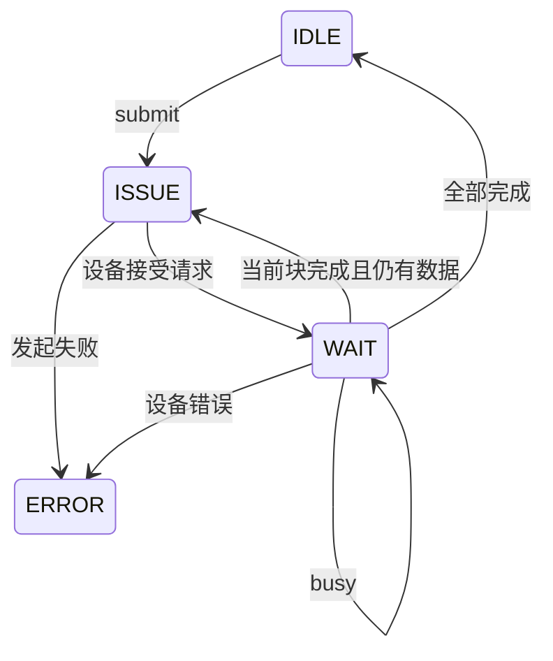

# 异步设备状态机基础

## 1. 学习目标

本文讨论如何把耗时外设操作组织成可周期推进的状态机。重点包括请求提交、busy等待、分块执行、缓冲区生命周期、停止语义和错误处理。

## 2. 为什么不能一直等待

Flash擦除、DMA传输、网络发送和传感器转换可能持续数百微秒到数秒。最直接的写法是：

```c
device_start();
while (device_is_busy())
{
}
```

这种轮询会阻塞通信、看门狗和其他任务。在协作式系统中，任何一个阻塞循环都会扩大所有任务的最坏响应时间。

异步设计把操作拆成两个阶段：

```text
submit：验证并保存请求，快速返回
process：每次推进有限一步，未完成则让出CPU
```

## 3. 最小状态模型

```c
typedef enum
{
    STATE_IDLE = 0,
    STATE_ISSUE,
    STATE_WAIT,
    STATE_ERROR
} state_t;
```



状态名应表达“下一步要做什么”或“正在等待什么”。如果一个状态既发起操作又阻塞到完成，它仍然是同步流程。

## 4. 请求上下文

```c
typedef struct
{
    state_t state;
    uint32_t address;
    uint32_t remaining;
    uint32_t in_flight;
    const uint8_t *write_data;
    int result;
} transfer_t;
```

状态机必须保存恢复执行所需的全部信息。局部变量在`submit()`返回后已经失效，不能承载跨周期进度。

`in_flight`与`remaining`不能混为一个字段：设备busy期间，本次块尚未确认完成，不能提前递增地址或减少剩余长度。

## 5. 提交接口

提交时完成所有不依赖设备进度的检查：

- 上下文和缓冲区非空；
- 当前状态为空闲；
- 地址与长度合法；
- 权限允许；
- 长度为0时直接成功。

```c
int transfer_submit(transfer_t *t,
                    uint32_t address,
                    const uint8_t *data,
                    uint32_t length)
{
    if ((t == NULL) || ((data == NULL) && (length != 0u)))
    {
        return RESULT_BAD_ARGUMENT;
    }
    if (t->state != STATE_IDLE)
    {
        return RESULT_BUSY;
    }
    if (length == 0u)
    {
        return RESULT_OK;
    }

    t->address = address;
    t->remaining = length;
    t->write_data = data;
    t->state = STATE_ISSUE;
    return RESULT_IN_PROGRESS;
}
```

忙时拒绝新请求，不要覆盖旧上下文。

## 6. 发起与完成必须分开记账

```c
case STATE_ISSUE:
    chunk = choose_chunk(t);
    if (device_program(t->address, t->write_data, chunk) != DEVICE_OK)
    {
        fail(t);
        break;
    }
    t->in_flight = chunk;
    t->state = STATE_WAIT;
    break;
```

在设备报告完成后才提交进度：

```c
case STATE_WAIT:
    if (device_state_get() == DEVICE_BUSY)
    {
        break;
    }
    if (device_state_get() == DEVICE_ERROR)
    {
        fail(t);
        break;
    }

    t->address += t->in_flight;
    t->write_data += t->in_flight;
    t->remaining -= t->in_flight;
    t->in_flight = 0u;
    t->state = (t->remaining == 0u) ? STATE_IDLE : STATE_ISSUE;
    break;
```

如果在发起时就修改进度，掉电、超时或设备错误后会把未完成块误记成成功。

## 7. 分块边界

异步状态机经常同时承担请求整形：

- 读取受DMA最大长度限制；
- Flash编程不能跨页；
- 擦除必须以块为单位；
- 通信发送受MTU限制。

页内写块计算：

```text
page_offset = address mod page_size
page_remaining = page_size - page_offset
chunk = min(remaining, page_remaining)
```

分块函数应是纯计算，设备geometry由配置提供。不要在公共状态机中写死256字节页或4KiB扇区。

## 8. 缓冲区生命周期

异步API通常只保存指针，不复制数据。调用方必须保证完成前：

- 写源仍然存在且内容不变；
- 读目标仍然存在且没有被复用；
- 栈上局部缓冲区不会离开作用域；
- DMA所需的对齐和Cache一致性得到满足。

安全做法包括静态缓冲区、对象成员缓冲区，或者由上层事务明确锁定的缓冲池。仅仅“没有动态内存”不能自动解决生命周期问题。

## 9. 同步完成的设备

底层操作可能在函数返回时已经完成。仍可以使用相同异步接口：

- 发起函数返回成功；
- 状态查询立即返回ready；
- 下一次`process()`提交进度。

这样Core无需为同步和异步驱动维护两套流程。代价是至少多一个调度周期，但状态语义一致。

## 10. 停止与取消

不是所有设备操作都能安全取消。Flash正在擦除时切断控制器可能留下不确定内容。

常见停止语义：

```text
空闲时请求停止 → 立即停止
设备操作中请求停止 → 记录stop_requested
当前完整事务完成 → 进入stopped
```

“停止当前请求”和“终止当前硬件命令”是两个不同能力。接口命名和文档必须明确是哪一种。

## 11. 超时与失败

状态机需要考虑设备永远busy：

- 在上下文记录开始tick；
- 使用无符号差值处理计数器回绕；
- 超时后进入错误或恢复状态；
- 不在同一周期中无限重试；
- 重试次数和退避策略由业务风险决定。

错误发生后应保存最后结果，直到上层读取或新事务明确覆盖。状态回到idle并不意味着上一次结果成功。

## 12. 调度周期

周期越短，操作块之间的空隙越小；周期越长，系统响应更平滑但总吞吐下降。设计时分别考虑：

- 单次`process()`最坏执行时间；
- 状态查询开销；
- 设备本身busy时间；
- 通信和看门狗允许的最大延迟；
- 是否允许一次调用推进多个立即完成状态。

“每次只推进有限步骤”比“每次只能执行一个switch case”更本质。可以在有严格上界时连续推进，但不能形成依赖设备响应的无界循环。

## 13. 思考题

1. 为什么进度只能在设备完成后提交？
2. 忙时覆盖旧请求会产生哪些内存和介质问题？
3. 零长度请求是否应该调用底层驱动？
4. 一个同步驱动如何接入异步Core？
5. 停止请求为什么不一定能够取消当前Flash擦除？
