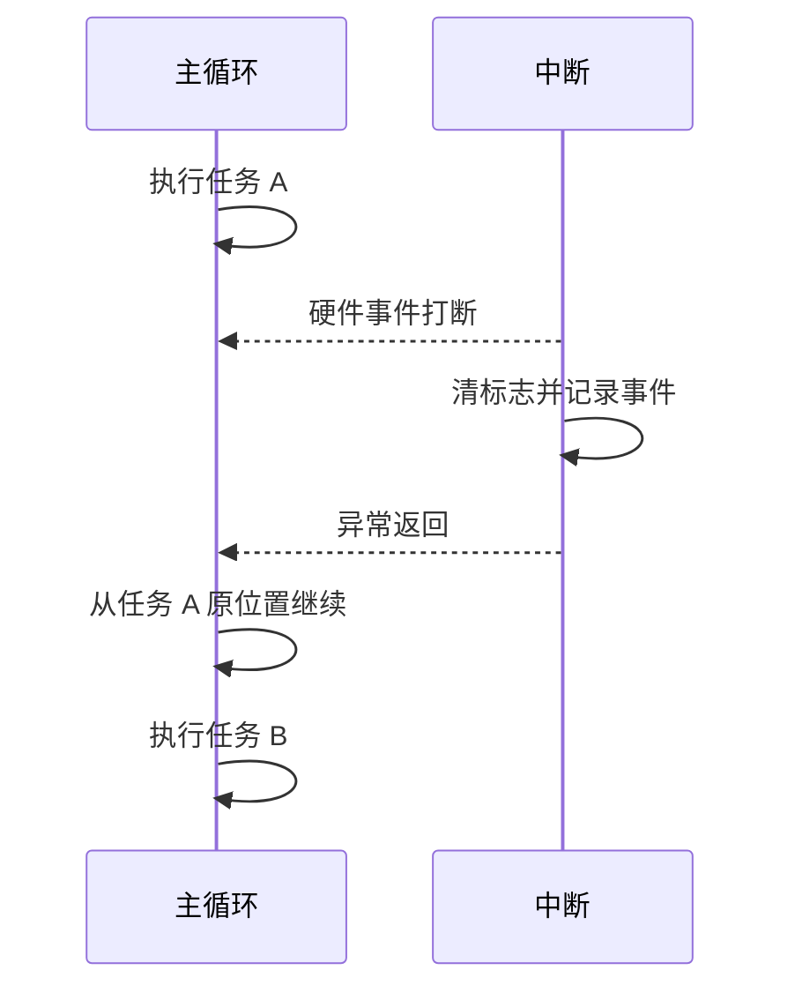
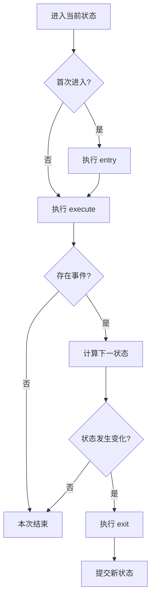
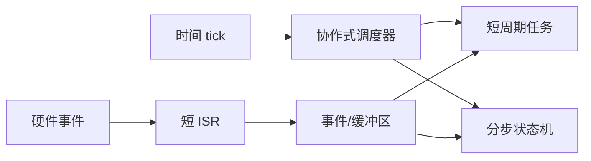

# 裸机调度、中断与状态机基础

## 1. 学习目标

本章建立三个相互关联的基础模型：

- 主循环如何组织周期工作。
- 中断如何处理异步硬件事件。
- 状态机如何把长流程拆成可重复推进的小步骤。

它们共同构成典型前后台系统：中断负责及时响应，主循环负责持续推进业务状态。

## 2. 前后台系统

最简单的裸机程序由初始化、无限主循环和中断组成：

```c
int main(void)
{
    platform_init();

    for (;;)
    {
        sensor_process();
        communication_process();
        control_service_process();
    }
}
```

主循环是后台，中断是前台。中断可以打断后台，后台函数之间不能相互抢占。



这种模型结构简单、内存确定，但任意一个后台函数不返回，后续所有后台工作都会停止。

## 3. 超级循环与协作式调度

超级循环可以进一步抽象为任务表。调度器判断任务是否到期，再调用任务函数：

```c
typedef struct
{
    uint32_t period_ticks;
    uint32_t last_release_tick;
    void (*p_func)(void);
} periodic_task_t;
```

任务之间通过“函数主动返回”共享 CPU，因此称为协作式调度。

协作式调度的关键假设是：

```text
每个任务都必须在可接受时间内返回。
```

如果任务最坏执行时间分别为 $C_1,C_2,\ldots,C_n$，一轮全部任务都执行时，主循环时间近似为：

$$
T_{loop}=\sum_{i=1}^{n}C_i+C_{scheduler}
$$

某个刚到期任务的等待时间，可能包含当前任务剩余执行时间以及排在它前面的其他工作。因此裸机系统的响应能力首先受最长不可中断后台代码段限制。

## 4. tick、周期与执行时间

三个时间概念必须区分：

| 概念 | 含义 |
| --- | --- |
| tick | 软件时间的最小计数单位 |
| 周期 $T$ | 任务两次释放之间的目标间隔 |
| 执行时间 $C$ | 任务一次运行实际占用 CPU 的时间 |

任务周期为 10 ms，不代表它一定在第 10 ms 的瞬间开始，也不代表它会在 10 ms 内完成。

常见时间关系为：

$$
R = J + W + C
$$

其中：

- $J$ 是释放抖动。
- $W$ 是等待其他任务的时间。
- $C$ 是自身执行时间。
- $R$ 是从应当释放到执行完成的响应时间。

只有满足截止期约束 $R \le D$，任务才在该工况下满足实时要求。

## 5. 无符号时间差与回绕

固定宽度无符号计数器最终会回绕。正确的到期判断通常使用差值：

```c
static uint32_t task_is_due(uint32_t now,
                            uint32_t last,
                            uint32_t period)
{
    uint32_t due = 0u;

    if ((uint32_t)(now - last) >= period)
    {
        due = 1u;
    }

    return due;
}
```

无符号整数按模 $2^N$ 运算。只要被比较的真实时间间隔小于计数器范围，回绕前后的差值仍然正确。

不要使用 `now >= last + period`。`last + period` 自身可能溢出，并在回绕附近给出错误结果。

## 6. 周期漂移与补偿

任务执行完成后把当前时间作为下一次基准：

```text
last = now
```

会把调度延迟不断累积到后续周期，形成漂移。

保持绝对周期的方法是：

```text
last = last + period
```

如果系统一次跨过多个周期，可以计算：

$$
k=\left\lfloor\frac{now-last}{period}\right\rfloor
$$

然后更新：

$$
last=last+k\cdot period
$$

这会跳过已经错过的历史释放点，避免系统恢复后连续补执行大量过期任务。是否允许跳过，取决于业务语义：控制采样通常使用最新数据，计费脉冲等累计事件则不能简单丢弃。

## 7. 任务超期

当任务执行时间接近或超过周期时，会出现：

- 后续任务响应延迟增加。
- 同一任务再次到期时上一次仍未完成。
- 主循环负载接近或超过 100%。
- 通信缓冲积压或看门狗无法及时喂狗。

周期利用率可以粗略估算为：

$$
U=\sum_{i=1}^{n}\frac{C_i}{T_i}
$$

即使 $U<1$，协作式系统仍可能因为某个单次任务过长而违反短任务截止期。平均负载不能代替最坏响应时间分析。

## 8. 在普通任务中分阶段推进长流程

等待硬件完成的流程不应忙等：

```c
while (flash_is_busy() == 1u)
{
}
```

可以把流程状态保存在静态上下文中，由普通周期任务每次只推进一个阶段：

```c
typedef enum
{
    UPDATE_STATE_IDLE_E = 0,
    UPDATE_STATE_ERASE_WAIT_E,
    UPDATE_STATE_PROGRAM_WAIT_E,
    UPDATE_STATE_DONE_E,
} update_state_t;

typedef struct
{
    update_state_t state;
    uint32_t offset;
} update_context_t;

static void update_process(update_context_t *p_context)
{
    switch (p_context->state)
    {
        case UPDATE_STATE_IDLE_E:
            flash_erase_start();
            p_context->state = UPDATE_STATE_ERASE_WAIT_E;
            break;

        case UPDATE_STATE_ERASE_WAIT_E:
            if (flash_is_busy() == 0u)
            {
                flash_program_start(p_context->offset);
                p_context->state = UPDATE_STATE_PROGRAM_WAIT_E;
            }
            break;

        case UPDATE_STATE_PROGRAM_WAIT_E:
            if (flash_is_busy() == 0u)
            {
                p_context->state = UPDATE_STATE_DONE_E;
            }
            break;

        case UPDATE_STATE_DONE_E:
            update_result_publish();
            p_context->state = UPDATE_STATE_IDLE_E;
            break;

        default:
            p_context->state = UPDATE_STATE_IDLE_E;
            break;
    }
}
```

这种写法把调用栈中的隐式执行位置转换成结构体中的显式状态。优点是不会长期占用 CPU，代价是状态和中间数据需要明确保存。

## 9. 中断的基本职责

中断用于响应无法等待主循环轮询的硬件事件。典型 ISR 顺序为：

1. 确认中断来源。
2. 清除或应答硬件标志。
3. 读取必须立即保存的数据。
4. 更新最小共享状态或写入缓冲区。
5. 尽快退出。

ISR 中通常不执行：

- 阻塞等待。
- 动态内存分配。
- 大量格式化输出。
- 长时间算法计算。
- 可能再次依赖同一中断完成的操作。

耗时工作应推迟到后台任务，这称为上半部/下半部思想：中断是快速上半部，主循环是可调度下半部。

## 10. `volatile`、原子性与临界区

`volatile` 告诉编译器每次都要真实读取或写入对象，适合硬件寄存器和异步修改的简单状态：

```c
static volatile uint32_t rx_event_count = 0u;
```

但 `volatile` 不保证：

- 复合操作原子化。
- 多个字段保持一致快照。
- 不同处理器核心之间的内存顺序。
- 读改写过程不被中断。

例如 `rx_event_count++` 包含读取、加法和写回。如果任务和中断都修改它，可能丢失更新。

临界区应尽量短：

```c
static uint32_t event_count_take(void)
{
    uint32_t count = 0u;
    uint32_t irq_state = platform_irq_save();

    count = rx_event_count;
    rx_event_count = 0u;
    platform_irq_restore(irq_state);

    return count;
}
```

保存并恢复原中断状态比无条件开中断更安全，因为调用者进入函数前可能已经处于临界区。

## 11. 回调链与软件优先级

一个硬件中断可以分发给多个软件回调。回调按固定顺序执行时，总 ISR 时间为：

$$
C_{ISR}=C_{entry}+\sum C_{callback}+C_{exit}
$$

软件回调优先级只决定同一次分发中的先后，不会产生硬件嵌套抢占。高优先级回调仍要等待当前硬件 ISR 入口和排在它前面的工作。

设计回调链时需要明确：

- 每个回调的最坏执行时间。
- 是否允许访问同一外设。
- 是否要求固定顺序。
- 回调失败是否影响后续回调。
- 回调表能否在中断运行期间修改。

静态回调表最容易分析；运行期修改需要临界区和生命周期管理。

## 12. 有限状态机基础

有限状态机由有限状态集合、事件集合和迁移函数组成：

$$
S_{next}=\delta(S_{current},E)
$$

常见两种模型：

- Moore 型：输出只由当前状态决定。
- Mealy 型：输出由当前状态和输入事件共同决定。

工程中常把一个状态拆成：

- `entry`：首次进入时执行一次。
- `execute`：停留期间周期执行。
- `check`：根据事件计算下一状态。
- `exit`：离开前执行一次。



把新状态的 `entry` 放到下一次调度，可以避免一次调用连续穿越多个状态，使每次推进的执行上界更清晰。

## 13. 表驱动状态机

大量 `switch` 可以改写为状态表：

```c
typedef struct
{
    uint32_t state;
    void (*p_entry)(void);
    void (*p_execute)(void);
    uint32_t (*p_check)(uint32_t event);
    void (*p_exit)(void);
} state_entry_t;
```

表驱动的优点：

- 状态与处理函数关系集中可见。
- 添加状态主要修改数据表。
- 执行器可以复用。
- 便于自动检查重复状态和缺失函数。

代价是函数指针调用增加间接性，调试器调用栈不如直接 `switch` 直观，状态查找还需要考虑线性扫描或索引表的成本。

## 14. 前后台系统的组合



这个组合的核心边界是：

- 中断负责及时捕获事实。
- 调度器负责决定何时执行后台工作。
- 状态机负责让长流程每次只推进有限步骤。

## 15. 优缺点

| 方面 | 优点 | 代价 |
| --- | --- | --- |
| 执行模型 | 调用关系简单，调试直观 | 长任务会阻塞所有后续后台任务 |
| 内存 | 不需要每任务独立栈 | 中间流程需要显式状态保存 |
| 时序 | 静态任务容易估算 | 响应时间受最长协作代码段影响 |
| 中断 | 能快速响应硬件 | ISR 过长会扩大整个系统中断延迟 |
| 状态机 | 非阻塞、易控制步骤边界 | 状态数量增加后维护成本上升 |

## 16. 实验与思考题

建议实验：

1. 建立 1 ms、5 ms 和 10 ms 三个任务，记录实际启动间隔。
2. 在 10 ms 任务中加入 4 ms 忙等，观察短任务抖动。
3. 把忙等改成分步状态机，再次测量。
4. 将 32 位 tick 初始化到最大值附近，验证回绕判断。
5. 在 ISR 和任务间传递一个多字段对象，比较无保护和临界区快照。

思考题：

1. CPU 平均负载只有 30%，为什么 1 ms 任务仍可能超时？
2. 为什么 `volatile` 不能替代临界区？
3. 状态机中事件在何时清除最安全？
4. 同一优先级回调依赖注册顺序会带来什么维护风险？
5. 哪些业务事件可以合并，哪些事件必须计数保存？
