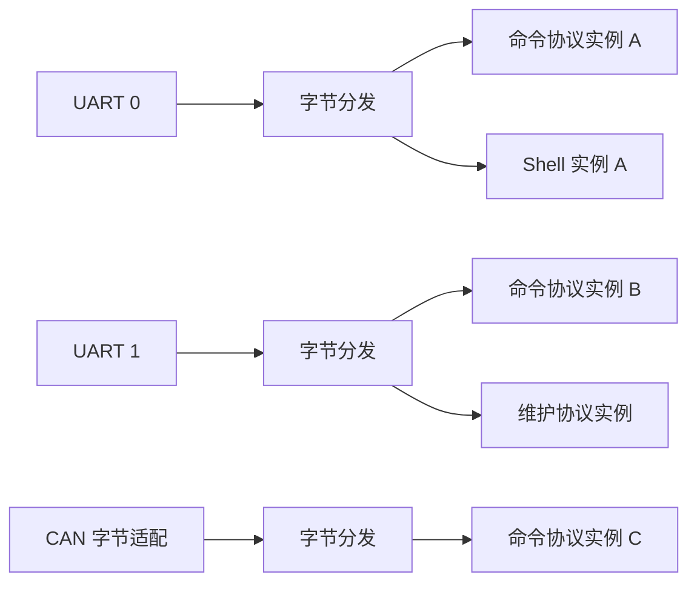
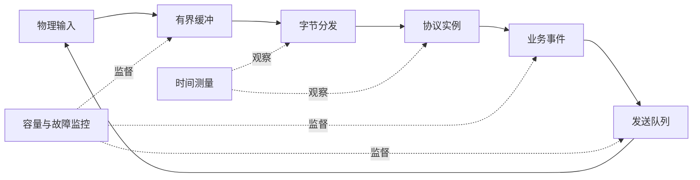

# 嵌入式通信分发、性能与可靠性基础

## 1. 学习目标

本章讨论裸机系统中三个容易相互影响的领域：

- 字节如何从物理链路进入不同协议解析器。
- 如何测量任务和中断的真实时间行为。
- 如何通过容量、边界和故障策略保证系统长期运行。

重点是通用的数据流与工程分析方法，不限定具体通信协议。

## 2. 物理链路与协议分层

物理链路回答“字节从哪里来、向哪里发”，协议回答“这些字节表示什么”。

```text
UART / CAN / USB / SPI
          ↓
接收缓冲与字节提取
          ↓
协议解析状态机
          ↓
命令、数据或事件
          ↓
业务处理
```

把物理链路和协议解析分离后：

- 同一协议可以运行在不同链路上。
- 同一链路可以承载多个协议。
- 驱动变化不会迫使协议重新实现。
- 协议测试可以使用内存字节流，不依赖真实硬件。

## 3. 字节流不是数据帧

串口和许多 DMA 接口提供的是连续字节流。一次读取可能得到：

- 半个帧。
- 一个完整帧。
- 多个连续帧。
- 上一个帧的尾部加下一个帧的头部。

协议解析器必须跨调用保存状态：

```c
typedef struct
{
    uint8_t buffer[128];
    uint16_t length;
    uint16_t expected_length;
    uint8_t state;
} parser_context_t;
```

每收到一个字节或一段数据，就推进解析状态。不能假设驱动读取边界等于协议帧边界。

解析过程通常包括：

1. 搜索帧头。
2. 读取长度和类型。
3. 检查长度是否超过本地容量。
4. 收集剩余字段。
5. 校验 CRC 或校验和。
6. 提交完整帧。
7. 错误时重新同步。

外部长度字段在参与数组访问前必须验证。

## 4. 解析函数与上下文

同一解析函数可以绑定多个上下文：

```c
typedef void (*byte_handler_f)(uint8_t data, void *p_context);

typedef struct
{
    byte_handler_f p_handler;
    void *p_context;
} handler_binding_t;
```

函数表示规则，上下文表示某个协议实例的持续状态。

如果两个物理链路共用一个全局解析上下文，它们的字节会互相污染。因此“复用代码”不等于“复用状态”。可重入设计要求每个并发协议实例拥有独立上下文，或者由更高层明确串行化访问。

## 5. 多链路与多协议组合

物理链路和协议可以形成交叉绑定：



组合关系最好由静态绑定表表达。每条连接都应明确：

- 接收来源。
- 解析函数。
- 独立上下文。
- 响应发送接口。
- 调度预算和错误策略。

## 6. 同步扇出与责任链

把同一个字节依次送给多个解析器称为同步扇出：

```c
static void byte_dispatch(uint8_t data,
                          const handler_binding_t *p_handlers,
                          uint16_t handler_count)
{
    for (uint16_t index = 0u; index < handler_count; ++index)
    {
        if (p_handlers[index].p_handler != NULL)
        {
            p_handlers[index].p_handler(data,
                                        p_handlers[index].p_context);
        }
    }
}
```

扇出表示所有 handler 都观察该字节。责任链则允许某个 handler 声明“已经消费”，后续 handler 不再接收。两种模型的语义不同：

| 模型 | 适合场景 | 风险 |
| --- | --- | --- |
| 同步扇出 | 多个协议独立观察同一数据 | 总执行时间为所有 handler 之和 |
| 责任链 | 协议互斥、按顺序识别 | 顺序会影响结果，前级可能吞掉数据 |

## 7. 接收缓冲与环形队列

中断或 DMA 生产数据，主循环消费数据时，常用单生产者单消费者环形缓冲区。

容量为 $N$ 的缓冲区通常维护 head 和 tail：

```text
生产者写入 buffer[head]，再推进 head
消费者读取 buffer[tail]，再推进 tail
```

设计必须明确：

- head 与 tail 分别由谁写。
- 满和空如何区分。
- 索引回绕是否依赖 2 的幂容量。
- 缓冲区满时丢新数据、丢旧数据还是停止接收。
- DMA 写指针如何形成一致快照。

如果保留一个空槽区分满和空，可用容量是 $N-1$。如果额外维护计数，则读写计数本身需要原子性保护。

## 8. 背压与处理预算

设输入平均速率为 $\lambda_{in}$，后台长期处理速率为 $\lambda_{out}$。稳定运行至少需要：

$$
\lambda_{out} > \lambda_{in}
$$

但平均速率足够仍不能保证不溢出。突发数据量 $B$ 和最长服务空窗 $T_{gap}$ 共同决定缓冲需求：

$$
Capacity \ge B + \lambda_{in}T_{gap}
$$

同步扇出时，每字节处理成本近似为：

$$
C_{byte}=C_{read}+\sum_{i=1}^{m}C_{handler,i}
$$

链路数量、协议数量和最坏输入速率必须一起计算，不能只测试空闲通信状态。

## 9. 发送所有权

多个模块共享发送链路时，需要明确：

- 谁拥有发送缓冲区。
- 异步 DMA 完成前数据是否保持有效。
- 多个发送请求如何排队。
- 高优先级告警是否能插队。
- 队列满时调用者得到什么结果。

最危险的错误是把函数局部数组交给异步 DMA，然后函数返回导致生命周期结束。

可靠接口通常选择一种所有权模型：

1. 驱动立即复制数据。
2. 调用者持有数据直到完成回调。
3. 调用者从驱动池申请缓冲区，发送完成后归还。

接口必须明确使用哪一种，不能依赖调用者猜测。

## 10. 性能测量的基本量

嵌入式时间行为至少包括：

| 指标 | 定义 |
| --- | --- |
| 执行时间 $C$ | 一次函数实际占用 CPU 的时间 |
| 周期 $T$ | 两次目标释放之间的间隔 |
| 实际启动间隔 | 相邻两次真实开始时间之差 |
| 响应时间 $R$ | 从事件或释放到处理完成的时间 |
| 抖动 $J$ | 实际时刻相对目标时刻的变化 |
| CPU负载 $U$ | 统计窗口内忙时间占比 |

最近值能反映当前状态，峰值用于容量判断，平均值用于趋势分析。只记录平均值会隐藏偶发的最坏情况。

## 11. 插桩边界

最简单的执行时间测量为：

```c
uint32_t start_count = performance_counter_get();
target_function();
uint32_t elapsed_count = performance_counter_get() - start_count;
```

需要先定义“测量什么”：

- 只测用户函数。
- 测整个调度过程。
- 包含中断占用时间。
- 扣除中断占用时间。

不同边界回答不同问题。若要估算任务自身算法成本，应扣除任务执行期间的中断时间；若要分析从开始到结束的墙钟延迟，则应包含中断干扰。

## 12. 测量扰动

测量代码也消耗时间，称为观察者效应。误差来源包括：

- 读取计数器的开销。
- 记录结构体的写入开销。
- 中断在两次读数之间发生。
- 计数器频率换算和回绕。
- 输出日志改变原系统时序。

减少扰动的方法：

- 使用自由运行硬件计数器。
- 热路径只记录原始整数。
- 后台再换算单位和输出。
- 先测量空插桩开销。
- 用编译期开关完全移除不需要的测量路径。

## 13. 最坏执行时间与负载

平均执行时间不能证明实时安全。需要关注：

- 不同输入数据导致的最长路径。
- Cache、Flash wait state 和总线竞争。
- 中断嵌套。
- DMA 与 CPU 争用存储器。
- 首次执行和稳定执行的差异。

统计峰值是已经观察到的最大值，不等于数学上的 WCET。工程上通常将静态分析、压力工况测量和安全裕量结合使用。

周期任务的测量负载可估算为：

$$
U_i=\frac{C_i}{T_i}
$$

系统总负载还需要加入中断、通信解析、调度器和测量本身的开销。

## 14. 静态内存与容量上界

裸机系统常使用固定大小数组和静态对象。优点是：

- 启动后不产生堆碎片。
- 内存上界可以从链接 map 中检查。
- 分配失败点集中在设计阶段。
- 对象地址和生命周期稳定。

代价是容量不足时不能自动扩展，容量过大又会浪费 RAM。因此应同时维护：

- 当前使用量。
- 历史高水位。
- 溢出次数。
- 最后一次溢出来源。

容量设计不是“永远不会满”的假设，而是“满时行为明确且可观测”。

## 15. 故障策略

资源不足或输入非法时，常见策略包括：

| 策略 | 行为 | 适用情况 |
| --- | --- | --- |
| 拒绝 | 返回错误，不改变已有状态 | 新请求可以安全失败 |
| 丢弃 | 丢新数据或旧数据并计数 | 允许数据损失的遥测流 |
| 降级 | 关闭非关键功能，保留核心控制 | 功能可分级系统 |
| 重试 | 在有上限和退避条件下再次尝试 | 瞬态外设错误 |
| 复位 | 保存原因后由看门狗恢复 | 状态无法证明安全 |
| 停机 | 保持安全输出并等待外部处理 | 错误恢复可能扩大风险 |

重试必须有次数、时间或状态边界。无限重试会把可诊断故障变成永久卡死。

## 16. 断言、错误返回与故障记录

三种机制的用途不同：

- 断言：发现理论上不应发生的内部不变量破坏。
- 错误返回：处理可能发生的外部输入或资源失败。
- 故障记录：在系统停止或复位前保留证据。

有价值的故障记录通常包括：

- 故障类型和首次发生时间。
- 当前运行模块或状态。
- 相关索引、长度和容量。
- 最近一次有效命令或事件。
- 计数器、高水位和重试次数。

故障路径本身也必须简单，避免依赖已经损坏的通信、堆或复杂格式化输出。

## 17. 看门狗与存活性

喂看门狗不应只证明“某段代码仍在运行”，而应证明关键功能在规定时间内都取得进展。

可以为关键服务维护心跳：

```text
采样任务推进
通信任务推进
状态机推进
关键输出处于允许状态
        ↓
统一监督器满足全部条件后喂狗
```

如果死循环任务自己持续喂狗，看门狗无法发现系统其他部分已经饿死。

存活监控还应区分：

- 任务被调用过。
- 任务成功完成过。
- 任务的业务进度真正发生变化。

## 18. 综合数据流



可靠系统需要同时看数据正确性、处理速率和故障行为。协议解析正确但处理速度不足，仍会因缓冲溢出丢数据；性能足够但长度验证缺失，仍会因异常输入破坏内存。

## 19. 实验与思考题

建议实验：

1. 用随机长度分片向解析器输入多帧数据，确认帧边界与读取边界无关。
2. 为同一解析函数建立两个上下文，交叉输入字节并验证互不污染。
3. 增加 handler 数量，测量每字节分发时间的增长。
4. 制造突发输入，记录环形缓冲高水位和溢出次数。
5. 分别测量包含和扣除中断后的任务执行时间。
6. 故意减小缓冲容量，验证满策略和故障记录。
7. 让一个任务停止业务推进但继续运行，检查普通喂狗和进度监督的差异。

思考题：

1. 为什么一个协议函数可重入，不代表使用一个全局上下文也是安全的？
2. 同步扇出在什么情况下会使通信接收饿死其他任务？
3. 平均输入速率小于处理速率，为什么缓冲区仍可能溢出？
4. 统计到的最大执行时间为什么不能直接称为 WCET？
5. 丢旧数据和丢新数据分别适合什么业务？
6. 看门狗复位前最少应保存哪些证据？
