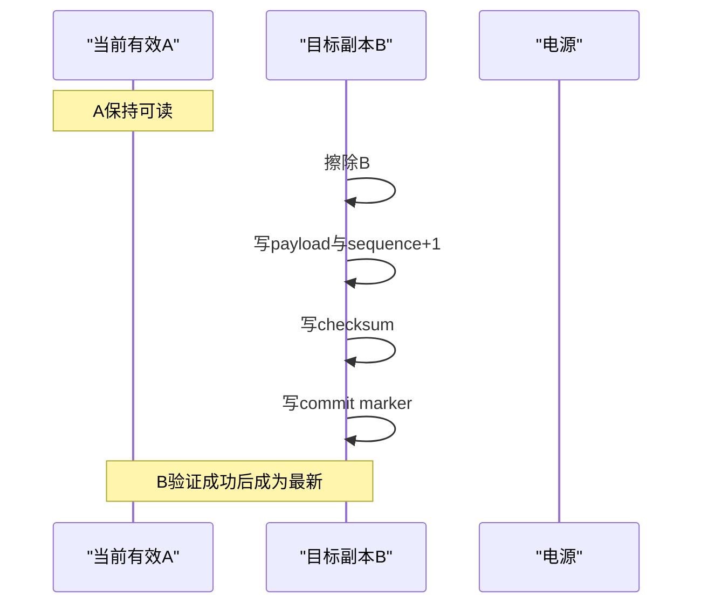

# 掉电安全持久化基础

## 1. 学习目标

本文介绍嵌入式系统在任意写入时刻掉电时，如何让下次启动仍能判断数据是否有效、哪一份更新、事务进行到哪里。内容适用于参数、升级状态、日志索引等小型持久化记录。

## 2. 掉电问题的本质

非易失存储的写入不是原子操作。一次看似简单的结构体保存，实际可能经历：

```text
擦除块 → 写字段1 → 写字段2 → 写校验 → 写完成标志
```

电源可能在任意箭头处消失。下次启动看到的内容可能是：

- 旧数据；
- 全擦除值；
- 新旧位混合；
- 字段完整但校验未写；
- 校验完整但业务动作尚未完成。

掉电安全的目标不是保证“总能得到最新数据”，而是保证能够区分有效旧状态、有效新状态和无效中间状态。

## 3. 有效记录的组成

一条可判定记录通常包含：

```text
magic
format_version
business_state
sequence
payload
checksum
commit_marker
```

- `magic`过滤空白区和其他数据。
- `format_version`决定解码方式。
- `business_state`说明事务阶段。
- `sequence`比较多个有效副本的新旧。
- `checksum`检测部分写入和随机损坏。
- `commit_marker`表示记录已经完成提交。

只有全部条件同时满足，记录才有效。不能只检查magic或只检查checksum。

## 4. 提交标记最后写

提交顺序应让“有效”成为最后发生的状态变化：

```text
写入数据主体
  → 写入校验
  → 最后写入commit marker
```

如果存储器只能把位从1写成0，提交标记应选择能从擦除态单向变成有效态的值。不能依赖再次把0写回1。

即使提交标记存在，仍应验证checksum。介质损坏可能偶然保留标记，但破坏其他字段。

## 5. 双副本交替提交

单副本更新通常要先擦除旧记录，此时掉电会同时失去旧状态和新状态。双副本使用A/B交替：



在B提交完成前，A始终保留。任何中途掉电最多使B无效，不会破坏A。下一次更新再擦除A。

## 6. 如何选择较新记录

简单比较`a > b`在序号回绕后失效。固定宽度无符号序号可以使用模运算关系：

```c
static uint8_t sequence_is_newer(uint32_t a, uint32_t b)
{
    return ((int32_t)(a - b) > 0) ? 1u : 0u;
}
```

这个方法要求两个候选序号之间的真实距离小于序号空间的一半。对交替写入的双副本，这一条件通常成立。

若只有一个副本有效，直接选择该副本；两个都无效时，系统必须进入独立恢复策略，不能构造一个“看起来合理”的默认进度继续破坏性操作。

## 7. 持久化状态机

记录最终结果往往不够。长事务需要记录阶段和进度：

```text
EMPTY
  → PREPARING
  → COMMITTED_INPUT
  → APPLYING(offset)
  → VALID
```

启动恢复依据状态决定：

- `PREPARING`：输入不完整，丢弃并等待重来；
- `COMMITTED_INPUT`：输入完整，可以重新开始应用；
- `APPLYING(offset)`：从安全边界继续，或重新执行幂等步骤；
- `VALID`：最终对象可以使用。

关键问题不是“保存多少进度”，而是保存后的进度是否对应一个已经完成、可重复验证的边界。

## 8. 幂等恢复

恢复动作最好可以重复执行：

- 重复擦除同一目标块；
- 从可信源重新复制完整块；
- 写后读回确认；
- 成功后再提交下一进度。

如果一个步骤执行一半后无法判断结果，恢复时应从该步骤的安全起点重做，而不是假设它已经完成。

## 9. 数据完整与业务有效不同

checksum正确只表示记录字节一致，不表示业务一定可接受。例如：

- 长度超过目标容量；
- 状态枚举超出已知范围；
- 版本无法解析；
- offset不满足块对齐；
- 模块身份错误。

解码过程应先验证格式完整，再验证每个业务约束。未知状态不能默认为某个安全状态后继续写介质。

## 10. CRC、哈希和签名

- CRC适合检测随机传输或介质错误，不提供身份认证。
- 哈希适合证明大数据内容一致，但不能阻止攻击者替换数据和哈希。
- 数字签名用于验证发布者身份和内容未被恶意修改。

掉电原子性与安全启动认证是两个维度。双副本和commit marker解决“写到一半”，签名解决“数据由谁发布”。一个系统可能需要同时具备两者。

## 11. 擦写寿命

每处理一个小数据包就提交整块元数据，会快速消耗擦除寿命。设计时考虑：

- 只在不可重新推导的关键阶段提交；
- 复制进度按较大安全块提交；
- 使用多槽轮转而非固定A/B；
- 根据器件寿命估算最坏升级或保存次数；
- 元数据区故障时停止自动反复擦写。

可靠性不能只看单次掉电恢复，还要看长期重复恢复是否伤害介质。

## 12. 保留SRAM事务

跨软件复位传递少量请求时，可以使用不初始化SRAM：

1. 先写业务字段。
2. 计算并写checksum。
3. 最后写magic。
4. 复位后先检查magic和checksum。
5. 消费后清除magic，防止重复处理。

SRAM方案不承受完全掉电，只承受保持供电的软件复位。链接脚本和启动代码必须保证该区域不被清零，也不能与栈、堆或DMA缓冲区重叠。

## 13. 验证方法

掉电安全不能只验证正常路径。应在每个持久化动作前后模拟复位：

- 擦除前、擦除后；
- 每个字段写入中间；
- checksum前后；
- commit marker前后；
- 业务动作完成但进度尚未提交；
- 新记录提交后旧记录尚未轮换。

每个注入点都应满足以下之一：

- 启动选择旧的有效状态；
- 启动选择新的有效状态；
- 无法证明有效，进入安全等待。

绝不能出现“选择了半写入状态并继续执行破坏性动作”。

## 14. 思考题

1. 为什么只有CRC而没有commit marker仍可能误判？
2. 为什么新副本验证成功前不能擦除旧副本？
3. 复制进度应该在发起写入时还是读回成功后提交？
4. 双副本序号回绕时如何判断新旧？
5. 保留SRAM请求为什么不能代替非易失元数据？
