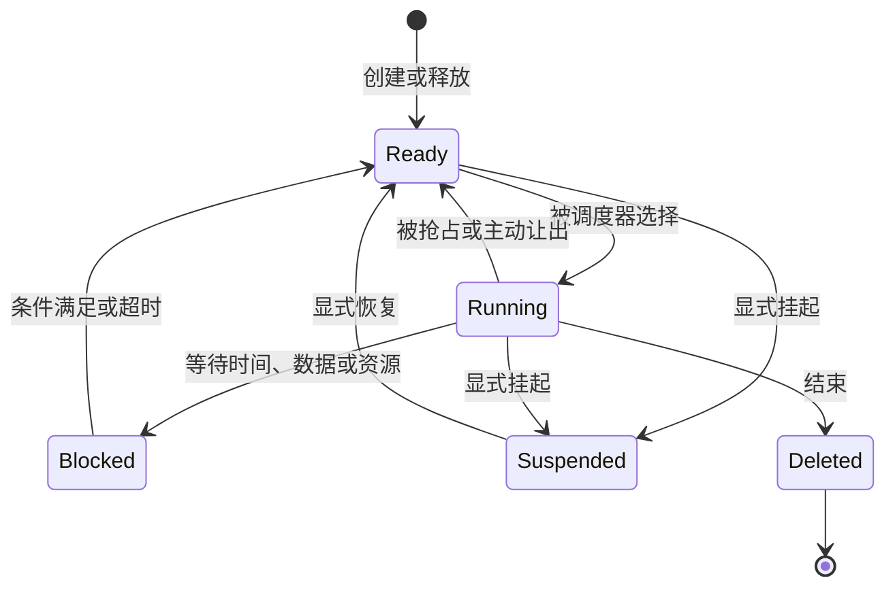
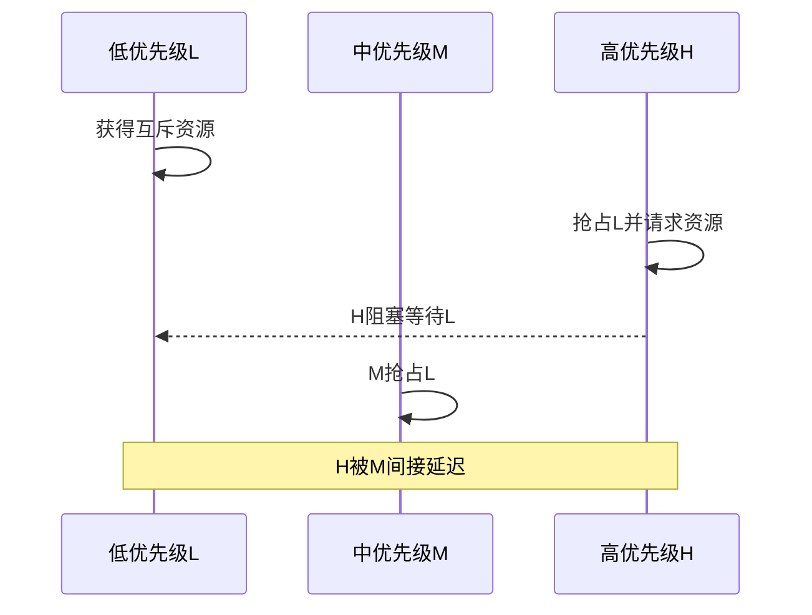

# 实时任务与调度基础

## 1. 实时系统关注什么

普通软件常关注平均吞吐量，实时系统更关注结果能否在规定时间内产生。一次计算即使结果正确，超过截止期后才完成，也可能被判定为失败。

实时性不等于“运行得快”，而是时间行为可以描述、测量和验证。

实时任务常用以下参数描述：

| 符号 | 含义 |
| --- | --- |
| $T_i$ | 任务周期或最小到达间隔 |
| $C_i$ | 最坏执行时间 |
| $D_i$ | 相对截止期 |
| $J_i$ | 释放抖动 |
| $B_i$ | 由共享资源产生的阻塞时间 |
| $R_i$ | 最坏响应时间 |

任务满足实时要求的基本条件是：

$$
R_i \le D_i
$$

## 2. 任务和任务实例

任务描述一类持续存在的工作，任务实例表示它在某次释放后需要完成的一次执行。

例如一个 1 ms 采样任务每秒产生 1000 个任务实例。任务的代码相同，但每个实例都有自己的释放时间和截止时间。

按照到达方式可以分为：

- 周期任务：以固定周期释放。
- 偶发任务：到达时间不固定，但存在最小到达间隔。
- 非周期任务：到达规律未知，通常用于人机交互和维护工作。

按照时间约束可以分为：

- 硬实时：错过截止期可能造成不可接受后果。
- 固实时：超时结果没有价值，但偶发超时不会破坏安全。
- 软实时：超时降低质量，但结果仍可使用。

任务分类决定调度和故障策略。硬实时控制不能只依赖平均执行时间，维护日志则可以容忍排队和丢弃。

## 3. 从超级循环到抢占调度

### 3.1 超级循环

超级循环按固定顺序调用函数：

```text
任务 A → 任务 B → 任务 C → 再次从 A 开始
```

它没有独立任务状态，任何函数不返回都会阻塞后续工作。优点是调用关系直接、内存少、调试简单。

### 3.2 协作式调度

协作式调度增加了任务周期和就绪判断，但任务仍通过主动返回释放 CPU。

它的主要时序边界是最长不可让出的代码段。短周期任务可能等待当前长任务完成，即使系统平均负载很低也可能超时。

### 3.3 抢占式调度

抢占式调度能够暂停当前任务，保存执行现场，再恢复另一个任务。高紧迫性工作不需要等待低紧迫性任务主动返回。

抢占改善响应能力，同时引入：

- 上下文切换开销。
- 多个任务交错执行产生的竞态。
- 独立栈或现场存储需求。
- 临界区和同步对象。
- 更复杂的最坏时序分析。

## 4. 任务状态模型

典型状态如下：



各状态含义：

- Ready：具备运行条件，只缺少 CPU。
- Running：当前正在使用 CPU。
- Blocked：等待条件尚未满足，即使 CPU 空闲也不能运行。
- Suspended：被管理逻辑显式停用。

Ready 与 Blocked 的区分很重要。Blocked 任务不应被调度器反复轮询；事件发生或超时后，它才重新进入 Ready。

## 5. 调度器的基本问题

调度器需要回答：

1. 当前有哪些 Ready 任务？
2. 哪个任务最应该运行？
3. 什么事件会触发重新选择？
4. 相同紧迫性的任务如何共享 CPU？
5. 如何避免某类任务永久得不到执行？

调度策略由“选择规则”和“抢占规则”共同组成。选择规则决定下一个任务，抢占规则决定何时允许替换当前任务。

## 6. FIFO与时间片轮转

FIFO按照进入 Ready 队列的先后运行。规则简单，但前面的长任务会增加后续任务等待时间。

时间片轮转为同一组任务分配最大连续运行时间：

```text
A运行一个时间片 → B运行一个时间片 → C运行一个时间片 → A继续
```

时间片的取舍：

- 太长：响应接近FIFO，短任务等待增加。
- 太短：切换频繁，CPU耗费在调度上。
- 没有竞争者时：通常让当前任务继续，避免无意义切换。

时间片保证的是获得调度机会，不保证任务在一个时间片内完成。

## 7. 固定优先级抢占

固定优先级系统始终运行最高优先级Ready任务。更高优先级任务就绪时，可以抢占当前任务。

优先级应表达时间紧迫性，而不是模块名称或主观重要程度。两种经典分配方法是：

- 速率单调：周期越短，优先级越高。
- 截止期单调：相对截止期越短，优先级越高。

对于周期等于截止期、任务相互独立的经典模型，$n$ 个速率单调任务的充分利用率界为：

$$
U=\sum_{i=1}^{n}\frac{C_i}{T_i}
\le n\left(2^{1/n}-1\right)
$$

当 $n\rightarrow\infty$ 时，右侧趋近：

$$
\ln 2\approx0.693
$$

超过该界不代表一定不可调度，只表示这个简单充分条件不能证明它可调度。

## 8. 最早截止期优先

EDF按照绝对截止期选择任务：截止时间越早，调度优先级越高。

在理想单核、可抢占、任务独立且截止期等于周期的模型中，EDF可以在：

$$
\sum\frac{C_i}{T_i}\le1
$$

时实现可调度。

EDF利用率高，但运行期优先级不断变化，队列维护、过载行为和调试分析通常比固定优先级复杂。实际系统还必须加入中断、阻塞和调度开销。

## 9. 响应时间分析

固定优先级任务 $i$ 的响应时间可以迭代计算：

$$
R_i^{(k+1)}=C_i+B_i+\sum_{j\in hp(i)}
\left\lceil\frac{R_i^{(k)}+J_j}{T_j}\right\rceil C_j
$$

其中 $hp(i)$ 表示所有高于任务 $i$ 的任务。

计算步骤：

1. 取初值 $R_i^{(0)}=C_i+B_i$。
2. 计算一次高优先级干扰。
3. 将结果代回公式继续迭代。
4. 结果不再变化时得到响应时间上界。
5. 如果中途超过 $D_i$，则该任务无法通过此分析。

示例：

| 任务 | $T$ | $C$ | 优先级 |
| --- | ---: | ---: | --- |
| A | 5 ms | 1 ms | 高 |
| B | 10 ms | 2 ms | 低 |

忽略阻塞和抖动，任务B从 $R_B^{(0)}=2$ ms开始：

$$
R_B^{(1)}=2+\left\lceil\frac{2}{5}\right\rceil\cdot1=3\text{ ms}
$$

再次迭代仍为3 ms，因此 $R_B=3$ ms，小于10 ms截止期。

## 10. 公平性与饥饿

实时调度不一定公平。只要高优先级任务持续Ready，低优先级任务可能长期得不到运行，这称为饥饿。

常用平衡方法：

- 为同优先级任务使用时间片。
- 限制连续选择某类任务的次数。
- 使用老化机制逐步提升等待任务的机会。
- 为后台工作预留服务器预算。
- 控制高优先级任务的最坏执行时间和到达速率。

公平性提高吞吐与进度保证，但可能降低高紧迫任务的最快响应速度。设计必须说明偏向实时性还是偏向公平性。

## 11. 阻塞和忙等待

忙等待任务持续占用CPU检查条件：

```text
while 条件未满足：重复检查
```

阻塞等待把任务移出Ready队列，条件满足后再唤醒。阻塞能节省CPU，但需要内核维护等待对象、超时和唤醒竞争。

对硬件异步操作，常见路径为：

```text
任务启动操作 → 任务阻塞 → 中断报告完成 → 任务重新Ready
```

任何阻塞都应考虑超时。没有超时的等待会把外设故障变成永久任务挂起。

## 12. 优先级反转

高优先级任务等待低优先级任务持有的互斥资源时发生优先级反转。如果中优先级任务不断抢占低优先级持有者，高优先级任务会间接等待中优先级任务。



常见解决方法：

- 优先级继承：低优先级持有者临时继承最高等待者优先级。
- 优先级上限：资源预先配置上限，获取资源时提升任务优先级。
- 缩短临界区：减少不可避免的阻塞时间。
- 消除共享：改用消息传递或单一所有者任务。

## 13. tick、周期唤醒与tickless

周期tick实现简单，但每个tick都会产生中断开销。tick粒度还限制延时分辨率。

周期任务应使用绝对唤醒基准：

$$
t_{next}=t_{previous}+T
$$

而不是在任务完成后重新延时一个周期，否则执行时间和调度延迟会累积成漂移。

tickless系统在空闲时计算最近到期事件，配置一次性定时器并休眠。它能降低空闲功耗，但需要处理定时器范围、唤醒补偿和多个到期事件。

无符号计数器回绕时，使用：

```c
if ((uint32_t)(now - last) >= period)
{
    task_release();
}
```

## 14. 任务过载与截止期错过

当需求超过处理能力时，系统必须有明确策略：

- 跳过过期实例，只处理最新状态。
- 保留累计次数，后续逐步补偿。
- 降低非关键任务频率。
- 丢弃低价值数据。
- 进入降级或安全状态。

控制任务通常关心最新采样，日志任务可能允许丢弃，而计量事件通常必须累计。不能用一种超期策略处理所有任务。

## 15. 调度方案比较

| 方法 | 主要优势 | 主要限制 |
| --- | --- | --- |
| 超级循环 | 极简、内存少 | 长函数阻塞全部后台工作 |
| 协作式周期调度 | 周期清晰、容易移植 | 响应受最长不让出代码段限制 |
| FIFO | 顺序直观 | 队首长任务造成延迟 |
| 时间片轮转 | 同组任务获得公平机会 | 缺少明确截止期优先关系 |
| 固定优先级抢占 | 易做响应时间分析 | 需要解决阻塞和优先级反转 |
| EDF | 理论利用率高 | 动态优先级和过载行为更复杂 |

## 16. 实验和思考题

建议实验：

1. 建立三个周期任务，测量执行时间、启动间隔和响应时间。
2. 增加一个长低优先级任务，观察协作式与抢占式响应差异。
3. 调整时间片，绘制切换次数与最大等待时间的关系。
4. 制造互斥资源竞争，观察优先级反转和继承效果。
5. 在计数器回绕附近验证周期释放。

思考题：

1. CPU利用率低于100%，为什么任务仍可能错过截止期？
2. 时间片越短是否一定越实时？
3. Ready与Blocked混在一个轮询表中会带来什么开销？
4. 为什么优先级不能只按“功能重要程度”分配？
5. 哪些任务适合跳过过期实例，哪些任务必须累计？
