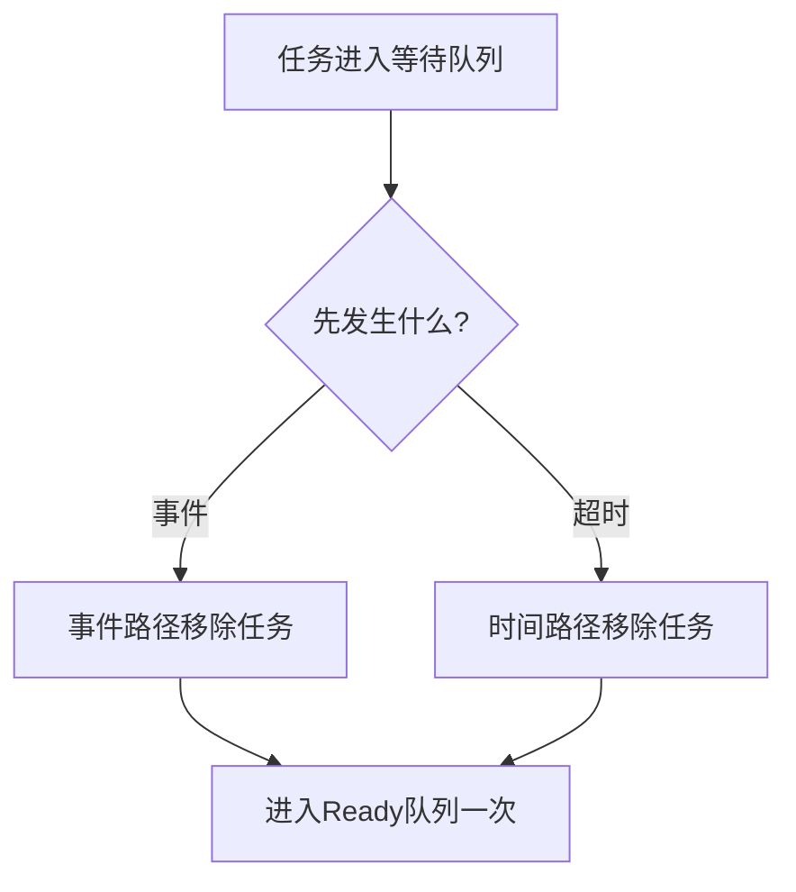

# RTOS并发、内存与可靠性基础

## 1. 为什么并发容易出错

单核处理器同一时刻通常只执行一条指令，但任务切换和中断会让多个执行流交错访问同一数据。错误不取决于是否真正并行，而取决于操作能否在中间被打断。

```text
任务A：读取 count
        ── 被中断或抢占 ──
任务B：读取 count、加1、写回
任务A：加1、写回
```

两次加1可能只得到一次结果，这称为丢失更新。

并发设计需要明确：

- 谁拥有数据。
- 谁可以读取和修改。
- 哪些操作必须不可分割。
- 执行流在什么位置可能被抢占。
- 数据什么时候对其他执行流可见。

## 2. 竞态条件

当结果依赖执行顺序，而这个顺序没有被规则约束时，就存在竞态。

常见竞态包括：

- 读改写计数器丢失更新。
- 一个任务读到结构体更新一半的状态。
- 事件超时和正常到达同时移除等待节点。
- ISR写入缓冲区时任务正在重置索引。
- 对象已经删除，另一个任务仍持有指针。

竞态往往只在特定中断点出现，单步调试还可能改变时序使问题消失。

## 3. `volatile`的作用和局限

`volatile`要求编译器真实执行对对象的访问，适合：

- 硬件寄存器。
- ISR异步修改、任务轮询的简单标志。
- 调试器或外部硬件可见的状态。

它不提供：

- 原子性。
- 互斥。
- 多字段一致性。
- 跨核缓存一致性。
- 完整内存顺序保证。

因此“共享变量加上volatile”不是通用并发解决方案。

## 4. 原子操作

原子操作在其他执行流看来不可分割。是否原子取决于处理器位宽、地址对齐、总线和指令实现。

即使单次32位读写原子，下面的复合操作也不一定原子：

```c
event_count++;
```

它通常包含读取、计算和写回。

C11原子类型能表达部分并发语义，但裸机和RTOS工程还要确认工具链、处理器指令以及中断上下文支持情况。外设寄存器仍应遵守芯片手册定义的访问规则。

## 5. 临界区

临界区用于保护必须作为整体完成的数据操作。

单核系统常通过暂时屏蔽可访问同一数据的中断或禁止调度实现。正确模式是保存原状态并恢复：

```c
uint32_t irq_state = platform_irq_save();
shared_state_update();
platform_irq_restore(irq_state);
```

不要无条件在退出时打开中断，因为调用者进入前可能已经关闭中断。

临界区设计原则：

- 只保护共享状态提交，不包围耗时计算。
- 不在临界区内等待硬件或其他任务。
- 不在临界区内执行不可控回调。
- 明确允许屏蔽哪些中断优先级。
- 测量最长临界区时间。

临界区越长，高优先级事件的最坏响应越差。

## 6. 内存屏障

编译器和处理器可能重排内存访问。多核、DMA和设备寄存器交互时，即使每次读写都原子，观察顺序仍可能错误。

需要区分：

- 编译器屏障：限制编译器重排。
- 数据内存屏障：保证指定内存访问完成顺序。
- 数据同步屏障：等待先前访问完成。
- 指令同步屏障：刷新后续指令执行环境。

屏障不是互斥锁。它约束可见顺序，不阻止两个执行流同时修改同一对象。

## 7. 数据所有权

减少共享比保护共享更简单。常见所有权模式：

- 单一写者，多方只读。
- 数据只由一个任务持有，其他任务通过消息请求操作。
- 双缓冲：生产者写构建区，原子切换后消费者读取稳定区。
- 不可变消息：发布后不再修改。

接口应说明数据是借用、复制还是转移所有权。异步操作尤其需要明确缓冲区必须保持有效到什么时候。

## 8. 同步对象

RTOS常见同步对象：

| 对象 | 主要语义 | 不适合替代的对象 |
| --- | --- | --- |
| 二值信号量 | 事件通知或一次资源计数 | 带所有权的互斥量 |
| 计数信号量 | 多个同类资源计数 | 消息内容传递 |
| 互斥量 | 带所有权的共享资源保护 | ISR事件通知 |
| 消息队列 | 按值传递离散消息 | 大块共享数据零拷贝 |
| 事件标志 | 等待多个布尔条件组合 | 保存重复事件次数 |

选择对象前先确定语义：要保护所有权、累计事件、传递数据，还是等待条件组合。

## 9. 超时与唤醒竞争

任务等待事件并设置超时时，事件和超时可能几乎同时发生：



系统必须保证：

- 任务只从等待队列移除一次。
- 任务只进入Ready队列一次。
- 返回原因明确为成功或超时。
- 对象删除不能与唤醒并发破坏节点。

这通常需要在临界区内提交状态转换，而把耗时通知放在临界区外。

## 10. 调度数据结构

### 10.1 Ready队列

固定优先级内核通常为每个优先级维护FIFO，并使用位图快速找到最高非空优先级。

关键不变量：

- Ready任务恰好位于一个Ready队列。
- Running任务是否同时保留在Ready队列必须有统一约定。
- 队列头尾和任务状态同步更新。
- 同一节点不能重复入队。

### 10.2 延时队列

延时队列可以按绝对到期时间排序，也可以使用时间轮。排序链表插入成本高但简单；时间轮每tick成本稳定但结构更复杂。

### 10.3 等待队列

同步对象的等待队列可以按FIFO或任务优先级排序。FIFO强调等待顺序，优先级排序强调高紧迫任务响应。

数据结构选择决定复杂度、最坏操作时间和公平性，不只是代码风格问题。

## 11. 任务状态不变量

可靠内核至少要保持：

- 同一时刻只有一个任务使用单核CPU。
- 一个任务不会同时出现在多个互斥队列中。
- Blocked任务不在Ready队列。
- 每个队列节点都有明确所有者。
- 从队列移除后节点链接恢复为安全状态。
- 任务现场与任务控制块一一对应。
- 状态字段和队列归属在同一临界区提交。

不变量是调试和断言的基础。没有明确不变量，就无法判断内部状态是否已经损坏。

## 12. 静态和动态内存

### 12.1 静态分配

应用在构建时或启动时提供任务栈、控制块和队列缓冲区。

优点：

- 内存上界清晰。
- 无运行期碎片。
- 对象地址稳定。
- 分配失败集中在设计阶段。

代价是容量固定，配置过大会浪费RAM。

### 12.2 动态分配

内核运行时从堆创建任务和对象。

优点是灵活，代价包括：

- 分配时间可能变化。
- 长期运行可能产生碎片。
- 必须处理分配失败。
- 删除时要解决悬空引用。

硬实时或安全关键系统通常倾向于启动阶段完成分配，运行阶段保持对象拓扑不变。

## 13. 固定块与内存池

固定块内存池把区域切成等大块，分配和释放时间稳定，不产生外部碎片。

块大小需要覆盖最大对象，可能产生内部浪费。不同大小对象可以使用多个规格的池。

环形池适合严格FIFO生命周期的数据；如果对象释放顺序任意，不能直接用FIFO环形结构，否则早期对象会阻塞后续空间回收。

内存池需要记录：

- 总容量和当前使用量。
- 历史高水位。
- 分配失败次数。
- 块所有权或释放顺序。
- 边界和完整性标记。

## 14. 栈与对象容量

容量不能只按平均使用量设计。需要考虑：

- 最深调用路径。
- 最大中断嵌套。
- 浮点扩展现场。
- 最大同时等待任务数。
- 最大消息突发量。
- 最长消费者停止时间。

高水位是重要运行证据，但它只覆盖已经执行过的路径。容量确定应结合静态分析、压力测试和安全裕量。

## 15. 故障分类

RTOS相关故障可以分为：

### 配置故障

- 栈或内存池过小。
- 优先级配置错误。
- 时间基准单位错误。
- 中断优先级不满足内核调用约束。

### 运行故障

- 栈越界。
- 非法指针和越界访问。
- 队列重复插入或错误释放。
- 死锁、活锁和任务饥饿。
- 现场保存或恢复损坏。

### 外部故障

- 外设长时间忙。
- DMA或通信超时。
- 输入长度和状态非法。
- 电源异常或存储器错误。

不同故障需要不同策略，不能全部用无限循环或自动复位处理。

## 16. 失败策略

| 策略 | 含义 | 主要风险 |
| --- | --- | --- |
| 拒绝请求 | 保持原状态并返回错误 | 上层必须处理失败 |
| 保持当前执行 | 不进行危险切换 | 其他任务可能失去响应 |
| 功能降级 | 关闭非关键服务 | 降级边界需要预先设计 |
| 安全停机 | 输出进入安全状态 | 系统服务暂时不可用 |
| 看门狗复位 | 从已知启动路径恢复 | 复位循环掩盖永久故障 |
| 故障锁存 | 保存证据并等待人工处理 | 需要可靠诊断通道 |

内部状态无法证明完整时，应优先避免继续使用损坏现场。继续运行可能把局部错误扩大成任意代码执行或错误硬件输出。

## 17. 看门狗与进度监督

只要CPU仍在循环就喂狗，无法发现任务饥饿或业务停滞。

更可靠的方法是监督关键进度：

```text
控制任务完成本周期
通信任务持续消费数据
存储状态机取得进展
关键输出状态有效
          ↓
监督器确认全部条件后喂狗
```

需要区分：

- 任务被调度过。
- 任务函数返回过。
- 任务完成了有效业务进度。

复位次数也应有限制。连续相同故障复位需要进入降级或等待外部处理，避免永久复位循环。

## 18. 可观测性

调度系统应暴露足够证据：

- 当前任务和任务状态。
- Ready、等待和延时队列长度。
- 任务切换次数。
- 执行时间、响应时间和调度抖动。
- 每任务栈高水位。
- 内存池当前值和峰值。
- 超时、丢弃和分配失败次数。
- 最近故障原因、PC、SP和状态寄存器。

记录应在故障发生的第一时间完成，避免后续错误覆盖最初原因。

## 19. 断言与错误返回

断言适合检查内部不变量，例如：

- 队列指针一致。
- 当前任务状态合法。
- 栈指针位于边界内。
- 内存池使用量不超过容量。

错误返回适合外部可预期失败，例如参数非法、队列满或资源忙。

发布版本是否保留断言取决于系统要求。即使关闭开发断言，关键安全检查也不能随之消失，应转换为明确故障路径。

## 20. 死锁、活锁与饥饿

- 死锁：多个任务相互等待，谁都无法继续。
- 活锁：任务持续运行和重试，但业务没有进展。
- 饥饿：某任务长期无法获得CPU或资源。

避免死锁的常见方法：

- 所有任务按统一顺序获取多个资源。
- 避免持有资源时等待另一个不受控事件。
- 为等待设置超时和回滚路径。
- 使用消息传递减少多资源共享。

活锁和饥饿需要进度计数、等待时间和调度统计才能被发现。

## 21. 测试方法

并发和可靠性测试应覆盖：

1. 在每个共享状态更新点制造中断或任务切换。
2. 让事件到达和超时发生在同一时间附近。
3. 重复提交同一任务或队列节点。
4. 压满消息队列和内存池。
5. 制造最长调用链和最大中断嵌套。
6. 让外设永久忙并观察超时路径。
7. 制造任务不再推进但CPU仍运行的活锁。
8. 检查复位后的故障证据和复位次数。

压力测试应配合不变量断言和高水位记录，而不是只观察系统是否“看起来还在运行”。

## 22. 实验和思考题

建议实验：

1. 在任务和ISR中同时执行计数器加一，比较无保护、临界区和原子操作。
2. 用双缓冲发布结构体快照，验证消费者不会读到半更新数据。
3. 实现Ready队列并故意重复入队，观察链表损坏方式。
4. 实现事件等待与超时竞争，保证任务只唤醒一次。
5. 对固定块池和通用堆进行长期随机分配，比较碎片和时延。
6. 设计多任务心跳，验证任务活锁能否被监督器发现。

思考题：

1. 为什么关闭调度不能自动保护ISR共享数据？
2. 为什么内存屏障不能替代互斥？
3. 消息队列和共享内存分别适合什么数据流？
4. 高水位从未达到容量，是否足以证明永远不会溢出？
5. 为什么任务被调用次数不能证明业务仍在推进？
6. 哪些内部错误适合断言，哪些外部失败必须正常返回错误？
