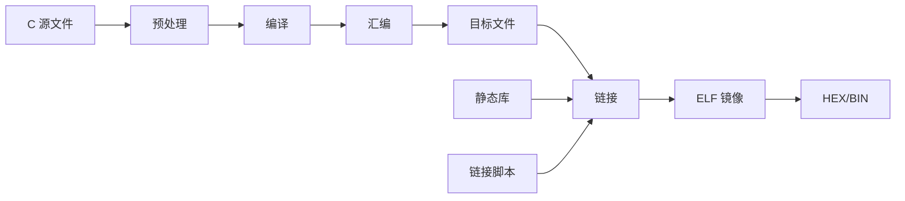

# C语言静态注册与链接基础

## 1. 学习目标

完成本章后，应能够解释：

- C 源文件如何变成最终可执行镜像。
- 静态存储期、链接属性和函数指针分别解决什么问题。
- 为什么链接器可以自动收集分散在不同源文件中的对象。
- 自定义段、链接脚本、边界符号和 `KEEP()` 如何协作。
- 静态注册相对手工表和动态注册的优缺点。

本章讨论通用 C 与 ELF 链接知识，不依赖某个具体软件框架。

## 2. 从源码到可执行镜像

C 程序不是直接从 `.c` 文件运行的。典型构建过程为：



各阶段的职责不同：

| 阶段 | 主要工作 |
| --- | --- |
| 预处理 | 展开头文件、宏和条件编译 |
| 编译 | 把 C 语义转换成目标处理器汇编 |
| 汇编 | 生成包含代码、数据、符号和重定位信息的目标文件 |
| 链接 | 合并目标文件、解析符号、分配地址并生成最终镜像 |

自动注册依赖的不是 C 运行时魔法，而是“编译器把对象放进指定输入段，链接器再把这些输入段排列到连续地址”这一过程。

## 3. 静态存储期与链接属性

### 3.1 存储期

文件作用域对象具有静态存储期：从程序启动到程序结束，它的存储一直存在。

```c
#include <stdint.h>

static uint32_t sample_count = 0u;
uint32_t g_system_state = 0u;
```

两个对象都具有静态存储期，但链接属性不同：

- `sample_count` 具有内部链接，只能被当前翻译单元按名称引用。
- `g_system_state` 具有外部链接，可以通过头文件声明供其他翻译单元引用。

静态注册对象必须在初始化完成后继续存在，因此不能使用函数内自动局部对象。

### 3.2 函数指针

函数指针把“要做什么”作为数据保存：

```c
typedef void (*module_init_f)(void *p_context);

typedef struct
{
    const char *p_name;
    module_init_f p_init;
    void *p_context;
} module_descriptor_t;
```

描述符把函数与上下文组合在一起。同一个函数可以绑定不同上下文，形成多个互不干扰的实例。

调用前必须检查函数指针：

```c
static void module_call(const module_descriptor_t *p_module)
{
    if ((p_module != NULL) &&
        (p_module->p_init != NULL))
    {
        p_module->p_init(p_module->p_context);
    }
}
```

这里的 `void *` 是泛型框架常见的边界。具体模块恢复真实类型时，应集中转换并保证对象生命周期和对齐正确。

## 4. 描述符与静态注册

### 4.1 手工表

最直接的静态组织方式是手工维护数组：

```c
static const module_descriptor_t modules[] = {
    {
        .p_name = "sensor",
        .p_init = sensor_init,
        .p_context = &sensor_context,
    },
    {
        .p_name = "storage",
        .p_init = storage_init,
        .p_context = &storage_context,
    },
};
```

优点是直观，缺点是每增加一个模块，都要修改集中表。模块声明与模块实现分离后，容易漏登记。

### 4.2 分散声明、集中发现

链接期注册允许每个模块在自己的源文件中声明描述符，最终镜像把所有描述符排成连续表：

```text
sensor.c  ── descriptor ──┐
storage.c ── descriptor ──┼─→ 自定义输入段 → 连续注册表
comm.c    ── descriptor ──┘
```

这种方式改变的是对象收集方法，不改变对象本身仍为普通静态结构体的事实。

## 5. 宏在静态注册中的作用

宏可以同时生成描述符名称、初始化值和段属性：

```c
#define REGISTER_MODULE(name, init_func, context_ptr)                    \
    static const module_descriptor_t module_##name                      \
        __attribute__((used, section("module_registry"))) = {           \
            .p_name = #name,                                            \
            .p_init = (init_func),                                      \
            .p_context = (context_ptr),                                 \
        }
```

其中：

- `##` 把多个 token 拼成新的标识符。
- `#` 把宏参数转换成字符串。
- `section` 指定目标文件输入段。
- `used` 告诉编译器该对象即使没有普通 C 引用也必须保留。

使用示例：

```c
REGISTER_MODULE(sensor, sensor_init, &sensor_context);
```

宏的风险在于错误信息难读、类型检查间接、符号可能冲突。适合宏完成的只有 C 语法无法直接表达的文本生成工作；普通计算和控制流程应优先使用函数。

## 6. ELF段与链接脚本

目标文件通常包含 `.text`、`.rodata`、`.data` 和 `.bss` 等输入段。编译器属性可以再产生自定义输入段，例如 `module_registry`。

链接脚本把输入段合并到输出段：

```ld
.module_registry :
{
    . = ALIGN(4);
    __module_registry_start = .;
    KEEP(*(module_registry))
    KEEP(*(module_registry.*))
    __module_registry_end = .;
} > FLASH
```

这段脚本完成四件事：

1. 把当前位置按 4 字节对齐。
2. 记录注册表起始地址。
3. 收集所有匹配输入段。
4. 记录注册表结束地址。

边界符号不是普通 C 对象，它们代表链接地址。访问它们属于低层适配行为，应集中在注册框架内部。

## 7. `used`、`KEEP()`与垃圾回收

现代嵌入式构建常使用：

```text
-ffunction-sections -fdata-sections -Wl,--gc-sections
```

编译器为函数和数据生成细分段，链接器再删除不可达段，以缩小固件体积。

自动注册对象往往没有普通 C 引用，因此可能在两个阶段被删除：

- 编译器认为对象未使用：使用 `used` 属性保留。
- 链接器认为输入段不可达：使用链接脚本 `KEEP()` 保留。

两者解决不同阶段的问题，通常需要同时存在。

## 8. 遍历连续注册表

注册表可以视为半开区间 `[start, end)`：

```c
extern const module_descriptor_t __module_registry_start[];
extern const module_descriptor_t __module_registry_end[];

static void module_registry_run(void)
{
    const module_descriptor_t *p_module = __module_registry_start;

    while (p_module < __module_registry_end)
    {
        module_call(p_module);
        ++p_module;
    }
}
```

这种写法成立需要满足：

- 输入段只包含同一种描述符。
- 每个对象对齐满足结构体要求。
- 起止符号类型与真实对象布局一致。
- 注册表中没有链接器插入的额外填充对象。

如果一个注册表需要容纳不同类型，可以使用统一头部：

```c
typedef enum
{
    REGISTRY_TYPE_INIT_E = 0,
    REGISTRY_TYPE_TASK_E,
    REGISTRY_TYPE_DRIVER_E,
} registry_type_t;

typedef struct
{
    registry_type_t type;
    const void *p_object;
} registry_entry_t;
```

遍历层只识别统一头部，再根据 `type` 把对象交给对应模块。恢复 `void *` 前必须验证类型。

## 9. 初始化顺序与稳定排序

注册表的物理顺序可能受到目标文件顺序、静态库抽取和链接脚本通配符影响，不应默认等于业务初始化顺序。

常用方法是描述符携带优先级，启动时建立有序链表：

```c
typedef struct init_node_t
{
    uint8_t priority;
    void (*p_func)(void);
    struct init_node_t *p_next;
} init_node_t;
```

有序插入时需要决定相同优先级是否保持发现顺序。保持顺序称为稳定排序，它让构建结果更容易复现，但模块之间仍不应依赖未明确声明的同级顺序。

更稳健的初始化设计是：

- 用少量优先级表达阶段，例如时钟、驱动、服务、业务。
- 通过显式接口检查依赖是否准备完成。
- 避免用大量相邻数字隐式编码复杂依赖图。

## 10. 静态注册的优缺点

| 方面 | 优点 | 代价 |
| --- | --- | --- |
| 模块自治 | 声明与实现放在同一模块 | 全局对象集合不再集中可见 |
| 内存 | 无动态分配，启动后拓扑固定 | 运行期不能自由增删对象 |
| 扩展 | 新模块无需修改中央表 | 依赖编译器属性和链接脚本 |
| 裁剪 | 未编译模块自然不进入镜像 | 错误的 `KEEP()` 可能保留不需要内容 |
| 初始化 | 可统一发现并排序 | 同级顺序和依赖需要额外规则 |
| 移植 | 上层描述符保持普通 C 结构 | 不同工具链的段语法和边界符号不同 |

静态注册适合模块集合在构建时确定、运行期不需要动态插件、并且希望避免集中维护表的嵌入式系统。

## 11. 最小实验

可以建立三个源文件：

1. `registry.h`：声明描述符和注册宏。
2. `module_a.c`、`module_b.c`：分别注册一个对象。
3. `main.c`：遍历起止符号并打印名称。

构建后使用工具观察：

```text
arm-none-eabi-readelf -S firmware.elf
arm-none-eabi-nm -n firmware.elf
arm-none-eabi-objdump -s -j .module_registry firmware.elf
```

实验步骤：

- 先确认两个对象都存在。
- 删除 `KEEP()`，打开 `--gc-sections`，观察对象是否消失。
- 恢复 `KEEP()`，交换目标文件链接顺序，观察物理顺序变化。
- 增加优先级排序，确认运行顺序不再依赖物理顺序。

## 12. 思考题

1. 为什么 `used` 不能替代链接脚本中的 `KEEP()`？
2. 为什么不能在函数中创建局部描述符，再把地址放入注册表？
3. 同一个注册表混放不同大小结构体时，简单的指针递增为什么会失败？
4. 静态库中的注册对象为什么有时不会被链接器抽取？
5. 如果初始化函数之间形成循环依赖，增加更多优先级是否真的能解决问题？
