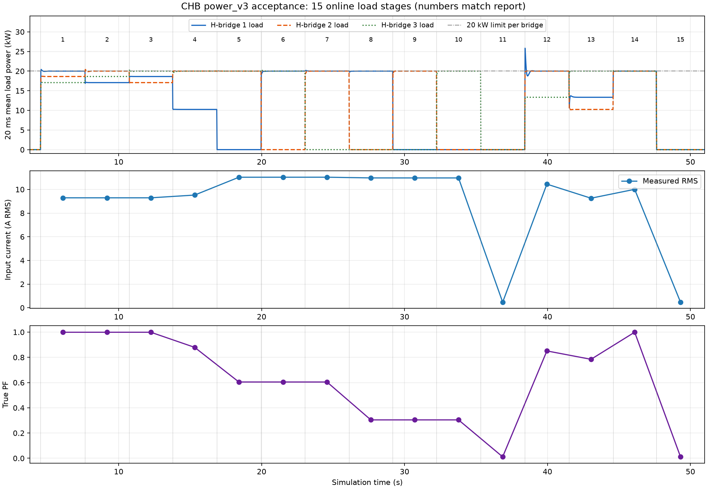
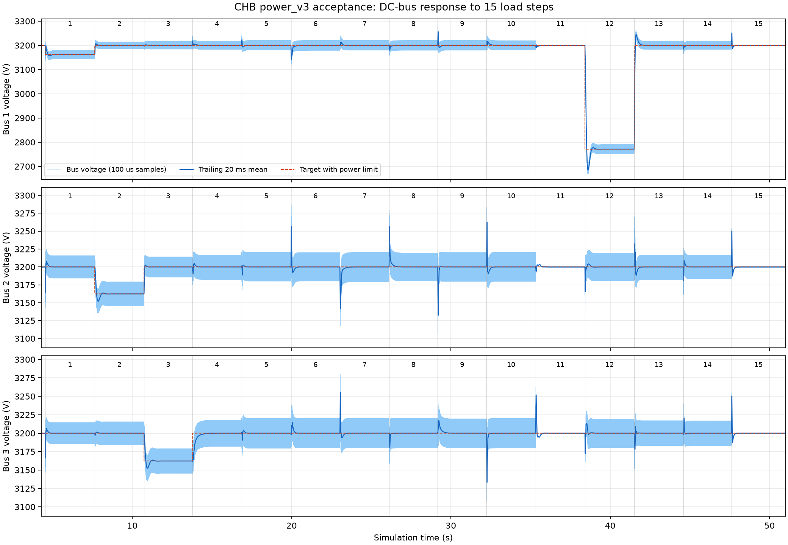

# 级联 H 桥整流器测试报告

测试日期：2026-09-26。数据标识：`power_v3_acceptance`。对象：三级单相 CHB 的 PLECS 开关模型与控制 DLL。本文全部结果来自同一次 51 s 仿真及其 15 个在线投卸载阶段。

## 1. 测试结论

先空载启机，全部母线在 3200±4 V 内持续 500 ms 且时间不早于 4 s 后，才开始投载。覆盖三桥轮换限功率、一般不平衡、一级及两级近空载、不等负载、均载和卸载恢复。

- 全部工况完成，EN 仅在 0.6211 s 启机上升，运行期间没有保护停波。
- 母线 20 ms 平均值均恢复到各自目标的 ±0.5%，最慢 372.1 ms。受限目标按 min(3200, √(20000R)) 计算。
- 投卸载前 1.5 s 暂态母线范围为 2666.22～3286.10 V，各负载阶段原始电感电流最大峰值 26.60 A。
- 阶段 13 的原始电流暂态超过 25 A。25 A 仅约束 dq 参考矢量，本轮没有证明实际瞬时电流被硬限制在该值以内。
- 稳态功率统计窗口的最大超出量为 0.751 W，低于 20 kW 的 0.5% 数值验收带。这是持续功率限制，不是瞬时功率硬钳位。
- 空载窗口中，20 ms 平均母线最大峰峰值 0.0430 V。近空载 PF 仍很低，须同时查看绝对 RMS，不能将稳压通过等同于高 PF。

母线调节及持续输出功率限制满足本轮判据；输入电流瞬时峰值 ≤25 A 不成立。均载 PF 为 0.999278，一级近空载约 0.6044～0.6046，两级近空载约 0.3041。强不平衡与近空载未达到高 PF。

## 2. 测试条件与统计方法

| 项目 | 本轮设置 |
|---|---|
| 输入电压与频率 | 6 kV RMS，50 Hz |
| 输入电感 | 12 mH |
| 直流电容 | 每桥 600 µF |
| 母线给定 | 每桥 3200 V，限功率时允许降压 |
| 输出功率上限 | 每桥 20 kW |
| dq 电流参考上限 | 25 A 峰值 |
| 控制与 PWM | 10 kHz，死区 2 µs |
| BSP 时序 | duty 和 EN 均保留 100 µs 延迟 |
| 负载采样 | R1～R3 独立负载支路电流，流向负载为正 |
| 功率反馈 | 同拍 V×I，100 Hz 陷波及 20 Hz 低通 |
| 负载切换 | FRAME 地址 2，app 在线更新三路电阻 |

每阶段约 3 s。稳态 PF、电流和功率取末尾连续 0.2 s（10 工频周期）窗口，再对窗口结果求平均。PF=P/(Vrms×Irms)，P 与 RMS 使用原始变步长轨迹的分段线性积分；谐波使用同一轨迹的傅里叶积分。母线均值与暂态指标另行统计。

电压调节验收使用 20 ms 平均值，保留正常 100 Hz 纹波。±0.5% 恢复时间表示进入并在该阶段剩余时间保持在带内；0 表示该平均量从统计开始就在带内。持续功率判据为窗口平均值 ≤20.1 kW；用户未指定谐波法规限值，本报告不作并网标准符合性声明。

表中输出功率按原始母线 V²/R 积分得到，与采样 V×I 交叉核对，最大相对偏差 0.000268%。实际控制使用 V×I，不读取负载电阻。功率图使用采样 V×I 的 20 ms 平均值。

Scope PF 与原始轨迹独立计算，15 阶段的最大绝对差为 0.000029，测量结果一致。导出的全部信号均为有限数值。

## 3. 15 阶段投卸载结果

### 3.1 每次切换的输入条件

切换时刻取本轮仿真日志的负载提交时间，保持时间截止至下一次切换或仿真结束。三路阻值均按 H 桥 1/2/3 顺序排列。

| 阶段 | 切换时刻 s | 保持时间 s | 切换前电阻 Ω，1/2/3 | 切换后电阻 Ω，1/2/3 |
|---|---:|---:|---|---|
| 1 | 4.5350 | 3.109 | 1M / 1M / 1M | 500 / 550 / 600 |
| 2 | 7.6440 | 3.091 | 500 / 550 / 600 | 600 / 500 / 550 |
| 3 | 10.7350 | 3.034 | 600 / 500 / 550 | 550 / 600 / 500 |
| 4 | 13.7690 | 3.094 | 550 / 600 / 500 | 1000 / 512 / 512 |
| 5 | 16.8630 | 3.097 | 1000 / 512 / 512 | 1M / 512 / 512 |
| 6 | 19.9600 | 3.073 | 1M / 512 / 512 | 512 / 1M / 512 |
| 7 | 23.0330 | 3.084 | 512 / 1M / 512 | 512 / 512 / 1M |
| 8 | 26.1170 | 3.052 | 512 / 512 / 1M | 512 / 1M / 1M |
| 9 | 29.1690 | 3.064 | 512 / 1M / 1M | 1M / 512 / 1M |
| 10 | 32.2330 | 3.086 | 1M / 512 / 1M | 1M / 1M / 512 |
| 11 | 35.3190 | 3.091 | 1M / 1M / 512 | 1M / 1M / 1M |
| 12 | 38.4100 | 3.093 | 1M / 1M / 1M | 384 / 512 / 768 |
| 13 | 41.5030 | 3.082 | 384 / 512 / 768 | 768 / 1000 / 512 |
| 14 | 44.5850 | 3.027 | 768 / 1000 / 512 | 512 / 512 / 512 |
| 15 | 47.6120 | 3.388 | 512 / 512 / 512 | 1M / 1M / 1M |

### 3.2 稳态功率、电流及恢复结果

| 阶段 | 负载 Ω，1/2/3 | 母线均值 V，1/2/3 | 输出功率 kW，1/2/3 | PF | 输入 RMS A | 阶段峰值 A | ±0.5% 恢复 ms |
|---|---|---|---|---:|---:|---:|---:|
| 1 | 500 / 550 / 600 | 3162.21 / 3199.96 / 3199.96 | 20.000 / 18.618 / 17.067 | 0.998891 | 9.291 | 18.62 | 97.1 |
| 2 | 600 / 500 / 550 | 3199.95 / 3162.21 / 3199.95 | 17.067 / 20.000 / 18.619 | 0.998939 | 9.291 | 14.90 | 64.3 |
| 3 | 550 / 600 / 500 | 3199.99 / 3200.00 / 3162.25 | 18.618 / 17.066 / 20.000 | 0.998917 | 9.291 | 14.75 | 64.2 |
| 4 | 1000 / 512 / 512 | 3199.96 / 3199.97 / 3199.99 | 10.240 / 20.000 / 20.001 | 0.879267 | 9.523 | 15.31 | 151.2 |
| 5 | 1M / 512 / 512 | 3200.00 / 3199.99 / 3199.99 | 0.010 / 20.000 / 20.001 | 0.604572 | 11.030 | 19.03 | 31.2 |
| 6 | 512 / 1M / 512 | 3200.01 / 3199.97 / 3200.00 | 20.000 / 0.010 / 20.001 | 0.604517 | 11.031 | 22.34 | 107.3 |
| 7 | 512 / 512 / 1M | 3199.95 / 3199.94 / 3199.95 | 20.000 / 20.000 / 0.010 | 0.604430 | 11.033 | 22.09 | 96.4 |
| 8 | 512 / 1M / 1M | 3199.97 / 3199.99 / 3199.98 | 20.000 / 0.010 / 0.010 | 0.304125 | 10.972 | 18.37 | 68.1 |
| 9 | 1M / 512 / 1M | 3200.00 / 3200.03 / 3200.00 | 0.010 / 20.000 / 0.010 | 0.304141 | 10.971 | 22.84 | 89.4 |
| 10 | 1M / 1M / 512 | 3199.98 / 3199.99 / 3199.98 | 0.010 / 0.010 / 20.001 | 0.304166 | 10.971 | 22.91 | 88.5 |
| 11 | 1M / 1M / 1M | 3200.00 / 3200.00 / 3200.00 | 0.010 / 0.010 / 0.010 | 0.011236 | 0.470 | 17.64 | 69.1 |
| 12 | 384 / 512 / 768 | 2771.26 / 3199.98 / 3199.97 | 20.000 / 20.000 / 13.334 | 0.850876 | 10.447 | 18.89 | 372.1 |
| 13 | 768 / 1000 / 512 | 3199.96 / 3199.95 / 3199.98 | 13.333 / 10.240 / 20.001 | 0.784424 | 9.258 | 26.60 | 262.4 |
| 14 | 512 / 512 / 512 | 3199.98 / 3199.98 / 3199.98 | 20.000 / 20.000 / 20.001 | 0.999278 | 10.007 | 16.79 | 54.3 |
| 15 | 1M / 1M / 1M | 3200.00 / 3200.00 / 3200.00 | 0.010 / 0.010 / 0.010 | 0.011258 | 0.470 | 11.35 | 37.0 |

1～3 为三桥轮换限功率；4 为一般不平衡；5～7 为一级近空载轮换；8～10 为两级近空载轮换；11 为空载恢复；12 为不等负载与降压限功率；13 解除限功率；14 为均载；15 为最终卸载。1 MΩ 为近空载，每桥仍消耗约 10.24 W。

上图为三路实测母线电压×负载支路电流的 20 ms 平均负载功率，点划线为每桥 20 kW 持续功率限值；下两图为各阶段稳态输入 RMS 和 PF。阶段编号与表格对应。投载初期电容供能可使功率暂时超过限值，随后由功率环收敛。

## 4. 母线电压与投卸载响应

### 4.1 各阶段稳态电压与纹波

受限母线目标按 min(3200, √(20000R)) 计算，其他桥保持 3200 V。稳态均值与峰峰纹波取各阶段末尾分析区间；这里的纹波来自未做 20 ms 平均的母线轨迹，包括正常二倍工频纹波，不等同于稳压误差。

| 阶段 | 目标 V，1/2/3 | 稳态均值 V，1/2/3 | 稳态峰峰纹波 V，1/2/3 |
|---|---|---|---|
| 1 | 3162.28 / 3200.00 / 3200.00 | 3162.21 / 3199.96 / 3199.96 | 33.81 / 31.27 / 28.50 |
| 2 | 3200.00 / 3162.28 / 3200.00 | 3199.95 / 3162.21 / 3199.95 | 28.37 / 33.65 / 31.14 |
| 3 | 3200.00 / 3200.00 / 3162.28 | 3199.99 / 3200.00 / 3162.25 | 31.10 / 28.34 / 33.61 |
| 4 | 3200.00 / 3200.00 / 3200.00 | 3199.96 / 3199.97 / 3199.99 | 33.56 / 34.11 / 35.77 |
| 5 | 3200.00 / 3200.00 / 3200.00 | 3200.00 / 3199.99 / 3199.99 | 40.04 / 40.17 / 40.66 |
| 6 | 3200.00 / 3200.00 / 3200.00 | 3200.01 / 3199.97 / 3200.00 | 40.95 / 39.96 / 40.11 |
| 7 | 3200.00 / 3200.00 / 3200.00 | 3199.95 / 3199.94 / 3199.95 | 40.30 / 41.03 / 39.94 |
| 8 | 3200.00 / 3200.00 / 3200.00 | 3199.97 / 3199.99 / 3199.98 | 40.46 / 39.25 / 40.57 |
| 9 | 3200.00 / 3200.00 / 3200.00 | 3200.00 / 3200.03 / 3200.00 | 40.64 / 40.48 / 39.28 |
| 10 | 3200.00 / 3200.00 / 3200.00 | 3199.98 / 3199.99 / 3199.98 | 39.33 / 40.64 / 40.18 |
| 11 | 3200.00 / 3200.00 / 3200.00 | 3200.00 / 3200.00 / 3200.00 | 1.51 / 1.52 / 1.50 |
| 12 | 2771.28 / 3200.00 / 3200.00 | 2771.26 / 3199.98 / 3199.97 | 37.92 / 38.83 / 38.57 |
| 13 | 3200.00 / 3200.00 / 3200.00 | 3199.96 / 3199.95 / 3199.98 | 33.18 / 34.46 / 33.84 |
| 14 | 3200.00 / 3200.00 / 3200.00 | 3199.98 / 3199.98 / 3199.98 | 33.29 / 33.29 / 33.29 |
| 15 | 3200.00 / 3200.00 / 3200.00 | 3200.00 / 3200.00 / 3200.00 | 1.50 / 1.52 / 1.51 |

### 4.2 负载切换后的电压极值与恢复时间

电压极值取每次切换后的前 1.5 s，基于 100 µs 重采样的母线轨迹；不把 20 ms 平均曲线的极值当作原始电压极值。恢复时间按三路 20 ms 平均电压均进入并在本阶段剩余时间保持在各自目标带内计算；0 表示统计起点已在带内。

| 阶段 | 暂态最低 V，1/2/3 | 暂态最高 V，1/2/3 | ±2% 恢复 ms | ±0.5% 恢复 ms |
|---|---|---|---:|---:|
| 1 | 3136.45 / 3142.46 / 3146.75 | 3215.42 / 3224.16 / 3221.19 | 0.0 | 97.1 |
| 2 | 3152.49 / 3135.21 / 3180.72 | 3221.29 / 3213.20 / 3217.01 | 0.0 | 64.3 |
| 3 | 3181.07 / 3159.70 / 3135.66 | 3217.76 / 3216.86 / 3213.59 | 0.0 | 64.2 |
| 4 | 3182.79 / 3174.36 / 3144.57 | 3236.81 / 3221.83 / 3217.84 | 0.0 | 151.2 |
| 5 | 3171.77 / 3167.65 / 3168.72 | 3248.53 / 3223.21 / 3224.51 | 0.0 | 31.2 |
| 6 | 3113.79 / 3171.93 / 3178.79 | 3220.34 / 3286.10 / 3238.23 | 0.0 | 107.3 |
| 7 | 3179.26 / 3117.72 / 3173.66 | 3240.01 / 3220.33 / 3279.86 | 0.0 | 96.4 |
| 8 | 3159.10 / 3180.26 / 3158.67 | 3222.39 / 3278.83 / 3220.48 | 0.0 | 68.1 |
| 9 | 3170.13 / 3106.82 / 3180.23 | 3284.00 / 3220.79 / 3245.99 | 31.8 | 89.4 |
| 10 | 3180.20 / 3170.02 / 3107.15 | 3245.28 / 3283.22 / 3220.08 | 30.8 | 88.5 |
| 11 | 3182.50 / 3183.36 / 3193.80 | 3219.51 / 3220.49 / 3262.76 | 0.0 | 69.1 |
| 12 | 2666.22 / 3130.51 / 3147.21 | 3200.57 / 3223.74 / 3230.34 | 283.5 | 372.1 |
| 13 | 2756.12 / 3170.85 / 3151.51 | 3262.38 / 3269.11 / 3226.59 | 53.5 | 262.4 |
| 14 | 3164.77 / 3160.87 / 3182.10 | 3219.56 / 3226.37 / 3240.09 | 0.0 | 54.3 |
| 15 | 3184.08 / 3184.11 / 3184.07 | 3254.35 / 3254.33 / 3254.39 | 0.0 | 37.0 |

图中浅色曲线为母线电压，蓝线为 20 ms 平均值，虚线为考虑功率限制后的目标电压。阶段 12 的第 1 桥目标降为约 2771 V；该下降属于限功率工作点变化，不能全部算作相对 3200 V 的调节误差。

## 5. 输入功率、PF 与谐波

| 阶段 | 输入有功 kW | 基波无功 kvar | 2～40 次 THD % | 含开关纹波总 THD % |
|---|---:|---:|---:|---:|
| 1 | 55.685 | -0.001 | 3.098 | 4.714 |
| 2 | 55.686 | -0.004 | 2.938 | 4.611 |
| 3 | 55.685 | +0.007 | 3.013 | 4.658 |
| 4 | 50.240 | +26.509 | 2.516 | 10.857 |
| 5 | 40.011 | +52.364 | 1.600 | 9.224 |
| 6 | 40.012 | +52.373 | 1.622 | 9.227 |
| 7 | 40.011 | +52.382 | 1.729 | 9.248 |
| 8 | 20.022 | +62.412 | 2.195 | 9.415 |
| 9 | 20.021 | +62.403 | 2.355 | 9.452 |
| 10 | 20.022 | +62.393 | 2.681 | 9.545 |
| 11 | 0.032 | +2.116 | 50.825 | 87.984 |
| 12 | 53.334 | +32.506 | 1.913 | 8.438 |
| 13 | 43.574 | +33.915 | 2.683 | 10.981 |
| 14 | 60.001 | -0.000 | 2.793 | 3.801 |
| 15 | 0.032 | +2.116 | 50.807 | 87.971 |

正 Q 表示感性网侧无功。总 THD 包含 2～40 次以外的频率分量；接近空载时基波分母很小，百分比不能脱离绝对 RMS 单独解释。强不平衡仍需要较大无功，未达到任意负载 PF=1。

## 6. 空载稳定性与关键结果

### 6.1 空载母线稳定性

| 窗口 | 时间 s | 母线均值 V，1/2/3 | 20 ms 平均母线峰峰值 V，1/2/3 |
|---|---|---|---|
| 首次投载前 | 2.00～4.00 | 3200.00 / 3200.00 / 3200.00 | 0.0230 / 0.0347 / 0.0319 |
| 最终卸载后 | 49.00～51.00 | 3200.00 / 3200.00 / 3200.00 | 0.0288 / 0.0430 / 0.0313 |

这些峰峰值反映平均母线的慢变化，不包含原始电压中的正常 100 Hz 纹波。最终近空载阶段输入电流约 0.470 A RMS、输入有功约 31.7 W、PF 约 0.01126。

### 6.2 限功率与恢复

- 阶段 1～3：500 Ω 在三桥轮换，受限桥母线约 3162.2 V，输出约 20 kW；另外两桥保持约 3200 V。
- 阶段 12：384/512/768 Ω，第 1 桥降至约 2771.26 V，输出约 20 kW；三桥平均母线进入目标 ±0.5% 的时间为 372.1 ms。
- 阶段 13：切换至 768/1000/512 Ω，三桥均恢复至约 3200 V，恢复时间 262.4 ms；本阶段出现全程负载测试的最大原始电流峰值 26.60 A。
- 阶段 15：三桥卸载至 1 MΩ，平均母线恢复时间为 37.0 ms，稳态电压约 3200 V。

### 6.3 判定汇总

| 检查项 | 本轮结果 |
|---|---|
| 15 次在线负载切换完整执行 | 完成 |
| 运行期间无 EN 下降 | 满足，仅在 0.6211 s 启机上升 |
| 各阶段平均母线最终保持目标 ±0.5% | 满足 |
| 每桥稳态输出功率 ≤20.1 kW | 满足，最大超出 20 kW 约 0.751 W |
| 原始电流瞬时峰值 ≤25 A | 不满足，最大 26.60 A |
| 强不平衡与近空载仍保持高 PF | 不满足，具体值见第 3 节 |

## 7. 本轮数据文件

- [结果 CSV](assets/chb_power_pf_20260926/power_v3_acceptance.csv)
- [逐阶段及逐窗口分析](assets/chb_power_pf_20260926/power_v3_acceptance_analysis.json)
- [模型、DLL、源码指纹与在线诊断](assets/chb_power_pf_20260926/power_v3_acceptance_manifest.json)

原始轨迹和日志在 `platform/plecs/chb/build/`，标签为 `power_v3_acceptance`。测试配置与被测版本以清单中的 SHA-256 为准。报告整理时，下列工作区文件与本轮被测版本指纹不同：platform\plecs\chb\chb.plecs、code\ctrl\chb\chb_ctrl.c。本文只证明清单所标识的模型与 DLL，不作为这些后续修改的验证。

## 8. 结论的适用范围

本轮覆盖表内电阻负载，未覆盖三桥同时深度降压等不可行组合、恒功率负载、电网频偏/畸变、热模型、ADC 噪声、硬件保护延迟及 MCU 执行时间。25 A 为 dq 参考上限；200 A 应用跳闸值是当前仿真配置，不是器件保护设计结论。

控制原理和设计推导保存在本地 `级联H桥整流器_设计文档.md`，设计文档不纳入版本库。本报告只给出上述开关仿真的测试结果，不代表实际功率硬件验证。
