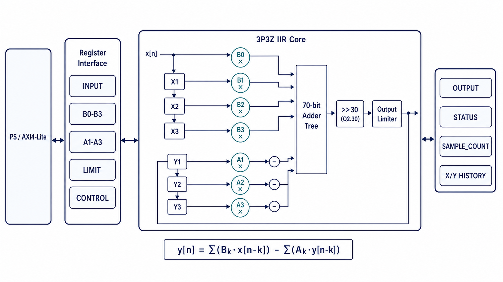

# AXI 3P3Z IIR 设计

## 模块划分

- `rtl/iir_3p3z_core.v`：实现单周期 3P3Z 运算、上下限幅、历史状态和样点计数。
- `rtl/axi_iir_3p3z.v`：实现 AXI4-Lite 寄存器、配置存储和单周期 core 控制。

`iir_3p3z_core` 与总线协议无关。AXI 封装只负责寄存器访问和启动握手，数值计算、限幅和历史更新均位于 core。

## RTL 简图



AXI 封装保存软件可写配置并产生单周期控制脉冲。core 内部由 X/Y 历史、
并行乘法器、加法树、定点缩放和限幅器组成；限幅后的输出同时进入状态寄存器
和 Y 历史反馈链。读回译码只观测当前寄存器及 core 状态，不参与计算路径。

## 数值数据通路

系数使用有符号 Q2.30，输入和输出使用有符号 32 位整数。7 个 32×32 位有符号乘法器并行计算，70 位平衡加法树实现：

```text
y[n] = b0*x[n] + b1*x[n-1] + b2*x[n-2] + b3*x[n-3]
       - a1*y[n-1] - a2*y[n-2] - a3*y[n-3]
```

累加结果算术右移 30 位后，与符号扩展的 `limit_upper` 和 `limit_lower` 比较。超出范围时输出对应限值并置位 `saturated`。

最终限幅值同时写入：

- `sample_out`
- `history_y1`，即下一次计算使用的 `y[n-1]`

因此反馈环路不会使用限幅前的内部计算值。

## 单周期时序

core 始终保持 `ready=1`、`busy=0`。`start` 在上升沿被接受时，当前输入、系数、历史和上下限的组合结果直接锁存到输出，并同步更新 X/Y 历史、计数和 `done`。

连续每个时钟提供一个 `start` 时，core 可以每周期接受并完成一个样点。`clear_state` 的优先级高于 `start`，清除输出、历史、状态和样点计数。

为保持单周期组合计算，7 个乘法器通过 `use_dsp="no"` 约束为 LUT 实现，
不使用带内部流水级的 DSP48E1。Vivado 2018.3 对 core 执行 50 MHz OOC
综合和 `opt_design` 后，当前报告为 DSP 数量 0、WNS 4.290 ns；该结果是
OOC 优化后的时序结果，不等同于完整平台布局布线结果。

## AXI4-Lite

AXI 接口为 32 位 AXI4-Lite 从设备。写地址和写数据通道可以独立握手，
可写寄存器支持 `WSTRB` 字节选通。硬件寄存器地址宽度为 8 位，软件只访问
`0x00`～`0x54` 中已定义且 4 字节对齐的偏移。Zynq-7020 平台将外设映射到
`0x43C00000`。

### 寄存器总表

| 偏移 | 名称 | 访问 | 复位值 | 当前含义 |
|---:|---|---|---:|---|
| `0x00` | `CONTROL` | WO | 读回 `0` | 写 1 产生启动、状态复位或完成位清除脉冲 |
| `0x04` | `STATUS` | RO | `0x00000008` | 当前忙、完成、限幅和就绪状态 |
| `0x08` | `INPUT` | RW | `0x00000000` | 下一次计算使用的有符号 32 位输入样点 |
| `0x0C` | `OUTPUT` | RO | `0x00000000` | 最近一次完成计算的有符号 32 位限幅后输出 |
| `0x10` | `B0` | RW | `0x40000000` | 当前输入 `x[n]` 的有符号 Q2.30 前向系数 |
| `0x14` | `B1` | RW | `0x00000000` | `x[n-1]` 的有符号 Q2.30 前向系数 |
| `0x18` | `B2` | RW | `0x00000000` | `x[n-2]` 的有符号 Q2.30 前向系数 |
| `0x1C` | `B3` | RW | `0x00000000` | `x[n-3]` 的有符号 Q2.30 前向系数 |
| `0x20` | `A1` | RW | `0x00000000` | `y[n-1]` 的有符号 Q2.30 反馈系数 |
| `0x24` | `A2` | RW | `0x00000000` | `y[n-2]` 的有符号 Q2.30 反馈系数 |
| `0x28` | `A3` | RW | `0x00000000` | `y[n-3]` 的有符号 Q2.30 反馈系数 |
| `0x2C` | `SAMPLE_COUNT` | RO | `0x00000000` | 状态复位后已经完成的样点数，32 位自然回绕 |
| `0x30` | `VERSION` | RO | `0x00020000` | 当前 RTL 接口版本 |
| `0x34` | `FORMAT` | RO | `0x0000201E` | `[15:8]=32` 位样点宽度，`[7:0]=30` 位系数小数位 |
| `0x38` | `X1` | RO | `0x00000000` | 输入历史 `x[n-1]` |
| `0x3C` | `X2` | RO | `0x00000000` | 输入历史 `x[n-2]` |
| `0x40` | `X3` | RO | `0x00000000` | 输入历史 `x[n-3]` |
| `0x44` | `Y1` | RO | `0x00000000` | 限幅后输出历史 `y[n-1]` |
| `0x48` | `Y2` | RO | `0x00000000` | 限幅后输出历史 `y[n-2]` |
| `0x4C` | `Y3` | RO | `0x00000000` | 限幅后输出历史 `y[n-3]` |
| `0x50` | `LIMIT_LOWER` | RW | `0x80000000` | 有符号 32 位输出下限，即 `INT32_MIN` |
| `0x54` | `LIMIT_UPPER` | RW | `0x7FFFFFFF` | 有符号 32 位输出上限，即 `INT32_MAX` |

未定义偏移读回 0，写入被忽略。对只读寄存器写入同样不会改变状态。AXI
读写响应保持 `OKAY`，因此软件不能依赖总线错误识别非法偏移，必须在驱动层
限制寄存器范围。

### CONTROL

`CONTROL` 是写 1 触发的脉冲寄存器，不保存软件写入值，读取始终返回 0。

| 位 | 名称 | 写入作用 |
|---:|---|---|
| 0 | `START` | 接受 `INPUT`、全部系数、上下限和当前历史，启动一个样点计算；同时清除粘滞 `DONE` |
| 1 | `RESET_STATE` | 清除 X/Y 历史、`OUTPUT`、`SATURATED`、`SAMPLE_COUNT` 和粘滞 `DONE`，不修改输入、系数和上下限 |
| 2 | `CLEAR_DONE` | 只清除粘滞 `DONE` |
| 31:3 | — | 写入无作用 |

一次写操作只使用一个命令位。若同时写入 `START` 和 `RESET_STATE`，core 对
`RESET_STATE` 的处理优先，当前写入不会生成有效样点。

### STATUS

| 位 | 名称 | 读取含义 |
|---:|---|---|
| 0 | `BUSY` | 单周期 core 固定为 0，只保留统一状态接口语义 |
| 1 | `DONE` | 最近一次 `START` 已更新输出；该位保持为 1，直到下一次 `START`、`RESET_STATE` 或 `CLEAR_DONE` |
| 2 | `SATURATED` | 最近一次完成结果被 `LIMIT_LOWER` 或 `LIMIT_UPPER` 截断；状态复位或下一样点会更新该位 |
| 3 | `READY` | 固定为 1，表示每个时钟都能接受一个启动脉冲 |
| 31:4 | — | 读回 0 |

软件以 `DONE` 判断 `OUTPUT` 是否属于刚提交的样点。`BUSY` 固定为 0，不能用
“等待 BUSY 清零”替代完成判断。读取 `OUTPUT` 不会自动清除 `DONE`。

### 系数、限幅和历史

`B0`～`B3`、`A1`～`A3` 都是有符号 Q2.30 数。反馈寄存器保存公式中的
`a1`、`a2`、`a3`，硬件数据通路执行减法：

```text
y[n] = B0*x[n] + B1*x[n-1] + B2*x[n-2] + B3*x[n-3]
       - A1*y[n-1] - A2*y[n-2] - A3*y[n-3]
```

例如 `0x40000000` 表示 `+1.0`，`0xC0000000` 表示 `-1.0`。软件生成系数时
必须按上述减号约定写入反馈系数，不能再次把分母符号隐式取反。

`LIMIT_LOWER` 和 `LIMIT_UPPER` 与输入、输出使用相同的有符号整数标度。
软件必须保证下限不大于上限。计算结果先限幅，再同时写入 `OUTPUT` 和 `Y1`，
因此后续反馈使用的是限幅后结果。`X1`～`X3`、`Y1`～`Y3` 用于状态观测和
诊断，不是软件维护的延时线。

### 软件使用顺序

初始化时按以下顺序建立一套确定状态：

1. 读取 `VERSION` 和 `FORMAT`，确认驱动与当前 RTL 数据格式一致。
2. 写入 `B0`～`B3` 和 `A1`～`A3`。
3. 写入 `LIMIT_LOWER` 和 `LIMIT_UPPER`。
4. 向 `CONTROL.RESET_STATE` 写 1，清除旧历史、输出和计数。

处理一个样点时：

1. 写入 `INPUT`。
2. 向 `CONTROL.START` 写 1。
3. 轮询 `STATUS.DONE`，并设置软件超时。
4. `DONE=1` 后读取 `OUTPUT`；需要诊断时同时读取 `SATURATED`、
   `SAMPLE_COUNT` 和历史寄存器。
5. 下一次 `START` 会自动清除旧 `DONE`；只有不再提交样点但需要显式确认完成
   状态时，才写 `CONTROL.CLEAR_DONE`。

系数和限幅寄存器没有影子组或统一提交位。连续处理样点期间修改多个系数，
可能使某个样点看到新旧参数混合。运行时重配置需要先停止提交 `START`，完整
写入全部目标参数，再根据控制策略决定保留历史还是执行 `RESET_STATE`。
虽然硬件支持 `WSTRB` 局部字节写，正常配置系数、输入和上下限时仍使用完整
32 位写入，避免形成非预期的有符号值。

## 关联导航

### 应用文档

- [AXI 3P3Z IIR 使用说明](../application/axi_iir_3p3z_usage.md)
