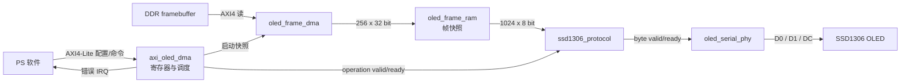

# Zynq-7020 PL OLED DMA 设计

## 1. 外设定位

PL OLED DMA 外设从 DDR 中读取 128x64 单色 framebuffer，生成
SSD1306 兼容的 4 线串行时序。控制寄存器基地址为 `0x41220000`，
默认 framebuffer 地址为 `0x1FF20000`。

framebuffer 固定为 1024 字节，按 SSD1306 page 格式组织：

```text
offset = (y / 8) * 128 + x
bit    = y % 8
```

## 2. RTL 数据流



控制面和数据面在顶层汇合。PS 只提交显示意图和 framebuffer 地址；DMA 负责
取得一致帧快照，协议层负责命令顺序，PHY 负责逐位时序。串行发送期间不再
访问 DDR，因此 PS 后续修改不会撕裂当前画面。

## 3. 分层边界

| 层次 | 模块 | 职责 |
|------|------|------|
| 数据控制 | `axi_oled_dma`、`oled_frame_dma`、`oled_frame_ram` | AXI寄存器、DDR DMA、帧快照、调度和错误 |
| 控制器协议 | `ssd1306_protocol` | 初始化、寻址、显示控制和帧协议 |
| 串行PHY | `oled_serial_phy` | 命令/数据字节到D0、D1、DC时序 |

数据控制层通过 operation valid/ready 和 frame data valid/ready 接口连接协议层。
协议层通过 byte valid/ready 接口连接PHY。SSD1306命令只存在于协议层，物理引脚
时序只存在于PHY。

## 4. DMA与快照

- 显存地址要求1024字节对齐。
- DMA使用32位AXI4读通道。
- 每帧执行16个16-beat INCR burst。
- AXI Master只允许一个outstanding事务。
- 完整帧先写入256x32位快照RAM，再交给协议层。
- DMA完成后PS可以修改DDR显存，不影响正在发送的快照。
- SLVERR、DECERR和RLAST错误停止DMA并锁存停止原因。

一次 PRESENT 的数据路径为：接收请求、执行16次burst、形成完整快照、发送
6字节寻址命令、发送1024字节画面。只有串行发送完成后才增加
`FRAME_COUNT`。

## 5. 寄存器

| 偏移 | 名称 | 访问 | 复位值 | 功能 |
|---:|---|---|---:|---|
| `0x00` | `CONTROL` | RW | `0x00000020` | 使能、复位、刷新和显示控制 |
| `0x04` | `STATUS` | RO | `0x00000020` | 初始化、DMA、协议、显示和错误状态 |
| `0x08` | `FB_BASE` | RW | `0x1FF20000` | 1024字节对齐的framebuffer地址 |
| `0x0C` | `SPI_DIV` | RW | `5` | 串行时钟半周期分频，合法范围3～25000 |
| `0x10` | `REFRESH_PERIOD` | RW | `50000000` | 自动刷新周期，单位为50MHz时钟 |
| `0x14` | `CONTRAST` | RW | `0x000000CF` | 低8位为SSD1306对比度 |
| `0x18` | `IRQ_STATUS` | W1C | `0` | 错误状态 |
| `0x1C` | `IRQ_ENABLE` | RW | `0x0000000F` | 错误中断使能 |
| `0x20` | `FRAME_COUNT` | RO | `0` | 成功发送的framebuffer数量 |
| `0x24` | `CLEAR_COUNT` | RO | `0` | 成功发送的全零画面数量 |
| `0x28` | `AXI_ERROR_COUNT` | RO | `0` | AXI读取失败次数 |
| `0x2C` | `COMMAND_ERROR_COUNT` | RO | `0` | 配置、命令和协议错误次数 |
| `0x30` | `DMA_STOP_REASON` | RO | `0` | 最近一次DMA停止原因 |
| `0x34` | `VERSION` | RO | `0x00010000` | RTL接口版本 |
| `0x38` | `GEOMETRY` | RO | `0x00400080` | 高16位高度64，低16位宽度128 |
| `0x3C` | `FRAME_BYTES` | RO | `1024` | 单帧字节数 |

### 5.1 CONTROL

| 位 | 名称 | 类型 | 含义 |
|---:|---|---|---|
| 0 | `ENABLE` | 保持 | 由0变1时排队执行初始化 |
| 1 | `SOFT_RESET` | W1P | 复位协议、PHY、请求队列和错误锁存 |
| 2 | `REINIT` | W1P | 空闲时重新执行SSD1306初始化 |
| 3 | `PRESENT` | W1P | 从DDR取得快照并显示 |
| 4 | `CLEAR` | W1P | 直接发送1024字节0，不修改DDR |
| 5 | `DISPLAY_ON` | 保持 | 选择显示开启或关闭 |
| 6 | `INVERT` | 保持 | 选择正常或反显 |
| 7 | `AUTO_REFRESH` | 保持 | 周期性提交PRESENT |

`SOFT_RESET`优先于同次写入的其他命令。它恢复显示控制状态并清除挂起请求、
错误IRQ、DMA停止状态，但保留framebuffer地址、分频、刷新周期、对比度、
中断使能和各类计数器。

### 5.2 STATUS

| 位 | 名称 | 含义 |
|---:|---|---|
| 0 | `ENABLED` | 外设已使能 |
| 1 | `INITIALIZED` | SSD1306初始化序列已完成 |
| 2 | `DMA_BUSY` | 正在从DDR取得快照 |
| 3 | `PROTOCOL_BUSY` | 正在执行控制器协议或串行发送 |
| 4 | `COMMAND_PENDING` | operation已排队、尚未被协议层接受 |
| 5 | `DISPLAY_ON` | 当前显示开关目标值 |
| 6 | `INVERTED` | 当前反显目标值 |
| 7 | `AUTO_REFRESH` | 自动刷新已使能 |
| 8 | `DMA_HALTED` | DMA错误后停止接受新的刷新 |
| 9 | `FB_INVALID` | framebuffer地址未按1024字节对齐 |
| 10 | `ERROR` | `IRQ_STATUS`中至少有一个错误位 |

### 5.3 错误状态

`IRQ_STATUS`与`IRQ_ENABLE`低4位一一对应：bit0为配置错误，bit1为AXI读取
错误，bit2为忙时重复提交命令，bit3为协议错误。IRQ只报告错误，正常刷新和
清屏不产生中断。

外部AXI事务可触发的`DMA_STOP_REASON`中，bit1表示SLVERR，bit2表示DECERR
或其他非OKAY响应，bit3表示RLAST位置错误。发生DMA错误后，`DMA_HALTED`
保持为1；软件读取诊断信息后通过软复位恢复。

## 6. 调度与显示行为

- enable上升沿自动执行控制器初始化。
- PRESENT先DMA快照，再发送寻址命令和1024字节数据。
- CLEAR直接发送1024字节零，不读取或修改DDR显存。
- 自动刷新复位后关闭；到期遇到忙状态时只保留一个待处理刷新。
- 显示开关、反显和对比度操作经过通用operation接口提交给协议层。

空闲时的处理优先级为：重新初始化、清屏、显示开关、反显、对比度、手动或
自动刷新。该顺序保证控制器状态变更先于新画面发送。忙时再次提交
REINIT、PRESENT或CLEAR会记录命令错误；自动刷新只合并为一个待处理请求。

## 7. 串行时序

PHY空闲时保持D0为低电平，按MSB优先发送。每经过`SPI_DIV`个PL时钟翻转
一次D0，因此：

```text
serial_clock = 50 MHz / (2 * SPI_DIV)
```

默认`SPI_DIV=5`，串行时钟为5MHz。初始化中的低电平复位和释放等待各为
500000个时钟，即各10ms。

## 8. 当前验证边界

- 协议层自检连续发送1024帧，共1MiB画面数据。
- AXI顶层自检覆盖寄存器、WSTRB、26字节初始化、16次DMA burst、完整画面、
  自动刷新、清屏、地址未对齐和AXI错误注入。
- Vivado 2018.3对顶层执行50MHz OOC综合和`opt_design`，当前结果为
  WNS 14.674ns、745个LUT、571个寄存器、0个BRAM。
- OOC结果用于检查模块自身的DRC和组合时序，不替代完整PS+PL布局布线结果。

## 9. 关联导航

### 应用文档

- [Zynq-7020 OLED Zero Player应用](../application/zynq7020_oled_zero_player.md)
